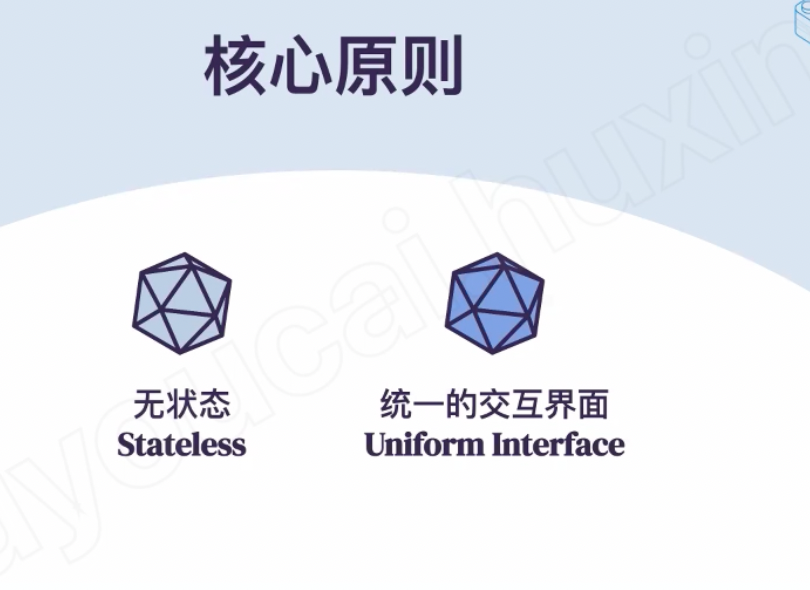
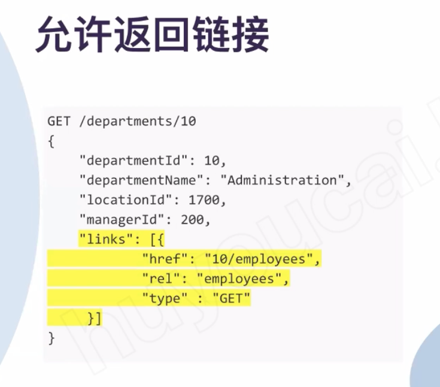
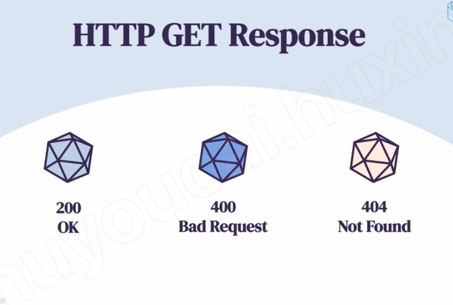
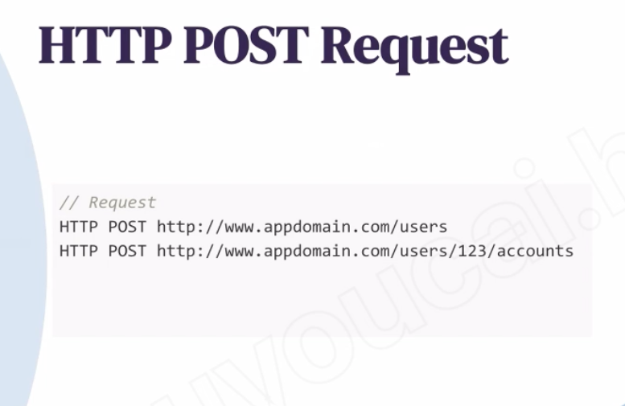
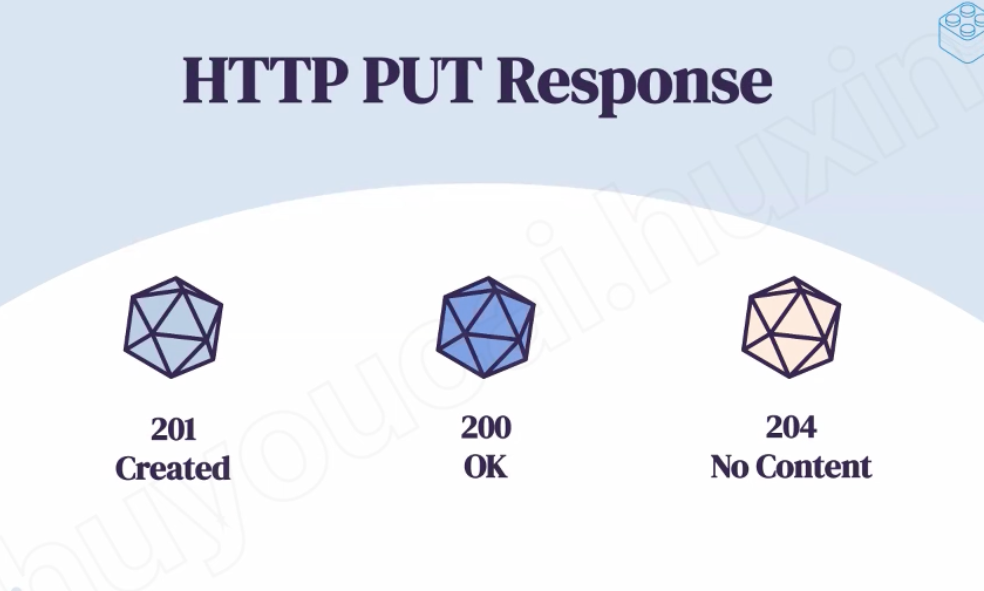
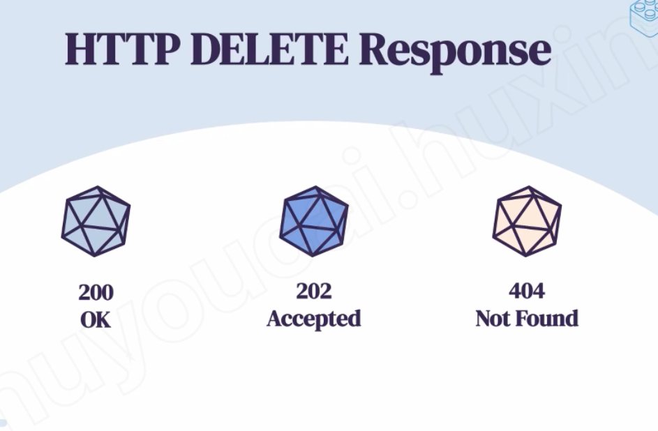
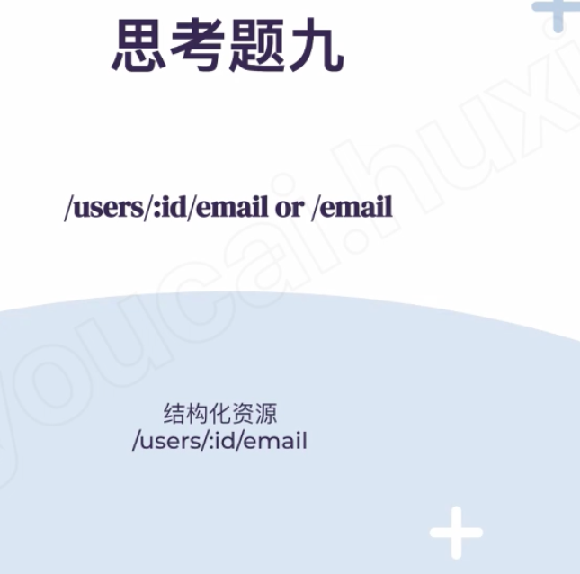
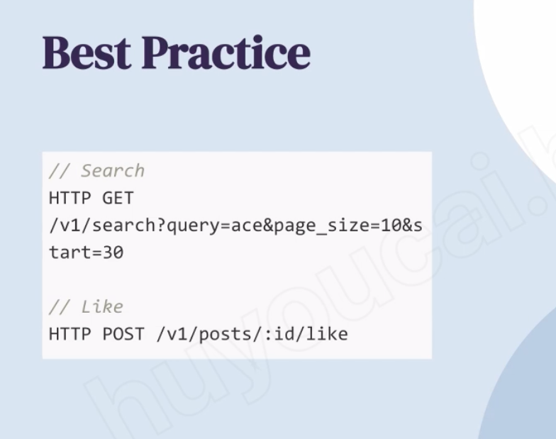

# Rest API -ACE

Created: 2021-04-23 23:22:35 -0600

Modified: 2021-04-23 23:40:26 -0600

---

{width="10.083333333333334in" height="7.364583333333333in"}

Stateless -- don't need to remeber the previous operation and previous status

{width="10.083333333333334in" height="5.083333333333333in"}

{width="10.083333333333334in" height="6.708333333333333in"}

{width="10.083333333333334in" height="7.541666666666667in"}

Return a jason format or txt format

{width="10.083333333333334in" height="8.875in"}

Query a department, but if user want to know more about this department and employee in this department, we can send a "links" to user..

信息描述形式

{width="10.083333333333334in" height="7.291666666666667in"}

{width="10.083333333333334in" height="6.802083333333333in"}

{width="10.083333333333334in" height="6.583333333333333in"}

Post = create new

{width="10.083333333333334in" height="6.270833333333333in"}

Put = update idempotent

{width="0.22916666666666666in" height="0.22916666666666666in"}

{width="10.083333333333334in" height="6.09375in"}{width="10.083333333333334in" height="6.635416666666667in"}

{width="10.083333333333334in" height="10.104166666666666in"}

{width="10.083333333333334in" height="9.979166666666666in"}

Nest resource

{width="10.083333333333334in" height="5.375in"}{width="0.4479166666666667in" height="0.625in"}

ID should only put the request body

{width="10.083333333333334in" height="5.71875in"}

{width="10.083333333333334in" height="7.979166666666667in"}

Consider search and like are nouns

取消like

Delete like ...

