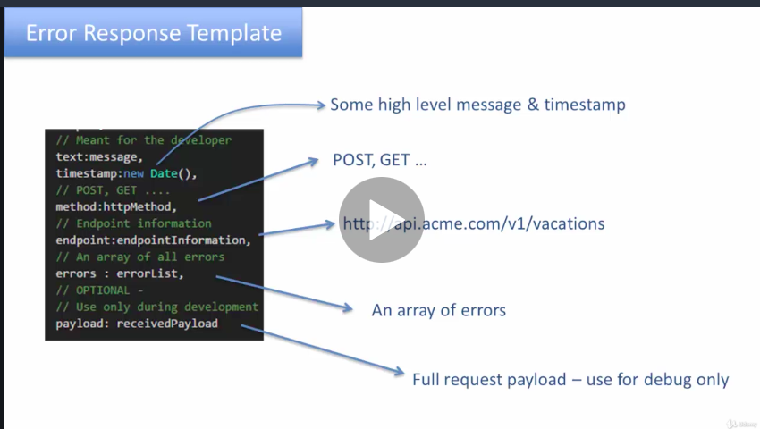
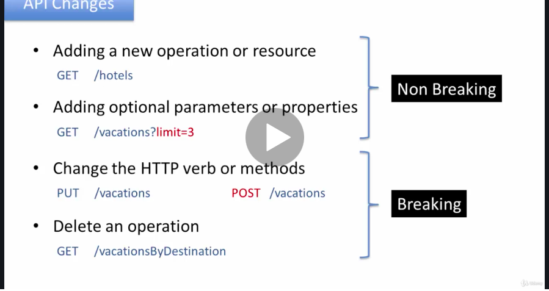
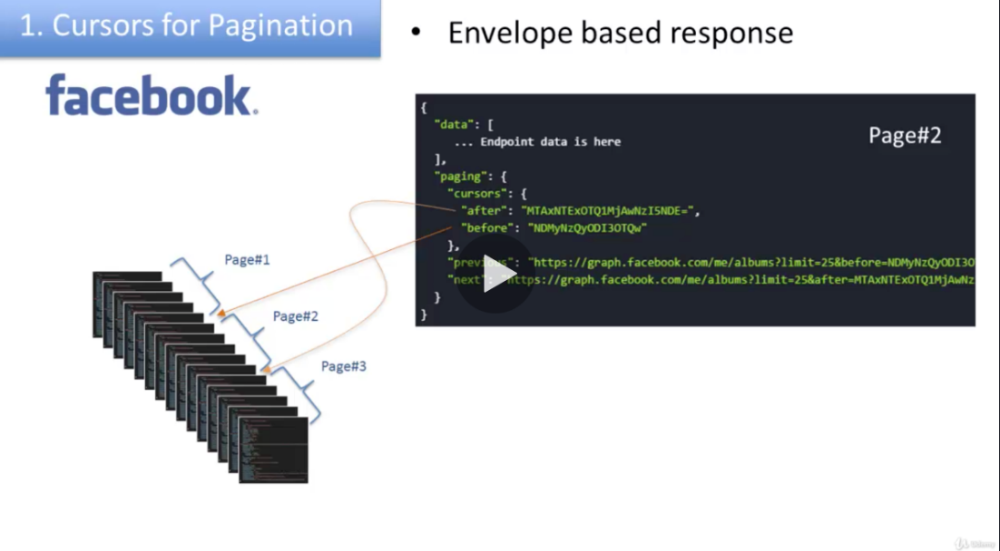
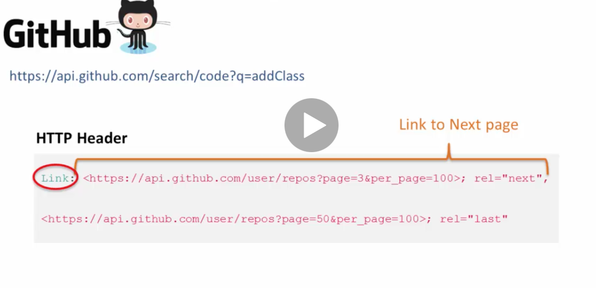
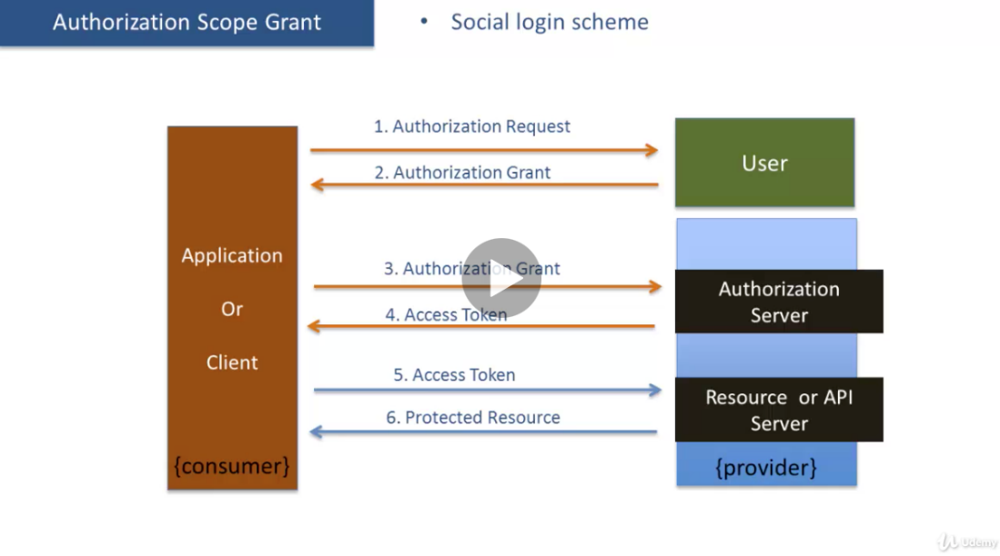
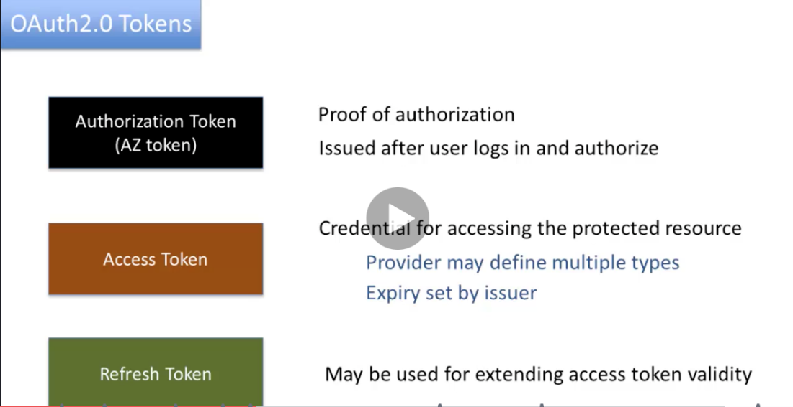

---

**Why not use html**

after we get the html from service, we need parse the html and extract the information that I would like to show on my web site

if the structure of the html change, all the logic of your web site need be changed

so there is a dependency on the backed service or other ... to feed the same HTML that same as your logic and parsing on web service.

if the html structure change, it will break your scraping logic . the information will not show correctly on your web site

the html is changing all the time, you are not able to notice that changes because your partner don't know you use the web service to connect them and they just know some user connect to them

html contain a lot of information we don't need like meta data, css

**API definition**

Let's take a look at what is an API. API or application programming interface can be thought of as a user

interface.

This API or the user interface created as an API is targeted to be consumed by applications rather than humans.

Rest is present to the representational state transfer . state is resource or object's state. if the resource or object is car, the state is car's color, townships.

The state usually stored in the database and will be transferred to client via api

A Browser client makes a request to the web server using the URL, some request has parameters and a verb.

like GET, POST, PUT, DELETE, HEAD, TRACE and OPTIONS. RESTful APIs use

most of these verbs.

So for example when you are creating a resource you would invoke this endpoint with the method POST.

It would be like inserting the resource in a database. When you are retrieving a resource you will use

the same end point

with a GET method.

It is like selecting from the database.

When you are updating the resource, you would use the same end point with a PUT method

which is like updating in the database and the delete will be carried out by using the vacation

endpoint with the DELETE method which is like deleting a row from the database.

The service response back with the data, data has header and response, header also has a response code or status code

**XML,Jason ..**

Xml is the contract between the api and web application (between provide and consumer)

xml format is not work well for the mobile , iPhone.. application

in general. XML is very heavy in terms of the network and mobile device suffer very bad battery performance

**Consumer of the API**

There are 3 types of consumers

one is private consumers , same company

public consumers

partner consumer, has trusted relationship with company or organization creating and expose the API

there is no differences in design or coding side of those 3 types of API. The differences is in the how to manage the API

1.  API security

2.  Documentation internal website

3.  SAL level management like: up time, throughout: max 20 calls/ second, so different type of API has the different throughout, internal developers can get unlimited rate access to the

API, whereas the public developer maybe districted to 20 calls/minute for the same API.

**what is Restful API**

6 conditions

1.  client service

When you are developing the server side, you will have to address certain concerns like the performance like the scaling of application,

Next is the data caching. How would you cache the data or would you cache the data?

How would you carry out the authentication and authorization of your users?

How about data security, how about database? Where do you manage your data, where do you maintain your data?

Is it going to be in the database or is it going to be in the file system or in some other kind of repository?

For the client side,

user experience, what kind of a user experience are you going to deliver to your customer,

the user interface that's of concern to the client side.

2.  the service and client share the same interface or contract for communication between each other

in the http head, service can set meta data, the content type

will indicate to the client that the response has a JSON type or an XML type, and the client can appropriately select the right parser for the content.

the client also can set the meta data

For example, the client can set the metadata for what kind of format or resource representation

it can accept. So the client can send a request with an Accept = application/json

and the server will know that the client understands JSON.

3.  hypermedia principle.

This basically suggests that the server not only sends the response data but it also sends the possible actions that the client can take on the resource or the data.

This is also sometimes referred to as the HATEOAS or hypermedia as the engine of application state.

For example the client will need to have a knowledge of the endpoint for adding a review for the vacation

package or the client should know the end point or the URL for booking the vacation package.

so the client will use the GET API for getting the vacation. The server will respond back with the vacation package details and not only the vacation package details but it will also respond back with the action around adding a review or comment.

So there'll be a URL that the client can use for adding a review or comment.

It may also have a link to the booking of the package so the client may invoke that link to book that

package but if the package is sold out. the client will only receive the review link

4.  Stateless

In some application, web application connect the backend service via the mid tire, the mid tire store the client data or client state n the http secession

For rest API, it is not acceptable, for restful APT, each client request is independent of any request made by client previously. There is no state management carry out in the mid tire or service side

If the client want to manage the state, it will manage the state in the client side

5.  Caching

The reason use cache

The objective of caching in this scenario is to boost the performance, to improve the scalability of the application and to enhance the user experience.

The caching is controlled by the server by way of the HTTP headers.

cache-control directive. it was set by service and store in the header.

This header will allow the server to define the policy for the cache, who can cache the data,

how long can the data be cached and under what conditions the data can be cached and Etag

All these are contained within the cache-control header

**caching --2**

The most cited reason for the use of cash as it improves performance.

No doubt it does improve performance but there is a bigger reason why you should consider caching.

And the reason is that caching improves the scalability and to put off your application of your API

The first factor is the speed of change.

Second is time sensitivity of the data geocaching.

And third is security the data started counting

Static content such as html, css, jpeg , they dont change as

frequently and they don't contain any time sensitive data and security is not an issue for them so they

can be cash for a longer period of times days weeks even months

You are dealing with dynamic data and not static data and for dynamic data these three factors are very

critical.

Speed of change time sensitivity and security.

security is very high for the customer profile.

So you don't want to cash any customer data in the intermediaries.

Service

The service sends back on response to a request it also sends back the

cache control header with the cached control directive.

API can set the cache Control header in the response: It can control who can catch the response; For how long and under what conditions.

The API consumer can send the cache control in the request and it can override the caching behavior.

Also it can protect sensitive data from being cached.

sensitive data should not be cast on the intermediaries like bank account information, You can set the cache control with the private secto. so the data will not be stored in the gateway and ISP but will cached in the browser

No store : let the browsers don't write date or the to local file system. sensitive data should not be stored anywhere

the no cash control or director may be use for preventing any kind of cash in to be happening on

any touchpoint

Etag

we use the Etag to change if the data has change.

e-tag header has a value set to some kind of a hash of the response data. if the data changes, the hash also changed.

API consumer sends the request along with the e-TAG header that it received in the original response. the service will compared with the response data with the E-tag data in the service.

If the e-TAG is still the same. In other words the response data has not changed on the server.

Then it sends back a response.

Max- age: let the API control how long the cache will be valid, life time of the cache data

Etag is associated with a cache item or cache resource, when the cache item expire, client just need send the Etag to service first and ask the item is changed or not. only if the item changed, service need send the new item to client

6.  layered system architecture.

REST API should consist of multiple layers.

We have the client connecting to a gateway then connecting to the app server layer which in turn is connecting to the database layer.

The gateway does not know how the database layer is set up so the client knows only about the gateway.

Layers may be added, removed or modified based on the needs of the sysem and other layer doesn't need change.

The client should never directly connect to the app service

the advantage:

simplifies the architecture, hide the complexity .

If it is connecting thru the gateway. The app server layer can change over a period of time without requiring.

The client of the API to change.vAlso the client does not need to worry about request distribution.

API Design

the customer or consumer of API is developer, we have to focus on the app developer when you creating the API

Make sure that when you are designing your API it's giving a clear idea on the intent behind that API.

Next one is designed for simplicity.

API end point or URL for the resource

1.  url and resource

In order to invoke an API you need the API endpoint or the URL.

There are multiple parts in this URL. In case of WalMart for example, for getting the items you

would invoke this API.

The first part is known as the base URL. Irrespective of which API you call for WalMart,

this part stays the same. <https://api.walmartlabs.com/v1/items>

Next one is the resource. and version

for resource: walmart items ( collections of items) / items/{id}

use nouns to identify the resource not use the verb

the resource need use plural (s)

2.  API operations and not CRUD

user /estimates/prices

we see here is that its ok to use action as part of resource hierarchy. For example friendships/lookup

or it is OK to create an action with sub-query, for example in case of WalMart its using this

/search with a query criteria. /search ?query

For book a vacation package, you can create a vacation package like POST /vacations/{id}/book

POST /bookVacation

Search by destination and nights.

Now if you think about it, if we try to do this the first way like

vacations/destinations

then there is a problem because it will not be a very easy way to do the "night" because

we have destination and nights.

Now where do we put nights here, so a better way to go with this would be to go with

vacations/search and then provide the query parameters for destination and nights.

Associations

Next topic is associations. The idea of associations is that resources contain other resources.

/me/photos

/items/{id}/reviews

/mutes/users/list

It is suggested that you keep the maximum nesting to 3 levels but there may be situations where you may have to go beyond three levels. In that situation,

you can use sub query.

use vacations/{id} of that vacation package /reviews and then followed by the id of that review

API curd operations

If you are creating a subordinate resource such as a review under a specific vacation package then

you have to provide the id of the vacation package.

the way it is shown here. In case of a success you would return back a code of 201 which basically indicates

that the creation of the resource was successful.

Now there are two things you can do in terms of returning the information about the resource.

You can return a link to the newly created resource.

This is a full path to the resource passed in the HTTP header called location or you may send back the

full object.

The Big concern is that returning a full object would use the bandwidth.

So if the API is getting invoked from a mobile phone it may not be a good idea because network bandwidth

Difference PUT and POST

So you would use PUT when you want to update ALL attributes of an existing resource.

Effectively you are replacing the existing resource with the data received in the request.

You can also use PUT for creating a new resource if the client is providing the ID.

Although it is permissible to do it, I would not suggest that you do it. For creating always use POST.

PATCH is used when you are updating part of the resource,

PATCH <http://api.acme.com/vacations/121?validTill> = 3/1/2017

121. In case of success, you can send back the complete updated resource but that's optional.

There is no need to even send back the link.

So that is also optional if you want to send it.

so client already have all the information so there is no point in sending back

that same information

Resource representation

For example WalMart the client can provide a parameter format equal to whatever format to get back

the data in that format.

So format=xml,

or

you to use the Accepts header.

So you would say Accepts: application/json in the HTTP header for the request and the server

will read the Accepts header and respond back with JSON.

or

format suffix.

. So for example to get the schedules for the programs for today,

you just suffix the resource today with .json to receive the data in JSON format or you

/programs/schedules/fm/today.jason

Error heading

In some scenarios this response data may not be needed.

For example if you are doing an insert and you're deciding not to send back the newly created item or

resource in the body then the response data can be blank or there is no data. In case of a failure,

the failure. If the failure is caused by the client.

For example client sent some data that was incomplete and server could not insert that data into the database,

in that case you would send back a 4xx series HTTP status code with some error data in the

response body. If it is a server error, you would send back the 5xx series HTTP status

code along with the error data.

You also can set numeric error code for application

specific error. Now application specific errors are different from the HTTP status codes that you

were sending back in the HTTP header. The application specific error code will go back as part

of the error response body.

So for example error code = 7002 is an application specific error code that I have said

in case the vacation API receives some data for insert and it is missing the description which is a required

error response template.

One thing to keep in mind is that the error response generated from the API is meant for the application developer

It is not meant for the end user.

Keeping that fact in mind you must provide all the information that the application developer will need

in order to resolve the error, in order to address any issues, in order to better understand why that error is happening and take some corrective action or create some user friendly message or messages that then they can display to their users in the application.

{width="10.083333333333334in" height="5.729166666666667in"}

{width="10.083333333333334in" height="5.6875in"}{width="10.083333333333334in" height="5.71875in"}

There is an alternate approach for sending back the responses in this order that approach you all to

send back and I should start to score of 200. OK.

And in this end of this response you define fix place of responses so every response will have this

form. The stock goes will have the error information if there is any error.

If it is the call is successful the start doesn't simply say successful

Version

If your chance is not breaking the code of an existing application then it is a non-breaking change.

The definition is that if the change breaks down the application to existing applications then it is

a breaking change.

They would not only like to receive the information of our discounted packages, -- use discount array but they would also like to get some links to the pictures related to those packages.

it is non breaking change

{width="10.083333333333334in" height="5.6875in"}

if we need change the "discount " array name to "deal" that is the breaking change

{width="10.083333333333334in" height="5.385416666666667in"}

The idea here is that if there is a change in the database or the souces that the EPA is using then

the API code needs to change.

Version information

{width="10.083333333333334in" height="5.875in"}

Partial Response

Now if the same API needs to be moved by a mobile application development they may not want to show

all the data because of the screen size limitations.

They may only want to only show some fields from the response since that show all the data which is useless.

API should be able to specify this feeds the particular fields that they would like to receive in the response

{width="10.083333333333334in" height="5.03125in"}

Pagination

In the case of an API that supports page nation the app developer can decide the number of rows they

would like to receive in response.

The benefits of page nation are very similar to that of the partial responses you get better performance

and optimize resource usage less CPO and less memory usage and lowered requirements from the network bandwidth perspective you can use a common API version for all your consumers to support multiple devices multiple use cases and multiple form factors.

cursor page

so a cursor is a random string that points to a specific item in a collection.

Then the API is involved it sends back an envelope based response.

Not only have the data for the end point but it also has some metadata for the page .

We see that the cursor before is pointing to the beginning of the page received in the response and after is pointing to the end of the page that was received.

The previous cursor of points to the previous page which is page 1 and the next cursor points to the page 3 which is the next

{width="10.083333333333334in" height="5.625in"}

you also can save the page data in the http header

**offset based pagination**

This approach involves the use of query parameters.

The app developer has to provide the starting row and the number of rows they would

be interested in receiving

t

{width="10.083333333333334in" height="5.697916666666667in"}

starting row = 6

how many row they want to receive

{width="10.083333333333334in" height="4.614583333333333in"}

rpp = row per page

3.  Http link header

Let me describe it with an example.

Github exposes an API for searching the repository for specific phrases when you invoke this API it

responds back with the data with the paginate in the http head . You would see the link header in the http header . This link header has two components a URL and a relationship.

So this particular part of the link had a gives you the URL to the next page and shows the relationship

as next. --- REL = next

And this one here is the link to the last page. The relationship shown here is last. rel == "last"

{width="10.083333333333334in" height="4.927083333333333in"}

Security

always use tls or Https, the data

[will be encrypted and will be protected for any unauthorized access or man in the middle attack and]{.underline}

Authentication

Basic authentication.

The consumer sends the credentials to the API service in http header called authentication

the data in authentication header is base 64 encoding string. the form of string is "user, password"

the service receive the credential in the http header, decode the value of header and check the user and password. everything is good, it send back a 200 -- OK

if the username and password is not good. it send a 401 unauthorized.

if you use HTTP that means the user name and password can be read by anyone.

basic authentication requires the caller or the consumer to send the credentials every

[request not to make things easier.]{.underline}

token base authentication

the application will issue a token with the credentials.

the service is receiving the credentials will validate the credentials and then save that token and send back that token to client

all the request that client made has to be accompanied with the same token

service will validate the token by checking the storage

if the token is expired or invalid, the service will send a 401 to client

client also can pass the token to the mobile application

token can be stored as an encoded string.

So there is some information that goes through some hashing or a private key

The API does not need to manage any sessions the client can send the token which is just a string in

[the http header or the query parameter and request body]{.underline}

issue can decide when the token will expire. In other words how frequently a client has to validate their credentials.

Also relocation the token, the token can be revoked at any point in time.

API key and secret

Let's say Facebook or Walmart or quicker you need to register your application

After your successful registration , the provider will send a key and secret like use an ID and password

So when it will receive the key it it'll know who is the API caller is

anonymous access

[Oauth 2.0]{.underline}

[Oauth 2.0 is a authrizatin standard]{.underline}

{width="10.083333333333334in" height="5.802083333333333in"}

.

let's say a Dream has a way to ask the customer if the customer is OK with dreams accessing customers data

If the customer says yes it's OK then dreams cause the API of customer information along with the proof of authorization from the customer.

Acme checks the [proof of authorization]{.mark} and if the proof of authorization is good they let the dream's request go through and access the customer information.

The 2.0 is based on tokens and there are different type of tokens used in this framework.

different token has different scope

That is a concept of scope in which the user can decide what data the user is authorized and the application

[for application client needs.application key and secret]{.underline}

{width="10.083333333333334in" height="5.645833333333333in"}

This law has three parties involved.

The first party is the end user who owns the data.

Second part is the application or the client was going to be the API consumer

3rd party is the provider of the API that has two parts.

First is the authorization server and the second is the resource or API server.

The flow begins with the application asking the user who granted the authorization.

The use of looks at the scope and Grant authorization .

The application receives the authorization token as part of step 2

The application at this point sends the authorization grant to the authorization server

The authorization server looks at the authorization token if everything is good.

Response back with the access token the client

the application can then repeatedly use the access token to access the critical resources

The access token has an expiry.

So at some point the access token will become invalid .

And then that is also a refresh token

{width="10.083333333333334in" height="5.260416666666667in"}

Once the Spotify client application has received the authorization they will be able to access the private

data for that user

client credentials

The user data is not accessible to the client so that client credentials you can only get access to

[areas that are turning public data.]{.underline}

implement oauth

You have to make certain design decisions for implement or the first one is scoping of the user data.

What data for the user is public and what is private.

Next one is a type of oauth grants that you would support for your re-appears.

Typical ones for private data authorization and implicit grant

{width="10.083333333333334in" height="5.552083333333333in"}

