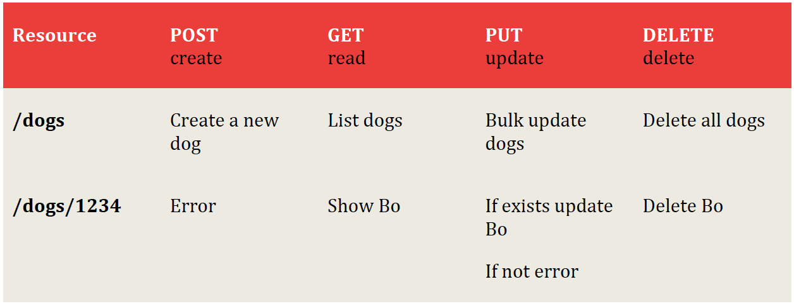

# apigee design 

Created: 2020-05-18 16:14:46 -0600

Modified: 2020-05-19 17:28:00 -0600

---

A key litmus test we use for Web API design is that there should be only **2 base URLs per resource**. /dogs /dogs/1234

{width="10.083333333333334in" height="3.9479166666666665in"}

Resources almost always have relationships to other resources

Once you have the primary key for one level, you usually don't need to include the levels above because you've already got your specific object. In other words, you shouldn't need too many cases where a URL is deeper than what we have above

**Facebook** No matter what happens on a Facebook request, you get back the 200-status code - everything is OK. Many error messages also push down into the HTTP response

the Google GData API uses only 10 status codes; Netflix uses 9, and Digg, only 8.

Never release an API without a version; Use a simple ordinal number.

partial response : /joe.smith/friends?fields=id,name,picture

paginate:

Let's look at how Facebook, Twitter, and LinkedIn handle pagination. Facebook uses **offset** and **limit**. Twitter uses page and **rpp** (records per page). LinkedIn uses **start** and **coun**

To get records 50 through 75 from each system, you would use:

/dogs?limit=25&offset=50

we also suggest including metadata with each response that is paginated that indicated to the developer the total number of records available.

Actions like the following are your clue that you might not be dealing with a "resource" response.:

Calculate Translate Convert

For example, an API to convert 100 euros to Chinese Yen:

/convert?from=EUR&to=CNY&amount=100

We recommend that you support more than one format

**Google Data**

?alt=json

We recommend the Foursquare approach.

To get the JSON format from a collection or specific element:

dogs.json

/dogs/1234.json

**What about default formats?**

In my opinion, JSON is winning out as the default format. JSON is the closest thing we have to universal language. Even if the back end is built in Ruby on Rails, PHP, Java, Python etc., most projects probably touch JavaScript for the front-end. It also has the advantage of being terse - less verbose than XML.

