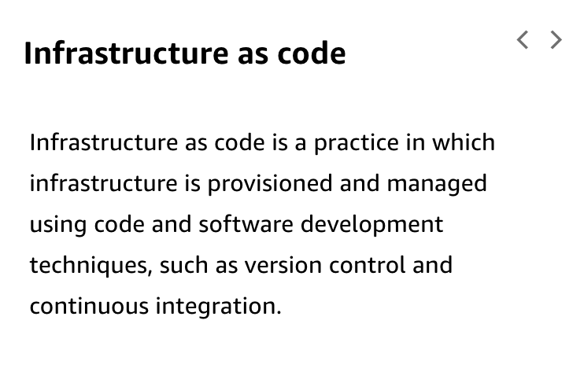
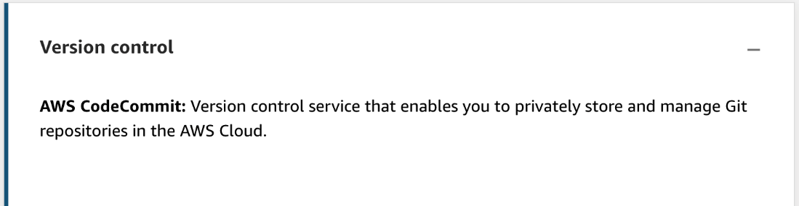

# 1 Foundations for DevOps

Created: 2023-10-01 09:19:29 -0600

Modified: 2023-10-22 17:40:41 -0600

---

Summary

The content emphasizes the importance of prioritizing people over processes and tools in DevOps, the significance of continuous integration and continuous deployment (CI/CD), infrastructure as code, automation, and the myriad of AWS tools available for supporting DevOps initiatives.

Facts

- People over process over tools: Emphasis on team collaboration and avoiding fixation on a particular process or tool.
- Continuous Integration (CI): The early phase of the pipeline where code is written, tested, and prepared for deployment.
- Continuous Delivery/Deployment (CD): The process of getting code to the customer. Delivery includes a manual review before deployment, while Deployment is fully automated.
- Microservices: Traditional large services are decomposed into smaller services for better management through the CI/CD pipeline.
- Infrastructure as Code: Automating the creation and management of infrastructure using code templates.
- Automation: Encouraging practitioners to automate routine tasks for efficiency and consistency.
- Monitoring and Observability: Going beyond traditional monitoring to achieve deeper insights into system performance and potential bottlenecks.
- Collaboration and Communication: Emphasizing teamwork across all teams, including QA, security, etc., to ensure smooth CI/CD processes.
- Serverless Computing: Transitioning from traditional resources to serverless platforms, where the management of the compute resources is handled by AWS.
- Toolsets for CI/CD:
  - Code Services: CodeCommit, CodeBuild, CodeDeploy, CodePipeline, CodeStar, and Cloud9.
  - Running Resources: EC2 instances, ECS, EKS, and Lambda.
  - Infrastructure Management: CloudFormation, Elastic Beanstalk, OpsWorks, and Systems Manager.
  - Monitoring: CloudWatch and X-Ray.
  - Security: IAM, GuardDuty, Inspector, Security Hub, and Config.
- DevOps: Represents a cultural shift and a combination of practices, patterns, tools, and automation, bridging the gap between developers and operations.

![Continuous Integration and Continuous Delivery (CI/CD) Cl and CD are processes in a pipeline that helps you with your software delivery process for development. As discussed previously about communication and collaboration, it is important to realize that the principle of frequent communication and the opportunity for customers to provide feedback on changes is how DevOps is linked to CI/CD. • Continuous integration (Cl) is the process in which developers integrate the source (code) continuously and strive to automate the build and test phase. So what is continuous delivery? • Continuous delivery (CD) is also the continuous integration phase, but it includes the provisioning, deployment (which noted by the graphic is a manual push or approval gate before going live), and finally the post-testing or monitoring. When the following CD best practices are applied, software can be released to production at any time. • Code changes are committed to the repository and built frequently (versioned sourced). • Builds are deployed to test environments and tested using automated and possibly manual tests. • Builds that pass rigorous tests are rapidly deployed to staging or production environments. A robust continuous delivery pipeline also does the following: • Automates the provisioning of infrastructure for testing and production environments ](../../../media/AWS-DevOps-Module-1-1-Foundations-for-DevOps-image1.png){width="5.0in" height="4.604166666666667in"}

![• Enables the monitoring and management of test and production environments. • Continuous deployment is a fully automated end-to-end process. Code Build Test Provision Deploy Monitor Continuous integration Continuous delivery Continuous deployment CI/CD Pipeline The goal of DevOps is to follow a continuous delivery model that is repeatable, reliable, stable, resilient, and secure, and improves operational efficiency. But how helpful is a DevOps approach if the teams involved still worl< in silos? ](../../../media/AWS-DevOps-Module-1-1-Foundations-for-DevOps-image2.png){width="5.0in" height="3.7916666666666665in"}

![Relationships across teams are vital: without cross-team communication and collaboration, processes are likely to fail. Teams must collaborate with each other and get involved in the development and delivery process. All technical team members should have experience with the processes and tools involved in the development pipeline. To learn more, choose each hotspot. Continuous integration Infrastructure as code Continuous delivery Monitoring and logging Microservices Communication and collaboration ](../../../media/AWS-DevOps-Module-1-1-Foundations-for-DevOps-image3.png){width="5.0in" height="3.71875in"}

{width="5.0in" height="3.1041666666666665in"}

{width="5.0in" height="3.5729166666666665in"}

{width="5.0in" height="2.2708333333333335in"}

{width="5.0in" height="3.1458333333333335in"}

{width="5.0in" height="2.7395833333333335in"}

{width="5.0in" height="3.8645833333333335in"}

{width="5.0in" height="1.8958333333333333in"}

{width="5.0in" height="1.3020833333333333in"}

![CI/CD AWS CodePipeline: Continuous delivery service that enables you to model, visualize, and automate the steps required to release your software. AWS CodeBuild: Fully managed build service that compiles your source code, runs unit tests, and produces artifacts that are ready to deploy. AWS CodeDeploy: Deployment service that enables developers to automate the deployment of applications to instances and to update the applications as required. AWS CodeStar: Quickly develop, build, and deploy applications on AWS. AWS Cloud9: Cloud-based integrated development environment (IDE) that you use to write, run, and debug code. ](../../../media/AWS-DevOps-Module-1-1-Foundations-for-DevOps-image12.png){width="5.0in" height="3.0520833333333335in"}

{width="5.0in" height="2.1770833333333335in"}

![Infrastructure as code AWS CloudFormation: Create and provision AWS infrastructure deployments predictably and repeatedly. AWS CloudFormation enables you to use a template file to create and delete a collection of resources together as a single unit (a stack). AWS Elastic Beanstalk: Quickly deploy and manage applications in the AWS Cloud without worrying about the infrastructure that runs those applications. AWS Elastic Beanstalk automatically handles the details of capacity provisioning, load balancing, scaling, and application health monitoring. AWS OpsWorks: Create and manage stacks and applications. You can provision AWS resources, manage their configuration, deploy applications to those resources, and monitor their health. AWS Systems Manager: Provides a unified user interface so you can view operational data from multiple AWS services and enables you to automate operational tasks across your AWS resources. AWS Config: Provides a detailed view of the resources associated with your AWS account, including how they are configured, how they are related to one another, and how the configurations and their relationships have changed over time. ](../../../media/AWS-DevOps-Module-1-1-Foundations-for-DevOps-image14.png){width="5.0in" height="4.010416666666667in"}

![Monitoring and logging Amazon CloudWatch: provides a reliable, scalable, and flexible monitoring solution to monitor your AWS resources and the applications you run on AWS in real time. AWS CloudTrail: Monitor your AWS deployments in the cloud by getting a history of AWS API calls for your account, including API calls made by using the AWS Management Console, the AWS SDKs, the command line tools, and higher-level AWS services. AWS X-Ray: Analyze the behavior of their distributed applications by providing request tracing, exception collection, and profiling capabilities. AWS AppMesh: Monitor and control microservices that are running on AWS. ](../../../media/AWS-DevOps-Module-1-1-Foundations-for-DevOps-image15.png){width="5.0in" height="2.7083333333333335in"}

![Security AWS Identity and Access Management (AWS 'AM): Web service for securely controlling access to AWS services. With IAM, you can centrally manage users, security credentials such as access keys, and permissions that control which AWS resources users and applications can access. Amazon GuardDuty: A continuous security monitoring service that helps to identify unexpected and potentially unauthorized or malicious activity in your AWS environment. AWS Key Management Service (AWS KMS): Encryption and key management service scaled for the cloud. AWS KMS keys and functionality are used by other AWS services, and you can use them to protect data in your own applications that use AWS. Amazon Inspector: Security vulnerability assessment service that helps improve the security and compliance of your AWS resources. It automatically assesses resources for vulnerabilities or deviations from best practices, and then produces a detailed list of security findings prioritized by level of severity. AWS Security Hub: A comprehensive view of the security state of your AWS resources. Security Hub collects security data from across AWS accounts and services, and helps you analyze your security trends to identify and prioritize the security issues across your AWS environment. ](../../../media/AWS-DevOps-Module-1-1-Foundations-for-DevOps-image16.png){width="5.0in" height="4.1875in"}

