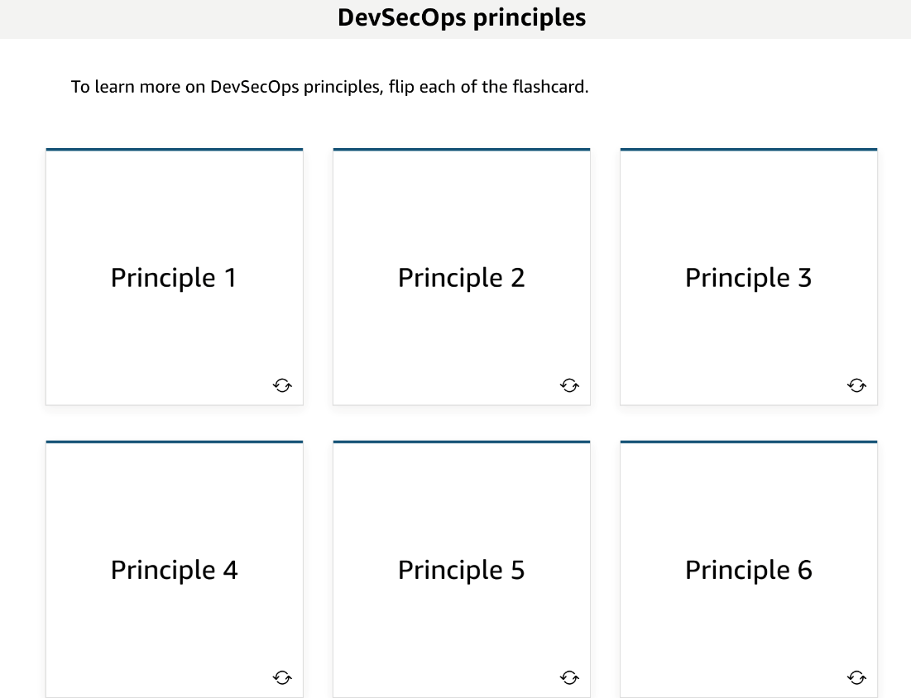
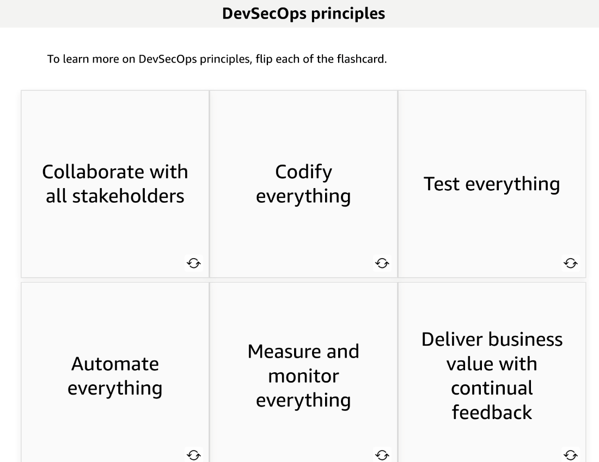

# 32 Introduction to DevSecOps

Created: 2023-10-11 20:21:06 -0600

Modified: 2023-10-22 17:44:36 -0600

---

Summary

DevSecOps emphasizes the integration of security practices within the CI/CD pipeline, ensuring that security measures are seamlessly incorporated throughout the development process, preventing vulnerabilities and ensuring business continuity.

Facts

- DevSecOps Concept:
  - Integrates security into the CI/CD pipeline.
  - Addresses the traditional conflict between developers' need for speed and operations' need for stability.
  - Aims to prevent security from being an afterthought or overlooked.
- Importance of DevSecOps:
  - Ensures businesses remain secure and operational.
  - Security checks and tests are integrated throughout the pipeline.
  - Makes security a community effort, removing the sole responsibility from a single "security czar."
- Principles of DevSecOps:
  - Requires buy-in from all stakeholders.
  - Emphasizes infrastructure as code and continuous feedback.
  - Focuses on both security of the pipeline and security in the pipeline.
  - Utilizes AWS managed architecture and standardized IAM permission sets for enhanced security.
- Security in the CI/CD Pipeline:
  - Scanning for secrets prevents sensitive data from being committed to repositories.
  - Services like GET Secrets help in keeping access keys and passwords secure.
  - Tools like Inspector ensure correct package versions on EC2 instances.
  - Monitoring and feedback tools include Config, SecurityHub, and GuardDuty.
- Example of a CI/CD Pipeline with Security:
  - Artifacts are placed in an S3 bucket, triggering the pipeline.
  - Static code analysis checks for potential vulnerabilities before deployment.
  - Automated and manual security tests can be run before moving to the next stage.
  - Initial test environments are deleted after validation, ensuring resources are used efficiently.
- Benefits of DevSecOps in CI/CD:
  - Matches the speed of development without compromising security.
  - Eliminates the need for lengthy, separate security audits.
  - Integrates security checks as part of the regular pipeline process.

{width="10.083333333333334in" height="2.1666666666666665in"}

{width="10.083333333333334in" height="2.09375in"}

{width="10.083333333333334in" height="6.854166666666667in"}

![Think of DevSecOps as putting security in the middle of Dev/_/Ops. Cloud security and compliance is a shared responsibility between AWS and the customer. As the cloud provider, AWS is responsible for security OF the cloud, including the hypervisor and hardware. Customers are responsible for security IN the cloud, by securing your applications and network with services from third-party vendors. DevSecOps in the cloud takes that approach to security and builds it into your development and operational processes. ](../../../media/AWS-DevOps-Module-10-32-Introduction-to-DevSecOps-image4.png){width="10.083333333333334in" height="3.46875in"}

{width="10.083333333333334in" height="5.958333333333333in"}

{width="10.083333333333334in" height="7.770833333333333in"}

{width="10.083333333333334in" height="7.8125in"}

{width="10.083333333333334in" height="9.010416666666666in"}

{width="10.083333333333334in" height="5.84375in"}

{width="10.083333333333334in" height="5.583333333333333in"}

