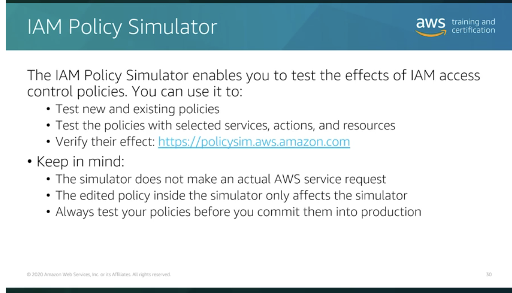
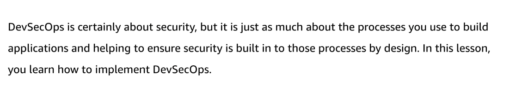

# 33 Security of the Pipeline

Created: 2023-10-11 20:26:29 -0600

Modified: 2023-10-22 17:44:39 -0600

---

Summary

The discussion emphasizes the importance of securing the CI/CD pipeline, detailing various tools and practices, such as IAM, multi-factor authentication, and AWS Config, to ensure robust security measures throughout the development process.

Facts

- Security of the CI/CD Pipeline:
  - Focuses on ensuring the pipeline is built and maintained correctly.
  - Considers user access and permissions to prevent malicious alterations.
  - Advocates for the principle of least privilege, granting minimal necessary access.
  - Uses detective controls to identify and remediate issues.
- IAM (Identity and Access Management):
  - Regulates user access to AWS resources.
  - Uses policy documents to define permissions.
  - Can implement conditions, such as requiring specific tags or multi-factor authentication.
  - Utilizes roles for temporary access, avoiding hard-coded credentials.

{width="5.0in" height="2.75in"}

- {width="5.0in" height="2.8333333333333335in"}

- ![Switching roles • Allows practice of the least-privilege principle training and certification • You should have only the permission to perform the current task • Use elevated permissions only if the task requires them • Permissions can be removed after task is completed • Example: If you need to push a new version of an application to the production environment: 1. Switch roles to get deployment permissions in the production environment 2. Perform the tasks 3. Switch back to your normal user account ](../../../media/AWS-DevOps-Module-10-33-Security-of-the-Pipeline-image3.png){width="5.0in" height="2.4479166666666665in"}

- {width="5.0in" height="2.7708333333333335in"}
- Multi-Factor Authentication (MFA):
  - Adds an extra layer of security.
  - Can be virtual (e.g., Google Authenticator) or hardware-based (e.g., YubiKey).
  - Can be used to protect specific API calls, requiring MFA for potentially damaging actions.
  - Not universally applicable; some limitations exist.
- Policy Testing and Validation:
  - AWS offers a policy simulator to test and validate policies without making actual calls.
  - The Policy Validator ensures correct syntax and structure in IAM policy documents.
- AWS Config:
  - Acts as an inventory management service for AWS resources.
  - Monitors and records configurations, allowing for historical analysis.
  - Enables the creation of rules to define desired configurations and checks.
  - Helps identify deviations from desired configurations.

{width="5.0in" height="2.8645833333333335in"}

{width="5.0in" height="1.03125in"}

![AWS Config Use the Dashboard to see an overview of your resources, rules, conformance packs, and their compliance states and to visualize your AWS Config usage and success metrics with Amazon CloudWatch. This page helps you quickly identify the top resources in your AWS account, the conformance packs with the lowest level of compliance in your AWS account, what rules or resources are noncompliant in your AWS account, what traffic is driving your AWS Config usage, and key metrics for success and failure that have occurred in your workflows. To watch the instructor video, choose the play button. ](../../../media/AWS-DevOps-Module-10-33-Security-of-the-Pipeline-image7.png){width="5.0in" height="2.1145833333333335in"}

{width="5.0in" height="2.0833333333333335in"}

