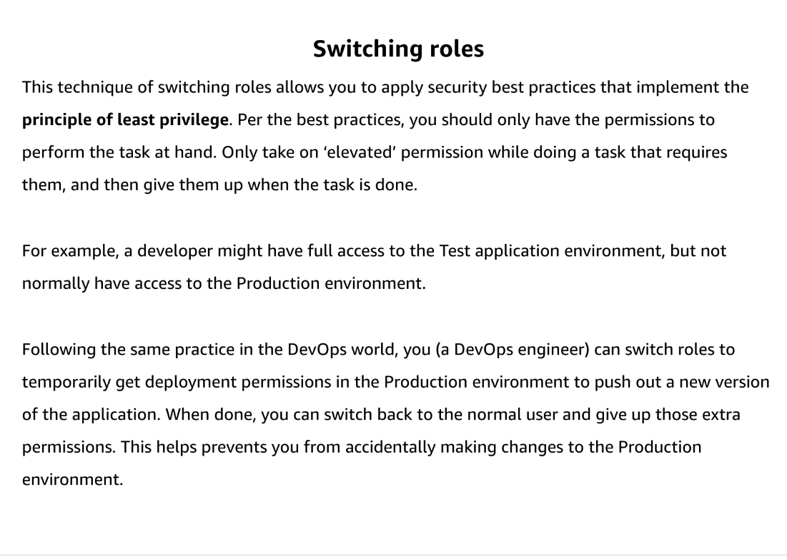
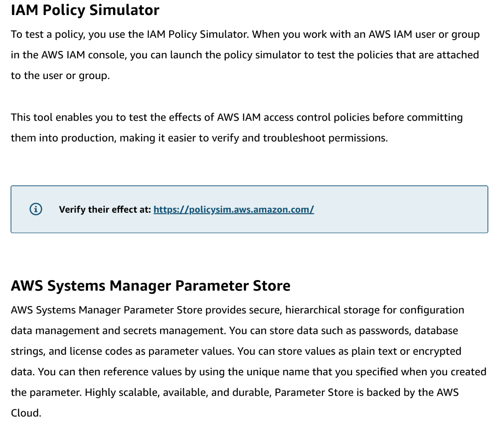
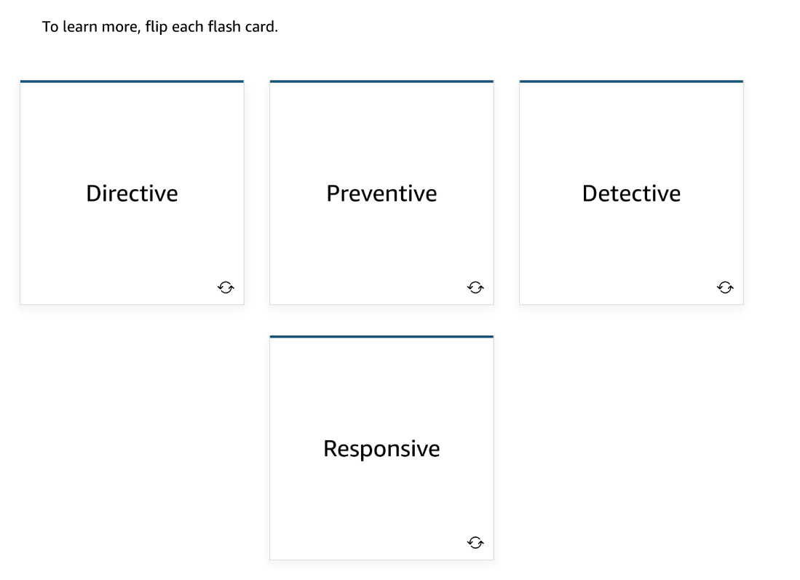

# 35 Security of the Pipeline-3

---

Summary

AWS Config provides insights into account compliance and best practices, while AWS Secrets Manager and Systems Manager Parameter Store offer secure solutions for credential storage and management, emphasizing the importance of security in the CI/CD pipeline.

Facts

- AWS Config:
  - Provides insights into resource compliance and best practices within an AWS account.
  - More details on Config will be covered in the upcoming module on configuration management.
- AWS Secrets Manager:
  - Safely manages and encrypts credentials.
  - Requires IAM access to retrieve and use

![Restrict AWS CodeBuild project actions based on resource tags The below example denies mentioned list of actions on projects tagged with the key Environment with the key value of Production. A user's administrator must attach this IAM policy in addition to the managed user policy to unauthorized IAM users. The aws:ResourceTag condition key is used to control access to resources based on their tags. "Version : ' " '2012-10-17" , " Statement " : [ "Effect " : "Deny" " Action " : [ " codebuild : CreateProject " , " codebuild : UpdateProject " , " codebuild : DeleteProj ect " "Resource "Condition " : { " ForAnyVa1ue : StringEqua1s " : { aws : RequestTag/Environment " : " Production " ](../../../media/AWS-DevOps-Module-10-35-Security-of-the-Pipeline-3-image4.png)

![Multi-factor authentication (MFA) MFA requires users to enter a unique authentication code when accessing AWS website or services. It can be used for CLI-, API-, and console-based access. It also acts as an additional layer of security. MFA is strongly recommended for key users and it is recommended to assign a unique MFA device (hardware or virtual) to each IAM user. Possible MFA mechanisms listed below. Do you use any of these? Virtual MFA device IJ2F security key Hardware MFA device SMS text message-based MFA ](../../../media/AWS-DevOps-Module-10-35-Security-of-the-Pipeline-3-image7.png)

![Pipeline security It is important to change to the mindset of treating the pipeline as a resource. It is useful to look at the security of your pipeline, and here are some areas to consider: • Who can commit • Who can build • Who deploys to test/production The Security Perspective of the Cloud Adoption Framework The Security Cloud Adoption Framework (CAF) whitepaper provides prescriptive controls to improve the security posture of your AWS accounts. To embed the DevSecOps discipline in the enterprise, AWS customers are automating CAF controls using a combination of AWS and third- party solutions. To learn more, flip each flash card. ](../../../media/AWS-DevOps-Module-10-35-Security-of-the-Pipeline-3-image9.png)

