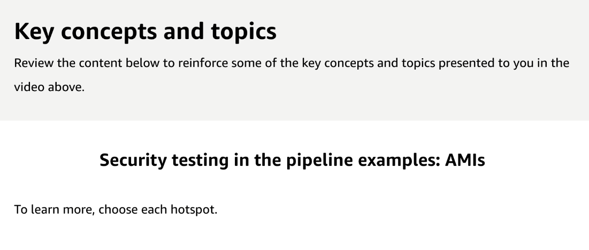
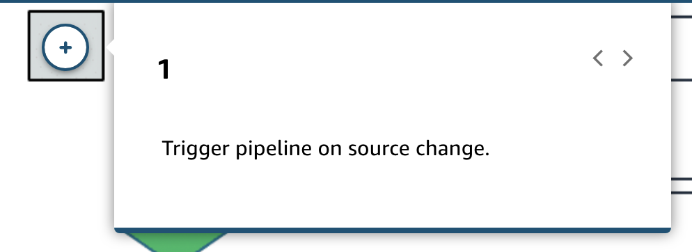
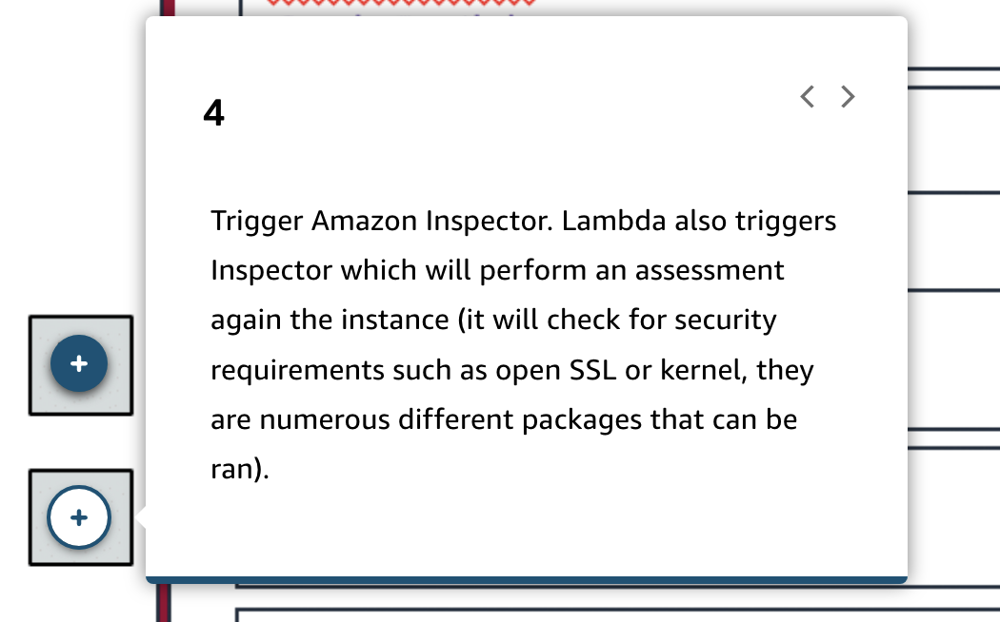
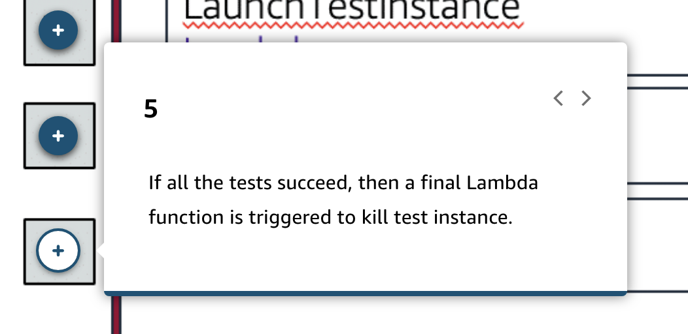
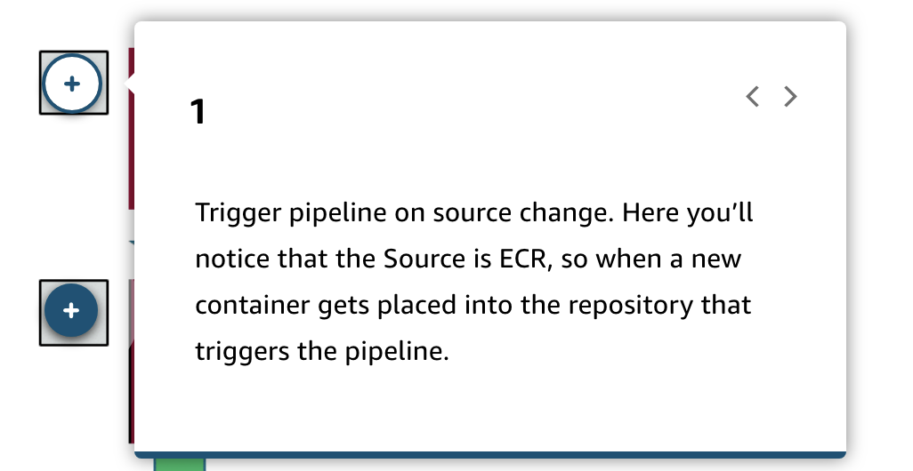
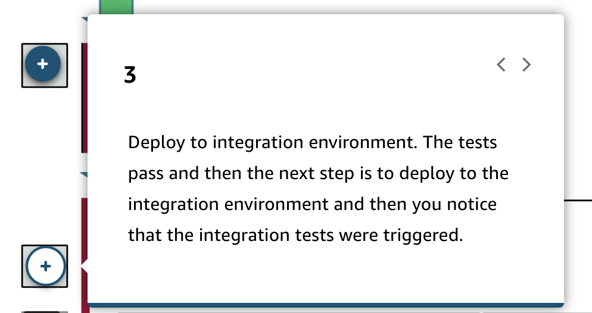
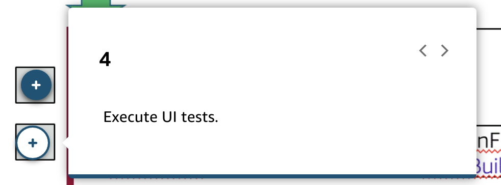
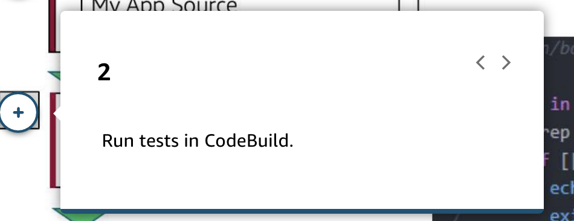

# 36 Security in the Pipeline

---

Summary

Security within the CI/CD pipeline is crucial, and there are various steps and tools available to ensure that code and infrastructure adhere to best practices and security standards.

Facts

- Emphasis on the distinction between security of the pipeline and security in the pipeline.
- Automated testing is essential, and security should be considered a vital test.
- EC2 instances can be tested for compliance with best practices using tools like AWS Inspector.
- Containers should undergo similar security checks to ensure they meet best practice standards.
- CodeBuild can be used to check for unauthorized packages or plugins during the build process.
- Static code analysis and dependency checks can identify potential security issues.
- Infrastructure as Code (IaC) tools like CloudFormation and Terraform can be checked for security compliance.
- Multiple stages of the pipeline offer opportunities to integrate security checks, ensuring robust testing and compliance.

