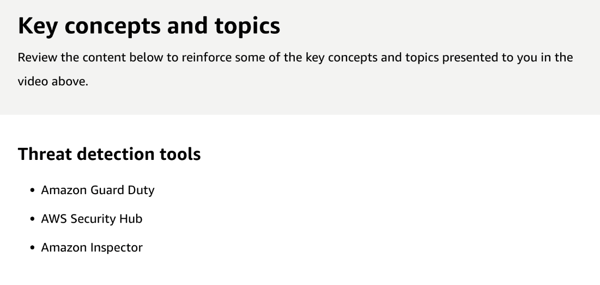

# 37 Threat Detection Tools

Created: 2023-10-12 21:58:43 -0600

Modified: 2023-10-22 17:44:49 -0600

---

Summary

AWS offers a suite of security tools that can be seamlessly integrated into the DevSecOps model, enhancing the security of both the pipeline and the applications within it.

Facts

- Threat detection tools in AWS provide significant security enhancements with minimal setup.
- Amazon GuardDuty is a network intrusion detection service that identifies threats like brute force attacks, Trojans, and Bitcoin mining.
- AWS Security Hub centralizes findings from various AWS security services, offering a comprehensive view of security posture.
- Amazon Inspector evaluates EC2 instances against security best practices, identifying vulnerabilities and misconfigurations.
- Inspector can be integrated into the CI/CD pipeline, allowing for real-time security assessments during the development process.
- The use of Lambda functions in the CI/CD pipeline can interpret Inspector results, triggering remediation actions or notifications based on findings.
- The overarching goal is to embed security checks throughout the AWS environment, ensuring both the integrity of the pipeline and the applications it manages.

{width="10.083333333333334in" height="4.854166666666667in"}

![Amazon GuardDuty Amazon GuardDuty is a security monitoring service that analyzes and processes Foundational data sources, such as AWS CloudTrail management events, AWS CloudTrail event logs, VPC flow logs, and DNS logs. It also processes features such as Kubernetes audit logs, RDS login activity, S3 logs, EBS volumes, and Runtime monitoring. It uses threat intelligence feeds, such as lists of malicious IP addresses and domains, and machine learning to identify unexpected, potentially unauthorized, and malicious activity within your AWS environment. This can include issues like escalation of privileges, use of exposed credentials, or communication with malicious IP addresses, domains, presence of malware on your Amazon EC2 instances and container workloads, or discovery of unusual patterns of login events on your database. For example, GuardDuty can detect compromised EC2 instances and container workloads serving malware, or mining bitcoin. It also monitors AWS account access behavior for signs of compromise, such as unauthorized infrastructure deployments, like instances deployed in a Region that hasn't been used before, or unusual API calls like a password policy change to reduce password strength. GuardDuty informs you of the status of your AWS environment by producing security findings that you can view in the GuardDuty console or through Amazon CloudWatch Events. GuardDuty also provides support for you to export your findings to an Amazon Simple Storage Service (S3) bucket, and integrate with other services such as AWS Security Hub and Detective. ](../../../media/AWS-DevOps-Module-10-37-Threat-Detection-Tools-image2.png){width="10.083333333333334in" height="8.385416666666666in"}

![Recon Known malicious IP (potentially) RDP brute force RDP brute force Connect to blacklisted site (potentially) RAT installed Unusual ports Unusual traffic volume Exfiltrate temp IAM creds over DNS DNS exfiltration Anonymizing proxy Probe API with temp creds Unusual ISP caller Bitcoin activity Attempt to compromise account Unusual instance launch Temp credentials used off-instance Amazon GuardDuty detection process Amazon GuardDuty can be enabled with a few clicks in the AWS Management Console. Once enabled, the service immediately starts analyzing billions of events from AWS Cloud Trail, Amazon VPC Flow Logs, and DNS logs. ](../../../media/AWS-DevOps-Module-10-37-Threat-Detection-Tools-image3.png){width="10.083333333333334in" height="4.635416666666667in"}

![AWS Security Hub AWS Security Hub provides you with a comprehensive view of your security state in AWS and helps you to check your environment against security industry standards and best practices. Security Hub collects security data from across AWS accounts, services, and supported third-party partner products and helps you to analyze your security trends and identify the highest priority security issues. The Amazon GuardDuty integration with Security Hub enables you to send findings from GuardDuty to Security Hub. Security Hub can then include those findings in its analysis of your security posture. ](../../../media/AWS-DevOps-Module-10-37-Threat-Detection-Tools-image4.png){width="10.083333333333334in" height="4.71875in"}

![CIS AWS Foundations controls Seagity Hub automated checks using the CIS AWS Foundations Benchmuk controtL Q Filter controls 2.3 Ensure the S3 bucket used to store CloudTrail logs is not publicly accessible @Compliant 2.6 Ensure S3 bucket access logging is enabled on the CloudTrail S3 bucket @Non-compliant I faild 2.4 Ensure CtoudTrail traits are integrated with CloudWatch Logs 1 failed 2.7 Ensure CloudTrail logs are encrypted at rest using KMS CMKs @Non-compliant I failed < 12 5 > 2.5 Ensure AWS Config is enabled in all regions @Complimt 1 Xcount passed 2.8 Ensure rotation for customer created CMKs is enabled NO data AWS Security Hub showing compliance The results of these compliance checks are called findings. Each finding tells you severity of the issue, which system reported it, which resources it affects, and a lot of other useful metadata. For example, you might see a finding that lets you know that multi- factor authentication should be enabled for a root account, or that there are credentials that haven't been used for 90 days that should be revoked. ](../../../media/AWS-DevOps-Module-10-37-Threat-Detection-Tools-image5.png){width="10.083333333333334in" height="3.8541666666666665in"}

{width="10.083333333333334in" height="4.322916666666667in"}

