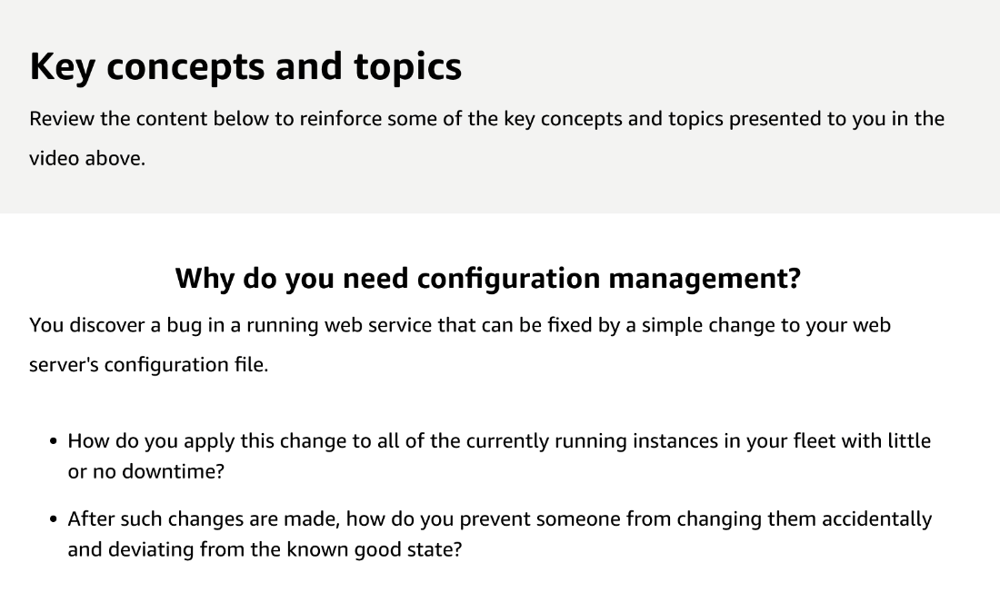

# 38

---

Summary

Effective configuration management is crucial for maintaining control over IT resources, ensuring they are in their desired state, and facilitating compliance and optimal operation across an organization's cloud architecture.

Facts

- Configuration management is essential for understanding and controlling the state of resources within a cloud environment, ensuring compliance, and addressing issues proactively.
- Traditional infrastructure management is labor-intensive, often becoming a bottleneck due to the need for constant updates and monitoring.
- Automated, distributed systems are necessary for efficiently deploying configuration files across numerous instances, allowing for dynamic adjustments per environment (dev, prod, etc.).
- Proper tools are required for ongoing management to enforce and apply changes, such as specific package versions or configuration file updates.
- Several third-party tools like Puppet, Chef, Salt, and Ansible, as well as AWS-native tools like Systems Manager and OpsWorks, can assist in applying comprehensive configuration management.
- Best practices include managing all possible aspects of resources, treating configuration instructions as code, and using version control methods like Git for change tracking and collaboration.
- Configuration management workflows typically involve writing instructions, storing them in a version-controlled repository, deploying them through a configuration management service, and executing them on the appropriate resources.
- Understanding the full scope of resources, maintaining an inventory, and controlling changes are fundamental steps in configuration management.
- AWS Config plays a significant role in monitoring compliance, helping to identify and rectify deviations from the desired configuration state.

![Example: Configuration management process Inventory/configuration tracking Control Change orchestration OS and application stack management training and -7 certification There are several best practices to consider when managing infrastructure configuration. First, it is important to understand the types of resources to manage and their different characteristics that must be accounted for in a configuration management system. For example, the configuration and orchestration of AWS resources (such as security groups, Auto Scaling groups, Elastic Load Balancing load balancers, etc.) is different from the configuration and orchestration of OS and application stack changes. It is also important to recognize that the manual configuration of distributed systems is time consuming, error prone, and can lead to inconsistently configured systems. Therefore, the ability to automate, monitor, and track configuration changes is a key component of any configuration management solution. ](../../../media/AWS-DevOps-Module-11-38-image4.png)

