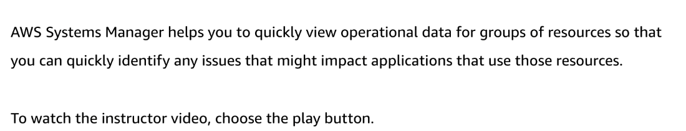

# 39 AWS Services and Tooling for Configuration Management

Created: 2023-10-15 09:10:11 -0600

Modified: 2023-10-22 17:45:00 -0600

---

Summary

AWS Config is instrumental in configuration management, providing continuous monitoring, auditing, and automatic remediation of resources within an environment, ensuring they adhere to desired configurations and best practices.

Facts

- AWS Config facilitates comprehensive oversight of all running resources, offering continuous monitoring and historical auditing trails for configuration changes and compliance.
- It enables automatic evaluation and reconciliation of configuration issues, as demonstrated with auto-remediation rules for non-compliant EC2 instances.
- AWS Config provides a repository of pre-built rules for common compliance checks (e.g., EBS encryption, proper Elastic IP attachment) and allows for custom rule creation using Lambda functions for unique scenarios or enhanced information gathering.
- Automatic remediation in Config can trigger Systems Manager automation documents to resolve identified issues, with flexibility for custom solutions to specific problems.
- AWS Config integrates with various AWS and third-party services for broader configuration management and orchestration, including CloudFormation, Systems Manager, Elastic Beanstalk, and external tools like Terraform by HashiCorp.
- AWS OpsWorks offers configuration management and automation using Puppet or Chef, with specific flavors like OpsWorks Stacks combining features from services like Elastic Beanstalk for a comprehensive solution.
- OpsWorks automates the deployment and configuration of applications on EC2 instances or containers, using Chef recipes or Puppet modules stored in a repository, thereby streamlining application management and infrastructure configuration.
- Systems Manager, an AWS-native tool, complements these services by providing free, extensive configuration management capabilities for both on-premises and cloud resources, integrating with AWS Config for a holistic approach to resource management and compliance enforcement.

{width="5.0in" height="2.8472222222222223in"}

![Use cases for AWS Config Discovery AWS Config will discover resources that exist in your account, record their current configuration, and capture any changes to these configurations. AWS Config will also retain configuration details for resources that have been deleted. A comprehensive snapshot of all resources and their configuration attributes provides a complete inventory of resources in your account. Change management When your resources are created, updated, or deleted, AWS Config streams these configuration changes to Amazon Simple Notification Service (Amazon SNS) so that you are notified of all the configuration changes. AWS Config represents relationships between resources so that you can assess how a change to one resource might affect other resources. ](../../../media/AWS-DevOps-Module-11-39-AWS-Services-and-Tooling-for-Configuration-Management-image2.png){width="5.0in" height="4.0625in"}

![Continuous audits and compliance AWS Config is designed to help you assess compliance with your internal policies and regulatory standards. It does this by providing you visibility into the configuration of your AWS resources and third-party resources, and evaluating resource configuration changes against your desired configurations on a continuous basis. Compliance-as-code framework You can use AWS Config as your framework for creating and deploying governance and compliance rules across your AWS accounts and Regions. You can codify your compliance requirements as AWS Config rules and author remediation actions using AWS Systems Manager Automation documents. You can then package them together within a conformance pack that can be easily deployed across an organization. Therefore, using AWS Config, you can automate assessment of your resource configurations and resource changes to help you ensure continuous compliance and self-governance across your AWS infrastructure. ](../../../media/AWS-DevOps-Module-11-39-AWS-Services-and-Tooling-for-Configuration-Management-image3.png){width="5.0in" height="3.7708333333333335in"}

![Troubleshooting Using AWS Config, you can quickly troubleshoot operational issues by identifying the recent configuration changes to your resources. Security analysis Data from AWS Config enables you to continuously monitor the configurations of your resources and evaluate these configurations for potential security weaknesses. Changes to your resource configurations can trigger Amazon SNS notifications, which can be sent to your security team to review and take action. After a potential security event, AWS Config enables you to review the configuration history of your resources and examine your security posture. ](../../../media/AWS-DevOps-Module-11-39-AWS-Services-and-Tooling-for-Configuration-Management-image4.png){width="5.0in" height="3.0625in"}

{width="5.0in" height="0.9583333333333334in"}

