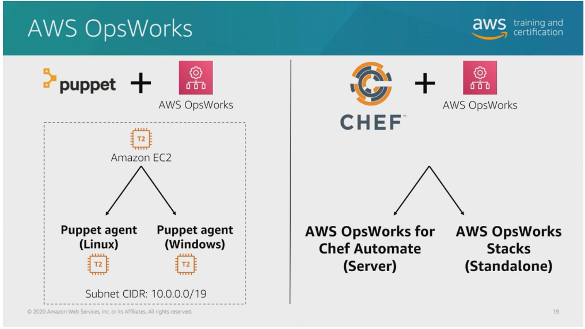

# 40 AWS Services and Tooling for Configuration Management

---

Summary

AWS Config plays a pivotal role in configuration management, providing continuous insight into your environment, auditing capabilities, and automated issue resolution. It helps with resource tracking, troubleshooting, and rule enforcement, while Systems Manager and other tools complement it for comprehensive configuration management.

Facts

- AWS Config offers continuous visibility into your environment's resource state, aiding in auditing and issue detection.
- It provides an audit trail for resource changes, enabling effective management and troubleshooting.
- AWS Config rules include pre-built ones for checking best practices, and custom rules can be created and managed using Lambda functions.
- Automatic remediation can be applied through Systems Manager automation documents.
- Various AWS services and third-party tools like CloudFormation, Elastic Beanstalk, and Terraform help orchestrate change management.
- OpsWorks is a configuration management tool that supports Puppet and Chef.
- Puppet on OpsWorks simplifies configuration management by handling the puppet master.
- Chef on OpsWorks offers two flavors: Chef Automate and OpsWorks Stacks.
- OpsWorks Stacks combines Elastic Beanstalk and Chef Service for an integrated solution.
- Systems Manager is an in-house configuration management toolset that supports EC2 architecture, best practices, and automatic remediation.
- It is suitable for managing on-premise and cloud resources.

These tools and services collectively enable effective configuration management in AWS environments.

![Use cases for AWS Config Discovery AWS Config will discover resources that exist in your account, record their current configuration, and capture any changes to these configurations. AWS Config will also retain configuration details for resources that have been deleted. A comprehensive snapshot of all resources and their configuration attributes provides a complete inventory of resources in your account. Change management When your resources are created, updated, or deleted, AWS Config streams these configuration changes to Amazon Simple Notification Service (Amazon SNS) so that you are notified of all the configuration changes. AWS Config represents relationships between resources so that you can assess how a change to one resource might affect other resources. ](../../../media/AWS-DevOps-Module-11-40-AWS-Services-and-Tooling-for-Configuration-Management-image2.png)![Continuous audits and compliance AWS Config is designed to help you assess compliance with your internal policies and regulatory standards. It does this by providing you visibility into the configuration of your AWS resources and third-party resources, and evaluating resource configuration changes against your desired configurations on a continuous basis. Compliance-as-code framework You can use AWS Config as your framework for creating and deploying governance and compliance rules across your AWS accounts and Regions. You can codify your compliance requirements as AWS Config rules and author remediation actions using AWS Systems Manager Automation documents. You can then package them together within a conformance pack that can be easily deployed across an organization. Therefore, using AWS Config, you can automate assessment of your resource configurations and resource changes to help you ensure continuous compliance and self-governance across your AWS infrastructure. ](../../../media/AWS-DevOps-Module-11-40-AWS-Services-and-Tooling-for-Configuration-Management-image3.png)![Troubleshooting Using AWS Config, you can quickly troubleshoot operational issues by identifying the recent configuration changes to your resources. Security analysis Data from AWS Config enables you to continuously monitor the configurations of your resources and evaluate these configurations for potential security weaknesses. Changes to your resource configurations can trigger Amazon SNS notifications, which can be sent to your security team to review and take action. After a potential security event, AWS Config enables you to review the configuration history of your resources and examine your security posture. ](../../../media/AWS-DevOps-Module-11-40-AWS-Services-and-Tooling-for-Configuration-Management-image4.png)

