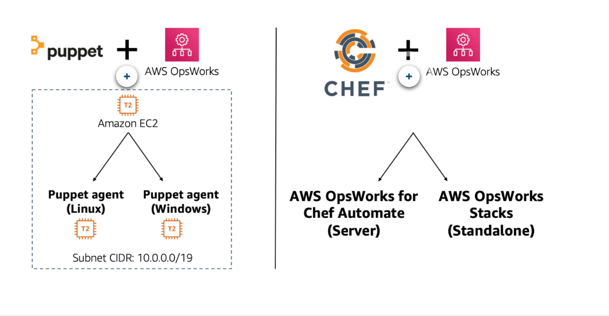
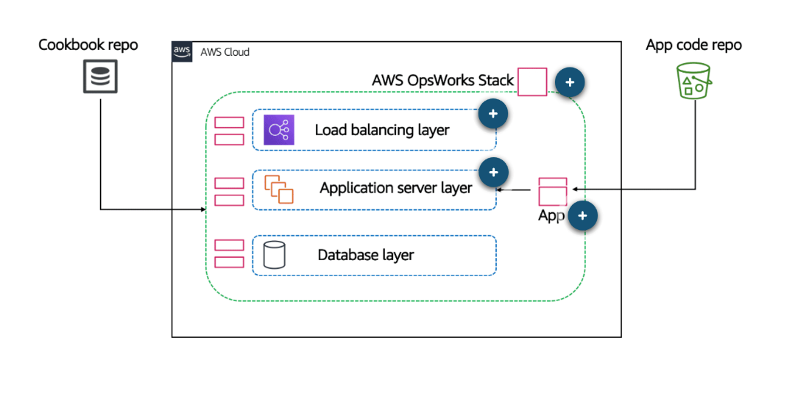
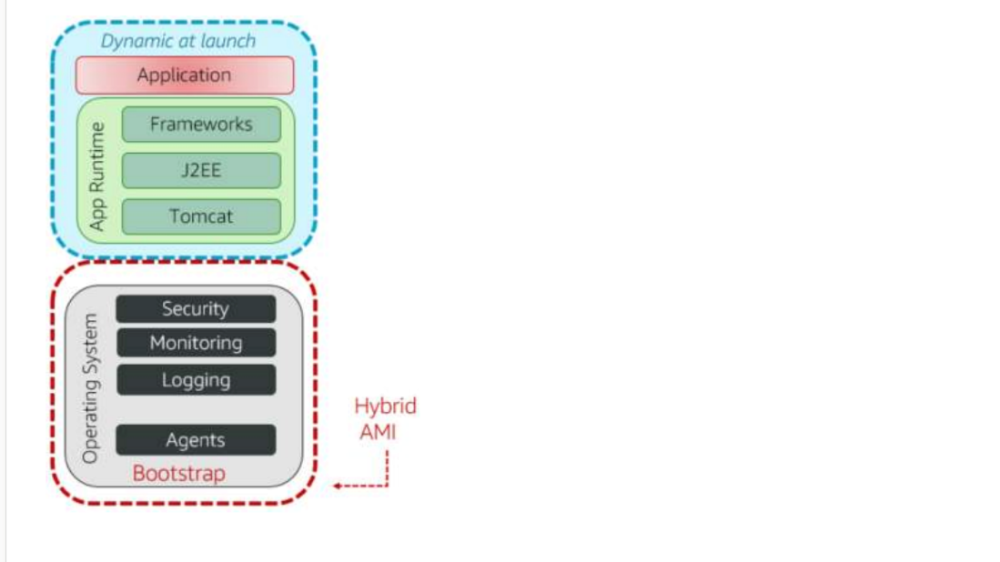

# 42 AWS Services and Tooling for Configuration Management-3

Created: 2023-10-17 21:37:17 -0600

Modified: 2023-10-22 17:45:08 -0600

---

Summary

In this section, we explore the capabilities of Systems Manager and how it simplifies the process of building and managing Amazon Machine Images (AMIs) in AWS. We discuss different AMI management strategies and automation possibilities.

Facts

- Systems Manager offers valuable features for managing AMIs, inventory, and automation.
- AMI management presents challenges such as version control and consistency.
- Customizing AMIs involves installing base-level tools like security, patches, and configuration agents.
- Different AMI types include fully built, just enough operating system, and hybrid options.
- Each AMI type has its benefits and drawbacks related to deployment time and automation complexity.
- A continuous loop of building, validating, registering, and distributing AMIs is crucial for maintaining a reliable golden AMI.
- CI/CD pipelines play a vital role in automating AMI creation.
- Tools like Packer and Systems Manager Automation Documents can automate AMI creation and updates.
- Automation Documents consist of playbooks, automation workflows, and actual YAML or JSON commands.
- Automation Documents can make API calls to AWS services for automated remediation.
- CloudFormation can be used to manage AMI updates in auto-scaling groups, with options like rolling or green-blue deployments.
- AWS encourages flexibility in choosing configuration management strategies, allowing experimentation with various tools and approaches.

{width="5.0in" height="2.2708333333333335in"}

{width="5.0in" height="2.6041666666666665in"}

![azon E :IDR: 10 rks S acks, y AWS OpsWorks for Puppet Enterprise AWS OpsWorks for Puppet Enterprise is a fully managed configuration management service that hosts Puppet Enterprise, a set of automation tools from Puppet, for infrastructure and application management. It maintains your Puppet master server by automatically patching, updating, and backing up your server. AWS OpsWorks eliminates the need to operate your own configuration management systems or worry about maintaining its infrastructure and gives you access to all of the Puppet Enterprise features. It also works seamlessly with your existing Puppet code. ](../../../media/AWS-DevOps-Module-11-42-AWS-Services-and-Tooling-for-Configuration-Management-3-image3.png){width="5.0in" height="5.798611111111111in"}

![I O AWS OpsWorks AWS OpsWorks for Chef Automate Offers a fully managed OpsWorks Chef Automate server. You can automate your workflow through a set of automation tools for continuous deployment and automated testing u for compliance and security. It also provides a user interface that gives you visibility into your nodes and their status. You can automate software and operating system configurations, package installations, database setups, and more. The Chef server centrally stores your configuration tasks and provides them to each node in your compute environment at any scale, from a few nodes to thousands of nodes. s for ate AWS OpsWorks Stacks (Standalone) ](../../../media/AWS-DevOps-Module-11-42-AWS-Services-and-Tooling-for-Configuration-Management-3-image4.png){width="5.0in" height="3.8125in"}

![AWS OpsWorks Stacks With OpsWorks Stacks, you can model your application as a stack containing different layers, such as load balancing, database, and application servers. You can deploy and configure EC2 instances in each layer or connect other resources such as Amazon RDS databases. You run Chef recipes using Chef Solo, enabling you to automate tasks such as installing packages and languages or frameworks, and configuring software. The diagram below shows the basic architecture of AWS OpsWorks Stacks. Keep in mind this is an example, layers and apps are flexible and can be used as needed across a stack. ](../../../media/AWS-DevOps-Module-11-42-AWS-Services-and-Tooling-for-Configuration-Management-3-image5.png){width="5.0in" height="2.451388888888889in"}

{width="5.0in" height="2.513888888888889in"}

{width="5.0in" height="4.375in"}

{width="5.0in" height="4.236111111111111in"}

{width="5.0in" height="4.166666666666667in"}

{width="5.0in" height="3.3819444444444446in"}

![Using Amazon Machine Images (AMIs) An Amazon Machine Image (AMI) provides the information required to launch an instance. It includes: • A template for the root volume for the instance (for example, an OS, an application server, and applications) • Launch permissions that control which AWS accounts can use the AMI to launch instances • A block device mapping that specifies the volumes to attach to the instance when it's launched • Storage for the root device (Amazon Elastic Block Store (Amazon EBS) snapshot-backed or instance store-backed) Remember: Automation is key, so it's a general best practice that you use prebuilt AMIs. ](../../../media/AWS-DevOps-Module-11-42-AWS-Services-and-Tooling-for-Configuration-Management-3-image11.png){width="5.0in" height="2.9583333333333335in"}

![AMI OPTIONS: FULLY BUILT AMI OPTIONS: JEOS AMI OPTIONS: HYBRID AMI On one end of the spectrum is the most common method for AMI design that provisions a fully functional instance, including all necessary software for a specific role or even a single instance. Organizations often create a baseline AMI that conforms to minimal security and configuration requirements. It then builds on this baseline to create fully baked AMIs that are specific to applications or infrastructures for actual instance deployment. Fully baked AMIs are the simplest to deploy and provide the fastest launch times. For this reason, fully baked AMIS are useful to quickly deploy replacement instances or add additional capacity. Fully baked AMIS also require minimal changes when launched and can be used to capture manual installation and configuration steps that cannot be automated. The process of using fully baked AMIs is similar to how many organizations deploy virtual servers in their existing data centers. This makes this simple approach applicable to customers who are new to the AWS platform and are accustomed to image-based server deployments. ](../../../media/AWS-DevOps-Module-11-42-AWS-Services-and-Tooling-for-Configuration-Management-3-image12.png){width="5.0in" height="2.7777777777777777in"}

{width="5.0in" height="2.951388888888889in"}

![AMI OPTIONS: FULLY BUILT AMI OPTIONS: JEOS AMI OPTIONS: HYBRID AMI At the other end of the spectrum is the just enough operating system (JeOS) approach. This approach creates an AMI that combines a minimal operating system with a configuration management agent that builds a fully functional system at instance launch. On first boot, the configuration agent downloads, installs, configures, and integrates all required software. JeOS AMIS offer the most flexibility during deployment and the highest levels of portability because they leverage minimal server images. Customers who prefer this approach typically have experience with AWS and configuration automation tools. They want deployment flexibility to be able to pull the latest software builds and updates at launch, or they might require minimal complexity to deploy resources to both AWS and on-premises environments. ](../../../media/AWS-DevOps-Module-11-42-AWS-Services-and-Tooling-for-Configuration-Management-3-image14.png){width="5.0in" height="2.4166666666666665in"}

{width="5.0in" height="2.75in"}

![AMI OPTIONS: FULLY BUILT AMI OPTIONS: JEOS AMI OPTIONS: HYBRID AMI Hybrid AMIs provide a subset of the software needed to produce a fully functional instance, falling between the fully built-in functionality and JeOS options on the AMI design spectrum. This approach creates a partially baked, generic infrastructure AMI that is further configured on first boot based on specific application requirements. The decision about what to build into the AMI and what to install and configure at launch is typically based on how reusable the underlying software package is across all instances and how long it takes to download, install, and configure the software component. For example, to reduce instance launch times, include server management agents and baseline security configurations into an AMI. To further reduce instance launch times, include the necessary software to create role-specific AMIs (for example, web servers, application servers, database servers). Hybrid AMIs combine the flexibility of post-launch changes with the speed of preinstalled and preconfigured infrastructure components. This can be especially useful for merging frequently changing software (such as application code or security updates) with infrequently changing software (such as management agents and security baselines). Customers who use this approach typically have a moderate amount of experience with AWS and configuration automation tools, and want to combine the deployment simplicity of a preconfigured image with the deployment flexibility that pulls the latest software builds and updates at launch. ](../../../media/AWS-DevOps-Module-11-42-AWS-Services-and-Tooling-for-Configuration-Management-3-image16.png){width="5.0in" height="3.9027777777777777in"}

{width="5.0in" height="2.8125in"}

![Creating a configuration strategy You can use different combinations of the technologies discussed in this module to manage your AMIs. The solution adopted by your company will depend on several factors, including your production workflow and your organizational standards. None of these techniques are mutually exclusive; they can all be used in tandem to craft a strategy that's right for your company. In general, placing software in AMIS is best reserved for foundational, slow-changing components that are truly required as standards throughout your company. Lastly, experiment! ](../../../media/AWS-DevOps-Module-11-42-AWS-Services-and-Tooling-for-Configuration-Management-3-image18.png){width="5.0in" height="1.9236111111111112in"}

{width="5.0in" height="2.8472222222222223in"}

![Example: Pipeline executing Systems Manager Automation AWS CodePipeline Lambda function AWS CodeCommit Git Push Git Pull Devops Base AMI AWS CodeBuild AWS CodeDeploy aws AWS Cloud Auto Scaling group training and -y certification Auto scaling group Systems Manager Automation Golden AMI On every deployment, golden AMI will be built per Systems Manager Automation document 0 2020 Amazon Web Services, Inc. or its Affiliates. All rights reserved. Updates the Auto Scaling group with the new golden AMI ID 36 ](../../../media/AWS-DevOps-Module-11-42-AWS-Services-and-Tooling-for-Configuration-Management-3-image20.png){width="5.0in" height="2.8125in"}

