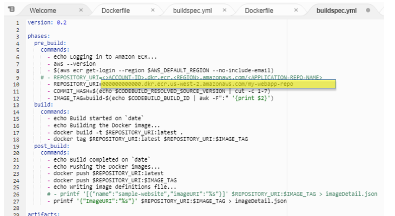
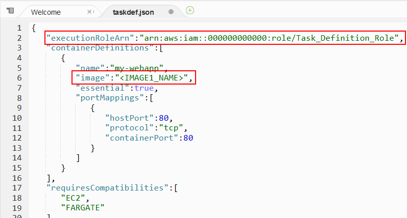
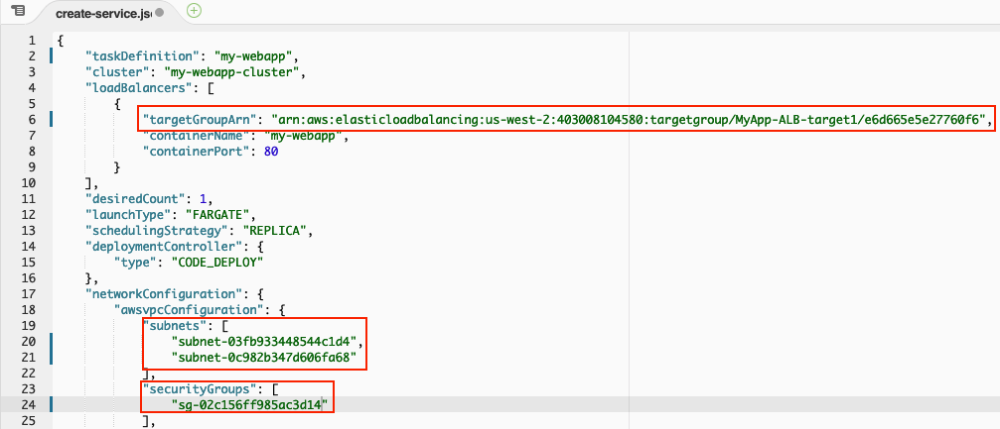
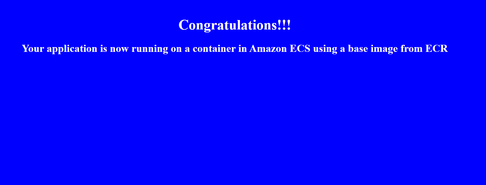
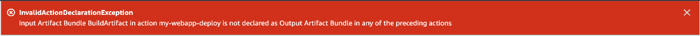
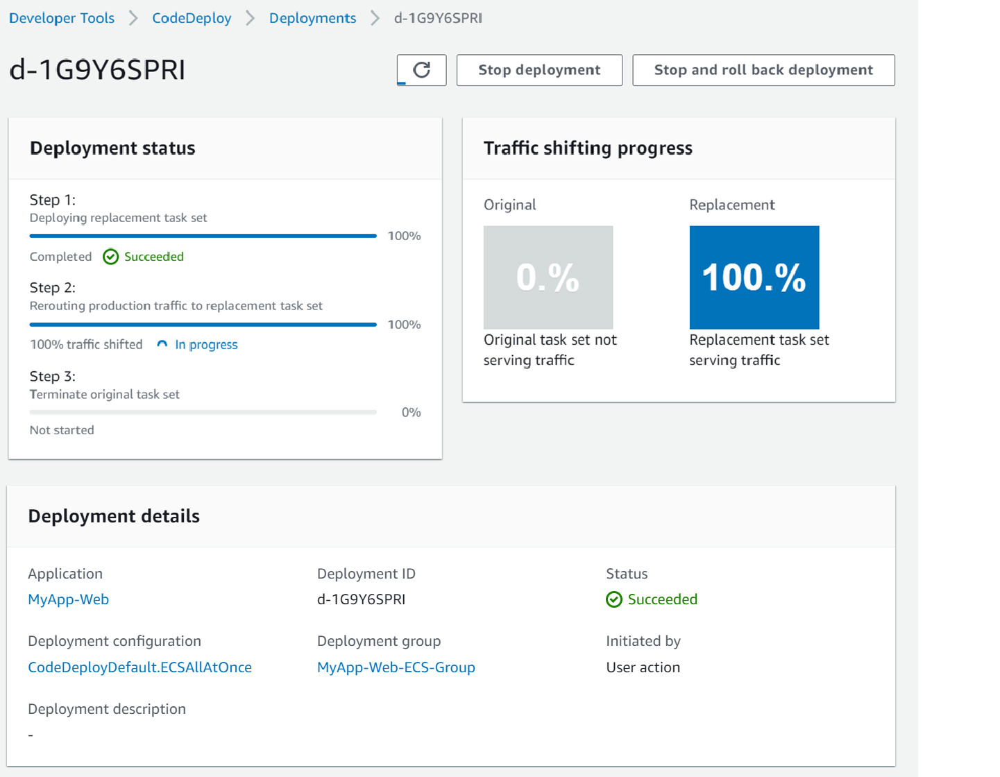
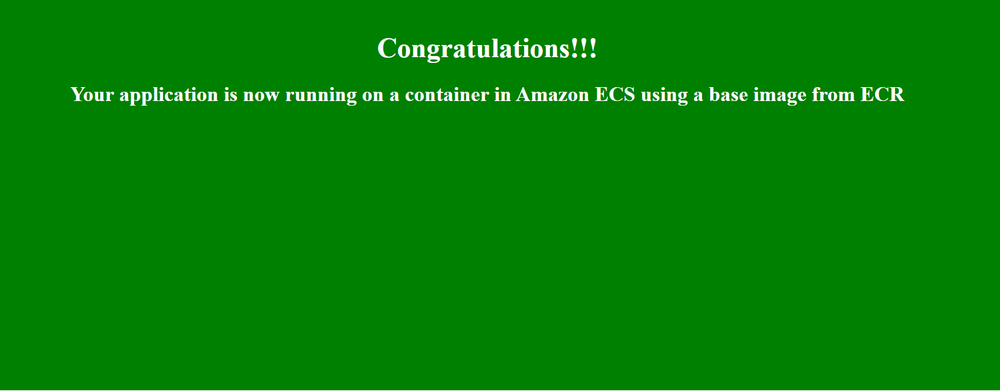

# Lab 5: Performing blue/green deployments with CI/CD pipelines and Amazon Elastic Container Service | Self-Paced Labs

---

Clipped from: <https://labs.skillbuilder.aws/sa/lab/arn%3Aaws%3Alearningcontent%3Aus-east-1%3A470679935125%3Ablueprintversion%2FILT-TF-200-DEVOPS-3%2Flab-5-CICDwECS%3A3.4.6-cf1f52fd/en-US>

# Lab 5: Performing Blue/Green Deployments with CI/CD Pipelines and Amazon Elastic Container Service

© 2023 Amazon Web Services, Inc. or its affiliates. All rights reserved. This work may not be reproduced or redistributed, in whole or in part, without prior written permission from Amazon Web Services, Inc. Commercial copying, lending, or selling is prohibited. All trademarks are the property of their owners.

Note: Do not include any personal, identifying, or confidential information into the lab environment. Information entered may be visible to others.

Corrections, feedback, or other questions? Contact us at *[AWS Training and Certification](https://support.aws.amazon.com/#/contacts/aws-training).*

## Lab overview

In this lab, you use AWS DevOps tools to build Docker container images and store them in the Amazon Elastic Container Registry (Amazon ECR). You implement blue/green deployments of a containerized web application into an Amazon Elastic Container Service (Amazon ECS) cluster managed by AWS Fargate. You configure one end-to-end continuous deployment (CD) pipeline with AWS CodeBuild, Amazon ECR, and AWS CodeDeploy to build and store the container image, and then perform a blue/green deployment.

Blue/green deployments minimize interruptions to the customer experience and provide rapid rollback. Automating a blue/green deployment model increases the delivery speed of a DevOps team by supporting the concept of CI/CD.

**Note:** In order to give you a jump start, you are provided with the following lab resources:

- The sample code for your web application, including a Dockerfile used to build a container image.
- Specification files for deployment.
- A cluster to deploy your container images into.
- Other supporting AWS infrastructure resources needed to implement this solution using CI/CD pipelines are also provided, such as a VPC, an Internet Gateway, Subnets, IAM Roles, an Application Load Balancer, AWS CodeCommit repositories, and more.

### Objectives

By the end of this lab, you will be able to do the following:

- Build custom container images using AWS CodeBuild and store them in Amazon ECR.
- Set up a CI/CD to build and automate application container image creation using AWS CodePipeline.
- Host and run a containerized web application using Amazon ECS and AWS Fargate.
- Configure AWS CodeDeploy to perform a blue/green deployment.
- Set up a CI/CD to automate the build and deployment of a containerized web application.

### Technical knowledge prerequisites

- Basic navigation of the AWS Management Console.
- Editing scripts using AWS Cloud9.
- Basic knowledge interacting with the AWS CLI using AWS Cloud9.
- Basic knowledge of containers and AWS DevOps tools.

### Duration

This lab requires *60* minutes to complete.

### Icon key

Various icons are used throughout this lab to call attention to different types of instructions and notes. The following list explains the purpose for each icon:

- **Command:** A command that you must run.
- **Expected output:** A sample output that you can use to verify the output of a command or edited file.
- **Note:** A hint, tip, or important guidance.
- **Additional information:** Where to find more information.
- **CAUTION:** Information of special interest or importance (not so important to cause problems with the equipment or data if you miss it, but it could result in the need to repeat certain steps).
- **WARNING:** An action that is irreversible and could potentially impact the failure of a command or process (including warnings about configurations that cannot be changed after they are made).

## Start lab

1.  To launch the lab, at the top of the page, choose Start lab.

You must wait for the provisioned AWS services to be ready before you can continue.

1.  To open the lab, choose Open Console.

You are automatically signed in to the AWS Management Console in a new web browser tab.

**Do not change the Region unless instructed.**

### Common sign-in errors

#### *Error: You must first sign out*

If you see the message, **You must first log out before logging into a different AWS account:**

- Choose the **click here** link.
- Close your **Amazon Web Services Sign In** web browser tab and return to your initial lab page.
- Choose Open Console again.

#### *Error: Choosing Start Lab has no effect*

In some cases, certain pop-up or script blocker web browser extensions might prevent the **Start Lab** button from working as intended. If you experience an issue starting the lab:

- Add the lab domain name to your pop-up or script blocker's allow list or turn it off.
- Refresh the page and try again.

### Lab environment

*The diagram outlines a web application pipeline where images are retrieved and stored into ECR repos during the build process, and finally deploying into ECS containers using the Blue-Green deployment method.*

### AWS Services Not Used in This Lab

AWS services that are not used in this lab are deactivated in the lab environment. In addition, the capabilities of the services used in this lab are limited to what the lab requires. Expect errors when accessing other services or performing actions beyond those provided in this lab guide.

## Task 1: Set up the source files

In this task, you configure the build specification files to refer the application docker file, build a new image, and push the code to an appropriate AWS CodeCommit source repository. Later, you use the output build artifacts in setting up the CI/CD pipeline.

### Task 1.1: Access the Cloud9 IDE to update the code

**WARNING:** Make sure that you are using the *Region* displayed in the *AwsRegionCode* value from the *Resources* panel to the left of these instructions.

1.  Open the **Cloud9** environment by copying the **URL** value to the left of these instructions for the heading reading **Cloud9Environment** and pasting it into a new browser tab.

**Note:** When the AWS Cloud9 environment is first launched, a bash script clones the two CodeCommit repositories you use for this lab.

**Expected output:**

******************************
**** This is OUTPUT ONLY. ****
******************************

/tmp/git-cloning-runner-1662502035300-043120246043.sh
/tmp/git-cloning-runner-1662502035300-043120246043.sh
AWSLabsUser-xkqi1eCSsRSe1YaCcQKetu:~/environment $ /tmp/git-cloning-runner-1662502035300-043120246043.sh
Cloning into '/home/ec2-user/environment/local_repo/my-webapp-repo'...
remote: Counting objects: 7, done.
Unpacking objects: 100% (7/7), 2.04 KiB | 522.00 KiB/s, done.

Navigate to your cloned repository by typing "cd /home/ec2-user/environment/local_repo/my-webapp-repo" to start working with " <https://git-codecommit.us-west-2.amazonaws.com/v1/repos/my-webapp-repo>"

To set your display name run "git config --global user.name YOUR_USER_NAME"
To set your display email run "git config --global user.email YOUR_EMAIL_ADDRESS"

AWSLabsUser-xkqi1eCSsRSe1YaCcQKetu:~/environment $

**Note:** You can close the *Welcome* tab.

### Task 1.2: Configure the web application image buildspec file

In this task, you use AWS CodeBuild and Docker to build your web application image and push the image to Amazon ECR. The Docker image built is based on the Dockerfile provided to you, which installs all basic dependencies needed for your application to host a simple web page in the blue background color. As part of this lab, you limit Dockerfile dependencies to *apache2*.

**Note:** The apache2 web server is required to host your sample website.

You add a *buildspec.yml* file to your source code repository to tell CodeBuild how to build the application image. The build specification provided does the following.

- *Pre-build stage*:

- Log in to Amazon ECR.
- Sets the ECR repository URI as the destination for the image that is built in the Build stage.
- Sets the tag format for the built image, using **latest** in addition to the Git commit ID.

<!-- -->
- *Build stage*:

- Builds the Docker image, then tags the built image using the format defined in the Pre-build stage.

<!-- -->
- *Post-build stage*:

- Pushes the tagged image to the ECR repository.

First, you need to configure the build specification file to match your lab settings before adding it into the source repository.

1.  In the **AWS Cloud9 Environment** pane, expand the **local_repo** folder and then the **my-webapp-repo** folder.
2.  Locate the **buildspec.yml** file. Open the context menu for the **buildspec.yml** file, and choose **Open**.
3.  In the **Resources** pane to the left of the lab instructions, locate the **URIwebappECRrepo** variable and choose the copy icon.
4.  In the **AWS Cloud9 editor** window, on line **9**, replace the text *after* **REPOSITORY_URI=** with the **URIwebappECRrepo** value you copied from the lab instructions for the Amazon Elastic Container Registry (Amazon ECR) **my-webapp-repo** repository.

*Image highlights the format of the repository URI.*

**Caution:** Do not erase *REPOSITORY_URI=* on line *9* of the buildspec.yml file.

1.  Save your changes to the **buildspec.yml** file.

### Task 1.3: Push the web application image buildspec file to CodeCommit repo

In this task, you push the changes you made to the build specification file to the codecommit repo *my-webapp-repo*.

1.  **Command:** In the **AWS Cloud9 terminal**, ensure that you are in the **my-webapp-repo** folder by running the following command:

cd ~/environment/local_repo/my-webapp-repo

**Expected Output:**

*None, unless there is an error.*

1.  **Command:** Confirm that your change to the **buildspec.yml** file is saved by running the following command:

git status

**Expected output:**

******************************
**** This is OUTPUT ONLY. ****
******************************

On branch main
Your branch is up to date with 'origin/main'.

Changes not staged for commit:
(use "git add <file>..." to update what will be committed)
(use "git restore <file>..." to discard changes in working directory)
modified: buildspec.yml

no changes added to commit (use "git add" and/or "git commit -a")

**Note:** If Git does not show *buildspec.yml* file as *modified*, verify that your changes to the file were saved correctly.

1.  **Command:** Update the remote repository by running the following commands:

git add .
git commit -m "Updated buildspec file"
git push

**Expected output:**

******************************
**** This is OUTPUT ONLY. ****
******************************

AWSLabsUser-xkqi1eCSsRSe1YaCcQKetu:~/environment/local_repo/my-webapp-repo (main) $ git add .
AWSLabsUser-xkqi1eCSsRSe1YaCcQKetu:~/environment/local_repo/my-webapp-repo (main) $ git commit -m "Updated buildspec file"
[main d6fd14e] Updated buildspec file
Committer: EC2 Default User [<ec2-user@ip-10-192-10-208.us-west-2.compute.internal](mailto:%3cec2-user@ip-10-192-10-208.us-west-2.compute.internal)>
Your name and email address were configured automatically based
on your username and hostname. Please check that they are accurate.
You can suppress this message by setting them explicitly:

git config --global user.name "Your Name"
git config --global user.email <you@example.com>

After doing this, you may fix the identity used for this commit with:

git commit --amend --reset-author

1 file changed, 1 insertion(+), 1 deletion(-)
AWSLabsUser-xkqi1eCSsRSe1YaCcQKetu:~/environment/local_repo/my-webapp-repo (main) $ git push
Enumerating objects: 5, done.
Counting objects: 100% (5/5), done.
Compressing objects: 100% (3/3), done.
Writing objects: 100% (3/3), 354 bytes | 354.00 KiB/s, done.
Total 3 (delta 2), reused 0 (delta 0), pack-reused 0
To <https://git-codecommit.us-west-2.amazonaws.com/v1/repos/my-webapp-repo>
d6f9250..d6fd14e main -> main

Congratulations! You have successfully configured the build specification file to refer to the application file and build an image by AWS CodeBuild.

## Task 2: Creating a continuous delivery pipeline

In this task, you create a CI/CD pipeline named *my-webapp-pipeline* for automating the creation of the application image based on the build specification file. The *my-webapp-pipeline* is started when any updates occur to the source code.

### Task 2.1: Create the continuous delivery pipeline to build your application image

Use the *AWS CodePipeline wizard* to create the pipeline stages necessary for continuous delivery of your application image. For this task, return to the *Your environments* browser tab and complete the following steps.

1.  Switch to the **AWS Management Console** browser tab.
2.  At the top of the AWS Management Console, in the search bar, search for and choose

CodePipeline

in a new browser tab.

3.  On the CodePipeline dashboard, choose Create pipeline .

**Note:** If you see an introductory page instead of the dashboard, choose *Get Started Now*.

1.  On the **Choose pipeline settings** page, in the **Pipeline settings** section:

- For **Pipeline name**, enter

my-webapp-pipeline

**Note:** The CodePipeline wizard creates a role for the *my-webapp-pipeline*. You use the same role for the *my-webapp-pipeline*.

1.  Accept the default values for the remaining options and choose Next .

### Task 2.2: Add a stage for referring to the application source code

In this task, you add a new stage to the pipeline to refer to the application source code. The application source code is hosted in an AWS CodeCommit repo. By adding this stage, any changes you make to the source code is automatically detected and continuously integrated into the pipeline workflow. You add the repo *my-webapp-repo* and *main* branch. You have committed the changes already in the earlier tasks.

1.  On the **Add source stage** page, in the **Source** card, choose **AWS CodeCommit** for the **Source provider**.

**Note:** After you select *AWS CodeCommit* the page refreshes to display additional options: *Repository name*, *Branch name*, and *Change detection options*.

1.  On the **Add source stage** page, in the **Source** section:

- For **Repository name**, choose **my-webapp-repo**
- For **Branch name**, choose **main**
- For **Change detection options**, select **Amazon CloudWatch Events (recommended)**
- For **Output artifact format**, select **CodePipeline default**

### Task 2.2: Add a stage for building application code

In this task, you add a stage to build your application artifacts using AWS CodeBuild. AWS CodeBuild refers to the source artifacts and builds the application based on the commands you provided in build specification file. You create a CodeBuild project to create a build environment with the necessary permissions.

1.  On the **Add build stage** page, in the **Build** - *optional* section:

- For **Build provider**, choose **AWS CodeBuild**

**Note:** After you select *AWS CodeBuild* the page refreshes to display additional options: *Region*, *Project name*, *Environment variables*.

- For **Region**, make sure that you are using the value displayed in the **AwsRegionCode** variable from the **Resources** panel to the left of these instructions.
- For **Project name**, choose Create project

**Note:** The browser opens a new tab for creating a CodeBuild project.

1.  On the **Create build project** page, in the **Project configuration** section:

- For **Project name**, enter

my-webapp-build-project

1.  In the **Environment** section:

- For **Environment image**, select **Managed image**
- For **Operating system**, choose **Ubuntu**
- For **Runtime(s)**, choose **Standard**
- For **Image**, choose **aws/codebuild/standard:7.0**
- For **Image version**, choose **Always use the latest image for this runtime version**
- For **Environment type**, choose **Linux EC2**
- For **Privileged**, select the check box **Enable this flag if you want to build Docker images or want your builds to get elevated privileges**
- For **Service role**, select **Existing service role**
- For **Role ARN**, choose **CodeBuild_Service_Role**

**Note:** It automatically populates with the ARN for the role.

- Clear the **Allow AWS CodeBuild to modify this service role so it can be used with this build project** check box.

**Caution:** You must *clear* the *check box* since the CodeBuild service does not have permissions to modify the role in this lab. This role already has the permissions needed.

1.  Leave remaining options with the default values.
2.  Choose Continue to CodePipeline .

**Expected Output:**

*Successfully created my-webapp-build-project in CodeBuild*

**Note:** The browser returns you back to the **Add build stage** page.

1.  For the **Build type** - *optional*, choose **Single build**.
2.  Choose Next .
3.  On the **Add deploy stage** page, choose Skip deploy stage .
4.  In the **Skip deployment stage** warning dialog box, choose Skip .
5.  On the **Review** page, review your selections for accuracy.
6.  When satisfied, choose Create pipeline .

**Expected Output:**

*Success*

*Congratulations! The pipeline my-webapp-pipeline has been created.*

The *Details* page for the *my-webapp-pipeline* is displayed. You can observe the progress of each stage of your pipeline.

*Images shows the different stages of the pipeline.*

Congratulations! You have successfully created the release pipeline with two stages. The pipeline should progress through each stage now. Once completed with the *Build* stage, it should add a new application image to the Amazon ECR repo, *my-webapp-repo*. You refer to this image in the next tasks to deploy your web application.

**Note:** You can proceed to the next task without waiting for it to complete.

## Task 3: Preparing the ECS cluster to support application deployment

In this task, you configure your ECS cluster to support the deployment of a demonstration application called *my-webapp*. You define an ECS task to refer to the application container image hosted in the ECR repo with necessary configuration details. Then, you define an ECS service to run containers based on the task definition behind a load balancer to support the traffic distribution once blue/green deployment goes live.

### Task 3.1: Create Amazon ECS task definition

In this task, you create an ECS task named *my-webapp* for *my-webapp* to run on a container instance in the cluster. You use AWS CLI command to create the task manually for the first time using the container image already available. Later, you change the task definition file to use a placeholder variable *IMAGE1_NAME* variable to refer to the latest images created during the pipeline workflow.

The task definition is the blueprint for your task and references the container image hosted in your image repository. It contains the minimum configuration information necessary to perform a blue/green rollout, such as name of the task, revisions, container definitions, roles, and volume details.

1.  Return to the **Lab5 - AWS Cloud9** web browser tab.
2.  In the **AWS Cloud9 Environment** pane, in the my-webapp-repo folder, locate the **taskdef.json** file, open the context menu for the file, and choose **Open**.
3.  In the lab instructions tab, in the information pane, locate the **ecsTaskDefinitionRoleARN** variable, and choose the copy icon.
4.  In the **AWS Cloud9 IDE environment**, on line **2**, replace the text *after* **executionRoleArn:** with the value of **ecsTaskDefinitionRoleARN** you copied from the lab instructions.
5.  In the lab instructions tab, in the information pane, locate the **URIwebappECRrepo** variable and choose the copy icon.
6.  In the **AWS Cloud9 IDE environment**, on line **6**, replace the text after **image:** with the value of **URIwebappECRrepo** you copied from the lab instructions.

**Caution:** Do not delete *executionRoleArn:* or *image:*, and be sure to enclose values in double quotation marks. For example, "arn:aws:iam::000000000000:role/Task_Definition_Role".

Once the changes are made as suggested, your *taskdef.json* should appear similar to:

*Image shows examples for the executionRoleArn format and the image URI.*

1.  Save your changes to the **taskdef.json** file.
2.  **Command:** Run the following command in the **AWS Cloud9 terminal** to ensure that you are in the **my-webapp-repo** folder:

cd ~/environment/local_repo/my-webapp-repo

**Expected Output:**

*None, unless there is an error.*

1.  **Command:** To create the **task definition** for your cluster, run the following command:

aws ecs register-task-definition --cli-input-json <file://taskdef.json>

**Expected output:**

{
"taskDefinition": {
"taskDefinitionArn": "arn:aws:ecs:us-east-1:000000000000:task-definition/my-webapp:1",
"containerDefinitions": [
{
"name": "my-webapp",
"image": "000000000000.dkr.ecr.us-east-1.amazonaws.com/my-webapp-repo",
"cpu": 0,
"portMappings": [
{
"containerPort": 80,
"hostPort": 80,
"protocol": "tcp"
}
],
"essential": true,
"environment": [],
"mountPoints": [],
"volumesFrom": []
}
],
"family": "my-webapp",
"executionRoleArn": "arn:aws:iam::000000000000:role/Task_Definition_Role",
"networkMode": "awsvpc",
"revision": 1,
"volumes": [],
"status": "ACTIVE",
"requiresAttributes": [
{
"name": "com.amazonaws.ecs.capability.ecr-auth"
},
{
"name": "ecs.capability.execution-role-ecr-pull"
},
{
"name": "com.amazonaws.ecs.capability.docker-remote-api.1.18"
},
{
"name": "ecs.capability.task-eni"
}
],
"placementConstraints": [],
"compatibilities": [
"EC2",
"FARGATE"
],
"requiresCompatibilities": [
"EC2",
"FARGATE"
],
"cpu": "256",
"memory": "512",
"registeredAt": 1662669241.52,
"registeredBy": "arn:aws:sts::000000000000:assumed-role/AWSLabsUser-eJhAC3cikLfKr88VFxxxeg/b3beddcc-9537-485d-b0fc-61796589617b"
}
}

Now, change the *taskdef.json* file so that the image gets dynamically updated with the latest image URI by AWS CodeDeploy in the pipeline for future deployments.

1.  On line **6** of the **taskdef.json** file, replace the entire text after the image field **"image":** with

"<IMAGE1_NAME>"

image placeholder.

**WARNING:**

- Do not delete *"image":* , and be sure to enclose the image field in quotation marks. For example, "image": "<IMAGE1_NAME>".
- The *taskdef* file is a JSON-formatted file, which requires that all lines end with a (,) except for the last line of a section. When you replace *my-webapp-repo:latest* with *<IMAGE1_NAME>* ensure the comma (,) is retained at the end of line *6*.

Once the changes are made as suggested, your *taskdef.json* should appear similar to:

*Image shows example of the taskdef.json file highlighting the format of the executionRoleArn and the image property.*

1.  Save your changes to the **taskdef.json** file.

Congratulations! You have successfully created an ECS task to define your container's configurations.

### Task 3.2: Create Amazon ECS service

In this task, you create an ECS service *MyApp-Web-service* based on the task you defined in the previous task.

Amazon ECS allows you to run and maintain a specified number of instances of a task definition simultaneously in an Amazon ECS cluster. This is called a service scheduler. If any of your tasks should fail or stop for any reason, the Amazon ECS service scheduler launches another instance of your task definition to replace it and maintain the desired count of tasks in the service, depending on the scheduling strategy used.

Besides maintaining the desired count of tasks in your service, you can optionally run your service behind a load balancer. The load balancer distributes traffic across the blue/green tasks that are associated with the service.

1.  In the **AWS Cloud9 Environment** pane, in the **my-webapp-repo** folder, locate the **create-service.json** file, open the context menu, and choose **Open**.

**Note:** When the *create-service.json* file opens, take note of the *targetGroupARN*, *subnets*, and *securityGroups*. Each of these has a sample entry that you replace with the value appropriate for your environment. The lab environment was pre-configured with these resources for you to use.

1.  In the **create-service.json** file, replace the sample **targetGroupARN** value on line **6** with the **TargetGroup1ARN** output from the left of these instructions.

**WARNING:** Ensure that when you replace the sample value with the *TargetGroup1ARN* value from the lab instructions, it is enclosed in quotation marks ("). Also, as with the *taskdef.json* file, retain the comma (,) at the end of the line.

1.  Replace both sample entries for the **subnets** on lines **20** and **21**, in the **create-service.json** file, with the **Subnet1** and **Subnet2** outputs from the left of these instructions.

**Caution:** The sample values must be enclosed in quotation marks ("). Also, only the first entry requires a comma (**,**) at the end of the line.

1.  Replace the sample entry for **securityGroups** on line **24** in the **create-service.json** file, with the **SecurityGroupID** output from the left of these instructions.

**Caution:** Include the quotation marks (") surrounding the sample value. Because there is only one entry in this section, no comma (,) is required after the closing quotation mark for the value.

Once the changes are made as suggested, your *create-service.json* should appear similar to:

*Image highlights examples of what targetGroupArn, subnets, and securityGroup properties look like when the create-service.json file is updated.*

1.  Save your changes to the **create-service.json** file.
2.  **Command:** To create the service for your ECS cluster, run the following command:

aws ecs create-service --service-name MyApp-Web-service --cli-input-json <file://create-service.json>

**Expected Output:**

{
"service": {
"serviceArn": "arn:aws:ecs:us-west-2:000000000000:service/my-webapp-cluster/MyApp-Web-service",
"serviceName": "MyApp-Web-service",
"clusterArn": "arn:aws:ecs:us-west-2:000000000000:cluster/my-webapp-cluster",
"loadBalancers": [
{
"targetGroupArn": "arn:aws:elasticloadbalancing:us-west-2:000000000000:targetgroup/MyApp-ALB-target1/553b1785838b7a0f",
"containerName": "my-webapp",
"containerPort": 80
}
],
"serviceRegistries": [],
"status": "ACTIVE",
"desiredCount": 1,
"runningCount": 0,
"pendingCount": 0,
"launchType": "FARGATE",
"platformVersion": "1.4.0",
"platformFamily": "Linux",
"taskDefinition": "arn:aws:ecs:us-west-2:000000000000:task-definition/my-webapp:1",
"deploymentConfiguration": {
"maximumPercent": 200,
"minimumHealthyPercent": 100
},
"taskSets": [
{
"id": "ecs-svc/2392616456916053674",
"taskSetArn": "arn:aws:ecs:us-west-2:000000000000:task-set/my-webapp-cluster/MyApp-Web-service/ecs-svc/2392616456916053674",
"serviceArn": "arn:aws:ecs:us-west-2:000000000000:service/MyApp-Web-service",
"clusterArn": "arn:aws:ecs:us-west-2:000000000000:cluster/my-webapp-cluster",
"status": "PRIMARY",
"taskDefinition": "arn:aws:ecs:us-west-2:000000000000:task-definition/my-webapp:1",
"computedDesiredCount": 1,
"pendingCount": 0,
"runningCount": 0,
"createdAt": 1662576178.788,
"updatedAt": 1662576178.788,
"launchType": "FARGATE",
"platformVersion": "1.4.0",
"platformFamily": "Linux",
"networkConfiguration": {
"awsvpcConfiguration": {
"subnets": [
"subnet-0cc4643e574a9c4ad",
"subnet-0c84b76a63ebdcfa0"
],
"securityGroups": [
"sg-0b15b19182b9eea0c"
],
"assignPublicIp": "ENABLED"
}
},
"loadBalancers": [
{
"targetGroupArn": "arn:aws:elasticloadbalancing:us-west-2:000000000000:targetgroup/MyApp-ALB-target1/553b1785838b7a0f",
"containerName": "my-webapp",
"containerPort": 80
}
],
"serviceRegistries": [],
"scale": {
"value": 100.0,
"unit": "PERCENT"
},
"stabilityStatus": "STABILIZING",
"stabilityStatusAt": 1662576178.788,
"tags": []
}
],
"deployments": [],
"roleArn": "arn:aws:iam::000000000000:role/aws-service-role/ecs.amazonaws.com/AWSServiceRoleForECS",
"events": [],
"createdAt": 1662576178.788,
"placementConstraints": [],
"placementStrategy": [],
"networkConfiguration": {
"awsvpcConfiguration": {
"subnets": [
"subnet-0cc4643e574a9c4ad",
"subnet-0c84b76a63ebdcfa0"
],
"securityGroups": [
"sg-0b15b19182b9eea0c"
],
"assignPublicIp": "ENABLED"
}
},
"healthCheckGracePeriodSeconds": 0,
"schedulingStrategy": "REPLICA",
"deploymentController": {
"type": "CODE_DEPLOY"
},
"createdBy": "arn:aws:iam::000000000000:role/AWSLabsUser-xkqi1eCSsRSe1YaCcQKetu",
"enableECSManagedTags": false,
"propagateTags": "NONE",
"enableExecuteCommand": false
}
}

Congratulations! You have successfully created an Amazon ECS service and defined how to run it.

**Note:** You need the application specification file for CodeDeploy deployments. The *appspec.yaml* file includes application details such as an ECS task definition, a container image, load balancer details, ECS service details, and application hooks to handle deployment events. For this lab, you use a pre-configured file.

### Task 3.2: Push the changes to source repo

In this task, you commit the changed source files to the CodeCommit repo and start the pipeline release workflow. The pipeline build stage creates a new application image which is used for application deployments.

1.  In the **AWS Cloud9 terminal**, ensure that you are in the **my-webapp-repo** folder.
2.  **Command:** Verify that your changes to the **create-service.json** and **taskdef.json** files were saved by running the following command:

git status

**Expected output:**

******************************
**** This is OUTPUT ONLY. ****
******************************

On branch main
Your branch is up to date with 'origin/main'.

Changes not staged for commit:
(use "git add <file>..." to update what will be committed)
(use "git restore <file>..." to discard changes in working directory)
modified: create-service.json
modified: taskdef.json

no changes added to commit (use "git add" and/or "git commit -a")

**Note:** If Git does not show both the *taskdef.json* and *create-service.json* files as *modified*, verify that your changes to the file were saved correctly.

1.  **Command:** Update the remote **my-webapp-repo** repository by running the following commands:

git add .
git commit -m "Updated taskdef file"
git push

**Expected output:**

******************************
**** This is OUTPUT ONLY. ****
******************************

AWSLabsUser-xkqi1eCSsRSe1YaCcQKetu:~/environment/local_repo/my-webapp-repo (main) $ git add .
AWSLabsUser-xkqi1eCSsRSe1YaCcQKetu:~/environment/local_repo/my-webapp-repo (main) $ git commit -m "Updated taskdef file"
[main 247d240] Updated taskdef file
Committer: EC2 Default User [<ec2-user@ip-10-192-10-208.us-west-2.compute.internal](mailto:%3cec2-user@ip-10-192-10-208.us-west-2.compute.internal)>
Your name and email address were configured automatically based
on your username and hostname. Please check that they are accurate.
You can suppress this message by setting them explicitly:

git config --global user.name "Your Name"
git config --global user.email <you@example.com>

After doing this, you may fix the identity used for this commit with:

git commit --amend --reset-author

2 files changed, 6 insertions(+), 6 deletions(-)
AWSLabsUser-xkqi1eCSsRSe1YaCcQKetu:~/environment/local_repo/my-webapp-repo (main) $ git push
Enumerating objects: 7, done.
Counting objects: 100% (7/7), done.
Compressing objects: 100% (4/4), done.
Writing objects: 100% (4/4), 560 bytes | 560.00 KiB/s, done.
Total 4 (delta 3), reused 0 (delta 0), pack-reused 0
To <https://git-codecommit.us-west-2.amazonaws.com/v1/repos/my-webapp-repo>
d6fd14e..247d240 main -> main

Congratulations! You have successfully configured your ECS cluster to support the deployment of a demonstration application. ECS task and ECS service are now in effect to deploy application automatically in the next task.

## Task 4: Review the current running state of your web application

By making the required application source code available and configuring ECS service in the previous tasks, you have manually deployed the application. In this task, you use the Application Load Balancer's URL to access the application and notice that the webpage is loading successfully with the blue background-color.

1.  Locate **LoadBalancerDNSName** in the information pane to left of the lab instructions. Copy the value of that variable.
2.  Open a new browser tab and enter the load balancer's **public DNS name** that you copied. When the name resolves, it shows the application website greeting page with a blue background.

*Image of the application with a blue screen.*

Keep this browser tab open. You use this in next to task.

Congratulations! This verified that the initial deployment was successful. In the next task, you automate the application deployment through the pipeline that you created in the previous tasks.

## Task 5: Configure the blue/green deployment

In this task, you add the *Deploy* stage to the pipeline. You use AWS CodeDeploy to handle the application deployment to the container environment using the blue/green deployment strategy. You review the current running state of the application (blue). Later, you make a code change to start the pipeline to initiate an automatic application deployment. You notice AWS CodeDeploy creating the new application environment (green) and handling the traffic shifts.

To accomplish this, you perform the following.

- Create a CodeDeploy application and deployment group with Amazon ECS as a target environment.
- Create a third stage for the CodePipeline to deploy your application using blue/green configuration.
- Initiate a new code change to verify the pipeline release workflow.

### Task 5.1: Create a CodeDeploy application and deployment group

1.  In the **CodePipeline - AWS Developer Tools** web browser tab, under **Deploy > CodeDeploy** choose **Applications**.
2.  Choose Create application .
3.  On the **Create application** page:

- For **Application name**, enter

MyApp-Web

- For **Compute platform**, choose **Amazon ECS**

1.  Choose Create application .

**Expected Output:**

*Application created*

*In order to create a new deployment, you must first create a deployment group.*

1.  In the **Deployment groups** section, choose Create deployment group .
2.  On the **Create deployment group** page, for the **Deployment group name** section:

- For **Enter a deployment group name**, enter

MyApp-Web-ECS-Group

1.  In the **Service role** section:

- For **Enter a service role**, choose **CodeDeploy_Service_Role**

**Note:** Automatically updates with the **ARN**.

1.  In the **Environment configuration** section:

- For **Choose an ECS cluster name**, choose **my-webapp-cluster**
- For **Choose an ECS service name**, choose **MyApp-Web-service**

1.  In the **Load balancers** section:

- For **Choose a load balancer**, choose **MyApp-ALB**
- For **Production listener port**, choose **HTTP: 80**
- For **Test listener port - *optional***, leave blank
- For **Target group 1 name**, choose **MyApp-ALB-target1**
- For **Target group 2 name**, choose **MyApp-ALB-target2**

1.  In **Deployment Settings** section:

- For **Traffic rerouting**, select **Reroute traffic immediately**
- For **Deployment configuration**, choose **CodeDeployDefault.ECSAllAtOnce**
- For **Original revision termination** section, make the following selections:

- **Days** 0 **Hours** 0 **Minutes** 0

1.  Choose Create deployment group .

**Expected Output:**

*Success*

*Deployment group created*

### Task 5.2: Add the deploy stage to your pipeline

1.  In the left navigation pane, under **Pipeline > CodePipeline** choose **Pipelines**.
2.  Choose the text link for **my-webapp-pipeline**.

**Note:** The browser takes you to the *my-webapp-pipeline* page.

1.  Choose Edit , and configure the following options:

- Below the **Edit: Build** stage card, choose Add stage .
- For **Stage name**, enter

Deploy

- Choose Add stage

1.  On the **Edit: Deploy** card, choose Add action group .

**Note:** The browser opens to the *Edit action* pop-up window.

1.  In the **Edit action** pop-up window:

- For **Action name**, enter

my-webapp-deploy

- For **Action provider**, choose **Amazon ECS (Blue/Green)**

**Note:** The browser refreshes the page with additional options.

- For **Region**, ensure it matches the **AwsRegionCode** value from the **Resources** panel to the left of these instructions.
- For **Input artifacts**, choose **SourceArtifact**
- Choose Add and add a second artifact:
- For **Input artifacts**, choose **BuildArtifact**
- For **AWS CodeDeploy application name**, choose **MyApp-Web**
- For **AWS CodeDeploy deployment group**, choose **MyApp-Web-ECS-Group**
- For **Amazon ECS task definition**, choose **SourceArtifact** and enter

taskdef.json

- For **AWS CodeDeploy AppSpec file**, choose **SourceArtifact** and enter

appspec.yaml

- For **Input artifact with image details**, choose **BuildArtifact**
- For **Placeholder text in the task definition**, enter

IMAGE1_NAME

Once settings are entered as instructed, your final configurations should appear similar to the image below.

*Image shows the list of options just selected.*

1.  Choose Done .
2.  Choose Done .
3.  On the **Editing: My-webapp-pipeline** page, choose Save .
4.  From the **Save pipeline changes** pop-up window, choose Save .

**Expected Output:**

*Success*

*Pipeline was saved successfully.*

Congratulations! You have successfully configured AWS CodeDeploy it to handle Blue/Green deployments for the ECS environment and added a new stage to the pipeline to automated this.

The pipeline is now ready to automate application deployments using a blue/green deployment type when any changes made to the source code in *my-webapp-repo*.

## 

## 

## Task 6: Testing the CodePipeline automation

In this task, you verify that the *my-webapp-pipeline* is automatically performing blue/green deployments by eliminating the need for manual intervention for building new images and deploying to the containers.

You change the webpage's background-color to *green* in the docker file and push the code changes to *my-webapp-repo*. The pipeline initiates the release workflow once changes are pushed. The deploy stage creates the green environment, shifts the traffic to it, and removes the blue environment once deployment is successful. You notice that your application webpage's background-color changed to *green* from *blue*.

### Task 6.1: Change the application code to modify the background-color

You make a simple update to your application by changing the background color to green, then you push changes to the application repo to validate the changes deployed to the website through the pipeline automatically.

1.  In the **Lab5 - AWS Cloud9** web browser tab, locate the **Dockerfile** file, under the **my-webapp-repo** folder in the **AWS Cloud9 Environment** pane. Open the context menu, and choose **Open**.
2.  Locate the **background-color:** setting in the **<style>** tag on line **7**, and replace the value **blue** with

green

.

3.  Save your changes to the **Dockerfile** file.
4.  From the **AWS Cloud9 terminal**, ensure that you are in the **my-webapp-repo** folder.
5.  **Command:** Confirm that your change to the **Dockerfile** file was saved by running the following command:

git status

**Expected output:**

******************************
**** This is OUTPUT ONLY. ****
******************************

On branch main
Your branch is up to date with 'origin/main'.

Changes not staged for commit:
(use "git add <file>..." to update what will be committed)
(use "git restore <file>..." to discard changes in working directory)
modified: Dockerfile

no changes added to commit (use "git add" and/or "git commit -a")

**Note:** If Git does not show the *Dockerfile* as *modified*, verify that your changes to the file were saved correctly.

1.  **Command:** Update the remote repository by running the following commands:

git add .
git commit -m "Updated Dockerfile file"
git push

**Expected output:**

******************************
**** This is OUTPUT ONLY. ****
******************************

AWSLabsUser-xkqi1eCSsRSe1YaCcQKetu:~/environment/local_repo/my-webapp-repo (main) $ git add .
AWSLabsUser-xkqi1eCSsRSe1YaCcQKetu:~/environment/local_repo/my-webapp-repo (main) $ git commit -m "Updated Dockerfile file"
[main 4e7da24] Updated Dockerfile file
Committer: EC2 Default User [<ec2-user@ip-10-192-10-208.us-west-2.compute.internal](mailto:%3cec2-user@ip-10-192-10-208.us-west-2.compute.internal)>
Your name and email address were configured automatically based
on your username and hostname. Please check that they are accurate.
You can suppress this message by setting them explicitly:

git config --global user.name "Your Name"
git config --global user.email <you@example.com>

After doing this, you may fix the identity used for this commit with:

git commit --amend --reset-author

1 file changed, 1 insertion(+), 1 deletion(-)
AWSLabsUser-xkqi1eCSsRSe1YaCcQKetu:~/environment/local_repo/my-webapp-repo (main) $ git push
Enumerating objects: 5, done.
Counting objects: 100% (5/5), done.
Compressing objects: 100% (3/3), done.
Writing objects: 100% (3/3), 345 bytes | 345.00 KiB/s, done.
Total 3 (delta 2), reused 0 (delta 0), pack-reused 0
To <https://git-codecommit.us-west-2.amazonaws.com/v1/repos/my-webapp-repo>
247d240..4e7da24 main -> main

### Task 6.2: Verify the changes are deployed to the application

1.  Go to the **CodePipeline - AWS Developer Tools** web browser tab.

**Note:** This deployment takes less than *5* minutes to complete. Observe the pipeline as it works through each stage.

1.  Once the progress reaches the *Deploy* stage, review the deployment details using CodeDeploy.
2.  You can click on **Details** to view the deployment when the **my-webapp-deploy** card shows the action is in progress.
3.  Choose the **Deployment Id** link that is in progress.

**Note:** Take time to review details. Notice the various stages of the deployment process and how the traffic is shifting from the blue to the green environment.

*Image depicts the deployment status once completed with traffic shifting to the replacement instance.*

You can also view the effects of traffic shifting in the web application by refreshing the browser tab.

1.  Return to the browser you opened with the **load balancer's public DNS name**. Keep refreshing the browser and you observe the application website shift from a **blue** to a **green** background.

*Image depicts the green background after completing the blue-green deployment.*

Congratulations! You have verified that the pipeline is handling blue/green deployments of code changes automatically into the ECS environment. Using similar methods, you can instruct your development teams to use the standardized and customized configuration images, perform deployment testing before switching the traffic, and automate end-to-end deployments to keep your applications as highly available as possible.

## Conclusion

Congratulations! You can now:

- Build custom container images using AWS CodeBuild and store them in Amazon ECR.
- Set up a CI/CD to build and automate application container image creation using AWS CodePipeline.
- Host and run a containerized web application using Amazon ECS and AWS Fargate.
- Configure AWS CodeDeploy to perform a blue/green deployment.
- Set up a CI/CD to automate the build and deployment of a containerized web application.

## End lab

Follow these steps to close the console and end your lab.

1.  Return to the **AWS Management Console**.
2.  At the upper-right corner of the page, choose **AWSLabsUser**, and then choose **Sign out**.
3.  Choose End lab and then confirm that you want to end your lab.

For more information about AWS Training and Certification, see *<https://aws.amazon.com/training/>.*

*Your feedback is welcome and appreciated.*
*If you would like to share any feedback, suggestions, or corrections, please provide the details in our [AWS Training and Certification Contact Form](https://support.aws.amazon.com/#/contacts/aws-training).*

