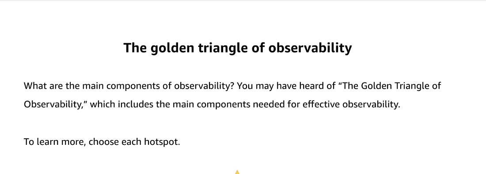
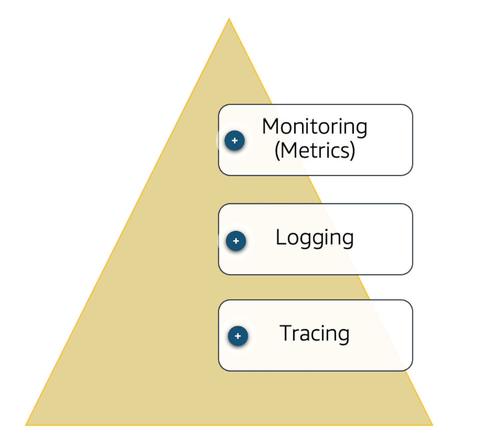
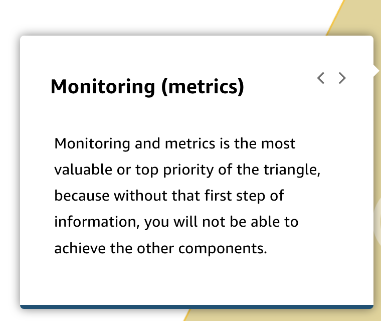
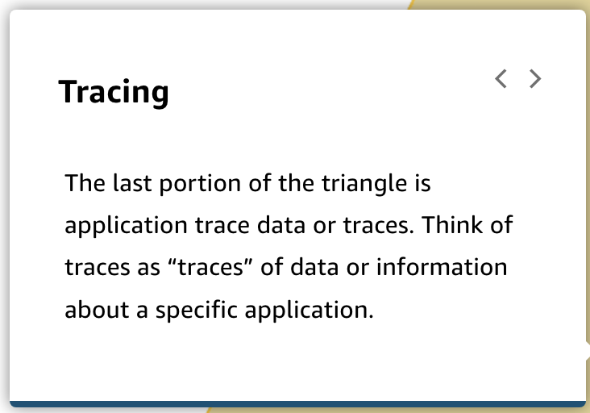

# 43 Introduction to Observability

Created: 2023-10-17 22:10:49 -0600

Modified: 2023-10-22 21:35:40 -0600

---

Summary

Observability is essential for understanding the performance and health of an application, and it encompasses logging, monitoring, and tracing. Monitoring, logging, and tracing are distinct components of observability that provide valuable insights into different aspects of application behavior.

Facts

- Observability includes more than just monitoring; it encompasses logging, monitoring, and tracing.
- Monitoring provides essential metrics such as CPU, memory usage, and network bandwidth to identify trends and make scaling decisions.
- Logging offers insights into application-level performance and behavior, highlighting issues that may not be evident from metrics alone.
- Tracing provides a detailed view of API calls and helps identify performance bottlenecks in microservices.
- The combination of monitoring, logging, and tracing creates a holistic observability framework, enabling data-driven decision-making.
- As architecture patterns evolve, traditional monitoring approaches may not scale to handle serverless, Lambda functions, and Fargate tasks.
- The "golden triangle of observability" includes monitoring, logging, and tracing, with each component serving a specific purpose in providing insights into application behavior.
- Effective observability is crucial for ensuring the performance and health of applications in complex, dynamic environments.

![Monitoring and observability have a close relationship. However, monitoring and observability have slightly different meanings and are not considered the same thing in the DevOps process. To have products that are observable, you must make sure that your products can be monitored. Monitoring consists of collecting, logging, and processing data. The monitoring describes the performance and health of the system. Observability means that you can infer the internal states of a system based on the external outputs. Observability is then achieved after that data has been collected from the monitoring phase. Finally, you can analyze your data and products to create a better solution for your business or IT challenges. After the observability, the user would have to translate the log metrics into meaningful insights. ](../../../media/AWS-DevOps-Module-12-43-Introduction-to-Observability-image1.png){width="5.0in" height="2.3854166666666665in"}

{width="5.0in" height="1.8645833333333333in"}

{width="5.0in" height="1.7916666666666667in"}

{width="5.0in" height="4.447916666666667in"}

{width="5.0in" height="4.208333333333333in"}

{width="5.0in" height="4.416666666666667in"}

{width="5.0in" height="3.4895833333333335in"}

{width="5.0in" height="4.458333333333333in"}

{width="5.0in" height="4.395833333333333in"}

![To learn more, choose appropriate tab. METRICS LOGS TRACES Traces are useful for understanding the path a request takes or its flow, and is very user-centric. For example, if a resource is unhealthy, traces will tell you the impact on the user/request path. Typically, traces will provide insight on the OS or application level, showing "traces" of information of the request and the different paths it takes. Traces Tracing @ 2020 Web 0' its All nqhts reserved training and certification • Representation of series of distributed events that encode end-to-end request flow • Used to provide visibility in both the path and structure of request 10 ](../../../media/AWS-DevOps-Module-12-43-Introduction-to-Observability-image10.png){width="5.0in" height="4.395833333333333in"}

