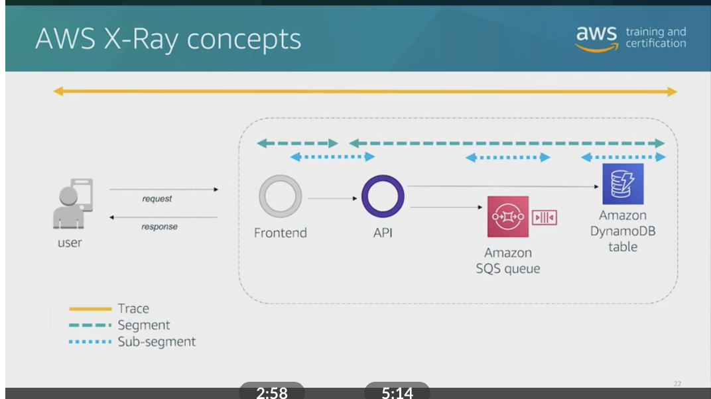
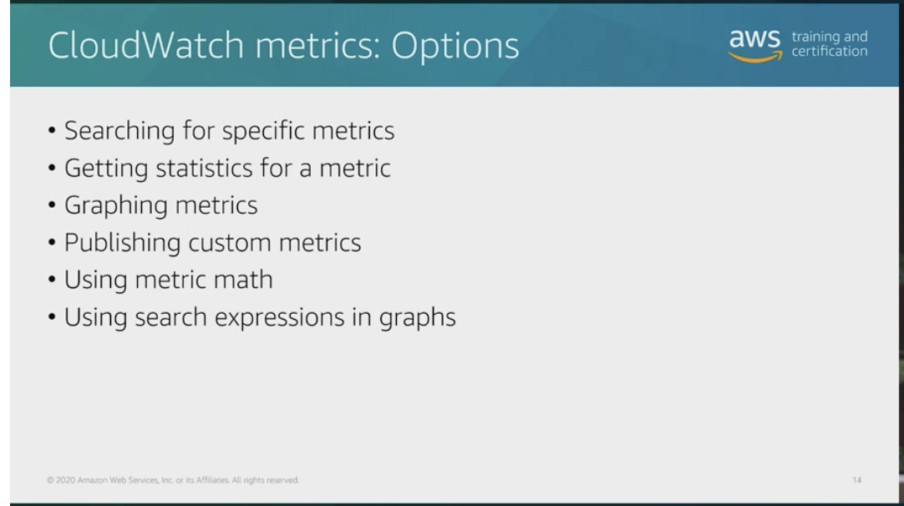
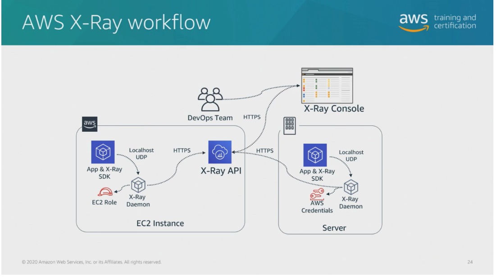

# 44

Created: 2023-10-22 20:57:54 -0600

Modified: 2023-10-22 21:13:44 -0600

---

Summary

AWS offers several tools for achieving comprehensive observability, including CloudWatch for monitoring and metrics, CloudWatch Logs for log streaming and analysis, AWS X-Ray for tracing applications, and App Mesh for managing complex service communication.

Facts

- CloudWatch:
  - Covers monitoring and provides metrics and alarms.
  - Offers default metrics for various AWS services and allows enabling detailed monitoring for more granular data.
  - Provides features like graphs, alarms, and metric math for data analysis and decision-making.
- CloudWatch Logs:
  - Handles log streaming and events.
  - Requires the installation of the CloudWatch agent to stream logs.
  - Supports filters, search expressions, and log groups for log management.
- AWS X-Ray:
  - Enables tracing within applications to identify bottlenecks and performance issues.
  - Creates traces, segments, and sub-segments to analyze interactions within applications.
  - Offers a service graph for visualizing function calls and identifying areas for optimization.
- App Mesh:
  - Facilitates application-level networking for services.
  - Automates service communication mapping and rerouting in case of failures.
  - Provides monitoring capabilities to ensure the health of service interactions.
- Observability:
  - Essential for building effective CI/CD pipelines.
  - Requires a combination of monitoring, logging, and tracing for comprehensive insight into applications and infrastructure.

These AWS tools collectively enhance observability, helping users monitor, analyze, and optimize their applications and services.

{width="10.083333333333334in" height="3.3229166666666665in"}

![Key concepts and topics Review the content below to reinforce some of the key concepts and topics presented to you in the video above. Mapping to AWS tools CloudWatch collects monitoring and operational data in the form of logs, metrics, and events, providing you with a unified view of AWS resources, applications, and services that run on AWS and on-premises servers. CloudWatch is cloud-native and all the AWS services automatically publish telemetry data to CloudWatch without you needing to do anything. It creates a single solution for both metrics and logs, which is useful when you are troubleshooting issues. CloudWatch enables you to automate monitoring by using SDKs, APIs, command line interfaces, CloudFormation templates, and more. ](../../../media/AWS-DevOps-Module-12-44-image2.png){width="10.083333333333334in" height="6.989583333333333in"}

{width="10.083333333333334in" height="5.989583333333333in"}

{width="10.083333333333334in" height="5.791666666666667in"}

{width="10.083333333333334in" height="5.604166666666667in"}

{width="10.083333333333334in" height="6.875in"}

{width="10.083333333333334in" height="4.75in"}

![CloudWatch logs terminology Log event A record of some activity recorded by the application or resource being monitored. Contains two properties: timestamp and raw event message. Log stream A sequence of log events from the same application instance or resource. Log streams with no log data two months after creation are automatically deleted. Log group A collection of log streams that share the same retention, monitoring, and access control settings. Every log stream must belong to a single log group. ](../../../media/AWS-DevOps-Module-12-44-image8.png){width="10.083333333333334in" height="8.864583333333334in"}

{width="10.083333333333334in" height="4.34375in"}

![AWS x-Ray AWS X-Ray works for both simple and complex applications, either in development or in production. You can analyze simple asynchronous event calls, three-tier web applications, or complex microservices applications consisting of thousands of services. With X-Ray, you can trace requests made to applications that span multiple AWS accounts, AWS Regions, and Availability Zones. AWS X-Ray works with Amazon EC2, Amazon Elastic Container Service (Amazon ECS), AWS Lambda, and AWS Elastic Beanstalk. You can use X-Ray with applications written in Java, Node.js, and .NET that are deployed on these services. AWS X-Ray helps you identify performance bottlenecks. X-Ray's service maps let you see relationships between services and resources in your application in real time. You can easily detect where high latencies are occurring, visualize node and edge latency distribution for services, and then drill down into the specific services and paths impacting application performance. ](../../../media/AWS-DevOps-Module-12-44-image10.png){width="10.083333333333334in" height="5.979166666666667in"}

{width="10.083333333333334in" height="5.697916666666667in"}

{width="10.083333333333334in" height="5.770833333333333in"}

![Utilizing AWS App Mesh AWS App Mesh is a service mesh that provides application-level networking to make it easy for your services to communicate with each other across multiple types of compute infrastructure. App Mesh standardizes how your services communicate, giving you complete visibility and ensuring high-availability for your applications. Modern applications are typically composed of multiple services. Each service may be built using multiple types of compute infrastructure, such as Amazon EC2 and AWS Fargate. As the number of services grow within an application, it becomes difficult to pinpoint the exact location of errors, reroute traffic after failures, and safely deploy code changes. Previously, this has required you to build monitoring and control logic directly into your code and redeploy your service every time there are changes. ](../../../media/AWS-DevOps-Module-12-44-image13.png){width="10.083333333333334in" height="4.625in"}

{width="10.083333333333334in" height="5.802083333333333in"}

{width="10.083333333333334in" height="4.791666666666667in"}

{width="10.083333333333334in" height="4.791666666666667in"}

{width="10.083333333333334in" height="2.7083333333333335in"}

{width="10.083333333333334in" height="5.625in"}{width="10.083333333333334in" height="5.6875in"}

{width="10.083333333333334in" height="4.6875in"}

{width="10.083333333333334in" height="5.697916666666667in"}{width="10.083333333333334in" height="5.802083333333333in"}

