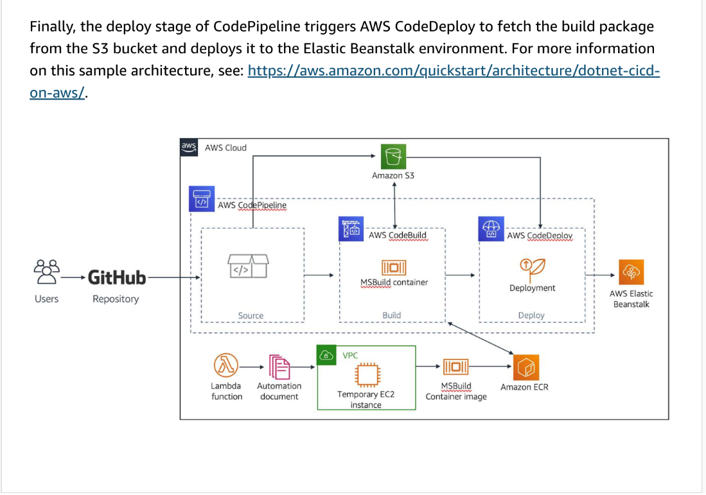
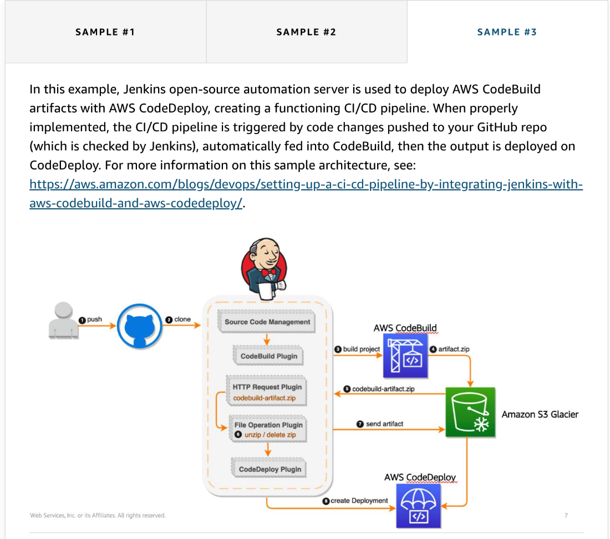

# 45

---

Summary

This course covered a wide range of topics related to DevOps, including culture, practices, continuous integration and delivery, automation, EC2 infrastructure, microservices, serverless computing, containers, Lambda functions, deployment strategies, testing, DevSecOps, and observability. The course also provides reference architectures for further understanding and implementation.

Facts

- DevOps Journey:
  - Examined the reasons for adopting DevOps and fostering collaboration between development and operations teams.
  - Emphasized the importance of automation in reducing development, deployment, and testing timelines.
- EC2 Infrastructure and Beyond:
  - Explored EC2 infrastructure and the transition towards microservices.
  - Discussed serverless computing, containers, and the role of Lambda functions in modern environments.
- Deployment and Testing:
  - Covered deployment strategies, testing methodologies, and the integration of DevSecOps principles.
- Observability:
  - Highlighted the significance of observability in CI/CD pipelines for monitoring, logging, and tracing.
- Reference Architectures:
  - Provided reference architectures for specific scenarios, such as testing with CodeBuild, building .NET applications on Windows, and integrating Jenkins into CI/CD pipelines.

The course offered comprehensive insights into various DevOps aspects and practical examples through reference architectures for further learning.

![SAMPLE #1 SAMPLE #2 SAMPLE #3 In AWS CodePipeline, a pipeline with four stages has been created: • Source (AWS CodeCommit) • UI testing (AWS Lambda and AWS CodeBuild) • Approval (manual approval) • Production (AWS Lambda) AWS CodePipeline automatically detects a change in the source repository and triggers the execution of the pipeline. In the UlTest stage, there are two parallel actions: • DeployTestWebsite invokes a Lambda function to deploy the test website in S3 as an S3 website. • DeployStatusPage invokes another Lambda function to deploy in parallel the status website in S3 as an S3 website. Next, there are three parallel actions that trigger the CodeBuild project: • TestOnChrome launches a container to perform the Selenium tests on Chrome. • TestOnFirefox launches another container to perform the Selenium tests on Firefox. • TestOnPhantomJS creates a Lambda function and invokes individual Lambda functions per test case to execute the test cases in parallel. ](../../../media/AWS-DevOps-Module-13-45-image3.png)

[https://aws.amazon.com/blogs/devops/using-aws-codepipeline-aws-codebuild-and-aws-lambda-for-serverless-automated-ui-testing/(opens in a new tab)](https://aws.amazon.com/blogs/devops/using-aws-codepipeline-aws-codebuild-and-aws-lambda-for-serverless-automated-ui-testing/)

![SAMPLE #1 SAMPLE #2 SAMPLE #3 As a first prerequisite, AWS CloudFormation provisions a Lambda function that executes the automation document to create a temporary Amazon EC2 Windows instance within a VPC. It then uses the instance to create a temporary MSBuild container image that has the required tools for compiling .NET applications. (This step is automated according to the steps in the Extending AWS CodeBuild with Custom Build Environments for the .NET Framework post.) It then pushes the MSBuild container image to Amazon ECR and deletes the Amazon EC2 Windows instance. As a second prerequisite, AWS CloudFormation creates an AWS Elastic Beanstalk application and environment that acts as a target for deploying the latest application. AWS CloudFormation then creates an AWS CodePipeline with three stages: source, build, and deploy. The source stage invokes CodePipeline every time there is a code change in the configured GitHub repository branch. This stage configures GitHub, which integrates the application source code via webhooks. It then fetches the latest GitHub code and places it in an Amazon S3 bucket. The resulting source code is placed in the Source Artifacts folder. The build stage of CodePipeline triggers AWS CodeBuild, which uses the MSBuild Windows container image from Amazon ECR to compile the latest source code. AWS CodeBuild uses an associated BuildSpec.yml file to create the Windows container from the image it obtains from Amazon ECR. It then fetches the source code from S3 and uses the container to build the .NET application code. The resulting build package is placed in the Build Artifacts folder in the S3 bucket. ](../../../media/AWS-DevOps-Module-13-45-image5.png)

[https://aws.amazon.com/quickstart/architecture/dotnet-cicd-on-aws/(opens in a new tab)](https://aws.amazon.com/quickstart/architecture/dotnet-cicd-on-aws/).

[https://aws.amazon.com/blogs/devops/setting-up-a-ci-cd-pipeline-by-integrating-jenkins-with-aws-codebuild-and-aws-codedeploy/(opens in a new tab)](https://aws.amazon.com/blogs/devops/setting-up-a-ci-cd-pipeline-by-integrating-jenkins-with-aws-codebuild-and-aws-codedeploy/).

