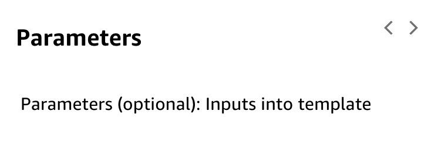
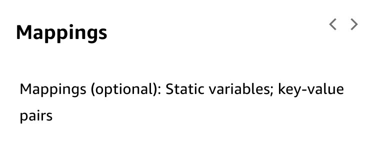
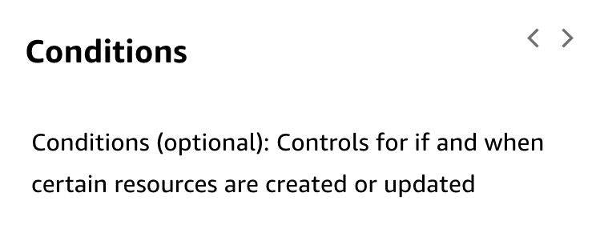
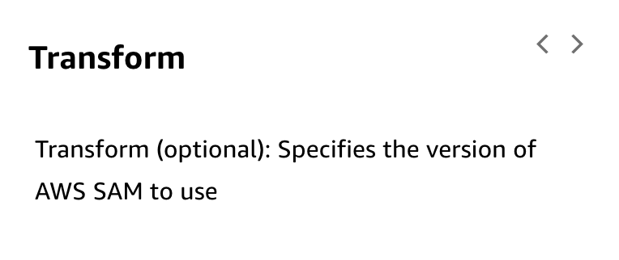
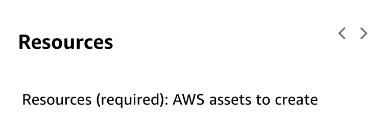
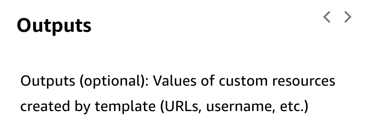

# 2 Introduction to Infrastructure Automation

Created: 2023-10-02 15:37:03 -0600

Modified: 2023-10-22 17:40:46 -0600

---

Summary

Infrastructure automation is crucial for achieving consistency, efficiency, and traceability in cloud environments. This involves using tools like AWS CloudFormation to define and deploy infrastructure as code.

Facts

- Infrastructure automation is essential for building and managing CI/CD pipelines and ensuring that manual changes are minimized.
- Automation can be achieved through methods like shell scripting, SDKs, and third-party tools, but AWS CloudFormation is a focus in this context.
- Infrastructure as code (IaC) allows developers to define and version their architecture, providing a history of changes and the ability to recreate environments

{width="10.083333333333334in" height="5.520833333333333in"}

![Code infrastructure Code your infrastructure from scratch with the Clou&ormation template language, in either YAML or JSON format, or start from many available sample templates Amazon S3 Check out your template code locally, or upload it into an S3 bucket AWS CloudFormation Use AWS CloudFormation via the browser console, command line tools or APIs to create a stack based on your template code Output AWS CloudFormation provisions and configures the stacks and resources you specified on your template ](../../../media/AWS-DevOps-Module-2-2-Introduction-to-Infrastructure-Automation-image2.png){width="10.083333333333334in" height="3.6666666666666665in"}

{width="10.083333333333334in" height="8.302083333333334in"}

{width="10.083333333333334in" height="3.7083333333333335in"}

{width="10.083333333333334in" height="3.1666666666666665in"}

{width="10.083333333333334in" height="3.40625in"}

{width="10.083333333333334in" height="4.28125in"}

{width="10.083333333333334in" height="3.875in"}

{width="10.083333333333334in" height="4.302083333333333in"}

{width="10.083333333333334in" height="3.4375in"}

{width="10.083333333333334in" height="3.7604166666666665in"}

![Templates A CloudFormation template is a JSON or YAML formatted text file. You can save these files with any extension, such as .json, .yaml, .template, or .txt. CloudFormation uses these templates as blueprints for building your AWS resources. For example, in a template, you can describe an Amazon EC2 instance, such as the instance type, the AMI ID, block device mappings, and its Amazon EC2 key pair name. Whenever you create a stack, you also specify a template that CloudFormation uses to create whatever you described in the template. For example, if you created a stack with the following template, CloudFormation provisions an instance with an ami-Off8a91507f77f867 AMI ID, t2.micro instance type, testkey key pair name, and an Amazon EBS volume. ](../../../media/AWS-DevOps-Module-2-2-Introduction-to-Infrastructure-Automation-image12.png){width="10.083333333333334in" height="5.46875in"}

{width="10.083333333333334in" height="8.895833333333334in"}

{width="10.083333333333334in" height="6.666666666666667in"}

![The previous templates are centered around a single Amazon EC2 instance; however, CloudFormation templates have additional capabilities that you can use to build complex sets of resources and reuse those templates in multiple contexts. For example, you can add input parameters whose values are specified when you create a CloudFormation stacl<. In other words, you can specify a value like the instance type when you create a stack instead of when you create the template, making the template easier to reuse in different situations. For more information about template creation and capabilities, see Template anatomy. ](../../../media/AWS-DevOps-Module-2-2-Introduction-to-Infrastructure-Automation-image15.png){width="10.083333333333334in" height="3.9166666666666665in"}

Template anatomy:

<https://docs.aws.amazon.com/AWSCloudFormation/latest/UserGuide/template-anatomy.html>

