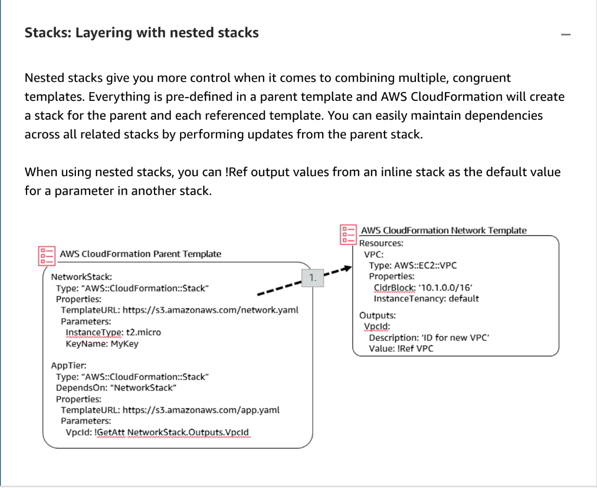

# 4 Diving into the AWS CloudFormation Template -2

---

Summary

- The text discusses how parameters in AWS CloudFormation templates allow users to input values and how to validate them.
- It emphasizes the importance of restricting user input to predefined values or lists.
- The text also introduces best practices for planning, organizing, securing, and structurally designing CloudFormation templates.
- It explains the concept of CreationPolicies to manage resource deployment.
- The text mentions the use of nested stacks and the option of creating self-contained CloudFormation templates.
- Updates to CloudFormation templates can be made with different levels of interruption, depending on the type of change.
- Change sets allow users to simulate and verify the impact of changes before applying them.

Facts

- Parameters in CloudFormation templates are used to collect user input for values.
- Users should be restricted to predefined values or lists to avoid potential issues.
- Best practices in CloudFormation include proper planning, organization, security considerations, and structural design.
- CreationPolicies help CloudFormation understand when a resource is fully deployed.
- CloudFormation supports both nested stacks and self-contained templates for managing resources.
- Updates to CloudFormation templates can have varying levels of interruption, depending on the nature of the change.
- Change sets allow users to preview and verify the impact of changes before applying them.

![Converting templates into YAML or JSON You can convert a valid template back and forth between JSON and YAML by selecting the appropriate radio button in Choose template language. Designer can only convert valid YAML or valid JSON templates. If the conversion succeeds, the Messages pane displays a message like: Successfully converted the template to YAML. Important: We recommend that you don't add # YAML comments to your templates in Designer. If your YAML template has # comments, Designer doesn't preserve those comments when editing the YAML or converting to JSON. If you edit or modify your template in Designer (for example, if you drag a resource on the canvas), your comments are lost. Once you choose a template language, any new resources you drag onto the canvas will be created in the language you have selected. To change back to another language, make sure your template is valid and then select YAML or JSON where it says Choose template language. ](../../../media/AWS-DevOps-Module-2-4-Diving-into-the-AWS-CloudFormation-Template--2-image1.png)

![Stacks: Layered architecture approach How you create and manage templates depends on several factors. For the tasks in this module, nested stacks and a layered approach are implemented using Export/lmport functionality. Layered architecture approach Front end Back end Shared Base network Identity CRM web interface, admin interface, analytics dashboard Customers, campaigns, products, marketing collateral, analytics CRM DBS, common monitoring/alarms, subnets, security groups VPCs, internet gateways, VPNs, NATs IAM users. groups. roles Layered stacks with separate lifecycles and separate owners, or both Each layer can be one or multiple stacks ](../../../media/AWS-DevOps-Module-2-4-Diving-into-the-AWS-CloudFormation-Template--2-image4.png)

![Stacks: Nested stack approach Nested stacks are stacks created as part of other stacks. You create a nested stack within another stack by using the AWS::CloudFormation::Stack resource. As your infrastructure grows, common patterns can emerge in which you declare the same components in multiple templates. You can separate out these common components and create dedicated templates for them. Then use the Resource section in your template to reference other templates, creating nested stacks. Nested stacks give you more control when it comes to combining multiple, congruent templates. Everything is predefined in a parent template and AWS CloudFormation creates a stack for the parent and each referenced template. You can easily maintain dependencies across all related stacks by performing updates from the parent stack. Using nested stacks to declare common components is considered a best practice. Consider initiating certain stack operations, such as stack updates, from the root stack rather than having them performed directly on nested stacks themselves. Also, in some cases, nested stacks affect how stack operations are performed. When using nested stacks, you can use the Ref function to return values from an inline stack as the default value for a parameter in another stack. ](../../../media/AWS-DevOps-Module-2-4-Diving-into-the-AWS-CloudFormation-Template--2-image5.png)

![Nested stacks often provide a greater ease of use, while chaining stacks allows for greater control and more flexibility. To cover your deployment scenarios in a modular fashion, create a master template that deploys one or many nested stacks, depending on the Quick Start. One or more of those nested stacks will deploy the actual workload of the Quick Start, while the others will be referenced as submodules (inside the /submodules/quickstart-repo-name folder in GitHub for each referenced Quick Start) at a particular commit level. This ensures that the reference is repeatable and does not change unexpectedly. The following diagram shows an example of how stacks could be linked together. Workload master stack New VPC entry point Directory stack ir t r .t m lat VPC stack ayysypc-template Cache stack ca he.tem lat Database stack database.tem late Workload stack rkl d.t m lat Existing VPC entry point IAM stack iam.tem late ](../../../media/AWS-DevOps-Module-2-4-Diving-into-the-AWS-CloudFormation-Template--2-image6.png)

![Parameter validation training and certification • AllowedPattern: specify a regular expression that constrains the input value • AllowedPattern: ,2))' • AllowedValues: specify a set of options, such as EC2 instance types. • AllowedValues: [ 't2.micro', 't2.small', 'il .32xlarge' ] • Parameter Type: specify the input type (string, int) and specify AWS-specific types that will validate existing elements • Default will specify a default value. ** ](../../../media/AWS-DevOps-Module-2-4-Diving-into-the-AWS-CloudFormation-Template--2-image9.png)

the vpcid !GEtAtt.. Is from the

