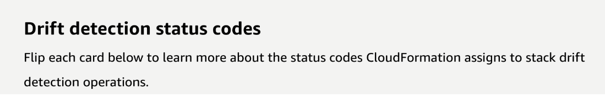
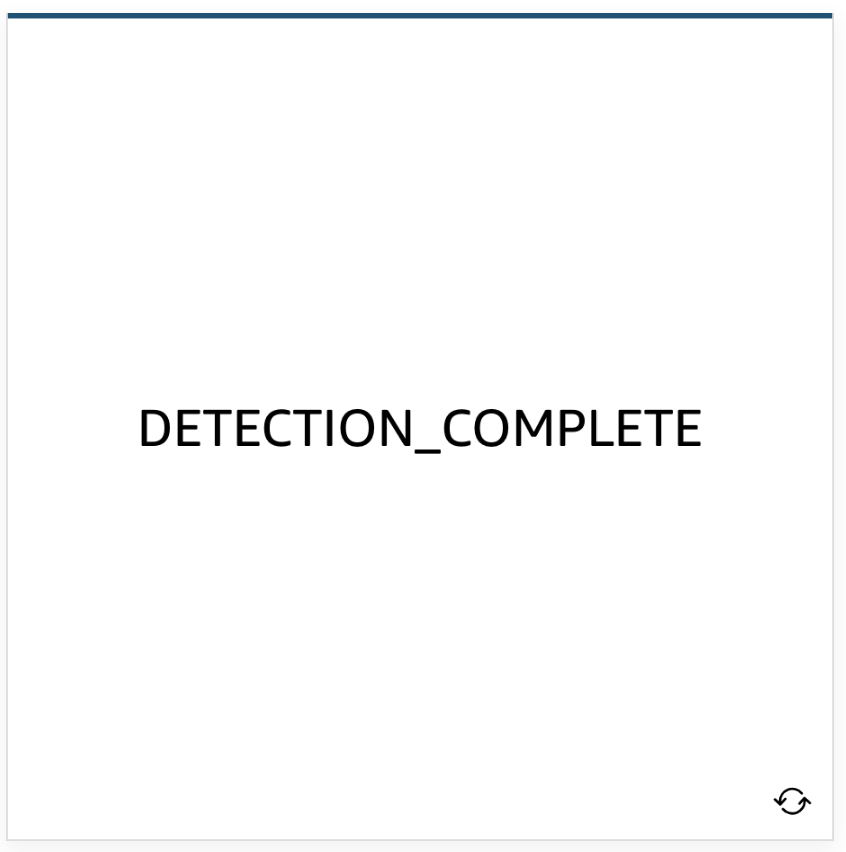
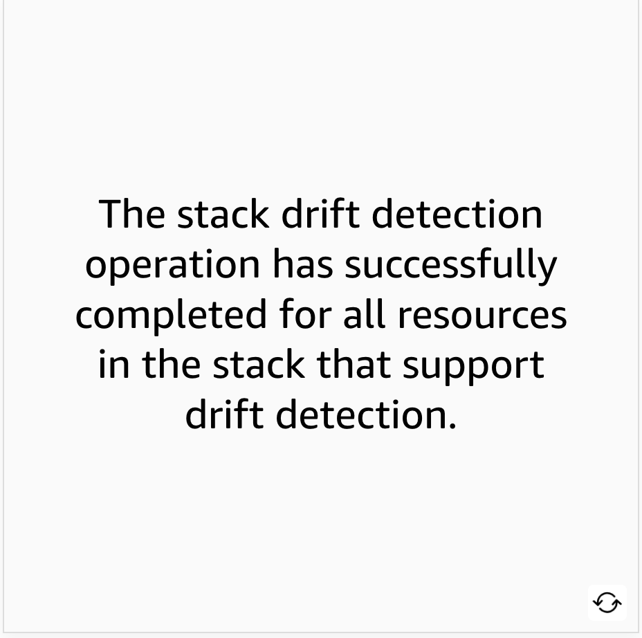
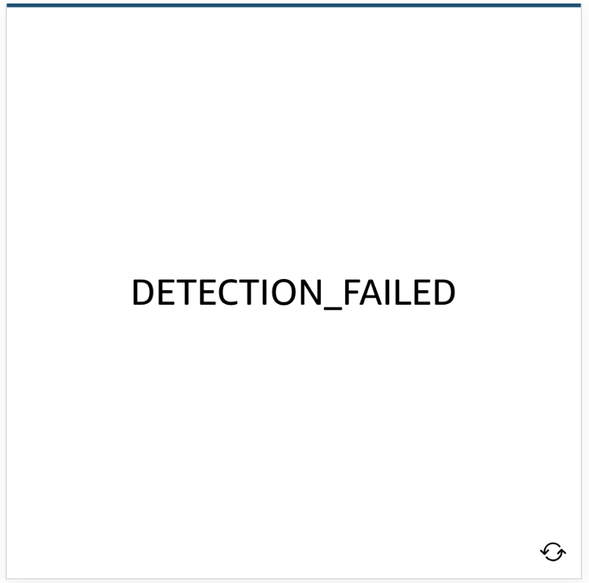
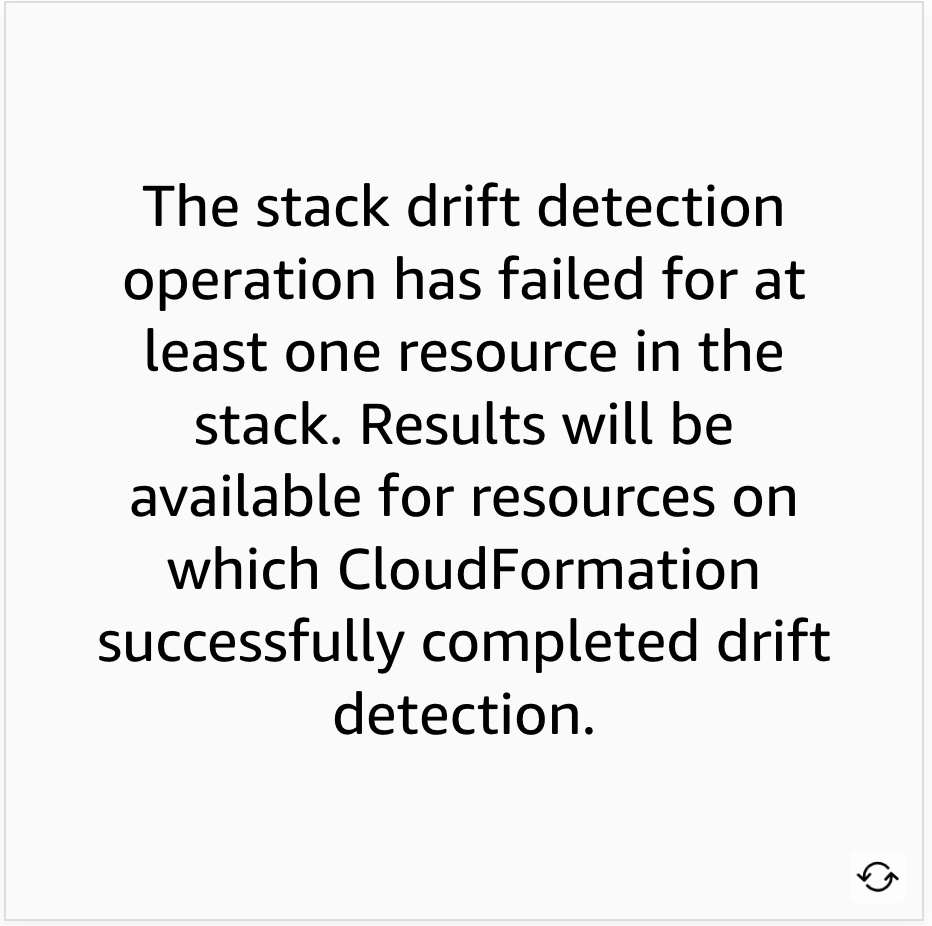
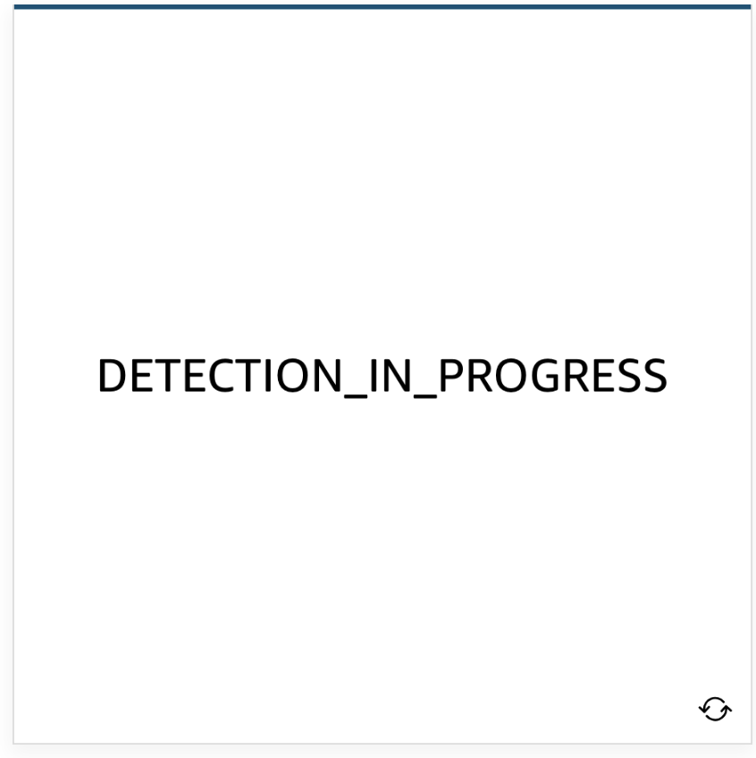
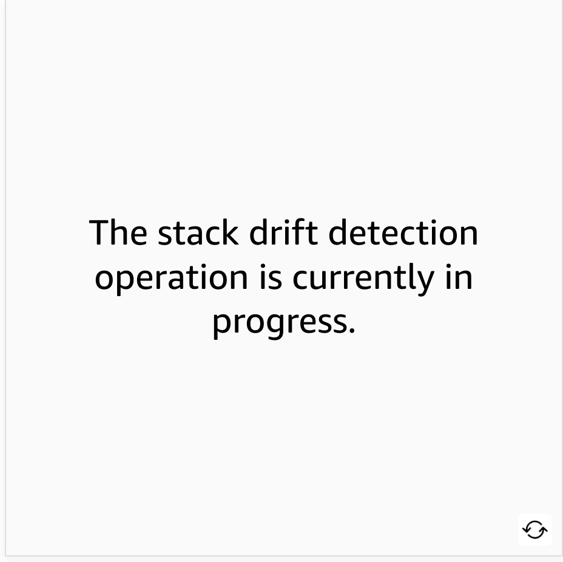
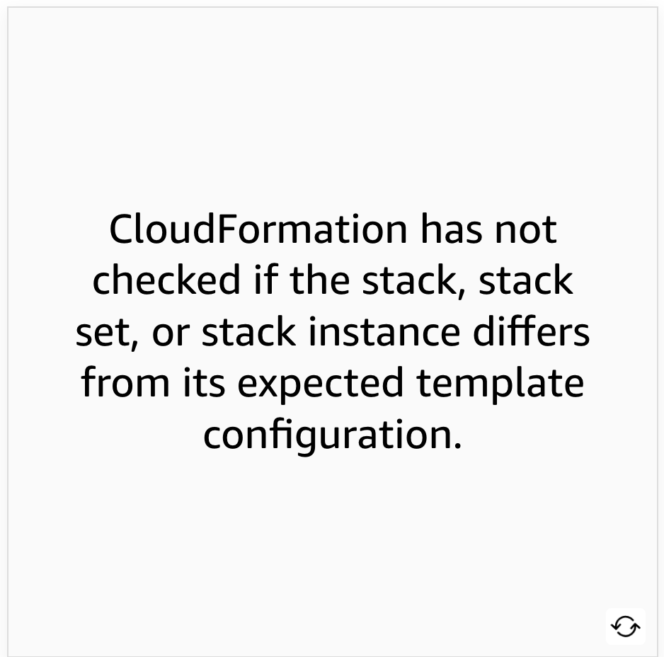

# 5 Modifying an AWS CloudFormation Template

---

Summary

The text provides a demonstration of AWS CloudFormation's capabilities, emphasizing the importance of permissions, drift detection, updating resources, and importing manually created resources into CloudFormation.

Facts

- The user demonstrated the limitations of a user with only CloudFormation permissions, showing they can't interact with other AWS services.
- Despite having full CloudFormation permissions, the test user couldn't create a VPC, leading to a failed stack.
- Drift detection in CloudFormation helps identify when resources deviate from their intended configurations.
- The user showcased a security group change, where unauthorized ports were opened, emphasizing the need for monitoring and control.
- The demonstration highlighted the process of updating instance sizes in CloudFormation and the importance of reviewing change sets before applying updates.
- Change sets in CloudFormation allow users to preview the potential impact of their updates.
- CloudFormation now supports importing manually created resources, like DynamoDB tables and S3 buckets, into its management framework.

![What is drift? Drift detection enables you to detect whether a stack's actual configuration differs, or has drifted, from its expected configuration. Use CloudFormation to detect drift on an entire stack, or on individual resources within the stack. A resource is considered to have drifted if any of its actual property values differ from the expected property values. This includes if the property or resource has been deleted. A stack is considered to have drifted if one or more of its resources have drifted. To determine whether a resource has drifted, CloudFormation determines the expected resource property values, as defined in the stack template and any values specified as template parameters. CloudFormation then compares those expected values with the actual values of those resource properties as they currently exist in the stack. A resource is considered to have drifted if one or more of its properties have been deleted, or had their value changed. CloudFormation generates detailed information on each resource in the stack that has drifted. ](../../../media/AWS-DevOps-Module-2-5-Modifying-an-AWS-CloudFormation-Template-image1.png)

