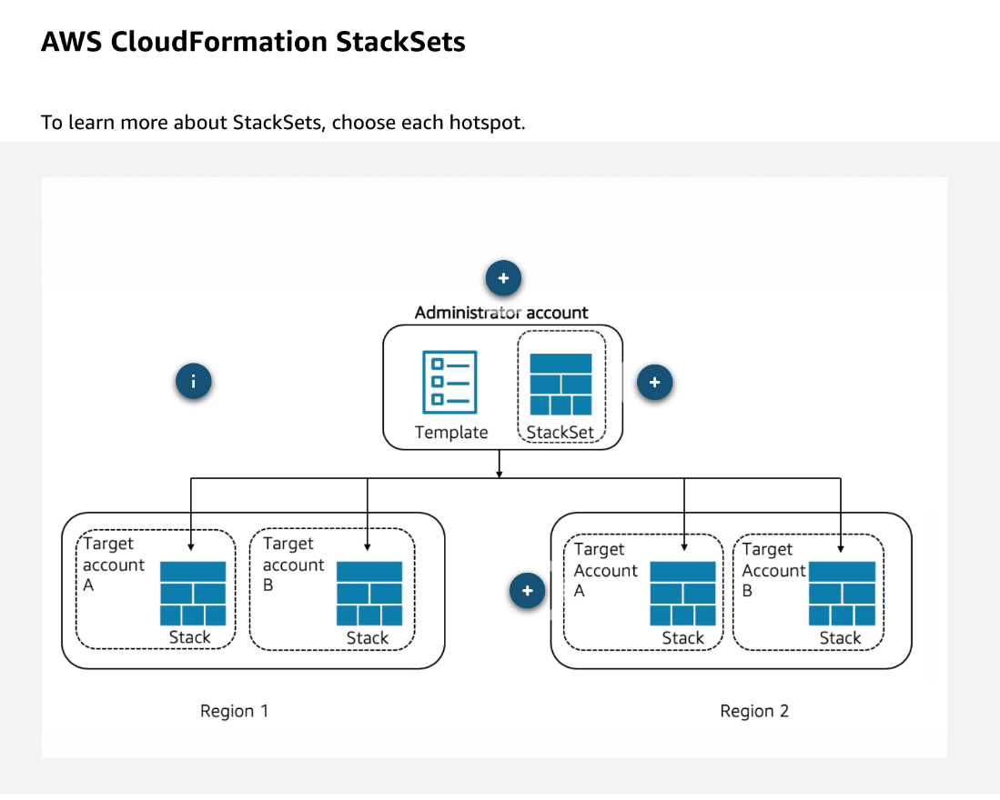
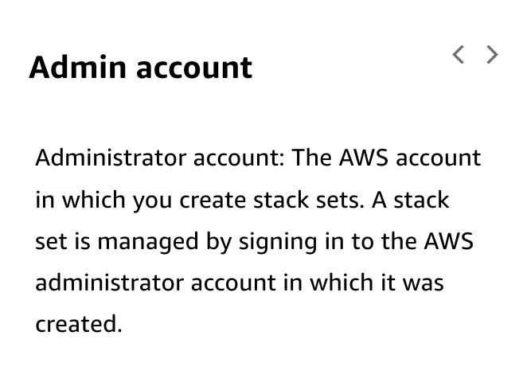
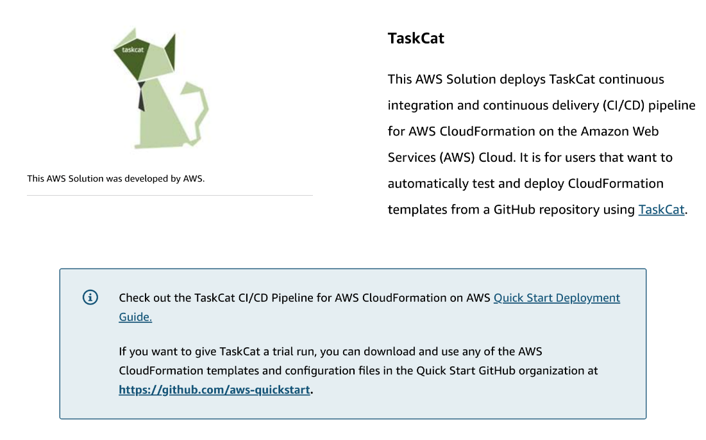

# 6 Modifying an AWS CloudFormation Template -2 

---

Summary

The text delves into the functionalities and features of AWS CloudFormation, emphasizing helper scripts, stack policies, deletion policies, drift detection, custom resources, and the utility of AWS TaskCat for testing CloudFormation templates across regions.

Facts

- CloudFormation allows updates through the CLI, enabling changes like switching from a dev stack to a production set.
- Helper scripts like cfn-init and cfn-hup are essential for reading and executing metadata instructions on EC2 instances.
- cfn-hup detects changes in metadata and triggers cfn-init to execute new instructions.
- cfn-signal communicates with the creation policy to indicate resource deployment completion.
- cfn-get-metadata allows users to view resource metadata without opening the template.
- CloudFormation StackSets enable deployment of stacks across multiple AWS accounts and regions.
- Stack policies can restrict updates to specific resources, ensuring architectural integrity.
- Deletion policies dictate actions upon stack deletion, such as taking snapshots or retaining resources.
- Drift detection in CloudFormation identifies deviations from the intended resource configurations.
- Custom resources in CloudFormation, often using Lambda functions, enable functionalities not natively supported.
- AWS TaskCat tests CloudFormation templates across various regions or accounts, providing a pass/fail report.
- CloudFormation is a pivotal tool for deploying AWS architecture, and its understanding is essential for efficient AWS management.

![Creating a change set To create a change set for a running stack, submit the changes that you want to make by providing a modified template, new input parameter values, or both. CloudFormation generates a change set by comparing your stack with the changes you submitted. You can either modify a template before creating the change set or during change set creation. Run the aws cloudformation create-change-set command. aws cloudformation create---change---set  ------stack---name NetworkStack  ------change---set---name SampleChangeSet  ------use---previous---template  ------parameters  ParameterKey= " InstanceType " , UsePreviousVa1ue=true ParameterKey= "KeyPairName " , UsePreviousVa1ue=true ParameterKey= " Purpose " , Parameter Value= " production " The sample shown above creates a change set named SampleChangeSet for the SampleStack stack. Note: If the template includes a DefaultValue parameter, and you do not specify UsePreviousValue=true or a particular value, AWS CloudFormation uses the default value in the template. ](../../../media/AWS-DevOps-Module-2-6-Modifying-an-AWS-CloudFormation-Template--2-image1.png)

![Testing AWS CloudFormation templates As a developer, you can utilize an open-source tool that can test your AWS CloudFormation templates. It creates stacks in multiple AWS Regions simultaneously and generates a report with a pass/fail grade for each region. You can specify the regions, indicate the number of Availability Zones you want to include, and pass in the AWS CloudFormation parameter values you want to test. You can use the CI/CD pipeline to test any AWS CloudFormation templates, including nested templates, from a GitHub repository. AWS is pleased to make the TaskCat tool available to all developers who want to validate their custom AWS CloudFormation templates across AWS Regions. ](../../../media/AWS-DevOps-Module-2-6-Modifying-an-AWS-CloudFormation-Template--2-image7.png)

![Testing AWS CloudFormation templates As a developer, you can utilize an open-source tool that can test your AWS CloudFormation templates. It creates stacks in multiple AWS Regions simultaneously and generates a report with a pass/fail grade for each region. You can specify the regions, indicate the number of Availability Zones you want to include, and pass in the AWS CloudFormation parameter values you want to test. You can use the CI/CD pipeline to test any AWS CloudFormation templates, including nested templates, from a GitHub repository. AWS is pleased to make the TaskCat tool available to all developers who want to validate their custom AWS CloudFormation templates across AWS Regions. ](../../../media/AWS-DevOps-Module-2-6-Modifying-an-AWS-CloudFormation-Template--2-image8.png)

<https://aws-quickstart.github.io/quickstart-taskcat-ci/>

<https://github.com/aws-quickstart>

