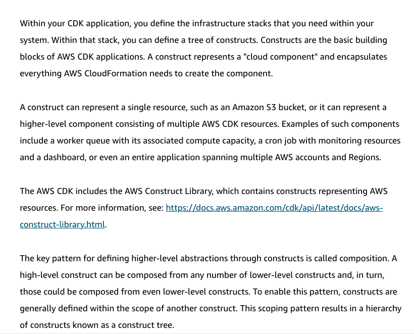

# 10 CDK

Created: 2023-10-03 21:47:29 -0600

Modified: 2023-10-22 17:41:18 -0600

---

Summary

The text introduces the Cloud Development Kit (CDK) as a tool to simplify the creation and deployment of CloudFormation templates in AWS, highlighting its integration with the Cloud9 IDE, its benefits, and supported languages.

Facts

- The CDK allows users to build CloudFormation templates more easily than manual methods.
- CDK is distinct from SDKs.
- Cloud9 is an in-browser Integrated Development Environment (IDE) that integrates with the CDK.
- With the CDK, users can define applications in familiar programming languages and deploy them as CloudFormation templates.
- The CDK supports languages like Python, Java, C#, JavaScript, and TypeScript.
- CDK makes it easier to write applications by allowing local development in the Cloud9 environment.
- cdkworkshop.com is a recommended resource for beginners to start with CDK applications.
- CDK can be used to define complex architectures, such as integrating SQS, Lambda, S3, and DynamoDB.
- Construct libraries in the CDK allow for the easy creation of AWS resources.
- CDK provides a unified code block for deploying applications, eliminating the need to switch between services or write multiple scripts/templates.

![Key concepts and topics Review the content below to reinforce some of the key concepts and topics presented to you in the video above. What is AWS Cloud Development Kit (AWS CDK)? AWS CDK is a software development framework for defining cloud infrastructure in code and provisioning it through AWS CloudFormation. Developers can use one of the supported programming languages to define reusable cloud components known as constructs. You compose these together into stacks and apps. No charges are incurred for using the AWS CDK. However you might incur AWS charges for creating or using AWS chargeable resources, such as running Amazon EC2 instances or using Amazon S3 storage. Use the AWS Simple Monthly Calculator to estimate charges for the use of various AWS resources. ](../../../media/AWS-DevOps-Module-3-10-CDK-image1.png){width="5.0in" height="3.6666666666666665in"}

{width="5.0in" height="2.75in"}

{width="5.0in" height="4.020833333333333in"}

![AWS CDK code sample Below is an example TypeScript code in an AWS CDK project to create an AWS Fargate load balancing service. import ec2 = require( i mport ecs - require( '@aws-cdk/aws-ecs'); import ecs patterns --- require( •@aws-cdk/aws-ecs-patterns'); Import cdk = require( '@aws-cdk/core'); :lass myEcsConstructStack extends cdk.Stack { constructor(scope: cdk.App, id: string, props?: cdk.StackProps) { super(scope, id, props); // Create VPC const vpc = new ec2.Vpc(this, 't•tyvpc', { maxAzs: 2 // WTE: // create Fargate cluster const cluster --- ne.d ecs.cluster(this, 'cluster', { vpc l); // Instantiate Fargate service with just cluster and image Limit AZs to avoid reaching resource quotas const fargateservice --- new ecs_patterns .NetworkLoadBalancedFargateSerwice(this, cluster, image: ecs.ContainerImage // Output the DNS where you can access your service "MyFargateService" , new cdk. Cfnoutput(this, • LoadBalancerDNS% { value: fargateService. loadBa1ancer. loadBa1ancerDnsName :Dnst app new cdk.App(); •ew WEcsConstructStack (app, app. synth() ; ](../../../media/AWS-DevOps-Module-3-10-CDK-image4.png){width="5.0in" height="3.6180555555555554in"}

