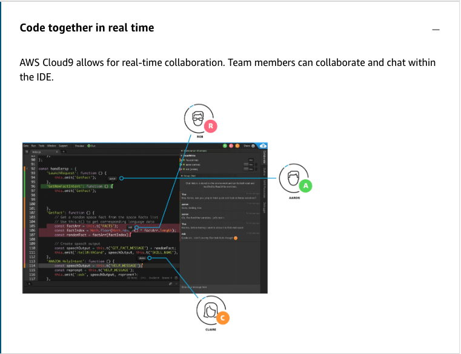

# 11 Cloud 9

---

Summary

The text highlights the features and benefits of Cloud9, an integrated development environment (IDE) in AWS, emphasizing its convenience, cost-effectiveness, and integration capabilities with other AWS services and tools.

Facts

- Cloud9 is a browser-based IDE allowing real-time collaborative coding.
- Users don't pay for Cloud9 directly but for the underlying EC2 instance it runs on.
- Cloud9 can connect to on-premise architectures.
- It automatically shuts down unused EC2 instances, optimizing costs.
- Cloud9 supports direct posting to CodeCommit and other repositories.
- The IDE offers auto-complete, code hinting, and the ability to open multiple files simultaneously.
- Cloud9 provides built-in debugging tools, including setting breakpoints.
- It enables local and remote execution of Lambda functions, streamlining the debugging process.
- The platform includes an integrated terminal, eliminating the need to switch between code editing and command-line tasks.
- Cloud9 supports real-time collaborative editing and team chat for seamless communication.
- AWS offers toolkits for integrating other IDEs like Visual Studio and Eclipse with AWS services.
- The discussion also touched on the CDK's role in simplifying CloudFormation templates and the various ways to interact with AWS outside of the console.

![Key concepts and topics Review the content below to reinforce some of the key concepts and topics presented to you in the video above. Introducing AWS Cloud9 AWS Cloud9 is a useful tool for your DevOps projects. AWS Cloud9 is a cloud-based integrated development environment (IDE) that lets you write, run, and debug your code using a browser. It includes a code editor, debugger, and terminal. AWS Cloud9 comes prepackaged with essential tools for popular programming languages, including JavaScript, Python, PHP, and more, so you don't need to install files or configure your development machine to start new projects. AWS Cloud9 IDE is cloud-based, so you can work on your projects from your office, home, or anywhere using an internet-connected machine. AWS Cloud9 also provides a seamless experience for developing serverless applications so that you can easily define resources, debug, and switch between local and remote execution of serverless applications. To learn more, expand each of the following. ](../../../media/AWS-DevOps-Module-3-11-Cloud-9-image2.png)

![How does AWS Cloud9 work? The following diagram shows a high-level overview of how AWS Cloud9 works. From the diagram (starting at the bottom), you use the AWS Cloud9 IDE, running in a web browser on your local computer, to interact with your AWS Cloud9 environment. A computing resource (for example, an Amazon EC2 instance or your own server) connects to that environment. Finally, your work is stored in an AWS CodeCommit repository or other type of remote repository. AWS CodeCommit repository Amazon EC2 instance + AVVS Cloudg environment Y our computer Other remote repository type Your serva- + AVVS Cloudg environment AWS Cloud9 IDE in a web browser ](../../../media/AWS-DevOps-Module-3-11-Cloud-9-image6.png)

![AWS Cloud9 environments An AWS Cloud9 environment is a place where you store your project's files and where you run the tools to develop your applications. Using the AWS Cloud9 IDE, you can: Store your project's files locally on the instance or server. Clone a remote code repository---such as a repo in AWS Codecommit---into your environment. Work with a combination of local and cloned files in the environment. You can create and switch between multiple environments, with each environment set up for a specific development project. By storing the environment in the cloud, your projects no longer need to be tied to a single computer or server setup. This enables you to do things such as easily switch between computers and more quickly onboard developers to your team. ](../../../media/AWS-DevOps-Module-3-11-Cloud-9-image7.png)

![Environments and computing resources Behind the scenes, there are a couple of ways you can connect your environments to computing resources: You can instruct AWS Cloud9 to create an Amazon EC2 instance, and then connect the environment to that newly created EC2 instance. This type of setup is called an EC2 environment. You can instruct AWS Cloud9 to connect an environment to an existing cloud compute instance or to your own server. This type of setup is called an SSH environment. EC2 environments and SSH environments have some similarities and some differences. If you're new to AWS Cloud9, we recommend that you use an EC2 environment because AWS Cloud9 takes care of much of the configuration for you. As you learn more about AWS Cloud9, and want to understand these similarities and differences better, see EC2 environments compared with SSH environments in AWS Cloud9. With AWS Cloud9, you can code, build, run, test, debug, and release software in many exciting scenarios and variations. These include (but are not limited to): ](../../../media/AWS-DevOps-Module-3-11-Cloud-9-image8.png)

![AWS Cloud9 features To learn more expand each of the following features. Editor Use the AWS Cloud9 browser-based editor to write, run, and debug your projects. As you type, code completion and code hinting suggestions appear in the editor, helping you code faster and avoid errors. Code completion is based on the identifiers within your files and on standard libraries. The editor also enables you to fully customize your view. You can adjust your panels in any direction by dragging a panel to the location you want. Multiple panels Code hinting Code ](../../../media/AWS-DevOps-Module-3-11-Cloud-9-image10.png)

![Run configurations AWS Cloud9 supports more than 40 programming languages and application types, including JavaScript, Python, PHP, Ruby, Go, and C++. You can either choose from the default run configurations or define custom configurations by specifying environment variables, file names, and command line options. View Goto Run Tools Run Run Last Run With Run Wndow Support ctrl* ctrl-shft-c Preview O Run lambda_functionpy x co ffeeScript Java Node .js PHP tililtqn web server) pHp Python 2 Python 3 Ruby indexjs Run *story configurations Run Configur atbns Show Debugger at Ere* Cancel Build Build System Show Build Resdt Autornabcally asild Supported Files Save N on ](../../../media/AWS-DevOps-Module-3-11-Cloud-9-image11.png)

![Tools for serverless development With AWS Cloud9, you can build serverless applications. Serverless will be discussed later in the course, but it's important to know that the option for serverless development is available. Its development environment is pre-packaged with SDKs, tools, and libraries needed for serverless application development. AWS Cloud9 also supports the AWS Serverless Application Model (AWS SAM) so that you can use AWS SAM templates in AWS Cloud9 to provide a simplified way of defining resources for your serverless applications. Additionally, AWS Cloud9 enables you to edit and debug AWS Lambda functions locally, which eliminates the need to upload your code to the Lambda console for debugging. Beginning process of invoking an existing function: • LOGI Functjcos mote Func Edit F unction awscod Edt C mrg cloud9- Stimu in Tree Run Loca Run Remote Run APIGateway Remote ](../../../media/AWS-DevOps-Module-3-11-Cloud-9-image13.png)

![Continuous delivery toolchain Continuous delivery is typically referencing some form of deployment (or delivery) that is released in short iterations. AWS Cloud9 integrates with AWS CodeStar, enabling you to quickly set up a continuous delivery toolchain for your application and start releasing code faster on AWS. AWS CodeStar provides a unified experience that enables you to easily build, test, and deploy applications to AWS with the help of AWS CodeCommit, AWS CodeBuild, AWS CodePipeline, and AWS CodeDeploy. In a few clicks, you will be able to connect your AWS Cloud9 development environment to a continuous delivery toolchain. AWS Pick how you want to edit your code SWO ](../../../media/AWS-DevOps-Module-3-11-Cloud-9-image16.png)

