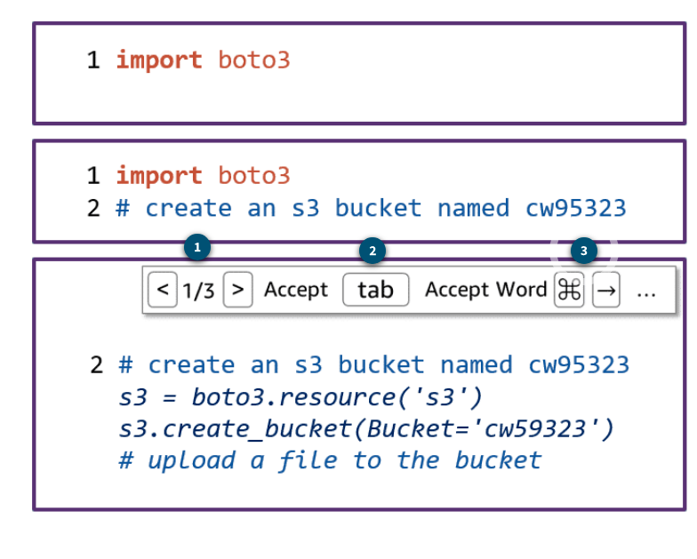

# 12 Code Whisper

---

Summary

The text introduces Amazon CodeWhisperer, an AI-powered coding companion integrated into IDEs, which offers real-time code suggestions, accelerates software development, and aids in improving application security.

Facts

- CodeWhisperer operates within an IDE and offers coding suggestions in real-time.
- It can generate both single-line code and full-function code based on user comments.
- The tool is optimized for AWS services, providing specific code suggestions for AWS tasks.
- Users can write comments in natural language, and CodeWhisperer will recommend code snippets accordingly.
- It has a built-in terminal, allowing users to edit code and make command-line changes without switching screens.
- CodeWhisperer can detect vulnerabilities in code and suggest remediations, aligning with security best practices.
- It is available for free by signing up with an AWS Builder ID.
- The tool supports both comment-driven code generation and real-time code completion.
- CodeWhisperer's suggestions are context-aware, considering code snippets, comments, cursor location, and open files in the IDE.
- Developers are advised to review and modify the AI-generated code as needed.
- Short, task-specific comments yield the best results from CodeWhisperer.
- The tool aids in reducing boilerplate code, allowing developers to focus on more complex tasks.
- To use CodeWhisperer, one should install the AWS toolkit in their IDE and sign in with an AWS Builder ID.

![CodeWhisperer prioritizes secure coding and responsible Artificial Intelligence (responsible Al) practices. It's optimized for Amazon APIs, trained extensively on Amazon and open-source code. You have the option of accepting the first suggestion, exploring more suggestions, or continuing writing your own code. It's important to review each code suggestion before accepting them, as you may need to make edits to ensure they align with your intended functionality. Security Scan The security scanning feature of Amazon CodeWhisperer detects security vulnerabilities in both generated and developer-written code. It scans the code to identify potential vulnerabilities and provides suggestions for remediation. This includes scanning for hard-to-find vulnerabilities that may be overlooked. ](../../../media/AWS-DevOps-Module-3-12-Code-Whisper-image3.png)

