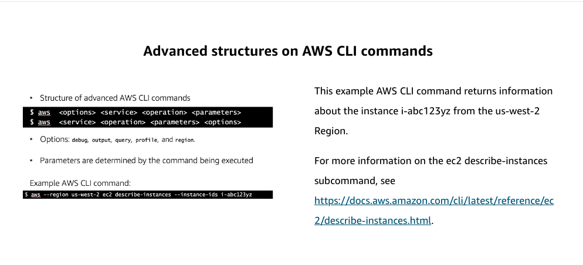

# 7

Created: 2023-10-03 21:38:01 -0600

Modified: 2023-10-22 17:41:09 -0600

---

Summary

The text discusses the importance of automation in AWS, focusing on the AWS Command Line Interface (CLI) and its functionalities, including setting up, making calls, and waiting for resource availability.

Facts

- Automation should be prioritized to eliminate manual steps.
- AWS offers tools like CloudFormation, CLI, SDKs, and CDK for automation.
- The AWS CLI allows users to script interactions with AWS services without using the GUI.
- Initial setup of the CLI requires configuration, including setting access key, secret key, region, and text output format.
- Directly setting configurations is possible, e.g., setting a region to Oregon with "AWS set region US west-two".
- Storing access and secret keys directly is discouraged; roles are preferred.
- Credentials are stored in a hidden AWS directory, while configurations are specific to the CLI.
- CLI commands follow a structure: AWS, the service, and the action (e.g., "AWS EC2 describe instance").
- The CLI offers "help" commands for guidance on syntax and options.
- AWS resources, like EC2 instances, might not be immediately available post-creation.
- AWS provides "wait" commands to poll resource status, such as "AWS EC2 wait" for EC2 instances or "CloudFormation wait" for CloudFormation stacks.

{width="5.0in" height="2.6458333333333335in"}

{width="5.0in" height="2.2708333333333335in"}

![Using AWS CLI with AWS services $ aws ec2 run---instances image---id aml---xxxxxxxx ---instance---type €2 . micro ---key---name MyKeypair ---count 1 ---security---group---ids sg---903004f8 ---subnet---id subnet---6e7f829e The first example shows how to launch a t2.micro instance in the specified subnet of a virtual private cloud (VPC). Replace the italicized parameter values with your own. $ aws s3 sync s3: / s3: / liny---us---east---I---bucket ---source---region ---region us---east---I This example shows a sync command that syncs files between two buckets in different regions. ](../../../media/AWS-DevOps-Module-3-7-image3.png){width="5.0in" height="3.2604166666666665in"}

