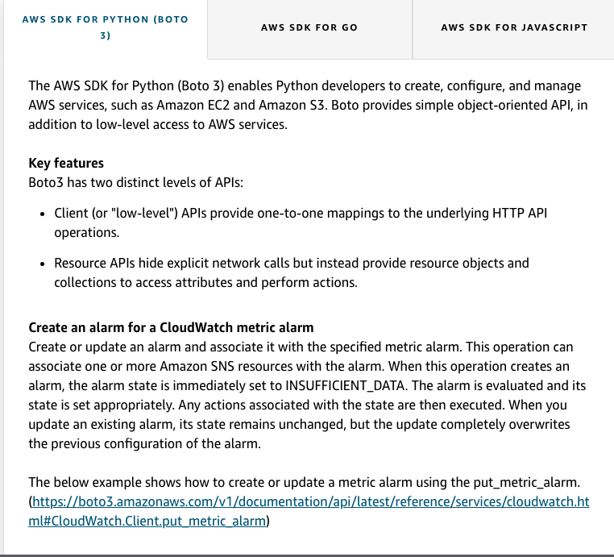
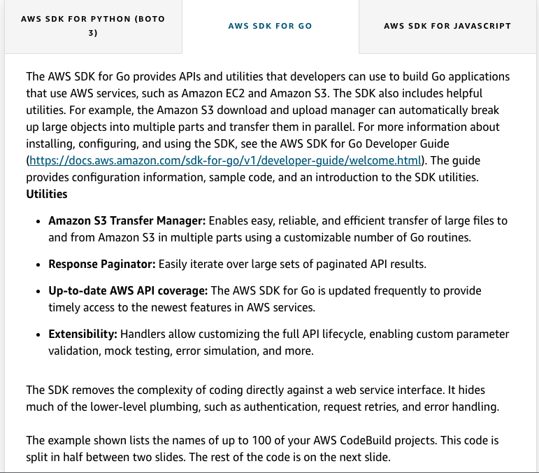

# 8 ASW SDKs

---

![Video Transcript SDKs, or software development kits, give us language-specific APIs that we can utilize to build our own applications to talk to AWS services. We've got some listed on the left hand side of the screen here. There's more available for you online, if your favorite language isn't found on this slide. We're gonna take a look at some example and popular SDKs that a lot of customers are out there using. We see an example here of utilizing the Python SDK to create a Cloudwatch alarm. Now, you should be familiar with some of these concepts already. I'm making a CPU alarm for my EC2 architecture, and I give it my description. We're utilizing Go, to take a look at all of the CodeBuild projects inside of the specified region. Here we're saying we're looking at our us-west-2 region. Now we can take a look inside of the CodeBuild service to see what projects we currently have. Node.js is a popular SDK inside of AWS because, well, we can run it directly from the browser. Meaning you can make API calls from your user's phone, their browser, their machine, and then make those calls happen inside of AWS. Now we need authentication to make this happen. Here we're authenticating to the IAM service to get our set of credentials. ](../../../media/AWS-DevOps-Module-3-8-ASW-SDKs-image1.png)

![AWS SDK for Go package main import ( " gi thub.com/aws/aws-sdk-go/aws" g i thub.com/A"/ayys- go/A"/sessi on g i thub.com/aws/aws-sdk-go/servi ce/codebui 1 d" training and certification Utilities • Amazon S 3 Transfer Manager • Response • Up-to-date AWS API coverage Extensibility // Lists a projects in the region configured in the shared fung main() { // Initialize a session in us-west-2 that the SDK will use to load // credentials from the shared credentials file ---/.aws/credentials. session. .Config{ err Region: aysStr.ingC'us-west-2")) , ](../../../media/AWS-DevOps-Module-3-8-ASW-SDKs-image6.png)

![AWS SDK FOR PYTHON (BOTO AWS SDK FOR GO 3) AWS SDK FOR JAVASCRIPT The AWS SDK for JavaScript enables you to directly access AWS services from JavaScript code running in the browser. Authenticate users through Facebook, Google, or Login with Amazon using web identity federation. Store application data in Amazon DynamoDB, and save user files to Amazon SS. A single script tag is all you need to use the SDK. No Server Required Direct calls to AWS services mean no server-side code and no need to configure application servers. Simple to Deploy There's no application logic to be processed on the server side, so deploying your web application can be as easy as uploading it to an Amazon S} bucket. Easy to Learn Using nothing but common web standards---HTML, CSS, and JavaScript---you can build full- featured dynamic browser applications. In this example, a series of Node.js modules are used to create and manage IAM account aliases. The Node.js modules use the SDK for JavaScript to manage aliases using these methods of the AWS.IAM client class. ](../../../media/AWS-DevOps-Module-3-8-ASW-SDKs-image7.png)

![Getting a list of account aliases Create a Node.js module with the file name iam_listaccountaliases.js. Be sure to configure the SDK (configure the SDK for JavaScript by creating a global configuration object then setting the Region for your code). To access IAM, create an AWS.IAM service object. Create a JSON object containing the parameters needed to list account aliases, which includes the maximum number of items to return. Call the listAccountAliases method of the AWS.IAM service object. To run the example, type the following in the command line: node iam_listaccountaliases.js Code example: Node.js code // Load the ABS SDK for Node.js var AWS = require('aws-sdk'); // Set the region AWS. config. 'REGION D // Create the IAM service object var iam = new i am. 1 i stAccountA1i : 10}, function(err, data) { if (err) console. err); else { console. loge Success", data) ; D; training and certification • Directly access AWS services from JavaScript code running in the browser No server required Simple to deploy ](../../../media/AWS-DevOps-Module-3-8-ASW-SDKs-image8.png)

