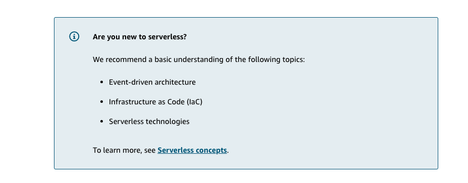

# 9 AWS SAM CLI

Created: 2023-10-03 21:46:14 -0600

Modified: 2023-10-22 17:41:15 -0600

---

![Video Transcript SAM, or the Serverless Application Model. Now, SAM is my favorite service because as you'll see later, we've got a bunch of fun squirrels building things for you. We've got a few commands listed here we're not gonna go into just yet because we're gonna cover SAM in a lot more depth later on. But it's important to understand what SAM gets us. Remember earlier, when we wrote those cloud formation templates? Did anyone think, "Wow that's a lot of work?" I mean, I sure do whenever I write a cloud formation template. We can use SAM to build and package these templates for us. Later on, we'll see how, with just a few lines of code, we can build out a pretty complicated application, and it gives us a package that we can move around and easily deploy to any AWS account that we want. ](../../../media/AWS-DevOps-Module-3-9-AWS-SAM-CLI-image1.png){width="5.0in" height="2.6041666666666665in"}

![Key concepts and topics Review the content below to reinforce some of the key concepts and topics presented to you in the video above. AWS Serverless Application Model The AWS Serverless Application Model (AWS SAM) is a toolkit that improves the developer experience of building and running serverless applications on AWS. AWS SAM consists of two primary parts: O O AWS SAM template specification --- An open-source framework that you can use to define your serverless application infrastructure on AWS. AWS SAM command line interface (AWS SAM CLI) --- A command line tool that you can use with AWS SAM templates and supported third-party integrations to build and run your serverless applications. ](../../../media/AWS-DevOps-Module-3-9-AWS-SAM-CLI-image2.png){width="5.0in" height="3.75in"}

![What is AWS SAM CLI? What is AWS SAM CLI? • AWS Serverless Application Model (AWS SAM) • Command Line Interface (CLI) • Locally build, test, and debug serverless applications defined by AWS SAM templates Common commands for deploying serverless applications • Sam build • package • deploy Locally build, test, and debug serverless applications defined by AWS SAM templates. Common commands for deploying server-less applications include: sam build, sam package, and sam deploy. Using the sam build command, you can easily create deployment artifacts that target the AWS Lambda execution environment. This enables the functions you build locally to run in a similar environment in the cloud. The sam build command iterates through the functions in your application, looks for a manifest file (such as requirements.txt) that contains dependencies, and automatically creates deployment artifacts that you can deploy to Lambda using the sam package and sam deploy commands. ](../../../media/AWS-DevOps-Module-3-9-AWS-SAM-CLI-image3.png){width="5.0in" height="2.576388888888889in"}

{width="5.0in" height="1.9444444444444444in"}

