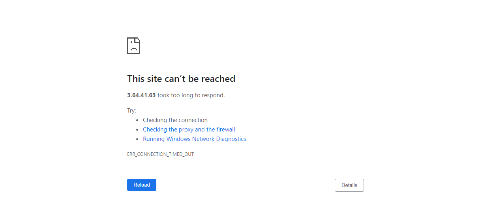
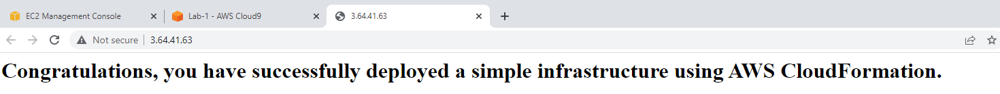

# Lab 1: Use AWS CloudFormation to provision and manage a basic infrastructure | Self-Paced Labs

Created: 2023-10-07 02:52:44 -0600

Modified: 2023-10-07 08:52:47 -0600

---

Clipped from: <https://labs.skillbuilder.aws/sa/lab/arn%3Aaws%3Alearningcontent%3Aus-east-1%3A470679935125%3Ablueprintversion%2FILT-TF-200-DEVOPS-3%2Flab-1-Cloudformation%3A3.3.2-1d8c8025/en-US>

# Lab 1: Use AWS CloudFormation to provision and manage a basic infrastructure

© 2023 Amazon Web Services, Inc. or its affiliates. All rights reserved. This work may not be reproduced or redistributed, in whole or in part, without prior written permission from Amazon Web Services, Inc. Commercial copying, lending, or selling is prohibited. All trademarks are the property of their owners.

Note: Do not include any personal, identifying, or confidential information into the lab environment. Information entered may be visible to others.

Corrections, feedback, or other questions? Contact us at *[AWS Training and Certification](https://support.aws.amazon.com/#/contacts/aws-training).*

## Duration

This lab requires **45 minutes** to complete.

### Prerequisites

**General prerequisites**

- Access to a notebook computer with Wi-Fi and Microsoft Windows, macOS X, or Linux (Ubuntu, SuSE, or Red Hat).
- For Microsoft Windows users: Administrator Access to the computer.
- An internet browser such as Chrome, Firefox, MS Edge.
- Review additional lab environment specific details in the [Appendix.](https://labs.skillbuilder.aws/sa/lab/arn:aws:learningcontent:us-east-1:470679935125:blueprintversion/ILT-TF-200-DEVOPS-3/lab-1-Cloudformation:3.3.2-1d8c8025/en-US#appendix)

## Overview

In this lab, you will gain hands-on experience with an AWS CloudFormation template. You will modify an AWS CloudFormation template, use the AWS CLI and AWS Management Console to create a stack, detect drift in the stack, and perform a stack update.

### Objectives

By the end of this lab, you will be able to do the following:

- Build AWS CloudFormation templates in YAML to define infrastructure resources.
- Create a CloudFormation stack to provision infrastructure and review the outputs.
- Detect changes made to your resources and generate drift reports.
- Update your infrastructure using CloudFormation change sets.

### Scenario

In this lab, you have been tasked with creating a simple environment for a development team. The development team has asked for an Apache web server with HTTP access. The requirements document that you have been provided asks for a dedicated VPC, a single public subnet, and a small Amazon Elastic Compute Cloud (Amazon EC2) instance. You will use your AWS Cloud9 environment to modify an existing AWS CloudFormation template to meet the requirements of the development team, modify the template to use CloudFormation's changeset and detect drift functionality.

First, using AWS Cloud9, you will modify an AWS CloudFormation template to build a simple Amazon Virtual Private Cloud (Amazon VPC) environment and deploy a web server with a simple web page. Second, verifying that the webpage renders properly, you will manually modify an Amazon EC2 Security Group and use the **Detect drift** command to detect the change. Last, you will create a change set to update the Security Group with the expected values.

*Diagram: The diagram below is a visual of the previous steps.*

{width="6.0in" height="2.90625in"}

## Start lab

1.  To launch the lab, at the top of the page, choose Start lab.

You must wait for the provisioned AWS services to be ready before you can continue.

1.  To open the lab, choose Open Console.

You are automatically signed in to the AWS Management Console in a new web browser tab.

**Do not change the Region unless instructed.**

### Common sign-in errors

#### *Error: You must first sign out*

{width="6.0in" height="1.2708333333333333in"}

If you see the message, **You must first log out before logging into a different AWS account:**

- Choose the **click here** link.
- Close your **Amazon Web Services Sign In** web browser tab and return to your initial lab page.
- Choose Open Console again.

#### *Error: Choosing Start Lab has no effect*

In some cases, certain pop-up or script blocker web browser extensions might prevent the **Start Lab** button from working as intended. If you experience an issue starting the lab:

- Add the lab domain name to your pop-up or script blocker's allow list or turn it off.
- Refresh the page and try again.

## Task 0: Connect to the AWS Cloud9 IDE

In this task, you will connect to the AWS Cloud9 integrated development environment (IDE).

Cloud9 development environments come prepackaged with the AWS CLI and tooling for over 40 programming languages. In this task you will verify that the AWS CLI is installed.

1.  Open the **Cloud9 environment** by copying the **URL** value to the left of these instructions for the heading reading **Cloud9Environment** and pasting it into a new browser tab.

### Explore the Cloud9 Interface

***Editor***

**The top pane to the right** is the *editor*. The *editor* is where you can do things such as write code, run terminal sessions, and change IDE settings. **It is currently displaying the AWS Cloud9 Welcome Screen.**

***File Tree***

**The left pane is the *file tree***. It shows a list of all files that are currently available and open in the editor.

You have been provided with three CloudFormation templates to work with.

1.  In the **AWS Cloud9 file tree** pane, select the **templates** folder to see the above listed CloudFormation templates.

- Within the **templates** folder:

- There is an incomplete CloudFormation template named **lab1.yaml**. You will be making changes to this template.

<!-- -->
- Within the sub-folder named **help**, there are two complete CloudFormation templates:

- A complete CloudFormation template to use as a reference to verify your **task 1** solutions named **task1-solution.yaml**.
- A complete CloudFormation template to use as a reference to verify your **task 4** solution named **task4-solution.yaml**.

In the **AWS Cloud9 Environment** pane, in the context menu, drop-down on the **templates** folder to see the above listed CloudFormation templates.

***Terminal tab***

The lower pane includes two tabs: a bash terminal and a tab labeled *Immediate*. You will be working in the bash terminal.

**Note:** When the AWS Cloud9 environment is first launched, a bash script clones a CodeCommit repository that contains the AWS CloudFormation templates you will use for this lab.

**Expected output:**

******************************
**** This is OUTPUT ONLY. ****
******************************

/tmp/git-cloning-runner-1665674232684-080250367781.sh
AWSLabsUser-hfRtqbnX2oKVNR5xSqAaQZ:~/environment $ /tmp/git-cloning-runner-1665674232684-080250367781.sh
Cloning into '/home/ec2-user/environment/templates'...
remote: Counting objects: 5, done.
Unpacking objects: 100% (5/5), 6.87 KiB | 6.87 MiB/s, done.

Navigate to your cloned repository by typing "cd /home/ec2-user/environment/templates" to start working with " <https://git-codecommit.us-east-1.amazonaws.com/v1/repos/lab1>"

To set your display name run "git config --global user.name YOUR_USER_NAME"
To set your display email run "git config --global user.email YOUR_EMAIL_ADDRESS"

### Verify that the AWS CLI is installed in the Cloud9 Environment

1.  **Command:** To verify the AWS CLI is installed and to display its version, run the following command in a terminal window:

aws --version

**Expected output:** Your version may be newer.

******************************
**** This is OUTPUT ONLY. ****
******************************

aws-cli/2.8.11 Python/3.9.11 Linux/4.14.294-220.533.amzn2.x86_64 exe/x86_64.amzn.2 prompt/off

### Explore the basics of a CloudFormation Template

1.  In the **AWS Cloud9 Environment** pane, from the **templates** folder, select the file named **lab1.yaml** and choose **Open.**

The file will open in the top pane in tabs next to the AWS Cloud9 welcome screen. Scroll through the file and note that it includes four sections: **Description**, **Parameters**, **Resources**, and **Outputs**. **Resources** is the only required section in an AWS CloudFormation template, all other sections are optional. For more information refer to the AWS CloudFormation documentation at this link: <https://docs.aws.amazon.com/AWSCloudFormation/latest/UserGuide/template-anatomy>

The sections included in your template serve the following purpose:

- **Description:** A text string that describes the template.
- **Parameters:** Values to pass to your template at runtime (when you create or update a stack).
- **Resources:** Specifies the stack resources and their properties.
- **Outputs:** Describes the values that are returned as stack properties after the stack has successfully completed.

For the next task, you will modify the **Parameters**, **Resources** and **Outputs** to the **lab1.yaml** template.

## Task 1: Build an AWS CloudFormation template

In this task, you will use AWS Cloud9 to modify an AWS CloudFormation template, and use that template to create a CloudFormation stack.

AWS CloudFormation provides a common language to model and provision resources in your cloud environment. You code your infrastructure with the CloudFormation template language, in either YAML or JSON format. Both YAML and JSON are data serialization languages but with different features. AWS CloudFormation only processes JSON; templates formatted as YAML will be converted to JSON when the stack create is initiated.

For this lab, you will use YAML to code the CloudFormation templates.

### Task 1.1: Add a parameter to the template

In this task you will be updating a **Parameter** in the **lab1.yaml** template in the Cloud9 environment.

**Parameters** in YAML are generally formatted as:

*********************************
**** This is an EXAMPLE ONLY ****
*********************************
Parameters:
InstanceTypeParameter:
Description: Enter t2.micro, m1.small, or m1.large. Default is t2.micro.
Type: String
Default: t2.micro
AllowedValues:
- t2.micro
- m1.small
- m1.large
ConstraintDescription: Must be a valid EC2 instance type.

Create a **Parameter** for the **InstanceType**

1.  Create an entry for the **Instance Type** by adding the following values:

In the **Parameters** section you will find the label that has been created as a placeholder. Configure the parameter with the following settings to match the sample structure above:

- **Label:**

InstanceType

- **Description:**

WebServer EC2 instance type

- **Type:**

String

- **Default:**

t2.nano

- **AllowedValues:**

t2.nano

,

t2.micro

,

t2.small

- **ConstraintDescription:**

must be a valid EC2 instance type.

### Task 1.2: Add a resource to the template

In this task you will be adding a **Resource** to the **lab1.yaml** template in the Cloud9 environment.

**Resources** also follow a general format but have a **Properties** section that defines the specifics of the object/service declared in the template. In general, all resources have the following properties:

*********************************
**** This is an EXAMPLE ONLY ****
*********************************
Resources:
Logical ID:
Type: Resource type
DependsOn:
- Resource Label 1
- Resource Label 2
Properties:
Property 1: value
Property 2: value
Property 3: value

1.  Create a **Resource** for the **Route**.

In the **Resources** section you will find the label that has been created as a placeholder. Configure the resource with the following settings to match the sample structure above:

- **Label:**

Route

- **Type:**

AWS::EC2::Route

- **DependsOn:**

VPC

,

AttachGateway

- **Properties:**

- **RouteTableId:**

!Ref RouteTable

- **DestinationCidrBlock:**

0.0.0.0/0

- **GatewayId:**

!Ref InternetGateway

### Task 1.3: Add an output to the template

In this task you will be adding an **Output** to the **lab1.yaml** template in the Cloud9 environment.

**Outputs** in YAML are generally formatted like the example below:

*********************************
**** This is an EXAMPLE ONLY ****
*********************************
Outputs:
Logical ID:
Description: Information about the value
Value: !IntrinsicFunction <Parameters>

1.  Create an **Output** for the **AppURL**.

In the **Outputs** section you will find the label that has been created as a placeholder. Ensure the output entry matches the following settings to match the sample structure above:

- **Logical ID:**

AppURL

- **Description**

Newly created application URL

- **Value:**

!Sub ''

**Note:** The intrinsic **!Sub** function is used in the **AppURL** output definition above to return a usable URL when stack creation is completed.

**Additional information:** The **!Sub** function substitutes variables in an input string with values that you specify. In your templates, you can use this function to construct commands or outputs that include values that aren't available until you create or update a stack.

When you have completed editing the file, save your changes.

1.  On the **File** menu, choose **Save**.

**Note:** The **task1-solution.yaml** present in the **help** folder is a complete and usable copy of the template you updated. If you have trouble or need help with syntax formatting, use the **task1-solution.yaml** template to identify your error or copy and paste between the documents as needed.

**Congratulations!** You have successfully built a CloudFormation template.

## Task 2: Provision an infrastructure using the stack's CloudFormation template

For this task you will launch the stack creation process from the AWS CLI and review all of the resources created on the CloudFormation console.

### Task 2.1: Run CreateStack using the lab1.yaml template

In this task you will be running the **create-stack** command to initiate a stack creation from the CLI.

1.  **Command:** In the **AWS Cloud9 terminal**, ensure you are in the **templates** folder by running the following command:

cd ~/environment/templates

**Expected Output:**

*None, unless there is an error.*

1.  **Command:** From the terminal, run the following command to launch the stack creation process using inline parameters to match the template definition.

aws cloudformation create-stack --stack-name Lab1 --parameters ParameterKey=InstanceType,ParameterValue=t2.micro --template-body <file://lab1.yaml>

**Expected output:**

******************************
**** This is OUTPUT ONLY. ****
******************************

{
"StackId": "arn:aws:cloudformation:ca-central-1:350214907448:stack/Lab1/7f733ee0-bf54-11ec-aa09-0244448197b2"
}

The create-stack command calls the specified AWS CloudFormation template and initiates a stack creation. The parameter InstanceType tells CloudFormation what size Amazon EC2 instance to deploy.

Successfully running **create-stack** returns a *StackId* at the command line.

**Note:** If your stack creation fails, refer to the troubleshooting steps: [Troubleshooting a stack CREATE_FAILED message](https://labs.skillbuilder.aws/sa/lab/arn:aws:learningcontent:us-east-1:470679935125:blueprintversion/ILT-TF-200-DEVOPS-3/lab-1-Cloudformation:3.3.2-1d8c8025/en-US#appendix)

### Task 2.2: Verify the status of the stack

In this task you will be querying the status of the stack creation process by running the **describe-stack** command in the CLI and viewing the process in the console.

1.  **Command:** From the terminal, run the following command:

aws cloudformation describe-stacks --stack-name Lab1

**Expected output:**

******************************
**** This is OUTPUT ONLY. ****
******************************

{
"Stacks": [
{
"StackId": "arn:aws:cloudformation:ca-central-1:167386515113:stack/Lab1/caa48f10-4dcd-11ed-9527-0251a4035624",
"StackName": "Lab1",
"Description": "AWS CloudFormation Simple Infrastructure Template VPC_Single_Instance_In_Subnet: This template will show how to create a VPC and add an EC2 instance with an Elastic IP address and a security group.",
"Parameters": [
{
"ParameterKey": "InstanceType",
"ParameterValue": "t2.micro"
},
{
"ParameterKey": "VPCCIDR",
"ParameterValue": "10.199.0.0/16"
},
{
"ParameterKey": "PUBSUBNET1",
"ParameterValue": "10.199.10.0/24"
},
{
"ParameterKey": "LatestAmiId",
"ParameterValue": "/aws/service/ami-amazon-linux-latest/amzn2-ami-hvm-x86_64-gp2",
"ResolvedValue": "ami-064687fa05edcd686"
}
],
"CreationTime": "2022-10-17T03:45:41.824Z",
"RollbackConfiguration": {},
"StackStatus": "CREATE_IN_PROGRESS",
"DisableRollback": false,
"NotificationARNs": [],
"Outputs": [
{
"OutputKey": "URL",
"OutputValue": " <http://13.234.178.84>",
"Description": "Newly created application URL"
}
],
"Tags": [],
"EnableTerminationProtection": false,
"DriftInformation": {
"StackDriftStatus": "NOT_CHECKED"
}
}
]
}

**Note:** The **describe-stacks** command will return a large amount of information to the terminal. It presents information on every resource defined by your template, the current status in the build process, and specific attributes of the resource that are available at the time that you run **describe-stacks**. The AWS CloudFormation dashboard presents the same information, but in a friendlier format.

**Note:** It will take CloudFormation a few minutes to complete the **create-stack** process.

1.  **Command:** To query the status of the stack creation process, from the terminal, run the following command:

aws cloudformation describe-stacks --stack-name Lab1 --query "Stacks[0].StackStatus"

A **CREATE_COMPLETE** status code indicates the completion of the stack creation process.

**Return to the "Your Environments" browser tab to view the status in the console.**

1.  At the top of the AWS Management Console, in the search bar, search for and choose **CloudFormation**.
2.  In the list of **Stacks**, locate *Lab1*. Note the *status* of your *Create Stack* job.

### Task 2.3: Review the stack resources created

In this task you will be reviewing the **Lab1** stack and exploring the **Stack Info**, **Events**, **Resources** and **Outputs** generated from the stack creation in the console.

1.  In the

CloudFormation

console explore the stack events.

2.  Select the stack and explore the information available on each tab: **Stack Info**, **Events**, **Resources** and **Outputs**.
3.  On the **Resources** tab, a list of resources defined in the template are created. Identify some key resources you have created. Each resource will have a unique **Logical ID**, **Physical ID**, **Type**, and **Status**.

- The following resources should be created:

- AttachGateway, IPAddress, InboundHTTPNetworkAclEntry, InboundNetworkAclEntry, InboundResponsePortsNetworkAclEntry, InstanceSecurityGroup, InternetGateway, NetworkAcl, OutBoundHTTPNetworkAclEntry, OutBoundHTTPSNetworkAclEntry, OutBoundResponsePortsNetworkAclEntry, Route, RouteTable, Subnet, SubnetNetworkAclAssociation, SubnetRouteTableAssociation, VPC, WebServerInstance.

1.  When the status of the *Create Stack* job shows **CREATE_COMPLETE**, on the **Outputs** tab, launch the URL shown on another browser tab.
2.  A webpage displaying a time-out error is expected to appear with the following message: **"This site can't be reached"**.

{width="6.0in" height="2.5520833333333335in"}

*Image: Shows an example of **this site can't be reached** error message.*

**Note:** The

Public IP

cannot be accessed at this time due to a

Security Group

restriction defined in the template. In the next task this will be fixed by modifying the

Security Group

resource.

**Congratulations!** You have successfully provisioned a simple infrastructure using a CloudFormation template and identified a limitation in the

Security Group

resource.

## Task 3: Detect drift in a CloudFormation stack

In this task, you use **AWS CloudFormation to detect changes that CloudFormation didn't make**. Make a change to your environment, instruct CloudFormation to detect any **drift** and then view the results.

Users can change resources *outside* of AWS CloudFormation. Drift detection can be used to identify stack resources that have been modified outside of AWS CloudFormation management.

### Task 3.1: Modify your environment

In this task, you will be modifying the security group rules in the **EC2** console.

1.  From the **AWS Management Console**, use the **AWS search bar** to search for

EC2

and then choose the service from the list of results.

2.  On the **EC2** console, in the navigation pane, choose **Security Groups** and select the security group for your simple infrastructure.

**Hint:** To select the correct **Security Group**, refer to the **Lab-1** CloudFormation stack **Outputs** and locate the one that has a matching value.

1.  On the **Inbound rules** tab choose Edit inbound rules .
2.  On the Edit inbound rules page, on the listed **Security group rule ID** modify the **Source** parameter by selecting **My IP** from the drop-down menu.
3.  Choose Save rules .

### Task 3.2: Verify the AppURL is working

In this task, you will verify the changes made to the security group have allowed you to access the previously unreachable webpage.

1.  Return to the **AWS Management Console**, use the **AWS search bar** to search for

CloudFormation

and then choose the service from the list of results.

2.  Locate the *Lab1* stack in the console view.
3.  On the **Outputs** tab, launch the URL shown in a new browser tab.
4.  When loaded, a webpage is displayed with the following message: **"Congratulations, you have successfully deployed a simple infrastructure using AWS CloudFormation".**

{width="6.0in" height="0.5625in"}

*Image: Shows what the webpage looks like with the congratulations message mentioned above.*

**Note:** Notice that changing the source IP address on the Security Group allowed traffic into the webpage URL. Modifying template resources via the console is a quick-fix but not a best practice.

### Task 3.3: Generate a drift report

In this task, you will identify and detect the drift in the template via the **AWS Management** console.

1.  Return to the **CloudFormation - Stack Lab 1** browser tab.
2.  In the stack details pane, choose Stack actions and then choose Detect drift .

**Note:** Wait until AWS CloudFormation completes the drift detection operation. Refresh the page to view the changes.

1.  With your stack selected, from the Stack actions menu, select **View drift results**.
2.  In the **Resource drift status** section, select the **InstanceSecurityGroup** resource that has the status of **MODIFIED**.
3.  Select View drift details and review the information.

Drift detection enables you to detect whether a stack's actual configuration differs from its expected configuration. A resource is considered to have drifted if any of its actual property values differ from the expected property values. This includes if the property or resource has been deleted. In this lab you manually changed a resource value. The most direct manner to address this drift is to manually modify the resource back to the expected value. If the change is due to the deployment of another stack, rollback the changes of the other stack. A last resort and the most destructive is to delete your stack and redeploy it. For more information on drift follow this link: [Detecting Unmanaged Configuration Changes to Stacks and Resources](https://docs.aws.amazon.com/AWSCloudFormation/latest/UserGuide/using-cfn-stack-drift)

### Task 3.4: Verify the AppURL is working via the CLI

In this task, you will identify and detect the drift in the template via the **Cloud9** CLI.

1.  Return to the **AWS Cloud9 terminal** to review the details of the stack drift detection operation using AWS CLI.
2.  **Command:** In the **AWS Cloud9 terminal**, enter the AWS CLI CloudFormation *describe-stack-resource-drifts* command with the following parameters:

- --stack-name [Paste the stack name here]
- --stack-resource-drift-status-filters MODIFIED DELETED

**Command:** Copy and paste the **describe-stack-resource-drifts** command:

aws cloudformation describe-stack-resource-drifts --stack-name Lab1 --stack-resource-drift-status-filters MODIFIED DELETED

In the results, look for the Resource Type *SecurityGroup* and then look for the *PropertyDifferences*. The results should mirror the drift information that was displayed on the AWS CloudFormation dashboard.

**Expected output:**

******************************
**** This is OUTPUT ONLY. ****
******************************

{
"StackResourceDrifts": [
{
"StackId": "arn:aws:cloudformation:ca-central-1:866205660680:stack/Lab1/8550eec0-77f5-11ed-96ae-0a8916d020f2",
"LogicalResourceId": "InstanceSecurityGroup",
"PhysicalResourceId": "sg-0ac8f08ddbd30c839",
"ResourceType": "AWS::EC2::SecurityGroup",
"ExpectedProperties": "{"GroupDescription":"Enable HTTP via port 80","SecurityGroupIngress":[{"CidrIp":"1.1.1.1/32","FromPort":80,"IpProtocol":"tcp","ToPort":80}],"VpcId":"vpc-0172e787ed9d66d8e"}",
"ActualProperties": "{"GroupDescription":"Enable HTTP via port 80","SecurityGroupIngress":[{"CidrIp":"52.94.133.131/32","FromPort":80,"IpProtocol":"tcp","ToPort":80}],"VpcId":"vpc-0172e787ed9d66d8e"}",
"PropertyDifferences": [
{
"PropertyPath": "/SecurityGroupIngress/0/CidrIp",
"ExpectedValue": "1.1.1.1/32",
"ActualValue": "52.94.133.131/32",
"DifferenceType": "NOT_EQUAL"
}
],
"StackResourceDriftStatus": "MODIFIED",
"Timestamp": "2022-12-09T19:17:49.495000+00:00"
}
]
}

**Congratulations!** You have successfully detected a drift in the CloudFormation template.

## Task 4: Update the stack using a change set

In the previous task, you manually changed a resource value. The best practice to change the environment is through the template updates. Template updates can be easily done using a changeset.

In this task, you will modify the Security Group resource to the expected value in the template. You will be editing the **lab1** template to modify the **SecurityGroupRules**, review those changes as part of the **Change Set**, and then implement the changes to the environment.

### Task 4.1: Modify the Security Group Rules

Earlier in **Task 3**, the **InstanceSecurityGroup** was modified outside of the CloudFormation template. In this task, a change will be made in the template for the stack to implement the modification when creating.

1.  In the **AWS Cloud9 Environment** pane, open the context menu for **lab1.yaml** file you edited earlier and choose **Duplicate.**
2.  Rename the duplicate file **lab1-CS.yaml**, and open the file in the AWS Cloud9 editor.

Modify the **InstanceSecurityGroup** resource to allow access to the **AppURL**:

1.  Under the **SecurityGroupIngress** property value, note the **CidrIP** listed as

1.1.1.1/32

.

2.  In order to make the webpage accessible, change the **CidrIP** value to

0.0.0.0/0

.

3.  Save the file.

**Note:** For hints, tips, and to validate the edits you have made to the *lab1-CS.yaml* template, refer to the *task4-solution.yaml* template.

### Task 4.2: Create the change set

In this task, you will be running the **create-change-set** command to create a change set for the **lab1.yaml** template.

1.  **Command:** In the **AWS Cloud9 terminal**, ensure you are in the **templates** folder by running the following command:

cd ~/environment/templates

**Expected Output:**

*None, unless there is an error.*

1.  **Command:** From the terminal, run the following command to launch the stack change set process:

aws cloudformation create-change-set --stack-name Lab1 --change-set-name Lab1ChangeSet --parameters ParameterKey=InstanceType,ParameterValue=t2.micro --template-body <file://lab1-CS.yaml>

**Expected output:**

******************************
**** This is OUTPUT ONLY. ****
******************************

{
"Id": "arn:aws:cloudformation:ca-central-1:350214907448:changeSet/Lab1ChangeSet/b62f9a0f-bd5e-4988-9016-bba2c46f351b",
"StackId": "arn:aws:cloudformation:ca-central-1:350214907448:stack/Lab1/7f733ee0-bf54-11ec-aa09-0244448197b2"
}

After the change set is processed, AWS CloudFormation returns a *StackId* and *Id*. To see the changes that you have staged, **return to the "CloudFormation" browser tab.**

**Note:** If your change set creation fails, refer to the troubleshooting steps: [Troubleshooting a changeset creation failure](https://labs.skillbuilder.aws/sa/lab/arn:aws:learningcontent:us-east-1:470679935125:blueprintversion/ILT-TF-200-DEVOPS-3/lab-1-Cloudformation:3.3.2-1d8c8025/en-US#troubleshoot_change-set_failed)

### Task 4.3: Review the changes

In this task, you will review the details of the change set in the console.

1.  Choose *Lab1* from the top of the drift results window to return to your stack.
2.  On the **Change sets** tab, select **Lab1ChangeSet**. Review the details of the change-set in the **Changes** tab.

### Task 4.4: Execute the change set

In this task, you will execute the change set created using the console.

1.  In the **Lab1ChangeSet** window, verify the changes are as expected for the **InstanceSecurityGroup** resource.
2.  At the top-right of the page, choose Execute change set..
3.  A pop-up window will prompt you to choose how to handle resources in the event of a stack failure.
4.  With the default **Roll back all stack resources** chosen, select Execute change set..

**Note:** Wait for 1 minute and refresh to see the change in the stack status.

1.  Wait for the stack update to complete and the **Status** to change to **UPDATE_COMPLETE**.

**Lab1ChangeSet** is no longer available, and there is a new entry under **Last executed change set**.

1.  Select the Change set id and review the information.

- **Status** as CREATE_COMPLETE
- **Execution Status** EXECUTE_COMPLETE

### Task 4.5: Verify the AppURL is working

In this task, you will access the AppURL link to ensure the security group change made is successfully implemented.

1.  Return to the **Your Environments** browser tab, return to the *Lab1* stack console view.
2.  On the **Outputs** tab, launch the URL shown in a new browser tab.
3.  When loaded, a webpage is displayed with the following message: **"Congratulations, you have successfully deployed a simple infrastructure using AWS CloudFormation".**

{width="6.0in" height="0.5625in"}

*Image: shows a visual representation of what the congratulations message looks like in the browser.*

## Summary

**Congratulations!** You have successfully:

- Built an AWS CloudFormation template to provision a simple infrastructure and perform a **CreateStack** action.
- Detected **drift** in an AWS CloudFormation stack.
- Created an AWS CloudFormation **change set** and ran it.

## End lab

Follow these steps to close the console and end your lab.

1.  Return to the **AWS Management Console**.
2.  At the upper-right corner of the page, choose **AWSLabsUser**, and then choose **Sign out**.
3.  Choose End lab and then confirm that you want to end your lab. For more information about AWS Training and Certification, see *<https://aws.amazon.com/training/>.*

*Your feedback is welcome and appreciated.*
*If you would like to share any feedback, suggestions, or corrections, please provide the details in our [AWS Training and Certification Contact Form](https://support.aws.amazon.com/#/contacts/aws-training).*

## Appendix

### Troubleshooting a stack CREATE_FAILED message

**Caution:** If your stack creation fails, the AWS CloudFormation console provides detailed information that you can use to identify the cause of the stack creation failure. Use that information to correct your template. When you have corrected the issue use the following command to delete the failed stack.

- Return to the **AWS Cloud9 terminal** and run the following command:

**WARNING:** The following command is destructive in nature. Only run this command as part of debugging a failed CloudFormation stack creation.

aws cloudformation delete-stack --stack-name Lab1

- Return to the AWS CloudFormation dashboard to observe your stack deletion. When the delete-stack has completed return to step 14 and re-run the create-stack command.

**WARNING:** If your stack deletion fails and you cannot roll back your changes successfully, bring your issue to the attention of a lab support technician or your instructor.

To create the stack, return back to [Task 2.1](https://labs.skillbuilder.aws/sa/lab/arn:aws:learningcontent:us-east-1:470679935125:blueprintversion/ILT-TF-200-DEVOPS-3/lab-1-Cloudformation:3.3.2-1d8c8025/en-US#task2-1).

### Troubleshooting a changeset creation failure

**Caution:** If your change set creation fails, the AWS CloudFormation console provides detailed information that you can use to identify the cause of the failure. Use that information to correct your template and deploy the change set again.

1.  **Command:** When you have corrected the issue use the following command to delete your change set:

aws cloudformation delete-change-set --change-set-name Lab1ChangeSet --stack-name Lab1

1.  Return to the AWS CloudFormation dashboard to observe your change set deletion. When the **delete-change-set** has completed re-run the **execute-change-set** command.

**WARNING:** If your stack deletion fails and you cannot roll back your changes successfully, bring your issue to the attention of a lab support technician or your instructor.

To create the change set, return back to [Task 4.2](https://labs.skillbuilder.aws/sa/lab/arn:aws:learningcontent:us-east-1:470679935125:blueprintversion/ILT-TF-200-DEVOPS-3/lab-1-Cloudformation:3.3.2-1d8c8025/en-US#task4-2).

### AWS Services Not Used in This Lab

AWS services that are not used in this lab are deactivated in the lab environment. In addition, the capabilities of the services used in this lab are limited to what the lab requires. Expect errors when accessing other services or performing actions beyond those provided in this lab guide.

### Icon key

Various icons are used throughout this lab to call attention to different types of instructions and notes. The following list explains the purpose for each icon:

- **Command:** A command that you must run.
- **Expected output:** A sample output that you can use to verify the output of a command or edited file.
- **Note:** A hint, tip, or important guidance.
- **Additional information:** Where to find more information.
- **File contents:** A code block that displays the contents of a script or file you need to run that has been pre-created for you.
- **Copy command:** A time when copying a command, script, or other text to a text editor (to edit specific variables within it) might be easier than editing directly in the command line or terminal.

[Return to the instructions](https://labs.skillbuilder.aws/sa/lab/arn:aws:learningcontent:us-east-1:470679935125:blueprintversion/ILT-TF-200-DEVOPS-3/lab-1-Cloudformation:3.3.2-1d8c8025/en-US#prerequisites)

