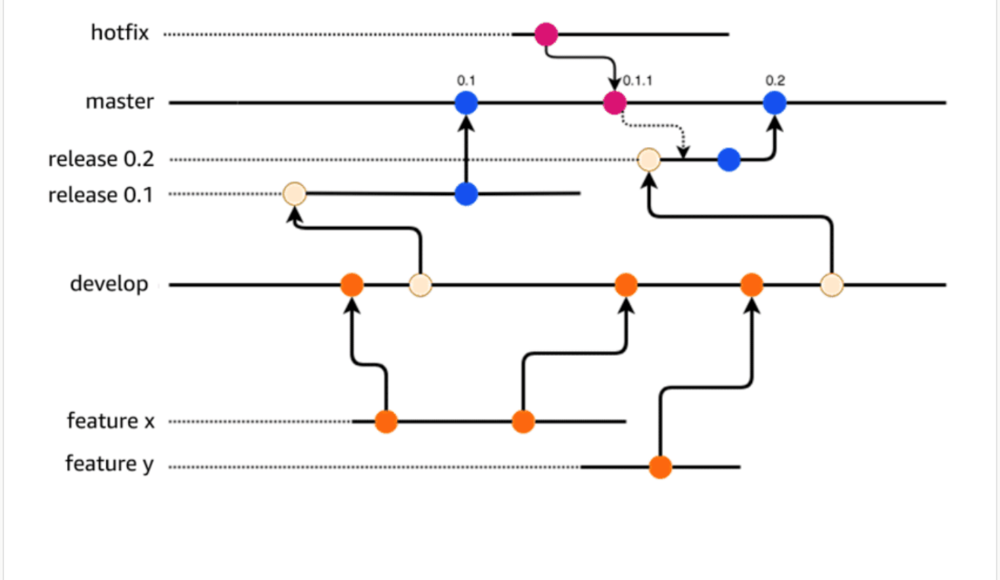

# 14 CI/CD Pipeline

Created: 2023-10-04 22:06:51 -0600

Modified: 2023-10-22 17:41:39 -0600

---

Summary

The text discusses the importance and structure of Continuous Integration and Continuous Delivery (CI/CD) pipelines, emphasizing the role of Git and AWS services like CodeCommit. It also touches on best practices for version control, branching strategies, and the benefits of using Git hooks.

Facts

- CI/CD pipelines focus on frequent changes, releases, and automation.
- Code repositories, such as GitHub, CodeCommit, and Bitbucket, are essential for CI/CD.
- Feedback loops and metrics are crucial for continual improvement.
- Source control, like Git, tracks changes and views history.
- AWS's CodeCommit is a fully managed Git solution backed by S3 and integrated with IAM for permissions.
- Setting up with CodeCommit requires permissions, installing Git locally, and setting up a credential helper.
- Best practices for permissions in CodeCommit involve using roles and supporting multifactor authentication.
- CodeCommit encrypts all content by default using KMS.
- Branching and merging are fundamental Git operations; strategies vary based on team size and complexity.
- Trunk based development is a branching strategy to reduce merge conflicts.
- Git offers client-side and server-side hooks for pre and post-commit actions.
- Pull requests in Git allow for code review and collaboration before merging changes.
- The text concludes with a mention of a demo showcasing the discussed concepts.

![Key concepts and topics Review the content below to reinforce some of the key concepts and topics presented to you in the videos above. Code Build Provision Deploy Monitor Continuous integration Continuous delivery Continuous deployment Release process stages (CI/CD pipeline) Here is an overview of the pipeline and its role within development. With continuous integration (Cl), developers frequently commit to a shared repository using a version control system such as Git. Before each commit, developers may run local unit tests on their code as an extra verification layer before integrating. A continuous integration service automatically builds and runs unit tests on the new code changes to immediately surface any errors. ](../../../media/AWS-DevOps-Module-4-14-CI-CD-Pipeline-image1.png){width="10.083333333333334in" height="6.3125in"}{width="10.083333333333334in" height="6.833333333333333in"}![Continuous integration Continuous development is an important aspect of continuous integration. In continuous development practices several people worl< on the code. It is critical that they all use the latest working build for their efforts. Code repositories maintain different versions of the code and also make the code accessible to the team. You check out the code from the repository, make your changes or write new code in your local copy, compile and test your code, and then frequently commit your code back to the repository. Use code repositories. Build and test code in a consistent, repeatable environment. Continually have an artifact ready for deployment. Continually close feedback loop when build fails. ](../../../media/AWS-DevOps-Module-4-14-CI-CD-Pipeline-image3.png){width="10.083333333333334in" height="4.364583333333333in"}![Branching While working on shared code repository, there might be multiple branches of the code created for various purposes. To learn more, choose appropriate tab. BRANCHING OFF THE MASTER WORKING WITH BRANCHES TRUNK-BASED DEVELOPMENT The diagram shows a repository with a master and two branches for new features and debugging. Continuously integrating the work from these two branches into the mainline is a recommended best practice. Master Merge Branch A --- new feature Merge Branch B - debugging ](../../../media/AWS-DevOps-Module-4-14-CI-CD-Pipeline-image4.png){width="10.083333333333334in" height="7.9375in"}![BRANCHING OFF THE MASTER WORKING WITH BRANCHES TRUNK-BASED DEVELOPMENT With teams working on multiple branches, it can be a complicated process to merge into the master. You can see in this diagram the different branches, features, and iterations. It becomes more and more complex as code commits branch off the master. It is strongly encouraged for Amazon teams to practice continuous integration (Cl) via "trunk-based development" where developers regularly merge their code changes into a central repository, ideally several times a day. When teams are able to regularly merge small changes they minimize the complexity of the merge and thereby the effort. Combining trunk-based continuous integration with continuous delivery (CI/CD) reduces the lead-time of getting a change into production. ](../../../media/AWS-DevOps-Module-4-14-CI-CD-Pipeline-image5.png){width="10.083333333333334in" height="4.833333333333333in"}{width="10.083333333333334in" height="5.90625in"}![BRANCHING OFF THE MASTER WORKING WITH BRANCHES TRUNK-BASED DEVELOPMENT Trunk-based development is another branching model in which many developers integrate or commit to one shared branch known as the trunk. This branch is commonly under source- control so a majority of the commits will happen in the trunk. The other branches that are created are for release, and after another branch is created usually, the older branch gets deleted. The release branches live for a short amount of time and commits are controlled by specific individuals or roles on the team. Most adjustments/fixes/ commits happen in the trunk and then are merged to the release branch. Branch A - release branch 1.0.1 Branch B - release branch 1.1.0 1 VZ I.o.x O Commit O 1.0.2 Trunk Release 1.1.x ](../../../media/AWS-DevOps-Module-4-14-CI-CD-Pipeline-image7.png){width="10.083333333333334in" height="8.802083333333334in"}

