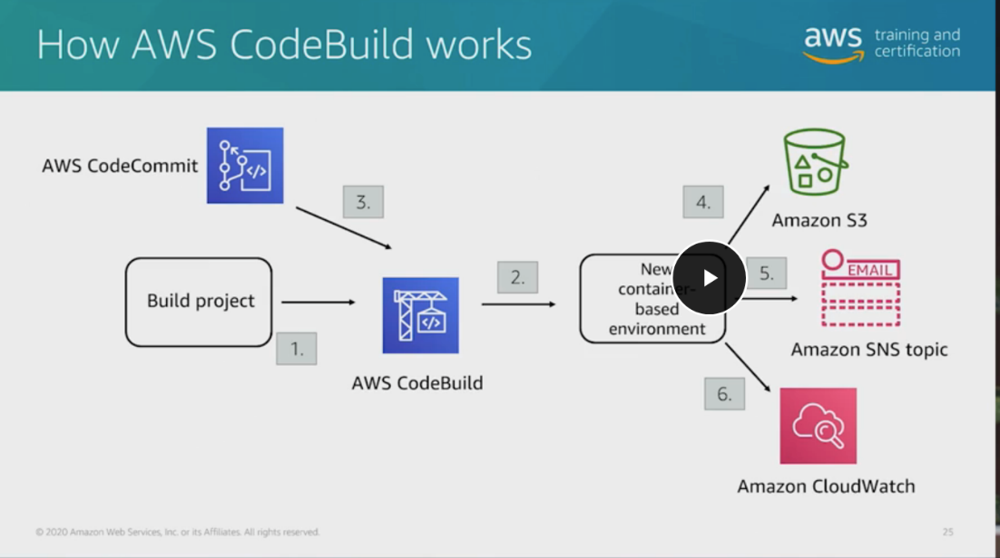
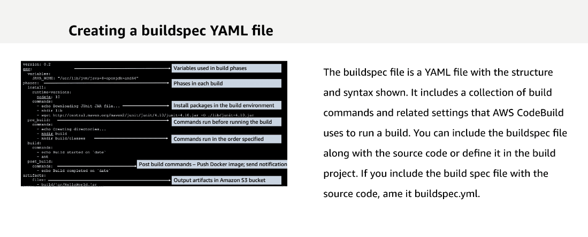

# 16 Developer Tools

---

Summary

The text delves into the intricacies of AWS's CodeBuild service, emphasizing its role in the CI/CD pipeline, its integration with other AWS services, and its compatibility with third-party tools like Jenkins.

Facts

- The demonstration covered AWS Code* services: CodeCommit, CodeBuild, CodeDeploy, and CodePipeline.
- CodeBuild is a fully managed build service, eliminating the need for a separate continuous integration service.
- CodeBuild can be triggered by code changes in CodeCommit, with the ability to save artifacts in S3 and notify teams via SNS.

- Other build services include Jenkins, Bamboo, and Team City.
- The buildspec file in CodeBuild defines the build process, including source code location, commands, and dependencies.
- Dependencies can be stored in S3 for security and cost-saving purposes.
- CodeBuild can cache build environments to speed up the build process and reduce costs.
- A buildspec file has multiple phases: install, pre_build, build, and post_build.
- The buildspec file also specifies the artifact to save.
- Docker integration with CodeBuild involves building and pushing Docker images to the Elastic Container Registry (ECR).
- CodeBuild's security is managed through AWS IAM policy documents, with predefined roles like AdminAccess, DeveloperAccess, and ReadOnly.
- CodeBuild integrates with third-party services like GitHub, GitHub Enterprise, Jenkins, and Bitbucket.
- Jenkins can be used in conjunction with CodeBuild to manage the CI/CD pipeline.
- The text concludes with a mention of a Jenkins integration demo in the AWS environment.

![What is AWS CodeBui1d? AWS CodeBuild is a fully managed build service in the cloud. CodeBuild compiles your source code, runs unit tests, and produces artifacts that are ready to deploy. CodeBuild eliminates the need to provision, manage, and scale your own build servers. It provides prepackaged build environments for popular programming languages and build tools such as Apache Maven, Gradle, and more. You can also customize build environments in CodeBuild to use your own build tools. CodeBuild scales automatically to meet peak build requests. CodeBuild provides these benefits: • Fully managed --- CodeBuild eliminates the need to set up, patch, update, and manage your own build servers. • On demand --- CodeBuild scales on demand to meet your build needs. You pay only for the number of build minutes you consume. • Out of the box---CodeBuildprovidespreconfiguredbuildenvironmentsforthemostpopular programming languages. All you need to do is point to your build script to start your first build. ](../../../media/AWS-DevOps-Module-4-16-Developer-Tools-image2.png)

![More on buildspec YAML file In build spec version 0.1, AWS CodeBuild runs each Shell command in a separate instance in the build environment. This means that each command runs in isolation from all other commands. Therefore, by default, you cannot run a single command that relies on the state of any previous commands (for example, changing directories or setting environment variables). To get around this limitation, use version 0.2, which solves this issue. If you must use version 0.1, AWS recommends the following approaches: • Include a shell script in your source code that contains the commands you want to run in a single instance of the default shell. For example, you could include a file named my- script.sh in your source code that contains commands such as cd MyDir; mkdir -p mySubDir; cd mySubDir; pwd; Then, in your build spec file, specify the command ./my-script.sh. • In your build spec file or on the Build commands setting for the build phase only, enter a single command that includes all the commands that you want to run in a single instance of the default shell (for example,). cd MyDir && mkdir -p mySubDir && cd mySubDir && pwd ](../../../media/AWS-DevOps-Module-4-16-Developer-Tools-image5.png)

![version: 0.2 phases : install : Creating a Docker buildspec Phases in each build runtime---versions : 18 pre_build: corrunands : --- echo Logging in to Amazon ECR... - $ (on get-login ------no---include---email ----regaon build: comrnands : --- echo Build started on date echo Building the Docker image... - build -E $1MAGE REPO NAME:$IMAGE TAG - tag $rMAGE REPO NAME:$rMAGE TAG Commands run before running the build $AWS DEFAULT REGION) SAWS ACCOUNT ID.dkr.ecr. $AWS DEFAULT REGION post build: commands : --- echo Build completed on date --- echo Pushing the Docker image... --- push $AWS ACCOUNT ID. dkr . ecr. $AWS DEFAULT REGION . amazonaws . . amazonaws. com/$1MAG@ REPO NAME: $IMAGE TAG Post build commands --- Push Docker image com/$1MAGE REPO NAME : $1MAGE TAG This example code produces a Docker image as build output and then pushes the Docker image to an Amazon ECR image repository. You can adapt this example to push the Docker image to Docker Hub as well. In this example, notice the install, prebuild, build, and postbuild phases. The post build displays the push of the Docker image to Amazon ECR. You can also push to a Docker Hub. ](../../../media/AWS-DevOps-Module-4-16-Developer-Tools-image6.png)

![Continuous delivery and deployment Continuous delivery automates most of the software release process. Every revision that is committed triggers an automated flow that builds, tests, and then stages the update. However, a developer must trigger the final deployment to a live production environment---that is not automated. In continuous deployment, the full release is automated minus the initial check-in of the source code. It expands upon continuous integration by deploying all code changes to a testing environment, a production environment, or both after the build stage. When continuous delivery is implemented properly, developers will have a tested, deployment-ready build. With continuous delivery and deployment, you can: ](../../../media/AWS-DevOps-Module-4-16-Developer-Tools-image7.png)

