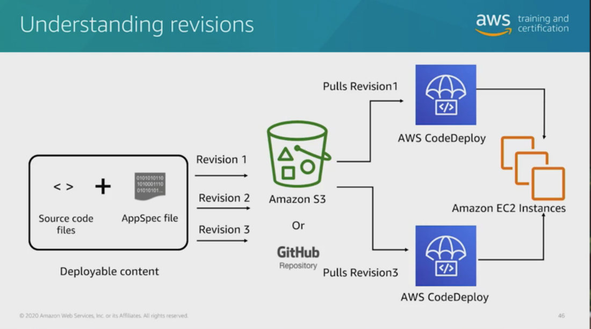

# 18 Developer tools -3

Created: 2023-10-07 22:12:49 -0600

Modified: 2023-10-22 17:41:52 -0600

---

Summary

The content delves into the functionalities and benefits of Jenkins and AWS CodeDeploy in the CI/CD pipeline, discussing scaling issues with Jenkins, deployment types, and feedback mechanisms in deployments.

Facts

- Jenkins is widely used but can experience scaling issues, with developers overloading the server.
- The EC2 plugin allows Jenkins to auto-scale by spinning up/down EC2 instances based on build requests.
- Continuous delivery/deployment is the next step after continuous integration.
- Deployments should be executed in production-like environments, starting with staging and progressing to production.
- AWS CodeDeploy aids in deploying applications to various platforms, including EC2, Lambda, Fargate, and ECS.
- CodeDeploy can automatically roll back to a previously working version if problems arise during deployment.
- CodeDeploy uses an appspec file to define deployment instructions.
- Deployment methods include in-place (updates existing architecture), rolling (updates in subsets), and blue/green (creates a new environment).
- CodeDeploy can deploy to specific AWS tags, such as 'prod' for production.
- Deployment configurations can vary from one-at-a-time to all-at-once or custom percentages.
- Application revisions in CodeDeploy encapsulate the code and instructions to be deployed.
- CodeDeploy can deploy Lambda functions and ECS containers, allowing more granular control.
- The appspec file in CodeDeploy specifies lifecycle hooks for different deployment stages.
- For deployments behind a load balancer, CodeDeploy ensures service continuity by updating resources one at a time.
- Permissions in CodeDeploy range from full access to read-only, with specific roles to facilitate deployments.
- Feedback during deployments is crucial, and CodeDeploy can provide notifications through SNS topics based on deployment status.

{width="10.083333333333334in" height="5.645833333333333in"}

