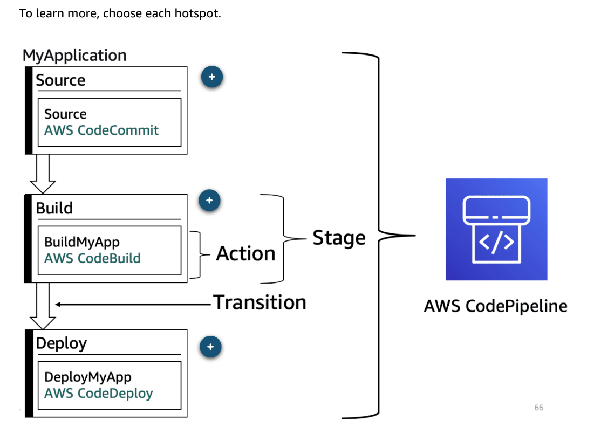
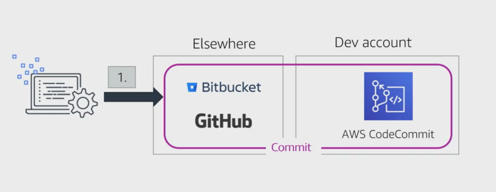

# 19 AWS CodePipeline

Created: 2023-10-08 11:38:26 -0600

Modified: 2023-10-22 17:42:00 -0600

---

Summary

The module discusses the functionalities of AWS CodePipeline and its integration with other AWS services and third-party tools, highlighting best practices, considerations, and recommendations for designing an efficient CI/CD pipeline.

Facts

- CodePipeline is a tool that orchestrates the stages of a CI/CD pipeline, from sourcing to deployment.
- Pipelines can have multiple stages, including source, build, test, staging, and deployment.
- The purpose of a CI/CD pipeline is to fully automate the development and deployment process, from code writing to production.
- CodePipeline supports multiple sources, build tools, and deployment methods, from Git services to AWS-specific tools.
- In the source stage, options include CodeCommit, GitHub, ECR, and S3, each with unique use cases.
- Parallel actions in pipelines allow for simultaneous tasks, such as building and notifying developers.
- Pipelines can be structured using JSON or CloudFormation, with the option to export configurations for adjustments.

- {width="10.083333333333334in" height="5.739583333333333in"}
- CodePipeline can span multiple AWS accounts, allowing for complex multi-account deployment scenarios.
- Feedback loops, including notifications on deployment statuses, are crucial in CI/CD pipelines.
- Robust testing strategies are essential, emphasizing the need to run unit tests consistently.
- A typical CI/CD pipeline integrates various third-party source controls, build tools, and deployment frameworks.
- After deployment, continuous monitoring, logging, and testing are necessary to ensure the application runs optimally.
- The module covers AWS services like CodeCommit, CodeBuild, CodeDeploy, CodePipeline, and their integration for a comprehensive CI/CD approach.

{width="10.083333333333334in" height="4.46875in"}

![Source Specify where source code is stored. Amazon S3, AWS CodeCommit, GitHub, and Amazon ECR Deploy Specify how application should be deployed. AWS CloudFormation, AWS CodeDep10y, Amazon ECS, AWS O sworks Stacks Build Specify how application should be built. AWS CodeBuild, CloudBees, Jenkins, and TeamCity Invoke Specify custom function to invoke. AWS Lambda Test Specify how application should be tested. AWS CodeBui1d, Jenkins, Ghost Inspector Approval Publish Amazon SNS topic for manual approval. Amazon SNS ](../../../media/AWS-DevOps-Module-4-19-AWS-CodePipeline-image3.png){width="10.083333333333334in" height="5.270833333333333in"}

![Three-stage pipeline This is a simple three-stage pipeline. Source actions are special actions. They continuously poll the source providers, such as AWS CodeCommit, GitHub, and Amazon S3, to detect changes. When a change is detected, the new pipeline is created, and the new pipeline begins its run. The source actions retrieve a copy of the source information and place it in a customer-owned Amazon S3 bucket. When the source actions are completed, the Source stage is marked as successful, and the process transitions to the Build stage. The Build Stage contains one action: BuildMyApp. AWS CodeBuild is integrated into AWS CodePipeline as a native function. You can create the AWS CodeBuild project before or while you create your AWS CodePipeline pipeline. When the build action is completed, the Build stage is marked as successful, and the process transitions to the Deploy stage. The Deploy stage contains one action: AWS CodeDeploy deployment action. The AWS CodeDeploy action retrieves the build artifact from the customer- owned Amazon S3 bucket and deploys it to the AWS CodeDeploy deployment group. To learn more, choose each hotspot. ](../../../media/AWS-DevOps-Module-4-19-AWS-CodePipeline-image4.png){width="10.083333333333334in" height="7.75in"}

{width="10.083333333333334in" height="8.729166666666666in"}

{width="10.083333333333334in" height="7.989583333333333in"}

{width="10.083333333333334in" height="9.072916666666666in"}

{width="10.083333333333334in" height="7.541666666666667in"}

![Alternatives to a simple pipeline There are alternatives to simple pipeline, to learn more choose appropriate tab. PARALLEL ACTIONS SEQUENTIAL ACTIONS MANUAL APPROVALS There are alternatives to a simple pipeline. In this example, a parallel action to send a notification to the development team was added to the build phase. Because BuildMyApp and NotifyDevelopers are parallel actions, they are initiated at the same time. Sample notification: "Hi, Dev team --- this is only a friendly note to let you know that a change was detected in the source code, and a new build has been initiated." ](../../../media/AWS-DevOps-Module-4-19-AWS-CodePipeline-image9.png){width="10.083333333333334in" height="4.791666666666667in"}

{width="10.083333333333334in" height="6.229166666666667in"}

{width="10.083333333333334in" height="8.90625in"}

![PARALLEL ACTIONS SEQUENTIAL ACTIONS MANUAL APPROVALS You can add a manual approval at the point where you want the pipeline to stop running until someone approves or rejects the revision in progress. The pipeline stops executing when it has reached the point at which you set the approval action, resuming only when the action has been approved. Approval action is managed with IAM permissions. You can notify approvers in several ways, including email, AWS SMS, webhooks, and more. MyApplication Build BuildM A AWS CodeCommit Staging-Deploy DeployMyApp AWS CodeDeploy ATeamReview Review Manual approvals Prod-Deploy De 10 M A AWS CodeDeploy ](../../../media/AWS-DevOps-Module-4-19-AWS-CodePipeline-image12.png){width="10.083333333333334in" height="8.885416666666666in"}

![Considerations when designing your CI/CD pipeline • Stages - what stages do you want in your pipeline? • Types of tests - What types of tests do you want to run at each stage? • Order of tests - Which tests must be run sequentially? Can any be run in parallel? • Detect and report failures - How will the system detect and report failures? • Regions - Which AWS Regions will your AWS services be running in? • Provisioning and management - How will you provision and manage the infrastructure for your test and production environments? • Rollbacks - If problems are detected, how will you rollback to a previous version? ](../../../media/AWS-DevOps-Module-4-19-AWS-CodePipeline-image13.png){width="10.083333333333334in" height="6.21875in"}

![Patterns and anti-patterns of delivery and deployment Anti-pattern Manual intervention Hardcoding config values inside the source code or using different tools in each dev environment Only running analysis/tests at the commit stage, taking extended time to discover simple problems Making last-minute changes to force a build to work Writing an app where each component is tightly coupled with every other Pattern Automated process All config values and tools externalized into build/deployment-time properties and resources Having the commit build run as quickly as possible to uncover common build problems first Failing fast using CD reduces the need for last-minute fixes Decoupling components of your app to allow updates of individual components ](../../../media/AWS-DevOps-Module-4-19-AWS-CodePipeline-image14.png){width="10.083333333333334in" height="6.822916666666667in"}

{width="10.083333333333334in" height="3.9895833333333335in"}

{width="10.083333333333334in" height="5.739583333333333in"}

{width="10.083333333333334in" height="5.53125in"}

{width="10.083333333333334in" height="6.166666666666667in"}

{width="10.083333333333334in" height="5.479166666666667in"}

![Example: Pipeline for monitoring, revising/updating, and redeploying training and -y certification Build artifacts gTeamCity AWS CodeBuild Store artifacts Test Acct Test build env Amazon ECS AWS Amazon EC2 Elastic Beanstalk Report Amazon Inspector 11. AWS CodePipeline AWS Lambda 12. Jenkins Amazon S3 Amazon ECR Test Ghost AMI Micro Focus 10. Travis Cl Amazon SNS RunScope StormRunner AWS CodeBuiId Inspector puppet CHEF AWS CodeDeploy 0 2020 Amazon Web Services, Inc. or its Affiliates. All rights reserved. ](../../../media/AWS-DevOps-Module-4-19-AWS-CodePipeline-image20.png){width="10.083333333333334in" height="5.697916666666667in"}

{width="10.083333333333334in" height="5.760416666666667in"}

![Example: Pipeline with Elsewhere O Bitbucket GitHub Commit Dev Acct AWS CodeCommit S e rvices 2. AWS CodePipeline AWS Lambda 12. 3. o o 7. 5. o training and -y certification Build artifacts * TeamCity AWS CodeBuild Store artifacts Test Acct Test build env AWS Amazon ECS Elastic Beanstalk Prod Acct Prod build env AWS Amazon ECS 4. 8. Amazon EC2 Amazon EC2 Report Amazon Inspector Report Amazon S3 est Amazon ECR 13. Jenkins Travis Cl 9. Amazon SNS Ghost AMI Micro Focus RunScope StormRunner AWS CodeBuiId Inspector 10. Amazon Inspector 6. puppet CHEF AWS CodeDeploy 0 2020 Amazon Web Services, Inc. or its Affiliates. All rights reserved ](../../../media/AWS-DevOps-Module-4-19-AWS-CodePipeline-image22.png){width="10.083333333333334in" height="5.604166666666667in"}

