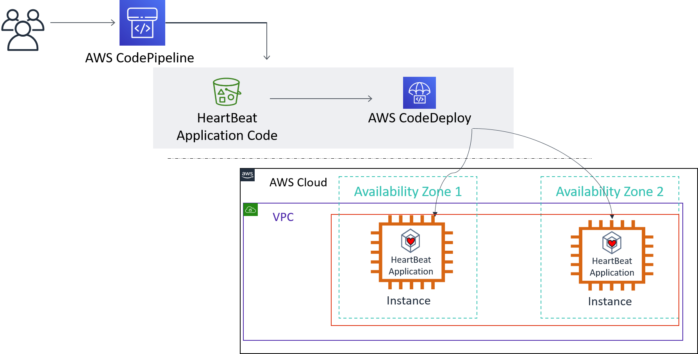
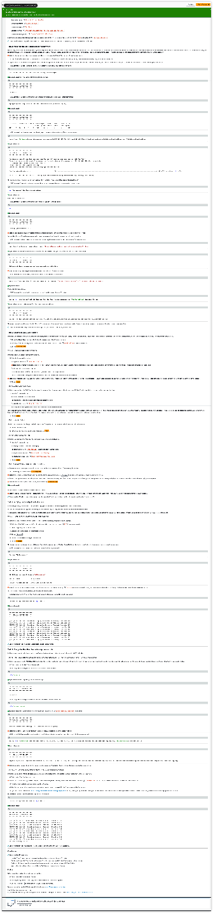

# Lab 3: Automating code deployments using AWS CodePipeline | Self-Paced Labs

Created: 2023-10-07 05:53:18 -0600

Modified: 2023-10-08 10:43:13 -0600

---

Clipped from: <https://labs.skillbuilder.aws/sa/lab/arn%3Aaws%3Alearningcontent%3Aus-east-1%3A470679935125%3Ablueprintversion%2FILT-TF-200-DEVOPS-3%2Flab-3-CodePipeline%3A3.4.5-0ad8f724/en-US/216be875-5650-4bee-975b-e85d4b826416::8Hj8d6EqLogNKSTBc9RTws>

# Lab 3: Automating Code Deployments Using AWS CodePipeline

© 2023 Amazon Web Services, Inc. or its affiliates. All rights reserved. This work may not be reproduced or redistributed, in whole or in part, without prior written permission from Amazon Web Services, Inc. Commercial copying, lending, or selling is prohibited. All trademarks are the property of their owners.

Note: Do not include any personal, identifying, or confidential information into the lab environment. Information entered may be visible to others.

Corrections, feedback, or other questions? Contact us at *[AWS Training and Certification](https://support.aws.amazon.com/#/contacts/aws-training).*

## Lab overview

In this lab, you use AWS CodePipeline with AWS CodeDeploy to deploy a Windows Service application to an Amazon Elastic Compute Cloud (Amazon EC2) Fleet running Windows Server operating system (OS).

In Lab 2 CodeDeploy, you were tasked with setting up a CodeDeploy application and deployment group for a Windows application. Your development team has been using this architecture to deploy the application and subsequent updates to an Amazon Elastic Compute Cloud (Amazon EC2) fleet using the AWS Command Line Interface (AWS CLI) or by using AWS CodeDeploy web console actions. However, the act of deploying code via the AWS CLI or a web console is still a manual process. Being able to programmatically deploy code across a fleet is faster and is less error prone than performing manual deployments to individual instances. In this lab, your task is to further automate this manual deployment done with AWS CodeDeploy by leveraging the AWS CodePipeline service.

### Objectives

By the end of this lab, you will be able to do the following:

- Use AWS Cloud9 to package application code and upload the revision to an Amazon S3 bucket.
- Build a multi-stage AWS CodePipeline with Amazon S3 as the source stage and AWS CodeDeploy as the deployment stage.
- Review the deployment configurations and perform an automatic code deployment using AWS CodeDeploy.
- Verify automatic deployment was successful using AWS Systems Manager Session Manager.

### Technical knowledge prerequisites:

- Experience with basic navigating the AWS Management Console.
- Understand Amazon S3 basic concepts.
- Experience with AWS Cloud9 environment basic usage.

### Duration

This lab requires *50* minutes to complete.

### Icon key

Various icons are used throughout this lab to call attention to different types of instructions and notes. The following list explains the purpose for each icon:

- **Command:** A command that you must run.
- **Expected output:** A sample output that you can use to verify the output of a command or edited file.
- **Note:** A hint, tip, or important guidance.

## Start lab

1.  To launch the lab, at the top of the page, choose Start lab.

You must wait for the provisioned AWS services to be ready before you can continue.

1.  To open the lab, choose Open Console.

You are automatically signed in to the AWS Management Console in a new web browser tab.

**Do not change the Region unless instructed.**

### Common sign-in errors

#### *Error: You must first sign out*

{width="6.5in" height="1.375in"}

If you see the message, **You must first log out before logging into a different AWS account:**

- Choose the **click here** link.
- Close your **Amazon Web Services Sign In** web browser tab and return to your initial lab page.
- Choose Open Console again.

#### *Error: Choosing Start Lab has no effect*

In some cases, certain pop-up or script blocker web browser extensions might prevent the **Start Lab** button from working as intended. If you experience an issue starting the lab:

- Add the lab domain name to your pop-up or script blocker's allow list or turn it off.
- Refresh the page and try again.

### Lab environment

{width="6.5in" height="3.3020833333333335in"}

*The image shows users accessing AWS CodePipeline. The Pipeline pulls the HeartBeat application code and deploys it using AWS CodeDeploy to two EC2 instances in AZ1 and AZ2.*

### AWS Services Not Used in This Lab

AWS services that are not used in this lab are deactivated in the lab environment. In addition, the capabilities of the services used in this lab are limited to what the lab requires. Expect errors when accessing other services or performing actions beyond those provided in this lab guide.

## Task 1: Review AWS CodeDeploy application that is already configured

In this task, you review the AWS CodeDeploy application and group you created in the last lab. The deployment group is mapped to your Amazon EC2 instance fleet with name as **HeartBeat-Instance** as a deployment target.

### Task 1.1: Review the AWS CodeDeploy application

**Note:** Make sure that you are using the AWS Region that matches the **AwsRegionCode** value from the navigation panel to the left of these instructions.

1.  At the top of the AWS Management Console, in the search bar, search for and choose

CodeDeploy

.

2.  In the navigation pane, choose **Applications** under **Deploy CodeDeploy**
3.  Choose the link for **HeartBeatProduction-App** application.
4.  Choose the **Deployment groups** tab.
5.  Choose the link for the deployment group named **HeartBeatProduction-App-Group**.

You can see that this deployment group is configured with the following properties:

- **Application name:**

HeartBeatProduction-App

- **Compute platform:**

EC2/on-premises

- **Deployment type:**

In place

- **Service role ARN:**

arn:aws:iam::AcctNumber:role/CodeDeployServiceRole

- **Deployment configuration:**

CodeDeployDefault.AllAtOnce

Under **Environment configuration: Amazon EC2 instances** you can see that it targets EC2 instances with a **Key** of

Name

and a **Value** of

HeartBeat-Instance

.

**Congratulations!** Now that you have reviewed the CodeDeploy application, you can move on to preparing the application code to be deployed.

## Task 2: Preparing the application code for deployment

For this task, an Amazon Simple Storage Service (Amazon S3) bucket with versioning activated has been provided for you. This bucket is the source location for AWS CodePipeline automated deployments to the EC2 Fleet in later tasks. You store the **HeartBeatProduction-App** object in this Amazon S3 bucket. AWS CodePipeline deploys the object from this Amazon S3 bucket to the target EC2 fleet. Unlike Lab 2 - AWS CodeDeploy, you do not use CodeDeploy directly to complete application deployments. Steps for registering and running the deployment from the command line are no longer necessary.

**Note:** Versioning must be activated on any Amazon S3 bucket that you want AWS CodePipeline to use for code deployments.

1.  Open the **Cloud9** environment by copying the **URL** value to the left of these instructions for the heading reading **Cloud9Environment** and pasting it into a new browser tab.

To populate your AWS Cloud9 file system, you need to download the application bundle from a bucket in your local region. First you need to find what region your Cloud9 environment is running in. Use the EC2 instance metadata service to find it programmatically.

1.  **Command:** Run the command below to view the region in which the Cloud9 instance is running in:

curl <http://169.254.169.254/latest/meta-data/placement/region>

**Expected output:** Your region may differ from what is shown here.

******************************
**** This is OUTPUT ONLY. ****
******************************

us-east-1

1.  **Command:** Run the following command to create a **myRegion** variable to be used in later commands:

myRegion=$(curl <http://169.254.169.254/latest/meta-data/placement/region>)

**Expected output:**

******************************
**** This is OUTPUT ONLY. ****
******************************

% Total % Received % Xferd Average Speed Time Time Time Current
Dload Upload Total Spent Left Speed
100 9 100 9 0 0 750 0 --:--:-- --:--:-- --:--:-- 750

1.  **Command:** Use the variable with the following **wget command** to download the zip file to your environment:

wget <https://$myRegion-tcprod.s3.amazonaws.com/courses/ILT-TF-200-DEVOPS/v3.4.5.prod-727e3603/lab-3-CodePipeline/bundles/CodeDeployHeartbeatDemo.zip> -P CodeDeployHeartbeatDemo

**Expected output:**

******************************
**** This is OUTPUT ONLY. ****
******************************

Resolving us-east-1-tcprod.s3.amazonaws.com (us-east-1-tcprod.s3.amazonaws.com)... 52.217.139.113
Connecting to us-east-1-tcprod.s3.amazonaws.com (us-east-1-tcprod.s3.amazonaws.com)|52.217.139.113|:443... connected.
HTTP request sent, awaiting response... 200 OK
Length: 285048 (278K) [application/zip]
Saving to: 'CodeDeployHeartbeatDemo/CodeDeployHeartbeatDemo.zip'

CodeDeployHeartbeatDemo.zip 100%[===============================================================================================================================>] 278.37K --.-KB/s in 0.01s

2022-02-10 19:23:31 (27.2 MB/s) - 'CodeDeployHeartbeatDemo/CodeDeployHeartbeatDemo.zip' saved [285048/285048]

The application code is now available to you in a zipped file in the folder **~/environment/CodeDeployHeartbeatDemo/**.

1.  **Command:** Change directories to the folder where the application code is copied by running the command below:

cd ~/environment/CodeDeployHeartbeatDemo

**Expected output:**

*None, unless there is an error.*

1.  **Command:** Run the following command to make sure you can see the zipped file:

ls

**Expected output:**

******************************
**** This is OUTPUT ONLY. ****
******************************

CodeDeployHeartbeatDemo.zip

**Note:** The application **CodeDeployHeartbeatDemo.zip** should be returned in the terminal. If it is not, ask a lab instructor for help.

You need the Amazon S3 **application source bucket name** that was provided for you to complete this task and the next task.

1.  **Command:** Find the bucket in your account that contains **applicationsourcebucket** in its name with the following command:

aws s3api list-buckets --output text --query 'Buckets[?contains(Name,`applicationsourcebucket`)].Name'

**Expected output:** Text before and after the **LabApplicationSourceBucket** description may differ from what you see in this example.

******************************
**** This is OUTPUT ONLY. ****
******************************

labstack-dbodmaxc-xanxzrm-applicationsourcebucket-qg4dt3qv4sqw

**Note:** You can verify the **LabApplicationSourceBucket** value to the left of these instructions.

1.  **Command:** Run the following command to create a variable with that bucket name:

myAppSrcBucket=$(aws s3api list-buckets --output text --query 'Buckets[?contains(Name,`applicationsourcebucket`)].Name')

**Expected output:**

*None, unless there is a change.*

1.  **Command:** Run the following command to copy the zipped file to your Amazon S3 bucket:

aws s3 cp ~/environment/CodeDeployHeartbeatDemo/CodeDeployHeartbeatDemo.zip s3://$myAppSrcBucket/HeartBeat-App.zip

**Expected output:** Your bucket name differs from the example shown below.

******************************
**** This is OUTPUT ONLY. ****
******************************

upload: ./CodeDeployHeartbeatDemo.zip to s3://labstack-dbodmaxc-xanxzrm-applicationsourcebucket-qg4dt3qv4sqw/HeartBeat-App.zip

This copies the application files from the AWS Cloud9 IDE environment to the Amazon S3 Application Source bucket. You receive an upload message in the terminal when the command runs successfully.

**Congratulations!** You have uploaded the HeartBeat application, that is used in this lab, to your S3 bucket.

## Task 3: Creating an AWS CodePipeline

In this task, you create an AWS CodePipeline using the deployment group information from AWS CodeDeploy created in an earlier lab. The purpose of this pipeline is to automate the deployment process from Amazon S3 source objects to AWS CodeDeploy deployment group targets.

1.  Choose the **Cloud9 logo** and choose **Go To Your Dashboard** in your Cloud9 browser window.
2.  At the top of the AWS Management Console, in the search bar, search for and choose

CodePipeline

in a new browser tab.

3.  Choose **Create pipeline** .

### Task 3.1 Choose pipeline settings

In this task, follow the steps to configure the pipeline.

1.  Enter the following information:

- For **Pipeline name** enter

HeartBeatPipeline

**Note:** This field names your pipeline. In a real-world scenario, you can have many pipelines at the same time for different purposes, such as beta and gamma environment pipelines. This makes self-describing names for pipelines helpful.

- For **Service role**, choose **New service role**
- For **Role name**, leave the default role name that is generated based on your pipeline name.
- Check the **Allow AWS CodePipeline to create a service role so it can be used with this new pipeline** checkbox.

**Note:** This service role allows AWS CodePipeline to interact with other AWS services on your behalf. For this lab, the IAM service role is generated for you. In a real-world scenario, you might want to create a customized IAM service role that is specific to the source stage and target stage AWS services configured in the pipeline.

### Task 3.2 Add source stage

In this task, you configure the AWS CodePipeline where the source artifacts for deployment are located and how AWS CodePipeline should detect changes to the source pipeline stage.

1.  Make the following selections:

- For **Source provider**, choose **Amazon S3**
- For **Bucket**, choose the one with **applicationsourcebucket** in the name
- For **S3 Object key**, enter

HeartBeat-App.zip

- For **Change detection options**, choose **Amazon CloudWatch Events (recommended)**

This option configures where the pipeline should look for changes to the source, and automatically start deployments in the pipeline when a change is detected. The monitoring detection options are currently either Amazon CloudWatch Events or AWS CodePipeline. In this task, by choosing to detect changes from Amazon CloudWatch Events, AWS CodePipeline and Amazon CloudWatch Events communicate with each other about any changes to the source object in the source pipeline stage.

### Task 3.3: Build stage

This lab does not require a build stage. The build stage is used for application code that requires build processes before deployment.

1.  Choose Skip build stage .
2.  In the dialog box about skipping the build stage, choose Skip .

### Task 3.4 Add deploy stage

In this task, you configure the AWS CodePipeline where the code should be deployed to.

1.  Make the following selections:

- For **Deploy provider**, choose **AWS CodeDeploy**
- For **Region**, enter the

AwsRegionCode

value to the left of the instructions

- For **Application name**, enter

HeartBeatProduction-App

- For **Deployment group**, enter

HeartBeatProduction-App-Group

### Task 3.5 Review AWS CodePipeline settings

In this task, review your settings to ensure that all are correct as described in earlier tasks and finish creating the pipeline.

1.  If the settings are correct, choose Create pipeline .

**Note:** If the settings are different from what was described in the previous tasks, choose **Previous** to go back to the appropriate stage, and correct any errors.

In the AWS CodePipeline console, once the pipeline creates, watch the automatic deployment from the *Source stage* to the *Deploy stage* until it completes. A success message is displayed in the AWS CodePipeline console when the deployment completes.

**Note:** You can force the pipeline to do a deployment by choosing **Release change** .

**Expected output:**

*Success*

*Congratulations! The pipeline HeartBeatPipeline has been created.*

**Note:** You can also watch any individual deployment by choosing *Deploy* in the navigation pane on the left side of the AWS CodeDeploy dashboard, and then *Deployments*. There, you receive a list of all deployments for the AWS account.

**Congratulations!** You have successfully created a pipeline using CodePipeline and deployed the HeartBeat application from the files stored in S3.

## Task 4 Verifying the CodePipeline deployment

In this task, you verify that the AWS CodePipeline has deployed the **HeartBeatProduction-App** code to the EC2 Fleet correctly.

In a previous task, you created a pipeline and configured it to detect changes in the pipeline by monitoring **Amazon CloudWatch Events**.

As the recently added application object in the *Source stage* does not yet exist in the *Deploy stage*, AWS CodePipeline begins a deployment of the application object from the *Source stage* of the pipeline (Amazon S3 bucket) to the *Deployment stage* (EC2 Fleet) of the pipeline.

### Task 4.1: Verify the HeartBeat-App deployment

To confirm that the software deployment of the Heartbeat service succeeded, complete the following steps.

1.  At the top of the AWS Management Console, in the search bar, search for and choose

EC2

in a new browser tab.

2.  In the navigation pane, choose **Instances**.
3.  Select one of the instances named **Heartbeat-Instance**.
4.  Choose Connect .
5.  Confirm that the **Session Manager** tab is selected.
6.  Choose Connect .

The browser opens a new browser tab and a **Windows PowerShell** session opens. Use **Windows PowerShell** to verify that the HeartBeat service is running as expected after the deployment.

1.  **Command:** In the Windows PowerShell session, enter the following command:

Service "AWSHeartbeat*"

**Expected output:**

******************************
**** This is OUTPUT ONLY. ****
******************************

PS C:Windowssystem32> Service "AWSHeartbeat*"

Status Name DisplayName
------ ---- -----------
Running AWSHeartbeatSer... AWS Heartbeat Demo Service

**Note:** If the expected output is not returned, rerun the command without the filter. Running

Service

command returns all running services sorted alphabetically. Scroll through the list of services to find the **AWSHeartbeat** service.

To view that the service is running correctly, you must review the log output.

1.  **Command:** In the Windows PowerShell session, enter the following command to view the log output:

Content C:LogsHeartBeatService.log -last 10

**Expected output:**

******************************
**** This is OUTPUT ONLY. ****
******************************

[INFO]08/31 17:33:34 - Heartbeat - Deploy has Worked on Tuesday! Iteration 825
[INFO]08/31 17:33:35 - Heartbeat - Deploy has Worked on Tuesday! Iteration 826
[INFO]08/31 17:33:36 - Heartbeat - Deploy has Worked on Tuesday! Iteration 827
[INFO]08/31 17:33:37 - Heartbeat - Deploy has Worked on Tuesday! Iteration 828
[INFO]08/31 17:33:38 - Heartbeat - Deploy has Worked on Tuesday! Iteration 829
[INFO]08/31 17:33:39 - Heartbeat - Deploy has Worked on Tuesday! Iteration 830
[INFO]08/31 17:33:40 - Heartbeat - Deploy has Worked on Tuesday! Iteration 831
[INFO]08/31 17:33:41 - Heartbeat - Deploy has Worked on Tuesday! Iteration 832
[INFO]08/31 17:33:42 - Heartbeat - Deploy has Worked on Tuesday! Iteration 833
[INFO]08/31 17:33:43 - Heartbeat - Deploy has Worked on Tuesday! Iteration 834

**Congratulations!** You have verified the **HeartBeat** application is functional.

## Task 5: Change the HeartBeatProduction-App source code

In this task, you simulate code changes to the HeartBeat application and observe the automatic deployment in AWS CodePipeline.

### Task 5.1 Retrieve the updated application and upload it to the Amazon S3 application source bucket

In this task, you connect to the **AWS Cloud9 IDE** and replace the Heartbeat application code to the source S3 bucket. To simplify things, the new source code with a small change has already been bundled for you. The new code change should print ***Heartbeat Service - Updated!!!*** as an output to the log.

1.  Switch to the **Lab 3 - AWS Cloud9 browser tab**.
2.  Verify that the **myRegion** variable is still active with the command below:

echo $myRegion

**Expected output:** Your region may differ from this example.

******************************
**** This is OUTPUT ONLY. ****
******************************

us-east-1

1.  Verify that the **myAppSrcBucket** variable is still active with the command below:

echo $myAppSrcBucket

**Expected output:** Your bucket name differs from below but should contain

applicationsourcebucket

in the name.

******************************
**** This is OUTPUT ONLY. ****
******************************

labstack-dbodmaxc-xanxzrm-applicationsourcebucket-qg4dt3qv4sqw

**Note:** If either of these variables do not return the expected result, recreate them with the steps in **Task 2**.

1.  Use the **S3 CP command** to copy the updated HeartBeat application to the pipeline's source bucket with the following command:

aws s3 cp s3://$myRegion-tcprod/courses/ILT-TF-200-DEVOPS/v3.4.5.prod-727e3603/lab-3-CodePipeline/bundles/updated-HeartBeat-App.zip s3://$myAppSrcBucket/HeartBeat-App.zip

**Expected output:**

******************************
**** This is OUTPUT ONLY. ****
******************************

copy: s3://us-west-2-tcprod/courses/ILT-TF-200-DEVOPS/v3.1.9.dev-40279795/lab-3-CodePipeline/bundles/updated-HeartBeat-App.zip to s3://labstack-dbodmaxc-wdtfrun-applicationsourcebucket-1018ppe2ktm83/HeartBeat-App.zip

**Note:** Copying the new code bundle to the source bucket is an **Amazon CloudWatch Event**, so it should **trigger** your **pipeline** automatically.

### Task 5.2 Watch the Deployment from AWS CodePipeline console

In this task, you go to the **AWS CodePipeline console** and watch the deployment of the updated HeartBeat application to the target EC2 fleet.

1.  Switch to the **CodePipeline** browser tab.

**Note:** If it was closed, from any browser tab opened to the **AWS Management Console**, use the **AWS search bar** to search for

CodePipeline

and then choose the service from the list of results in a new browser tab.

1.  From the list of available pipelines, choose **HeartBeatPipeline**.
2.  The pipeline updates with a new deployment timestamp next to the word *succeeded* for the *Source stage*, and the *Deploy stage*.
3.  *Optional* as in the previous task **[Task 4.1: Verify the HeartBeatProduction-App deployment](https://labs.skillbuilder.aws/sa/lab/arn:aws:learningcontent:us-east-1:470679935125:blueprintversion/ILT-TF-200-DEVOPS-3/lab-3-CodePipeline:3.4.5-0ad8f724/en-US/216be875-5650-4bee-975b-e85d4b826416::8Hj8d6EqLogNKSTBc9RTws#Task41), you may once again log into one of the target EC2 instances and check the HeartBeat service log for recent entries on the service restarting as verification that the deployment was successful.**

**Command:** Run the following command to pull details from the log:

Content C:LogsHeartBeatService.log -last 10

**Expected output:**

******************************
**** This is OUTPUT ONLY. ****
******************************

[INFO]02/11 17:38:53 - Heartbeat Service - Updated!!! Iteration 530
[INFO]02/11 17:38:54 - Heartbeat Service - Updated!!! Iteration 531
[INFO]02/11 17:38:55 - Heartbeat Service - Updated!!! Iteration 532
[INFO]02/11 17:38:56 - Heartbeat Service - Updated!!! Iteration 533
[INFO]02/11 17:38:57 - Heartbeat Service - Updated!!! Iteration 534
[INFO]02/11 17:38:58 - Heartbeat Service - Updated!!! Iteration 535
[INFO]02/11 17:38:59 - Heartbeat Service - Updated!!! Iteration 536
[INFO]02/11 17:39:00 - Heartbeat Service - Updated!!! Iteration 537
[INFO]02/11 17:39:01 - Heartbeat Service - Updated!!! Iteration 538
[INFO]02/11 17:39:02 - Heartbeat Service - Updated!!! Iteration 539
PS C:Windowssystem32>

**Congratulations!** You have updated the HeartBeat application and verified the update was successful.

## Conclusion

**Congratulations!** You can now:

- Use AWS Cloud9 to package application code and upload the revision to an Amazon S3 bucket.
- Build a multi-stage AWS CodePipeline with Amazon S3 as the source stage and AWS CodeDeploy as the deployment stage.
- Review the deployment configurations and perform an automatic code deployment using AWS CodeDeploy.
- Verify automatic deployment was successful using AWS Systems Manager Session Manager.

## End lab

Follow these steps to close the console and end your lab.

1.  Return to the **AWS Management Console**.
2.  At the upper-right corner of the page, choose **AWSLabsUser**, and then choose **Sign out**.
3.  Choose End lab and then confirm that you want to end your lab.

For more information about AWS Training and Certification, see *<https://aws.amazon.com/training/>.*

*Your feedback is welcome and appreciated.*
*If you would like to share any feedback, suggestions, or corrections, please provide the details in our [AWS Training and Certification Contact Form](https://support.aws.amazon.com/#/contacts/aws-training).*

{width="1.5208333333333333in" height="6.5in"}

