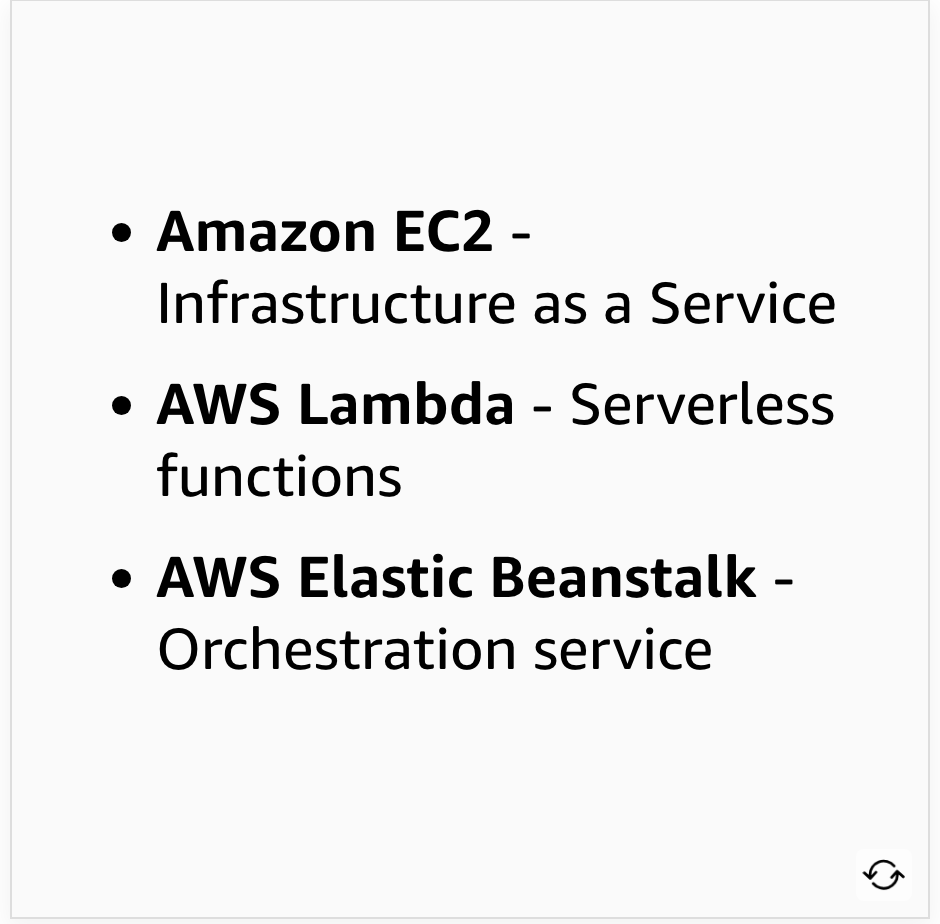
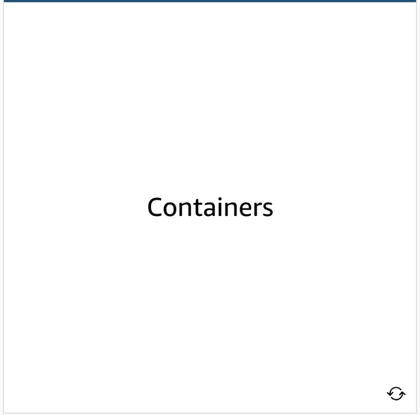
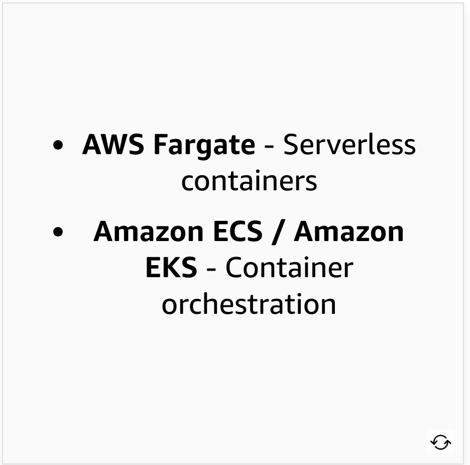
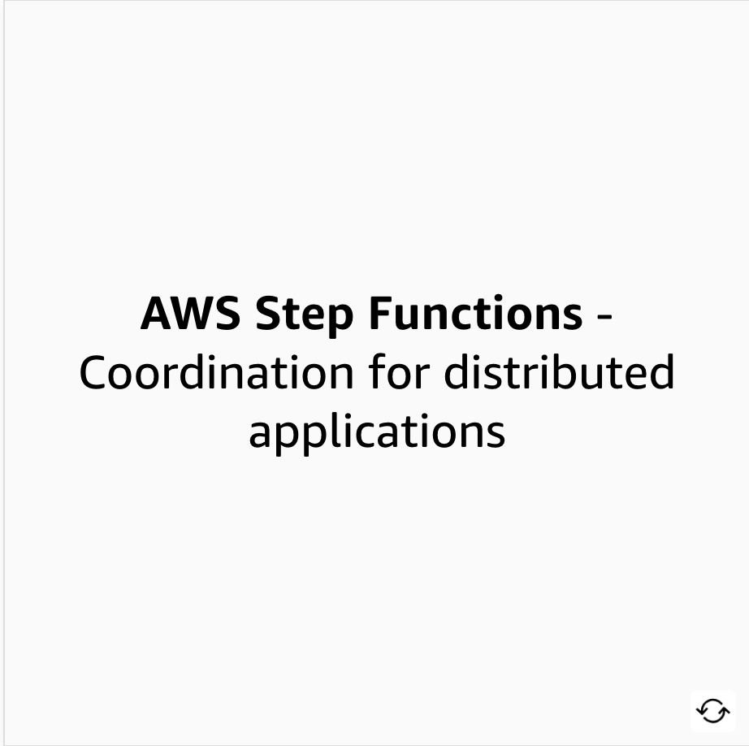
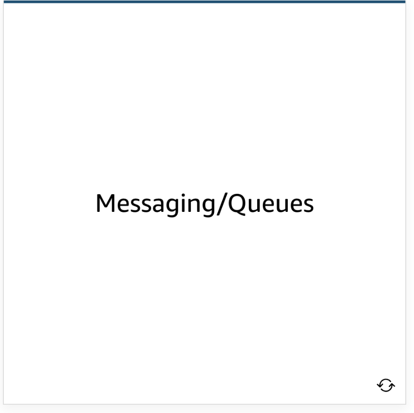
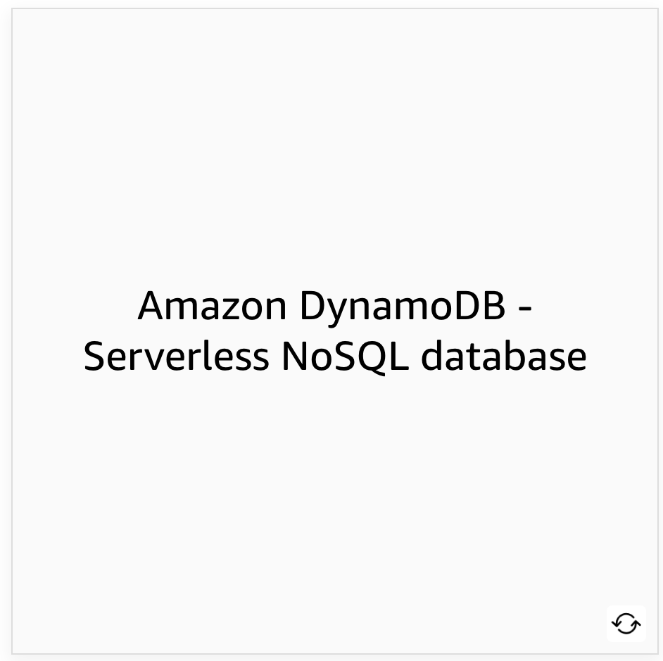
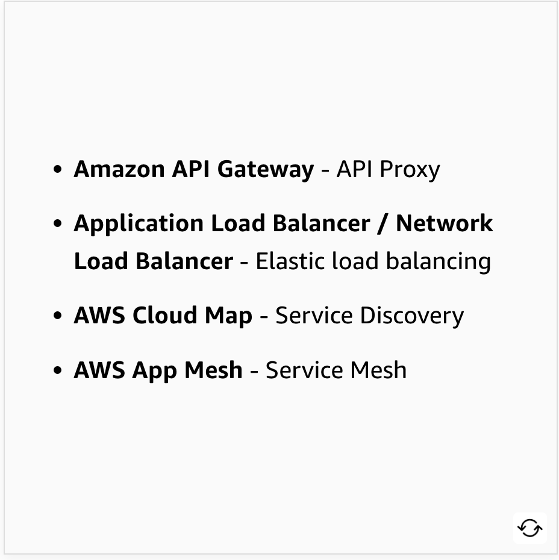

# 20 Introduction to Microservices

Created: 2023-10-08 15:29:08 -0600

Modified: 2023-10-22 17:42:06 -0600

---

Summary

The text delves into the concept of microservices, emphasizing their benefits, characteristics, and the transition from monolithic to microservice architectures, while also highlighting the importance of automation, decentralization, and the role of APIs in microservice communication.

Facts

- Microservices represent the smallest parts of an application, functioning like an assembly line.
- They are defined as small, language-agnostic independent services that operate over well-defined APIs.
- Microservices are like black boxes: they take input, process it, and produce output without revealing the internal workings.
- They are beneficial for DevOps pipelines due to their small size and clear ownership.
- Monolithic applications face challenges in scaling and deployment, whereas microservices alleviate these issues.
- Microservices are decentralized, fail independently, and are automated for deployment.
- Transitioning from monolithic to microservice architectures should start small and simple to avoid overwhelming the process.
- AWS offers various services, such as Elastic Beanstalk, SNS, SQS, and managed databases, to support microservice architectures.
- APIs play a crucial role in microservices, allowing for rapid changes without affecting end users.

{width="5.0in" height="1.7708333333333333in"}

{width="5.0in" height="3.423611111111111in"}

{width="5.0in" height="1.9166666666666667in"}

{width="5.0in" height="3.2291666666666665in"}

![Each service can independently scale to meet application demand. Enables rapid build/test/release cycles as it does not impact entire architecture. Microservices enable CI/CD. The low cost of failure enables experimentation and rollback in case of failure. Fosters an organization of small, independent teams that take the ownership of their services. Teams can act within a small well understood context and are empowered to work quickly and move independently Service independence increases an application's resistance to failure ](../../../media/AWS-DevOps-Module-5-20-Introduction-to-Microservices-image5.png){width="5.0in" height="3.326388888888889in"}

![APIs are the frontdoor of microservices APIs are set of tools, features, or data that allows the creation of a process, service or application that can assist you with microservices. APIs serve as the entry point for the application's logic behind a set of programmatic interfaces. The API accepts and processes calls from clients and might implement functionality such as traffic management, request filtering, routing, caching, authentication, and authorization. Developing microservices using AWS Microservice architecture is supported through various AWS services. To learn more about each type of AWS services flip the card. ](../../../media/AWS-DevOps-Module-5-20-Introduction-to-Microservices-image6.png){width="5.0in" height="3.3333333333333335in"}

{width="5.0in" height="4.875in"}

{width="5.0in" height="4.902777777777778in"}

{width="5.0in" height="4.9375in"}

{width="5.0in" height="4.9375in"}

{width="5.0in" height="4.9375in"}

{width="5.0in" height="4.965277777777778in"}

{width="5.0in" height="4.965277777777778in"}

{width="5.0in" height="5.0in"}

{width="5.0in" height="4.9375in"}

{width="5.0in" height="4.979166666666667in"}

{width="5.0in" height="4.965277777777778in"}

{width="5.0in" height="5.006944444444445in"}

