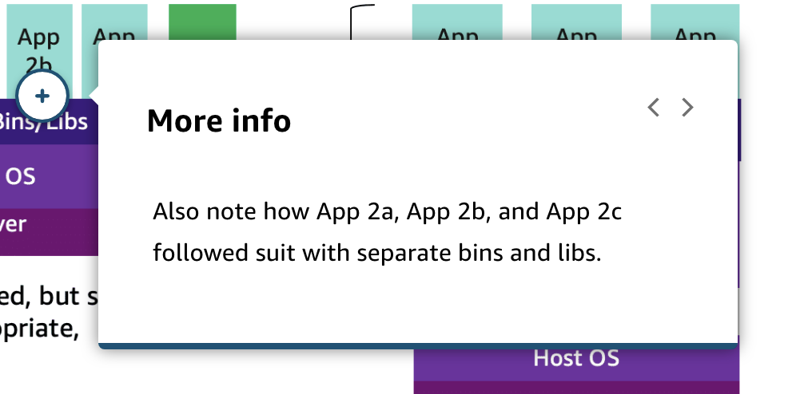
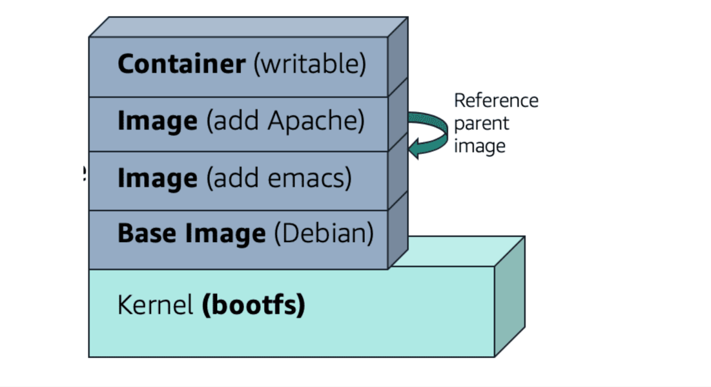
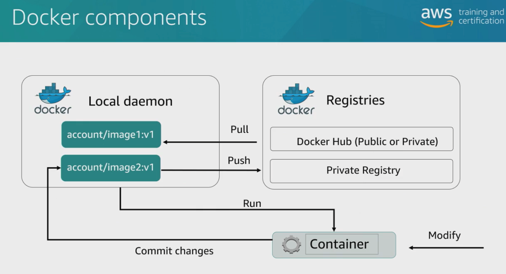

# 21 Deploying Applications with Docker

Created: 2023-10-08 15:50:51 -0600

Modified: 2023-10-22 17:42:12 -0600

---

Summary

The text provides an in-depth exploration of containers, emphasizing their functionality, benefits, and integration with AWS services, particularly focusing on Docker and the Elastic Container Service (ECS).

Facts

- Containers are often likened to very small virtual machines, containing only the essentials like code, dependencies, and configurations.
- Containers can be moved to any location, utilizing the host's CPU and RAM.
- The process of using a container involves building an image, which contains all necessary components, and then running it.
- Docker has popularized the use of containers, allowing them to run on various architectures.
- Docker images are made up of layers, and each command in a Docker file adds a layer.
- Images can be labeled or tagged for easy identification and version control.
- Best practices for Docker include keeping images minimal and using a .dockerignore file to exclude unnecessary content.
- Docker can be integrated into a CI/CD workflow, where base images are built by DevOps teams and developers add their layers.
- Managing a large number of containers can be challenging, which is where AWS's Elastic Container Service (ECS) comes in.
- ECS and the Elastic Kubernetes Service (EKS) are AWS services designed to manage container fleets.
- Containers can run on traditional EC2 architecture or use Fargate for a serverless option.
- Amazon's Elastic Container Registry (ECR) provides a private registry for hosting container images.

{width="10.083333333333334in" height="4.15625in"}

![Configuration Key concepts and topics Review the content below to reinforce some of the key concepts and topics presented to you in the video above. What are containers? 111b Code Dependencies (environmental consistency) Runtime engine Containers are a method of operating system virtualization that enables you to run an application and its dependencies in resource-isolated processes. Using containers, you can easily package an application's code, configurations, such as environmental settings, and dependencies into easy- to-use building blocks that deliver environmental consistency, operational efficiency, developer productivity, and version control. ](../../../media/AWS-DevOps-Module-6-21-Deploying-Applications-with-Docker-image2.png){width="10.083333333333334in" height="5.979166666666667in"}

![Containers vs Virtual machines When hearing about the capabilities of containers, it is intuitive to think that it sounds similar to a virtual machine (VM). However, the differences are in the details. The main difference is the lacl< of a hypervisor requirement. Containers can run on any Linux system with appropriate kernel feature support and the Docker daemon present. This makes them portable. Your laptop, your VM, your Amazon Elastic Compute Cloud (Amazon EC2) instance, and your bare metal server are all potential hosts. The lack of a hypervisor requirement also results in almost no noticeable performance overhead. The processes are communicating directly to the kernel and are largely unaware of their container silo. Most containers boot in only a couple of seconds. To learn more, choose each hotspot. ](../../../media/AWS-DevOps-Module-6-21-Deploying-Applications-with-Docker-image3.png){width="10.083333333333334in" height="5.895833333333333in"}

{width="10.083333333333334in" height="4.71875in"}

{width="10.083333333333334in" height="5.25in"}

{width="10.083333333333334in" height="4.947916666666667in"}

![What is Docker? Docker is a software platform that you can use to build, test, and deploy applications quickly. Docker packages software into standardized units called containers that have everything the software needs to run, including libraries, system tools, code, and runtime. Using Docker, you can quickly deploy and scale applications into any environment and know that your code will run. By using containers, you decouple applications from operating systems. The Docker CLI makes using containers easy, with commands like Docker run. You can use Docker images to define what runs in a container and versions the entire application. These concepts enable automation: You can define your application, build and share the image, and deploy that image. ](../../../media/AWS-DevOps-Module-6-21-Deploying-Applications-with-Docker-image7.png){width="10.083333333333334in" height="5.302083333333333in"}

{width="10.083333333333334in" height="5.552083333333333in"}

{width="10.083333333333334in" height="4.989583333333333in"}

{width="10.083333333333334in" height="5.510416666666667in"}

{width="10.083333333333334in" height="6.177083333333333in"}

what the relationship between docker and continer?

![Summary Docker is a platform that utilizes container technology to package, distribute, and run applications consistently across different environments. Facts • Containers are lightweight, standalone, executable software packages that encapsulate an application, its dependencies, libraries, and runtime in a consistent environment. This ensures that the application runs uniformly, regardless of where the container is deployed. Docker is a tool designed to facilitate the creation, deployment, and execution of applications using containers. It provides a comprehensive ecosystem around container management. • Docker uses its own containerization technology but is often used synonymously with containers due to its popularity and widespread adoption. • The Docker Engine is responsible for running containers. It takes the container images (created from Dockerfiles) and instantiates them as containers. Docker Hub is a registry service where users can share and pull container images, further emphasizing Docker's role in the container ecosystem. • While Docker is one of the most popular container platforms, there are others like Podman, rkt, and LXC. However, Docker's user-friendly CLI, API, and extensive documentation have made it a go-to choice for many developers and operations teams. G Rege ](../../../media/AWS-DevOps-Module-6-21-Deploying-Applications-with-Docker-image12.png){width="10.083333333333334in" height="9.114583333333334in"}

{width="10.083333333333334in" height="3.6979166666666665in"}

