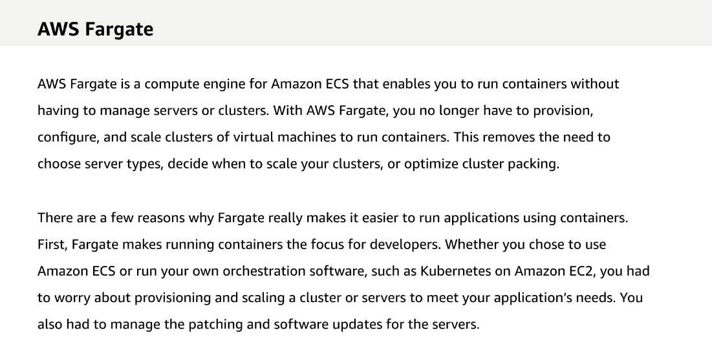

# 22 Amazon Elastic Container Service and AWS Fargate

Created: 2023-10-08 15:55:39 -0600

Modified: 2023-10-22 17:42:14 -0600

---

Summary

The text delves into the functionalities of Amazon's Elastic Container Service (ECS) and Fargate, highlighting their capabilities in managing and running containers, ensuring security, and integrating with other AWS services.

Facts

- ECS addresses challenges related to managing multiple containers, such as resource allocation and failure recovery.

- {width="5.0in" height="2.7152777777777777in"}
- Fargate offers a serverless environment for running containers, eliminating the need to manage EC2 instances.

- {width="5.0in" height="2.8333333333333335in"}
- Containers in Fargate can be placed inside a VPC, assigned a private IP, and be put behind load balancers.
- In terms of security with Fargate, Amazon manages the infrastructure while users control the container and its tasks.
- ECS offers two launch options: the traditional EC2 instance or the serverless Fargate.
- Task definitions in ECS specify the container's requirements, image, CPU, RAM, and roles.

{width="5.0in" height="2.7152777777777777in"}

- ECS tasks can be assigned specific roles, ensuring that permissions are container-specific and not tied to the EC2 instance.
- ECS integrates with other AWS services, allowing for a workflow where Docker files are built, images are stored in ECR, and tasks are placed on EC2 instances.
- ECS offers flexibility in scheduling tasks, allowing users to decide when, where, and on what platform (EC2 or Fargate) a task will run.
- Task placement in ECS considers cluster constraints, custom constraints, and placement strategies (spread or bin pack).
- ECS supports both short-lived tasks and long-running applications, with the latter being scalable based on demand.
- AWS provides APIs for ECS, enabling users to create custom schedulers and integrate with other AWS services like Lambda, Elasticsearch, and SNS.

![Key concepts and topics Review the content below to reinforce some of the key concepts and topics presented to you in the video above. Amazon Elastic Container Service Amazon Elastic Container Service (Amazon ECS) is a highly scalable, high-performance container management service that supports Docker containers. Use Amazon ECS to easily run applications on a managed cluster of Amazon EC2 instances. It is extensible through API. Amazon ECS is a scalable cluster service for: • Hosting containers that can scale up to thousands of instances • Monitoring the deployment of containers and managing the complete state of clusters. Clusters can use Spot Instances and Reserve Instances • Scheduling containers using built-in scheduler or a third-party scheduler (for example, Apache Mesos, Blox) ](../../../media/AWS-DevOps-Module-6-22-Amazon-Elastic-Container-Service-and-AWS-Fargate-image4.png){width="5.0in" height="3.6666666666666665in"}

{width="5.0in" height="1.8819444444444444in"}

{width="5.0in" height="2.5in"}

{width="5.0in" height="2.2083333333333335in"}

{width="5.0in" height="3.125in"}

![Tasks and services Let's review tasks. Tasks are the atomic unit of deployment within Amazon ECS. Tasks are made up of one or more tightly coupled containers. A task may run standalone, or it may be part of a service. A service is an abstraction on top of a task. A service runs a specified number of tasks and can include a load balancer to distribute traffic across the tasks that are associated with the service. If any of your tasks should fail or stop, the service scheduler launches another instance of your tasl< to replace it, and maintains the specified number of tasks. On-dem workloads Task Managed by ECS task scheduler Run once or at intervals More effective for batch jobs ing applications Long- Service Task Task Application Load Balancer • Managed by Amazon ECS service scheduler Scale out and in ](../../../media/AWS-DevOps-Module-6-22-Amazon-Elastic-Container-Service-and-AWS-Fargate-image9.png){width="5.0in" height="3.8958333333333335in"}

{width="5.0in" height="2.673611111111111in"}

{width="5.0in" height="2.2291666666666665in"}

{width="5.0in" height="3.4444444444444446in"}

{width="5.0in" height="2.6458333333333335in"}

{width="5.0in" height="3.4444444444444446in"}

{width="5.0in" height="2.6458333333333335in"}

{width="5.0in" height="2.826388888888889in"}

