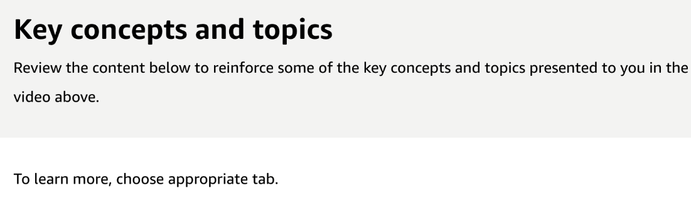
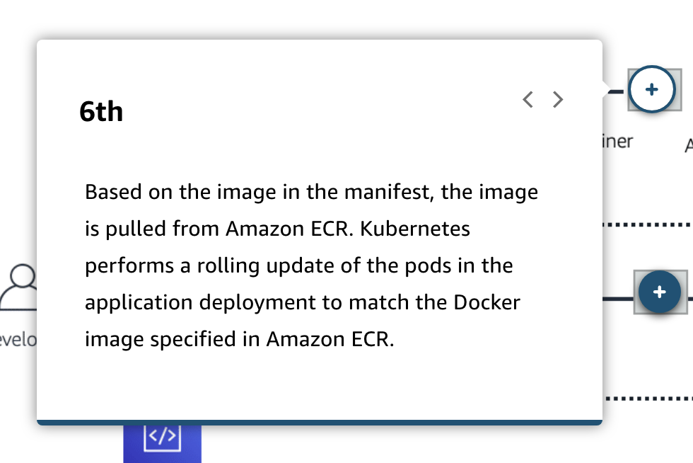
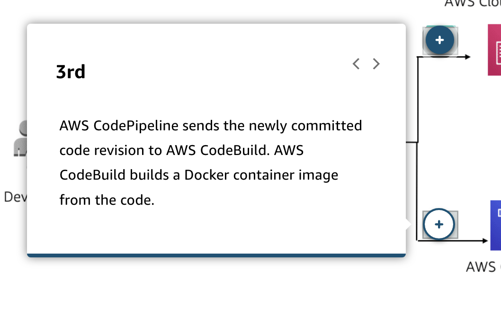
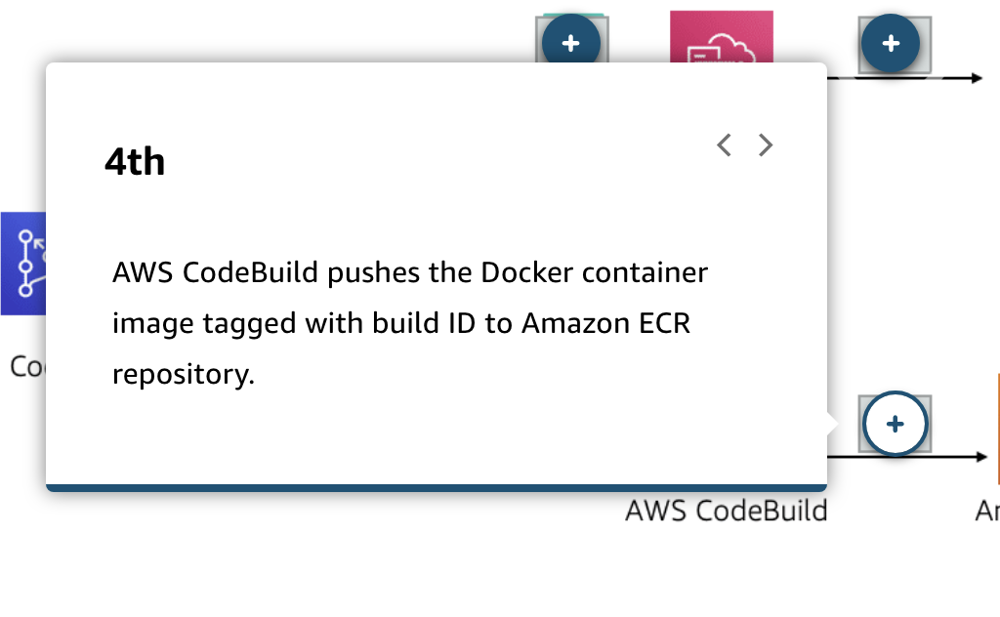
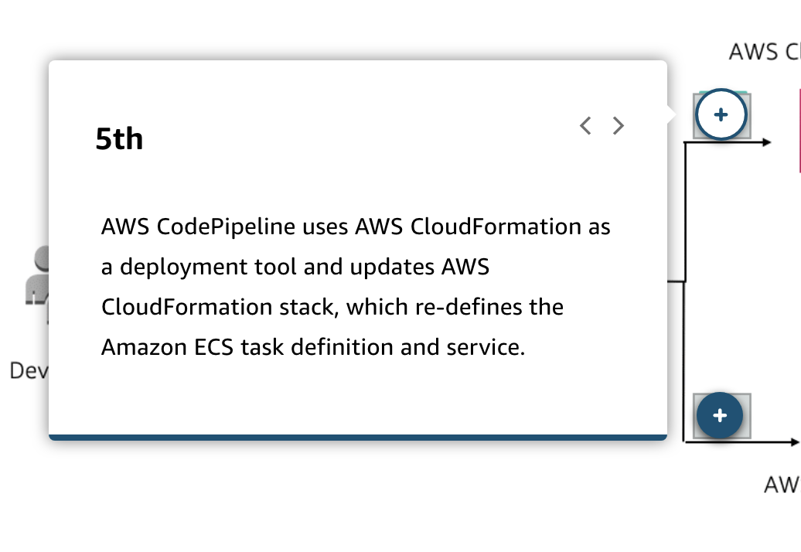
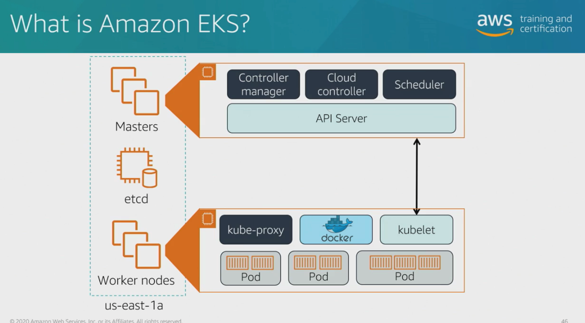

# 23 Amazon Elastic Container Registry and Amazon Elastic Kubernetes Service

---

![Now, we're gonna want to integrate this in with our CI/CD pipeline, and we can do so, in this example, through the use of Jenkins handling those build processes. We're gonna install our Docker plug-ins into our Jenkins build environment, I run, not my buildspec file, but the same sort of set of instructions to run my Docker build command to build that image, and then I have to authenticate Jenkins to either push that image into ECR, into Docker Hub or into a private repo that you're hosting, potentially on-premise. In this diagram, we can see our continuous integration server performing a rolling update inside of ECS. We'll get more into our updating options a little bit later on when we talk about deployments. But the continuous integration server will first go through and generate a new task definition or a new version of that task and update that service to reflect that new version, placing that new task behind our Elastic Load Balancer. ](../../../media/AWS-DevOps-Module-6-23-Amazon-Elastic-Container-Registry-and-Amazon-Elastic-Kubernetes-Service-image2.png)

![Video Transcript The Amazon Elastic Kubernetes Service, or shorthand, EKS, is a managed version of Kubernetes. Now, Kubernetes started as a Google application and has since been open sourced by our good friends over there. It allows us an alternative way to schedule and run containers inside of our environment. Now, let's take a look at a diagram here that really specifies what EKS is. Here we see a diagram of EKS. We see some new terms that we haven't covered before. They're specific to Kubernetes. I have my master nodes up there in the corner. They are publishing out that API that I can then hit to schedule containers to run on those worker nodes. Containers are grouped together in pods, pods are placed on those worker nodes, and are run effectively, giving me that same kind of environment that we talked about building out a minute ago with ECS. At the end of the day, ECS and EKS are two different ways to effectively get to the same point. It's whether you wanna run that open source Kubernetes application, or you want to consume and utilize our ECS scheduler. EKS can play a similar role inside of our pipeline here. Instead of publishing into ECS, I'm building my image, I'm hosting it inside of ECR, and part of my deployment process includes a Lambda function that reaches out to tell Kubernetes, "Hey, we've got a new image that we need to run. Let's update that pod to run on EKS and serve out that content to our end users." This is a similar diagram, now utilizing ECS inside of our pipeline. The same process applies. I build my image, I deploy the image into ECR. Now, from here, instead of going straight into ECS, as I did in my demonstration, we're going to CloudFormation and to tell CloudFormation to update our ECS environment. Now, why are we using CloudFormation here? Well, if we've templatized everything in CloudFormation, I can easily pick this content up and run it anywhere I want because I followed that best practice principle of infrastructure as code. ](../../../media/AWS-DevOps-Module-6-23-Amazon-Elastic-Container-Registry-and-Amazon-Elastic-Kubernetes-Service-image3.png)

![AMAZON ECR AMAZON ELASTIC KUBERNETES Amazon Elastic Container Registry (Amazon ECR) is a managed AWS Docker registry service that is secure, scalable, and reliable. Amazon ECR supports private Docker repositories with resource- based permissions. It uses AWS Identity and Access Management (IAM) so that specific users or Amazon EC2 instances can access repositories and images. Developers can use the Docker CLI to push, pull, and manage images. Write code Write and package code as a Docker image Amazon ECR O Compress, encrypt, and control access to images o Version, tag, and manage image lifecycles Run containers Pull image and run containers anywhere Amazon ECS Amazon EKS AWS Cloud On-premises ](../../../media/AWS-DevOps-Module-6-23-Amazon-Elastic-Container-Registry-and-Amazon-Elastic-Kubernetes-Service-image7.png)

![AMAZON ECR AMAZON ELASTIC KUBERNETES Amazon Elastic Kubernetes Service (Amazon EKS) is a managed service that you can use to run Kubernetes on AWS without needing to install and operate your own Kubernetes clusters. Challenges with Kubernetes Kubernetes is an open-source system for automating the deployment, scaling, and management of containerized applications. Operating Kubernetes for production applications presents a number of challenges: • You must manage the scaling and availability of your Kubernetes masters and persistence layer by ensuring that you have chosen appropriate instance types, ran them across multiple Availability Zones, monitored their health, and replaced unhealthy nodes. • You need to patch and upgrade your masters and worker nodes to provide that you are running the latest version of Kubernetes. This all requires expertise and a lot of manual work. Amazon Elastic Kubernetes Service With Amazon EKS, upgrades and high availability are managed for you by AWS. Amazon EKS runs three Kubernetes masters across three Availability Zones to provide high availability. Amazon EKS automatically detects and replaces unhealthy masters, and it provides automated version upgrades and patching for the masters. ](../../../media/AWS-DevOps-Module-6-23-Amazon-Elastic-Container-Registry-and-Amazon-Elastic-Kubernetes-Service-image8.png)

