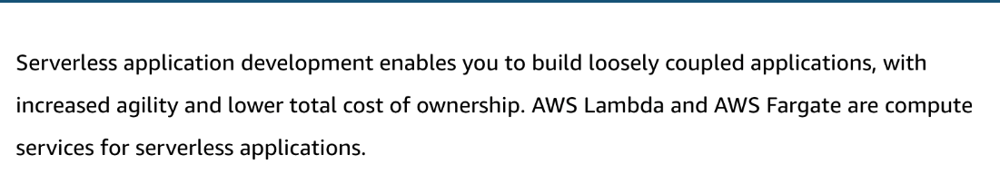

# 24 AWS Lambda and AWS Fargate

Created: 2023-10-08 11:20:33 -0600

Modified: 2023-10-22 17:42:22 -0600

---

Summary

Serverless computing, exemplified by AWS services like Lambda and Fargate, allows developers to focus on code while AWS manages the underlying infrastructure. This approach simplifies tasks such as scaling, maintenance, and patching, and integrates seamlessly with various AWS services and tools.

Facts

- Serverless Computing: Developers only focus on code; AWS manages the infrastructure.
- Lambda:
  - Does not require managing the OS or physical hardware.
  - Automatically scales based on the number of incoming requests.
  - Functions are short-lived, with a maximum execution time of 15 minutes.
  - Supports multiple runtimes including NodeJS, Python, Java, and more.
  - Functions are triggered by events, and AWS provides built-in monitoring via CloudWatch.
  - Lambda functions require permissions to be triggered and to interact with other AWS services.
  - Two invocation patterns: push (event-driven) and pull (Lambda polls a data source).
- Fargate:
  - Offers serverless compute for containers.
  - Suitable for longer-running tasks compared to Lambda.
  - Works in conjunction with other AWS services for tasks like storing code and building images.
- Serverless Application Model (SAM): A tool for building serverless applications, featuring a simplified template syntax.
- Serverless Storage and Communication: AWS offers services like API Gateway, AppSync, SQS, and SNS to facilitate storage and communication in a serverless architecture.
- Developer Tooling: AWS provides tools like Cloud9 and plugins for IDEs to aid in the development of serverless applications.
- Lambda Function Components:
  - Function: The actual resource running the code.
  - Runtime: The environment in which the code runs.
  - Event: The JSON document passed into the Lambda function.
  - Concurrency: Number of functions running in parallel.
  - Trigger: What initiates the Lambda function.
  - Layers: Reusable pieces of code or data.
- Use Cases: Lambda can be used for data processing, IoT architectures, IT automation, and more.

- {width="5.0in" height="2.826388888888889in"}

- CI/CD with Serverless: Serverless integrates with CI/CD pipelines, allowing for efficient code testing, building, and deployment.

{width="5.0in" height="0.9236111111111112in"}

![Key concepts and topics Review the content below to reinforce some of the key concepts and topics presented to you in the video above. Why serverless? Serverless enables you to build modern applications with increased agility and lower total cost of ownership. Building serverless applications means that your developers can focus on their core product. They don't have to worry about managing and operating servers or runtimes, either in the cloud or on premises. This reduced overhead lets developers reclaim time and energy that can be spent on developing products that scale and are reliable. Another advantage, is the ability to bring your own code. ](../../../media/AWS-DevOps-Module-7-24-AWS-Lambda-and-AWS-Fargate-image3.png){width="5.0in" height="2.6944444444444446in"}

{width="5.0in" height="2.7083333333333335in"}

![AWS Lambda AWS Lambda is the compute service for serverless. You can run code without servers, it triggers based on events that you configure, and it scales automatically based on demand. Lambda also incorporates built-in Amazon CloudWatch for monitoring and logging, so you have key metrics readily available. Lambda is closely integrated with other AWS services. From within your Lambda function, you can do anything your traditional application can do, including calling an AWS SDK or invoking a third- party API, whether on AWS, in your data center, or on the internet. Lambda's permissions model uses AWS Identity and Access Management (IAM) to securely grant access to AWS resources and give you fine-grained control for invoking your functions. Because Lambda is a fully managed service, high availability and fault tolerance are built into the service without any additional configuration on your part. ](../../../media/AWS-DevOps-Module-7-24-AWS-Lambda-and-AWS-Fargate-image5.png){width="5.0in" height="3.2083333333333335in"}

![Key terms for AWS Lambda Function A function is a resource that you can invoke to run your code in AWS Lambda. Runtime Lambda runtimes allow functions in different languages to run in the same base runtime environment. You configure your function to use a runtime that matches your programming language. The runtime sits between the Lambda service and your function code, relaying invocation events, context information, and responses between the two. You can use runtimes provided by Lambda, or build your own. ](../../../media/AWS-DevOps-Module-7-24-AWS-Lambda-and-AWS-Fargate-image6.png){width="5.0in" height="3.423611111111111in"}

![Event An event is a JSON formatted document that contains data for a function to process. The Lambda runtime converts the event to an object and passes it to your function code. When you invoke a function, you determine the structure and contents of the event. When an AWS service invokes your function, the service defines the event. Concurrency Concurrency is the number of requests that your function is serving at any given time. When your function is invoked, Lambda provisions an instance of it to process the event. When the function code finishes running, it can handle another request. If the function is invoked again while a request is still being processed, another instance is provisioned, increasing the function's concurrency. ](../../../media/AWS-DevOps-Module-7-24-AWS-Lambda-and-AWS-Fargate-image7.png){width="5.0in" height="3.5277777777777777in"}

![Layers You can configure your Lambda function to pull in additional code and content in the form of layers. A layer is a ZIP archive that contains libraries, a custom runtime, or other dependencies. With layers, you can use libraries in your function without needing to include them in your deployment package. Trigger A trigger is a resource or configuration that invokes a Lambda function. This includes AWS services that can be configured to invoke a function, applications that you develop, and event source mappings. ](../../../media/AWS-DevOps-Module-7-24-AWS-Lambda-and-AWS-Fargate-image8.png){width="5.0in" height="3.2916666666666665in"}

![Common use cases Data processing: You can use AWS Lambda to run code in response to triggers, such as changes in data, shifts in system state, or user actions. Lambda can be directly triggered by AWS services, such as Amazon S3, Amazon DynamoDB, Amazon Kinesis, Amazon Simple Notification Service (Amazon SNS), and Amazon CloudWatch, or it can be orchestrated into workflows by AWS Step Functions. This enables you to build a variety of real-time serverless data processing systems. Real-time stream processing: You can use AWS Lambda and Amazon Kinesis to process real-time streaming data for application activity tracking, transaction order processing, click stream analysis, data cleansing, metrics generation, log filtering, indexing, social media analysis, and IOT device data telemetry and metering. Backends: You can build serverless backends using AWS Lambda to handle web, mobile, Internet of Things (IOT), and third-party API requests. IT automation: AWS Lambda can be used for compliance and to create policies that invoke additional AWS services. ](../../../media/AWS-DevOps-Module-7-24-AWS-Lambda-and-AWS-Fargate-image9.png){width="5.0in" height="3.5208333333333335in"}

{width="5.0in" height="3.048611111111111in"}

{width="5.0in" height="4.3125in"}

{width="5.0in" height="2.8125in"}

{width="5.0in" height="3.5416666666666665in"}

first one is s3 notification function

3rd is pull model

![Serverless computing with AWS Fargate example In this architecture example below, we show development with Bitbucket, an open-source tool that runs on AWS services. Some other possible options include AWS CodeCommit and GitHub. With AWS Fargate, organizations can take advantage of the serverless computing architecture to implement applications with convenience, leaving behind the need to manage clusters and enabling seamless scaling of the applications. g Bitbucket Developer push Application repo or tag Unit tests run Regression tests run Acceptance test analysis Python connector script Orchestrator repo Clone the application code Build the docker image Push the image to ECR Clone terraform code Run terraform code Deploy image to Ear.gate Run load tests Amazon Elastic Container Registry AWS Fargate ](../../../media/AWS-DevOps-Module-7-24-AWS-Lambda-and-AWS-Fargate-image14.png){width="5.0in" height="3.576388888888889in"}

{width="5.0in" height="2.8125in"}

{width="5.0in" height="2.875in"}

{width="5.0in" height="2.201388888888889in"}

{width="5.0in" height="2.7291666666666665in"}

{width="5.0in" height="2.7777777777777777in"}

{width="5.0in" height="2.7708333333333335in"}

