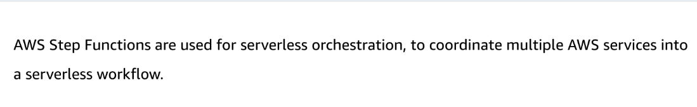
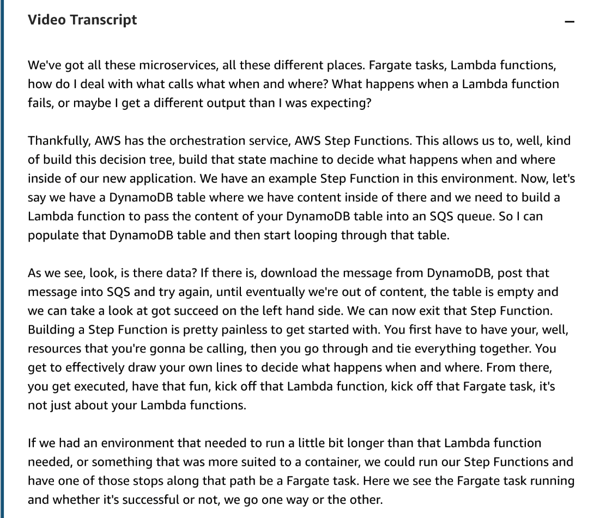
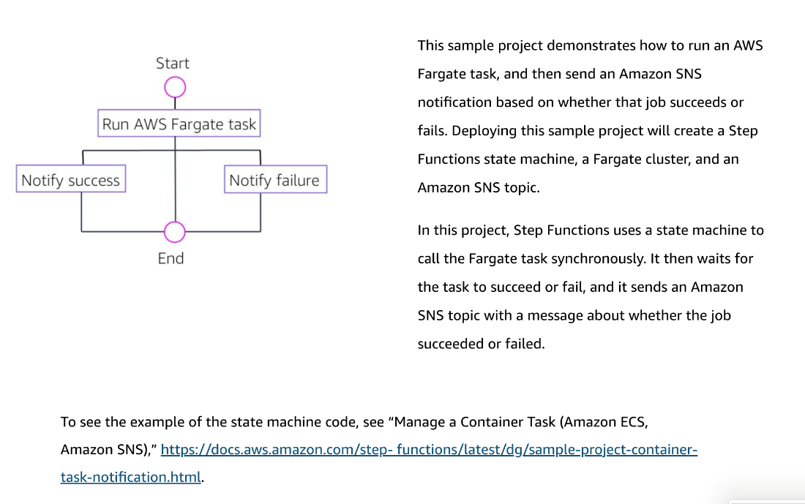

# 26 AWS Step Functions

---

![In summary, take a look at moving off of those EC2 instances. They're great right now and they'll probably be great going forward for certain applications, but there's definitely situations where you can either look at running something in Lambda or in Fargate. Start moving away from having to manage that architecture yourself. We saw in that pipeline earlier, we wanna focus on testing. While we haven't talked about that testing yet, we wanna drill that point home, keep that in mind. Always have testing everywhere, along every step of the CI/CD pipeline we're building. Services we covered, Lambda, Fargate, SAM, Step Functions. ](../../../media/AWS-DevOps-Module-7-26-AWS-Step-Functions-image3.png)

![Key concepts and topics Review the content below to reinforce some of the key concepts and topics presented to you in the video above. Serverless orchestration AWS Step Functions lets you coordinate multiple AWS services into serverless workflows so that you can build and update applications quickly. Using Step Functions, you can design and run workflows that stitch together services, such as AWS Lambda and Amazon Elastic Container Service (Amazon ECS), into feature-rich applications. There are many benefits to step functions. Some of them include: ](../../../media/AWS-DevOps-Module-7-26-AWS-Step-Functions-image4.png)

![Build and update apps quickly AWS Step Functions lets you build visual workflows that enable fast translation of business requirements into technical requirements. You can build applications in a matter of minutes, and when needs change, you can swap or reorganize components without customizing any code. Built-in operational controls AWS Step Functions manages the logic of your application for you, and implements basic primitives such as branching, parallel runs, and timeouts. This removes extra code that may be repeated in your microservices and functions. Step Functions automatically manages error handling, retry logic, and state. With its built-in operational controls, Step Functions manages sequencing, error handling, retry logic, and state, removing a significant operational burden from your team. Improve resiliency AWS Step Functions manages state, checkpoints and restarts for you to make sure that your application runs in order and as expected. Built-in try/catch, retry and rollback capabilities deal with errors and exceptions automatically. ](../../../media/AWS-DevOps-Module-7-26-AWS-Step-Functions-image5.png)

![With AWS Step Functions, you can build applications using a visual workflow. First, you define your workflow as a series of steps, such as tasks and timeouts or workflow controls such as sequence, parallel, or choice. Next, you connect those tasks to code hosted in functions, containers, instances, and on-premises servers. Third, you run your workflow by providing any additional input needed, and you can run it as many times needed (for up to one year). Finally, evolve your workflows by swapping out tasks, changing the order of steps, adding new steps (or both), without changing your code. ](../../../media/AWS-DevOps-Module-7-26-AWS-Step-Functions-image7.png)

