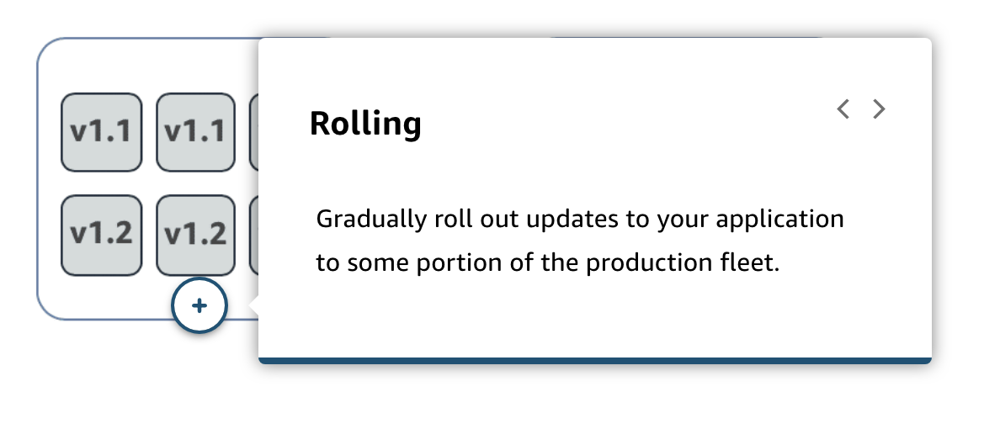
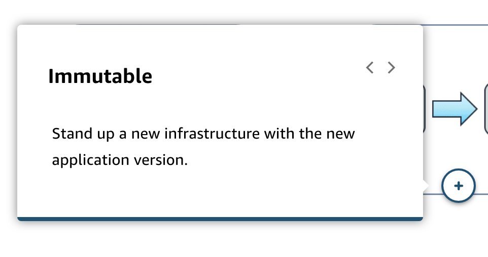
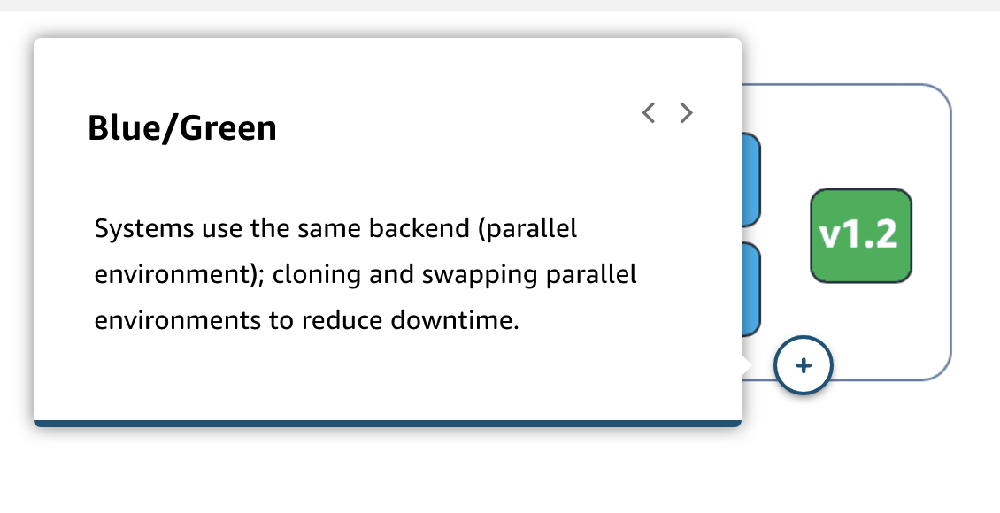
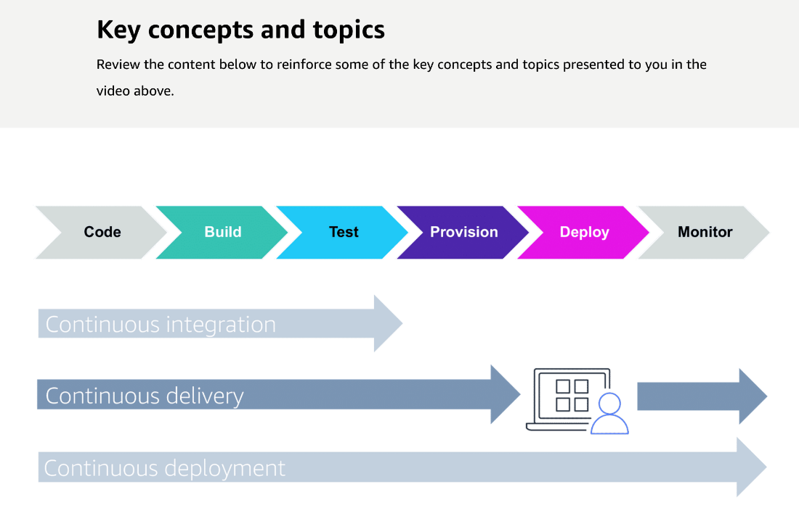
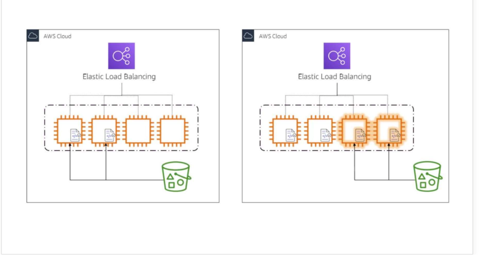
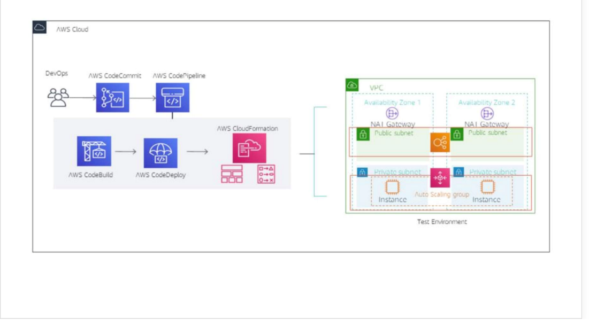
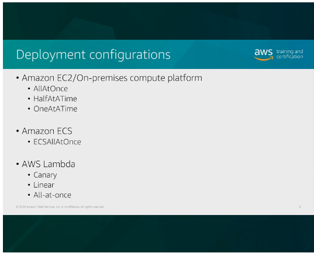
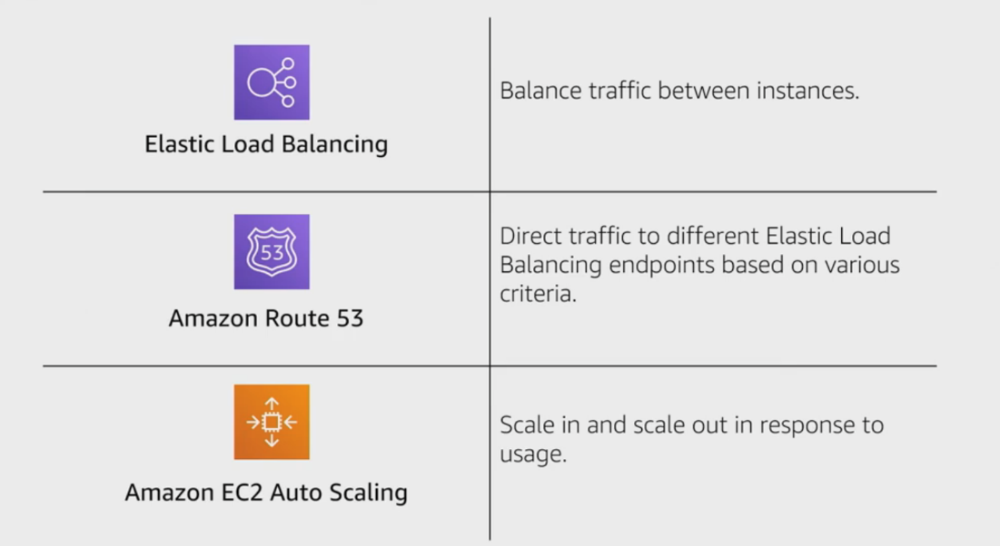

# 27 Continuous Deployment

Created: 2023-10-08 17:05:51 -0600

Modified: 2023-10-22 17:42:34 -0600

---

Summary

This module delves into various deployment strategies, emphasizing the importance of choosing the right strategy based on the application's requirements and the environment. It highlights the nuances of in-place, rolling, immutable, green/blue, and dark launches, among others, and underscores the significance of testing in ensuring successful deployments.

Facts

- The module discusses detailed deployment strategies.
- CI/CD pipelines inherently involve discussions about deployments.
- Deployment strategies include in-place, rolling, immutable, green/blue, and dark launches.
- Segmentation of deployments can help avoid potential issues arising from testing stages.
- Continuous delivery and continuous deployment differ in the manual approval step.
- Deploying code to customers can be complex due to considerations like downtime, rollback, and system updates.
- Cloud platforms like AWS offer a variety of deployment strategies.
- In-place updates involve replacing the current version with a new one directly.
- Rolling updates involve updating parts of the system incrementally.
- Immutable and green/blue strategies benefit from cloud architecture, allowing for environment cloning.
- Blue/green deployments involve having two environments (blue for current and green for new) and shifting traffic between them.

{width="10.083333333333334in" height="5.916666666666667in"}

{width="10.083333333333334in" height="4.3125in"}

{width="10.083333333333334in" height="4.375in"}

{width="10.083333333333334in" height="5.354166666666667in"}

{width="10.083333333333334in" height="5.208333333333333in"}

- Dark launches allow for deploying features without making them visible until they are activated.
- Segmentation in deployments can be based on aspects like availability zones, regions, or single hosts.
- Effective testing is crucial for successful deployments.

{width="10.083333333333334in" height="6.614583333333333in"}

![Deployment types IN-PLACE DEPLOYMENTS ROLLLING IMMUTABLE DEPLOYMENT BLUE/GREEN With in-place deployments, you are replacing the existing application version (VI) on the application infrastructure with a new version (v2), in the most basic sense. In-place deployment is a method of rolling out a new application version on an existing fleet of servers. The update is done in one deployment action, requiring some degree of downtime. By contrast, there are hardly any infrastructure changes needed for this update (no need to add additional infrastructure unless necessary). There is also no need to update existing DNS records. The deployment process is quick. If the deployment fails, redeployment is the only option for restoration. AWS CodeDeploy, AWS Elastic Beanstalk, AWS OpsWorks are some of the services that support in-place updates. 1 . Create deployable content on your local development machine or similar environment and then you add an application specification file (AppSpec file). The AppSpec file is unique to CodeDeploy. It defines the deployment actions you want CodeDeploy to perform. You bundle your deployable content and the AppSpec file into an archive file and then upload it to an Amazon S3 bucket or a GitHub repository. This archive file is called an application revision (or a revision). ](../../../media/AWS-DevOps-Module-8-27-Continuous-Deployment-image7.png){width="10.083333333333334in" height="6.875in"}

![2. Provide CodeDeploy with information about your deployment, such as which Amazon S3 bucket or GitHub repository to pull the revision from and to which set of Amazon EC2 instances to deploy its contents. CodeDeploy calls a set of Amazon EC2 instances a deployment group. A deployment group contains individually tagged Amazon EC2 instances, Amazon EC2 instances in EC2 Auto Scaling groups, or both. Each time you successfully upload a new application revision that you want to deploy to the deployment group, that bundle is set as the target revision for the deployment group. The application revision that is currently targeted for deployment is the target revision. This is also the revision that is pulled for automatic deployments. 3. The CodeDeploy agent on each instance polls CodeDeploy to determine what and when to pull from the specified Amazon S3 bucket or GitHub repository. 4. The CodeDeploy agent on each instance pulls the target revision from the Amazon S3 bucket or GitHub repository and, using the instructions in the AppSpec file, deploys the contents to the instance. ](../../../media/AWS-DevOps-Module-8-27-Continuous-Deployment-image8.png){width="10.083333333333334in" height="5.104166666666667in"}

{width="10.083333333333334in" height="5.833333333333333in"}

![Deployment types IN-PLACE DEPLOYMENTS ROLLLING IMMUTABLE DEPLOYMENT BLUE/GREEN With a rolling deployment, the fleet is divided into portions so that the fleet isn't upgraded at once. During the deployment process, two software versions, new and earlier versions, are running on the same fleet. This method enables a zero-downtime update. If the deployment fails, only the upgraded portion of the fleet will be affected. In the second image, half of the fleet is upgraded to new application version, whereas the other half is under deployment as displayed by the glowing instances. AWS services enabling rolling upgrades: • AWS Elastic Beanstalk: Choose deployment options: Rolling and Rolling with an additional batch. These options enable the application to first scale out before taking servers out of service, preserving full capability during the deployment. • AWS CodeDeploy: Variation of in-place upgrades. Choose deployment configuration: OneAtATime and HalfAtATime. You will learn about these services in subsequent modules. ](../../../media/AWS-DevOps-Module-8-27-Continuous-Deployment-image10.png){width="10.083333333333334in" height="8.15625in"}

{width="10.083333333333334in" height="5.46875in"}

{width="10.083333333333334in" height="5.75in"}

![IN-PLACE DEPLOYMENTS ROLLLING IMMUTABLE DEPLOYMENT BLUE/GREEN Immutable updates is another deployment strategy that you can implement. Immutable or disposable environment updates can be an easier option if your application has unknown dependencies. An earlier application infrastructure that has been patched and re-patched over time becomes more and more difficult to update the configuration. This type of update technique is more common in an immutable infrastructure. Immutable environment updates ensure that configuration changes that require replacing instances are applied efficiently and safely. If an immutable environment update fails, the rollback process requires only terminating an Auto Scaling group. By contrast, a failed rolling update requires performing an additional rolling update to roll back the changes. For disposable updates, you can set up a cloned environment with deployment services, such as Elastic Beanstalk, AWS CloudFormation, and AWS OpsWorks, or use them in combination with an Auto Scaling configuration to manage the upgrades. In the example diagram, a DevOps team uses AWS CodeBuild to build the application dependencies and use AWS Cloudformation as a AWS CodeDeploy provider to create the resources while respecting their interdependencies and enforcing an all-or- nothing operation--- all resources are successfully created, or none of them are created at all. DevOps engineering team uses AWS CodePipeline to integrate with other Dev Tools to automate this solution for their test environment. ](../../../media/AWS-DevOps-Module-8-27-Continuous-Deployment-image13.png){width="10.083333333333334in" height="8.0625in"}

{width="10.083333333333334in" height="5.541666666666667in"}

![Deployment types IN-PLACE DEPLOYMENTS ROLLLING IMMUTABLE DEPLOYMENT BLUE/GREEN Your blue environment is your existing production environment carrying live traffic. In parallel, you provision a green environment, which is identical to the blue environment other than the new version of your code. When it's time to deploy, you route production traffic from the blue environment to the green. If you encounter any issues with the green environment, you can roll it back by reverting traffic back to the original blue environment. DNS cutover and swapping Auto Scaling groups are the two most common methods used to redirect traffic in blue/green deployments. A blue/green deployment at its most basic level consists of two environments (blue and green) that are spun up in a parallel environment using the same resources. In this example, VI of the deployment is replicated across both environments. Next, VI is deployed to the green environment (green group). ](../../../media/AWS-DevOps-Module-8-27-Continuous-Deployment-image15.png){width="10.083333333333334in" height="7.010416666666667in"}

{width="10.083333333333334in" height="5.166666666666667in"}

![Other container considerations To learn more, expand each of the following categories. Fully managed updates with Amazon ECS Amazon ECS performs rolling updates when you update an existing Amazon ECS service. As a review, a rolling update involves replacing the current running version of the container with the latest version. The number of containers Amazon ECS adds or removes from the service during a rolling update is controlled by adjusting the minimum and maximum number of healthy tasks allowed during service deployments. When you update your service's task definition with the latest version of your container image, Amazon ECS automatically replaces the earlier version of your container with the latest version. During a deployment, Amazon ECS drains connections from the current running version and registers your new containers with the Application Load Balancer as they come online. ](../../../media/AWS-DevOps-Module-8-27-Continuous-Deployment-image17.png){width="10.083333333333334in" height="7.65625in"}

![Minimum Healthy Percent If a service is using the rolling update (ECS) deployment type, the minimum healthy percent represents a lower limit on the number of tasks in a service that must remain in the RUNNING state during a deployment, as a percentage of the desired number of tasks (rounded up to the nearest integer), and while any container instances are in the DRAINING state if the service contains tasks using the EC2 launch type. This parameter enables you to deploy without using additional cluster capacity. For example, if your service has a desired number of four tasks and a minimum healthy percent of 50%, the scheduler may stop two existing tasks to free up cluster capacity before starting two new tasks. Tasks for services that do not use a load balancer are considered healthy if they are in the RUNNING state; tasks for services that do use a load balancer are considered healthy if they are in the RUNNING state and they are reported as healthy by the load balancer. The default value for minimum healthy percent is 100%. If a service is using the blue/green (CODE_DEPLOY) or EXTERNAL deployment types and tasks that use the EC2 launch type, the minimum healthy percent value is set to the default value and is used to define the lower limit on the number of the tasks in the service that remain in the RUNNING state while the container instances are in the DRAINING state. If the tasks in the service use the Fargate launch type, the minimum healthy percent value is not used, although it is returned when describing your service. ](../../../media/AWS-DevOps-Module-8-27-Continuous-Deployment-image18.png){width="10.083333333333334in" height="7.729166666666667in"}

![Target groups A target group is a logical construct that enables you to run multiple services behind the same Application Load Balancer. This is possible because each target group has its own listener. When you create an Amazon ECS service that's fronted by an Application Load Balancer, you must designate a target group for your service. Ordinarily, you would create a target group for each Amazon ECS service. In some cases, you can create two target groups: one for the blue version of your service and one for the green version of your service. With this configuration, you can run both environments in parallel until you're ready to cut over to the green version of your service. You can also do things such as restricting access to the green version to testers on your internal network, using security group rules and placement constraints. For example, you can target the green version of your service to run only on instances that are accessible from your corporate network. ](../../../media/AWS-DevOps-Module-8-27-Continuous-Deployment-image19.png){width="10.083333333333334in" height="6.270833333333333in"}

{width="10.083333333333334in" height="8.145833333333334in"}

{width="10.083333333333334in" height="5.416666666666667in"}

{width="10.083333333333334in" height="5.572916666666667in"}

![Decommission the blue environment Deployment process: 100% aws training and certification t 1. 2. 3. 4. 5. 6. 7. Start with current (blue) application environment. Deploy a new (green) application environment. Test the new green environment with a small percentage of traffic. Gradually cut over traffic through DNS. Monitor the green environment for issues. If needed, roll back to blue. Decommission the blue environment. AWS Cloud Reg.on Route 53 DNS end oint Web Application Environm C' Amazon Wet, Orade Oracle DB Amazon ElastiCache ](../../../media/AWS-DevOps-Module-8-27-Continuous-Deployment-image23.png){width="10.083333333333334in" height="5.802083333333333in"}

{width="10.083333333333334in" height="5.770833333333333in"}

![Deploying Amazon ECS services in an AppSpec file version: 0.2 Resou rces : - TargetServi ce: Type: AWS: :ECS: :service Properti es : LoadBa1 ancerlnfo : training and certification TaskDefi nition: niti on-family-name: 1" Contai nerName: "Sampl eApp1 i cati onName" Contai nerPort: 80 # Optional properties PI atformversion: "LATEST" Networkconfi gu rati on : AwsvpcConfi gu rati on : Subnets: ["subnet-1234abcd" , "subnet-5678abcd"] Securi tyGroups: ["sg-12345678"] Assignpubliclp: "ENABLED" Hooks : - Beforelnstall : "LambdaFuncti onToVa1 i dateBeforeInsta11 " - Afterlnstall: " LambdaFuncti onToVa1 i dateAfterTraffi c" - AfterA1 lowTestTraffic: "LambdaFunctionToVa1idateAfterTestTraffi cstarts" - BeforeA1 lowTraffic: "LambdaFunctionTova1idateBeforeA1 lowi ngproductionTraffi c" - AfterA1 lowTraffic: "LambdaFunctionTova1idateAfterA1 lowi ngproductionTraffi c" ](../../../media/AWS-DevOps-Module-8-27-Continuous-Deployment-image25.png){width="10.083333333333334in" height="5.385416666666667in"}

