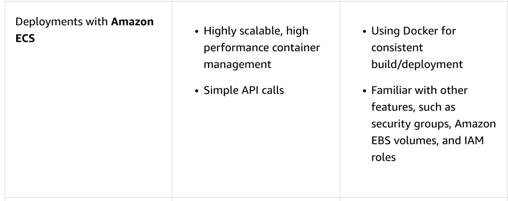

# 28 Deployments with AWS Services

Created: 2023-10-08 22:32:27 -0600

Modified: 2023-10-22 17:44:18 -0600

---

![Video Transcript We've got a quick summary here for you of different AWS tool sets and potential use cases when it comes to doing deployments. We talked about CloudFormation, utilizing the immutable deployment. CloudFormation could also be used with those green/blue, the rolling. Really, the possibilities are up to you. It gives you the most granular control because you can automate everything inside of that template. Now, with our EC2 architecture, we don't really deploy to EC2 by itself. We have to have a tool set that helps us deploy to those EC2 instances. This is where I would have most likely CodeDeploy or potentially a third party application go in and handle those rolling or in-place updates for us. Now we see a quick pipeline of what deployments to EC2 architecture look like. We've seen this before in some of our previous conversations. I create that application. I specify my deployment group using CodeDeploy. I deploy out to it. I verify that it worked. If it did, everything succeeds, then I'm good to go. If it doesn't, I simply loop back and redeploy the older version to have that rollback to what I know works. Deployments to ECS. We talked about how this can happen deploying straight to the ECS service and allowing it to spin up multiple versions of tasks and fail out the older ones that are no longer working. We can also use CodeDeploy to do a little bit more in depth and make calls to those Lambda functions for greater level of control. Here we see, well, a similar process. We should have an understanding now that deployment mechanisms, as far as the pipeline goes, look pretty similar. It depends on what service you're utilizing to do that organization. ](../../../media/AWS-DevOps-Module-8-28-Deployments-with-AWS-Services-image1.png){width="5.0in" height="4.291666666666667in"}

![Here we're using our CodeDeploy service because we have that appspec file written with those Lambda functions to verify that during that testing, that checking stage, that everything works correctly and potentially even adjusting those weighted entries between our different target groups behind that ALB. Deployments with serverless applications. Now, when we say serverless, we're focusing on that Fargate, that Lambda function. We have to have our applications automated. We have to have them wrapped in some sort of management tool, whether that's SAM, CDK, CloudFormation, building that entire process through that CI/CD pipeline. When it comes to deploying, say those Lambda functions, we're doing a lot at the same thing here, right? We can use CodeDeploy to do deployments to Lambda directly. We go through that same process defining that appspec file, going to the deployment stage, testing out that Lambda function, seeing if it worked. If it doesn't, reverting it back to that previous version. Now you should have an understanding of in-place, rolling, immutable, and blue/green deployments. None of these are going to be a single solution for your entire team or even your entire business. It's up to you to mix and match where appropriate. Take a look at the benefits and the potential drawbacks for each and apply where necessary based on the application requirements. ](../../../media/AWS-DevOps-Module-8-28-Deployments-with-AWS-Services-image2.png){width="5.0in" height="3.4583333333333335in"}

![Key concepts and topics Review the content below to reinforce some of the key concepts and topics presented to you in the video above. Deployment Deployments with AWS CloudFormation Deployments to Amazon EC2 Benefits • Provision and manage stacks of AWS resources based on templates • Control versioning • Easily replicate infrastructure • Deploy one instance to thousands in minutes • Integrate with third- party applications Recommended When you want a tool for granular control If you or your organization wants to manage infrastructure ](../../../media/AWS-DevOps-Module-8-28-Deployments-with-AWS-Services-image3.png){width="5.0in" height="4.472222222222222in"}

{width="5.0in" height="1.9861111111111112in"}

{width="5.0in" height="3.0625in"}

{width="5.0in" height="2.9097222222222223in"}

{width="5.0in" height="2.8472222222222223in"}

{width="5.0in" height="2.8680555555555554in"}

