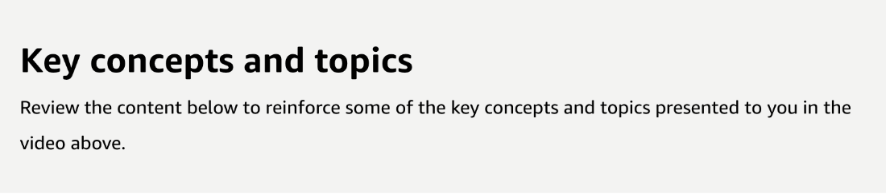
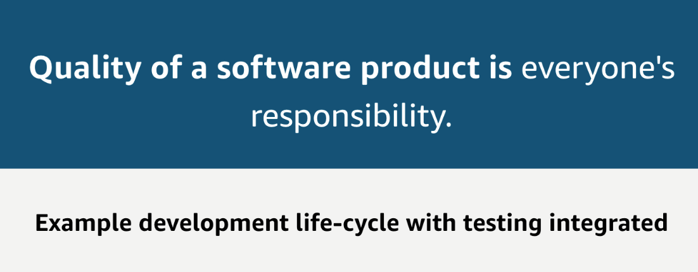
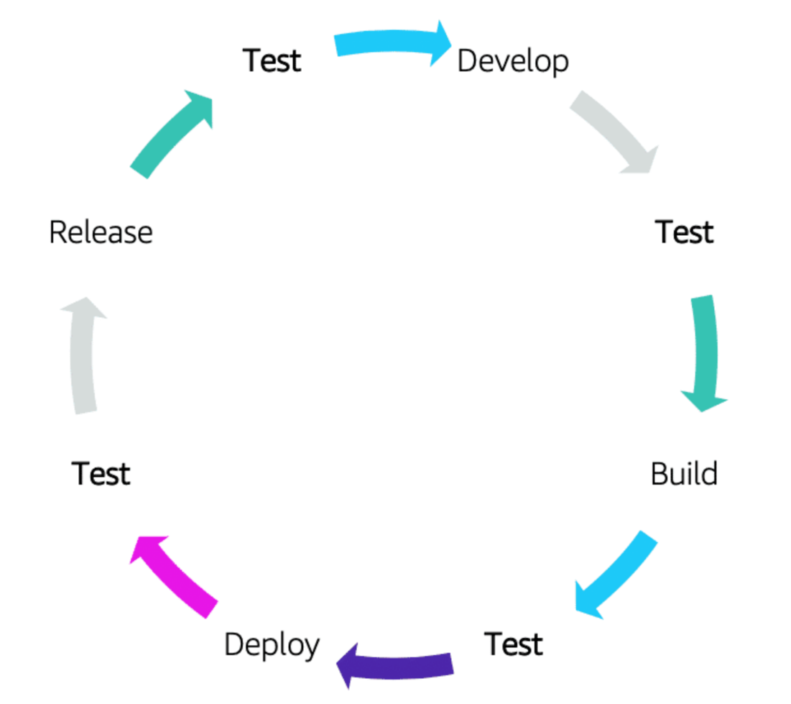

# 29 Introduction to Testing

Created: 2023-10-09 10:38:15 -0600

Modified: 2023-10-22 17:44:25 -0600

---

Summary

The content underscores the critical role of testing in every stage of the CI/CD pipeline, emphasizing that quality software is a collective responsibility and that a production-like environment should be employed for tests. It also introduces several testing strategies and tools.

Facts

- Testing is essential at every stage of the CI/CD pipeline.
- Quality software is a responsibility shared by everyone, not just the QA team.
- Testing must be automated and not manual.
- Solid test coverage, including both unit tests and integration tests, is crucial.
- Every step in the development cycle should involve testing.
- Automated testing should be conducted in a production-like environment to avoid discrepancies between development and production.
- Testing in a production-like environment helps identify bugs before reaching the production phase.
- Mocking is a strategy used when you don't want to communicate with a real downstream dependency during testing. WireMock is an example of a tool for this.
- Various tests include unit tests, integration tests, regression tests, load tests, performance tests, system tests, and user acceptance tests.
- Production testing, done responsibly, is about understanding which version of an application users prefer, often employing strategies like A/B testing.
- {width="5.0in" height="1.3958333333333333in"}

- {width="5.0in" height="1.1041666666666667in"}

- ![Testing and DevOps With frequent code check-ins, you can close the feedback loop with quality by having a good testing strategy as part of your CI/CD pipeline. Keeping a robust pipeline ensures that you can continue to deliver quality products and features faster. Tests are a critical part of software development because they ensure software quality. More importantly, they help find issues early in the development phase, lowering the cost of fixing them later during the project. Tests come in many forms: unit tests, performance tests, user acceptance tests, or integration tests. All require IT resources to run. Thus, test teams face the same challenges as development teams---the need to have enough IT resources, but only during the limited duration of the test runs. Test environments change frequently and are different from project to project, and as a result may require different IT infrastructure or have varying capacity needs. Continuous testing is important in balancing the CI/CD pipeline. Though adding software features at a rapid pace is a good practice, ensuring that the features adhere to the right level of quality is achieved by continuous testing. ](../../../media/AWS-DevOps-Module-9-29-Introduction-to-Testing-image3.png){width="5.0in" height="3.7430555555555554in"}

- {width="5.0in" height="1.9583333333333333in"}

- {width="5.0in" height="4.451388888888889in"}

- {width="5.0in" height="3.0694444444444446in"}

- {width="5.0in" height="2.0in"}

- {width="5.0in" height="1.5416666666666667in"}

- ![Stage phase A staging environment is a replica of the production environment. A complete system test is performed at this stage. UI, backend logic, and API are tested extensively. Performance testing tests the application performance under a particular workload. Types of performance tests include load tests, stress tests, and spike tests. A user acceptance testing is also performed at this stage in readiness for production deployment. Compliance testing is done to test for industry-specific regulatory compliance. ](../../../media/AWS-DevOps-Module-9-29-Introduction-to-Testing-image9.png){width="5.0in" height="1.9791666666666667in"}

- {width="5.0in" height="1.8263888888888888in"}
- 

