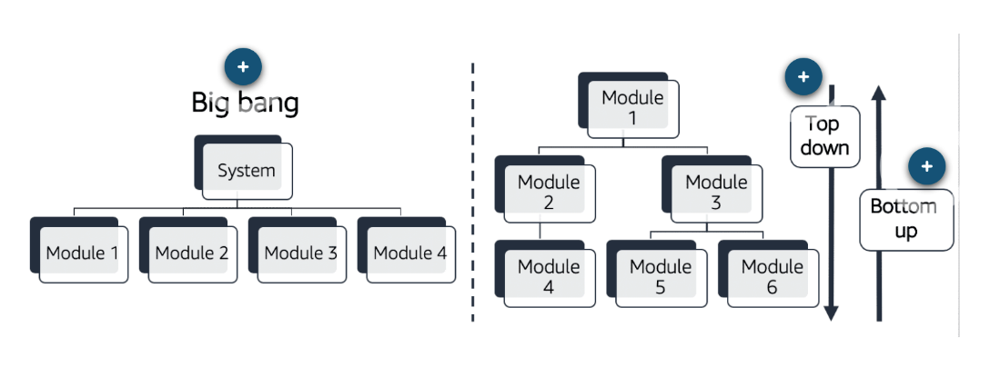
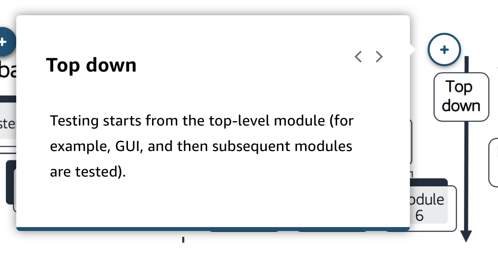

# 30 Tests: Unit, Integration, Fault Tolerance, Load, and Synthetic

---

Summary

The content emphasizes the importance of various testing methodologies in the software development process, from unit tests to integration and load tests, highlighting best practices and the significance of ensuring application robustness and performance.

Facts

- Unit Tests:
  - Foundation of good testing coverage.
  - Aim for high code coverage, ideally 100% or high nineties.
  - Test-driven development (TDD) ensures solid code coverage and keeps developers on track.
  - Unit tests help detect problems early in the CI/CD pipeline.
- Integration Tests:
  - Focus on interactions between different modules.
  - Big Bang approach tests all interactions simultaneously.
  - Top-down testing starts with the UI and flows downwards.
  - Bottom-up testing begins with core business logic modules.
- UI Testing with CodeBuild and Lambda:
  - CodeBuild can be used to run tests, not just build artifacts.
  - Tests can be run on different browsers like Firefox and Chrome.
- Fault Tolerance and Chaos Engineering:
  - Emphasizes the importance of testing applications under failure conditions.
  - Randomly shutting down resources helps remove human biases in testing.
- Load Testing:
  - Ensures applications can handle high traffic.
  - Tools like BlazeMeter can be integrated into CodePipeline to measure latency.
- Testing in Production:
  - A/B testing allows for testing different versions of an application in a live environment.
  - Netflix uses a Single Instance Canary approach to test on a single EC2 instance.
- Network Load Testing:
  - Tests the communication pathways between different environments.
  - Important for global applications to ensure consistent performance across regions.
  - CloudFormation can be used to spin up testing stacks.
- Communication Testing:
  - Test the robustness of connections between on-premise data centers and cloud architectures.
  - Evaluate the reliability of Direct Connect or VPN connections.

![Unit tests and test-driven development (TDD) Unit testing and TDD go together. There are multiple benefits to TDD, but having a robust set of unit tests for the code is the most beneficial of all. This aligns with the recommended practice of creating the bull< of tests (70%) as unit tests. These are some testing options that can be performed predeployment. Integration tests Integration tests: • Test interaction between units or modules • Perform after unit testing and before system testing Here are some of the approaches. To learn more choose each hotspot. ](../../../media/AWS-DevOps-Module-9-30-Tests--Unit,-Integration,-Fault-Tolerance,-Load,-and-Synthetic-image3.png)

![Fault tolerance testing This type of testing is recommended best practice for mission-critical applications. It can test how your application handles corner cases. When AWS is the target production environment for the application you've developed, some specific test practices provide insights into how the system will handle corner cases, such as component failures. AWS offers many options for building fault-tolerant systems. Some services are inherently fault- tolerant, such as: Amazon S3 Amazon DynamoDB Amazon SimpleDB Amazon Simple Queue Service (Amazon SQS) Amazon Route 53 Amazon CloudFront ](../../../media/AWS-DevOps-Module-9-30-Tests--Unit,-Integration,-Fault-Tolerance,-Load,-and-Synthetic-image8.png)

![Other services, such as Amazon EC2, Amazon Elastic Block Store (Amazon EBS), and Amazon Relational Database Service (Amazon RDS), provide features that help architect fault-tolerant and highly available systems. Load testing Load tests simulate heavy inputs that exercise and stress a system. Depending on the project, inputs can be a large number of concurrent incoming requests or a large dataset to process. One of the major difficulties in load testing is being able to generate large enough amounts of inputs to push the tested system to its limits. Typically, it implies having large amounts of IT resources to deploy the system to test, and to generate the test input, which requires further infrastructure. Because load tests generally don't run for more than a couple of hours, the AWS pay-as-you-go model is designed for this type of use case. Synthetic testing This type of testing is used to understand the user experience and its interaction with an application. ](../../../media/AWS-DevOps-Module-9-30-Tests--Unit,-Integration,-Fault-Tolerance,-Load,-and-Synthetic-image9.png)

