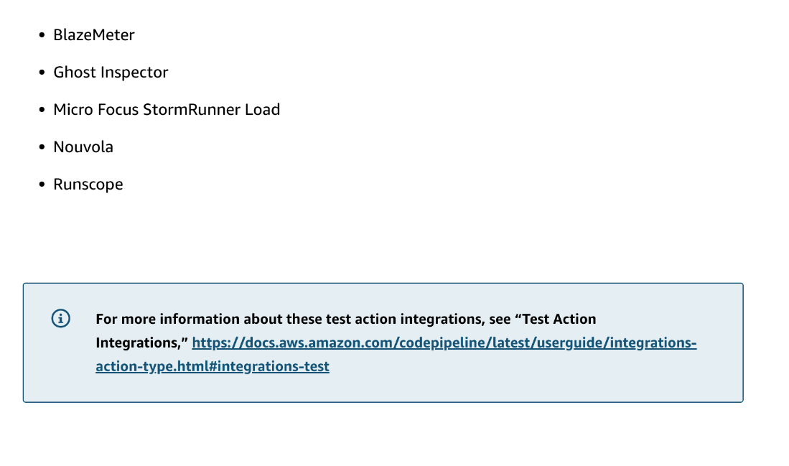
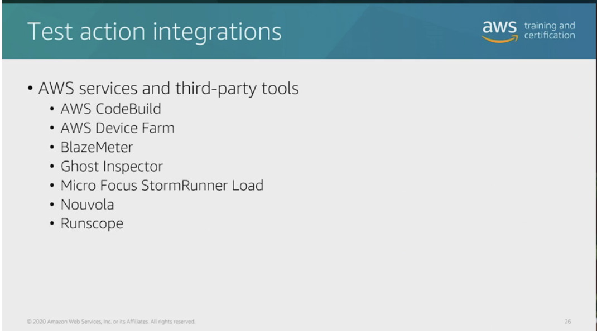

# 31 Product and Service Integrations

Created: 2023-10-09 22:24:09 -0600

Modified: 2023-10-22 17:44:31 -0600

---

![Video Transcript I mentioned that we have quite a few third party testing solutions. If you use one of these, take a look at the documentation included in that vendor website. It'll walk you through building out an example deployment of that testing suite into your CI/CD pipeline. While we have quite a few testing solutions with CodeBuild and Lambda, it is by no means exhaustive. An example of an additional testing stage that we can add is by using a service that AWS offers called AWS Device Farm. If you are building applications that run on either Android devices or iOS devices, you can test across those resources inside of your CI/CD pipeline. One of the testing stages could be pushing to one of those devices. Do that performance testing. Test on that device, and then when it succeeds, you know it's gonna work in that app store that you're about to publish it with. Go through, review that report, and eventually get it out there, get it published for your customers to download and run on their phones. Here we see an example of adding in Ghost Inspector for that UI testing. We saw a previous example of this in that slide earlier where I mentioned to take a look at some of the documentation. This is part of the steps that are included in building out that sample resource. We can use Ghost Inspector to test that UI, so it's not just that QA person clicking on all the buttons to see how the buttons actually perform. We need to automate every stage of testing in our pipeline. You can now see that testing is key to a well-built and well oiled DevOps pipeline. We have to have tested every single stage. Look at your pipeline now. Where do you have tests and where can you add more? Keep in mind that we have that integration with those third party tools that we can use to add into our environment if you're using one of those already ](../../../media/AWS-DevOps-Module-9-31-Product-and-Service-Integrations-image1.png){width="5.0in" height="4.458333333333333in"}

![Key concepts and topics Review the content below to reinforce some of the key concepts and topics presented to you in the video above. Test action integrations AWS CodeBui1d You can use AWS CodeBuild to compile your source code, run unit tests, and produce artifacts that are ready to deploy. You can add CodeBuild to a pipeline as a test action. It can also be included in a pipeline as a build action, with a mandatory build output artifact. AWS Device Farm AWS Device Farm is an application testing service that can be used to test and interact with your Android, iOS, and web applications on the real, physical phones and tablets. You can configure your CodePipeline to use AWS Device Farm to test your code in one or more actions in a pipeline. Third-party tools You can use the following third-party tools with CodePipeline to test your code in one or more actions in a pipeline: ](../../../media/AWS-DevOps-Module-9-31-Product-and-Service-Integrations-image2.png){width="5.0in" height="4.166666666666667in"}

{width="5.0in" height="2.9479166666666665in"}

{width="5.0in" height="2.7708333333333335in"}

