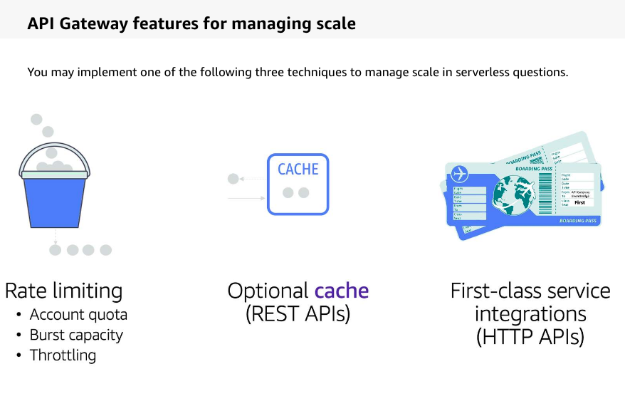
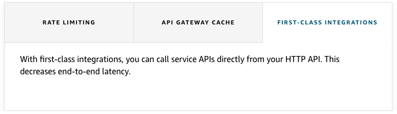

# 40

Created: 2023-09-29 22:21:10 -0600

Modified: 2023-10-22 17:30:49 -0600

---

Summary

Managing scale with API Gateway involves leveraging its built-in features to control request rates, protect backend resources, and optimize response times, rather than merely scaling the service itself.

Facts

- API Gateway is a managed service, capable of handling vast request volumes.
- The primary goal is to manage scale to protect backend resources, such as Lambda functions.
- Rate limiting is inherent in API Gateway, with both account quotas and burst capacities.
- The token bucket algorithm is used to control the rate of requests during bursts, preventing potential DDoS attacks on the backend.
- API Gateway offers an optional cache for REST APIs, beneficial for GET requests.
- Caching can offload requests from the backend, reduce Lambda invocations, and decrease latency.
- Time-to-live (TTL) settings determine how long data remains valid in the cache.
- First-class service integrations in API Gateway can further reduce latency by directly connecting with AWS services like DynamoDB or S3.
- Throttling options in API Gateway include setting limits per method/route or per client using API keys.
- Usage plans allow for client-specific throttling, setting daily quotas or request limits for specific API keys.
- Exceeding set limits results in a 429 error code, indicating the client has surpassed their allowed requests.

{width="5.0in" height="3.2847222222222223in"}

![To learn more about implementing each of the feature, choose the appropriate tab. RATE LIMITING API GATEWAY CACHE FIRST-CLASS INTEGRATIONS • Account quota - The account quota is a soft limit, and you can request an increase if you need very high throughput. • Burst capacity - the burst capacity uses the token bucket algorithm and is determined by the API Gateway service team. You cannot modify the burst capacity. At a high level, the token bucket algorithm means that, as requests come into the bucket, they are fulfilled at a steady rate. If the rate at which the bucket is being filled causes the bucket to fill up and exceed the burst value, a 429 Too Many Requests error is returned. • Throttling- API Gateway provides throttling at different levels so that you have granular control over where throttling applies. Throttling options include the following: Apply throttling to all methods or routes within an API (default throttling) o Set throttling per method or route o Assign throttling behaviors based on client via usage plans and API keys (REST APIs only) ](../../../media/AWS-Developing-Serverless-Solutions-on-AWS-Model--11-40-image2.png){width="5.0in" height="4.229166666666667in"}

{width="5.0in" height="1.7430555555555556in"}

{width="5.0in" height="1.4375in"}

![Throttling options In addition to the account-level controls, API Gateway provides throttling at different levels so that you have granular control over where throttling applies. Throttling options include the following: • Apply throttling to all methods or routes within an API (default throttling) • Set throttling per method or route Assign throttling behaviors based on client via usage plans and API keys (REST APIs only) Settings are applied to the most granular control first. For example, if an incoming request is from a client tied to a usage plan on a REST API, throttling related to individual methods for that client is applied first and followed by any client-level limits. After that, any throttling settings indicated for a particular method and stage are applied first, followed by any limits placed across the entire stage. Finally, if no throttling is applied at more granular levels, the account quota is applied. Throttle rate = 50 requests per second Mobile apps Websites 000 Services Amazon CloudFro Amazon API Gateway Daily quota = 10,000 requests Example: Usage plans with rate and volume quotas Usage plan Usage plan specifies who can access deployed stages and methods, and controls the rate and number of requests that a client makes. Within usage plans, you can set throttling limits to control the request rate, and you can set a quota to control how many requests that API key can use within a specific time frame. API keys (REST) are unique string values that you give out to grant access to APIs. ](../../../media/AWS-Developing-Serverless-Solutions-on-AWS-Model--11-40-image5.png){width="5.0in" height="3.7430555555555554in"}

