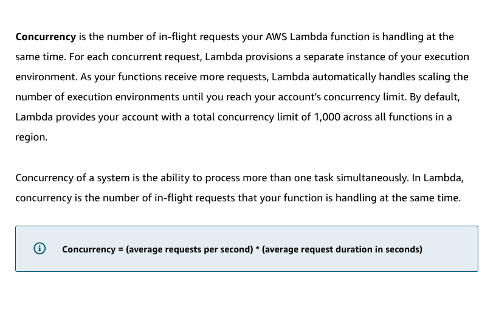
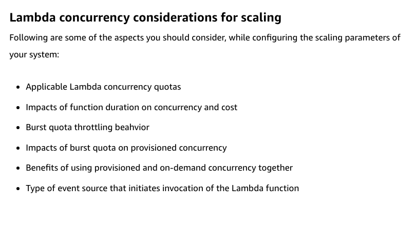
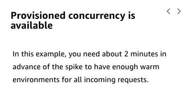

# 41

---

Summary

Lambda concurrency refers to simultaneous Lambda invocations, and understanding its nuances is crucial for optimizing performance, managing costs, and ensuring efficient scaling of serverless applications.

Facts

- Lambda concurrency denotes the number of Lambda functions executing simultaneously.
- Different limits and quotas exist for Lambda concurrency.
- Function duration affects both concurrency and cost; longer durations require more concurrent environments.
- Billing for Lambda is based on one millisecond intervals per function.
- Increasing a function's memory can make it run faster, potentially reducing costs.
- The regional burst quota determines how quickly concurrency can rise in response to a sudden influx of traffic.
- Provisioned concurrency allows for pre-warmed Lambda environments, ensuring faster response times.

- ![Concurrency is the number of in-flight requests your AWS Lambda function is handling at the same time. For each concurrent request, Lambda provisions a separate instance of your execution environment. As your functions receive more requests, Lambda automatically handles scaling the number of execution environments until you reach your account's concurrency limit. By default, Lambda provides your account with a total concurrency limit of 1,000 across all functions in a region. Concurrency of a system is the ability to process more than one task simultaneously. In Lambda, concurrency is the number of in-flight requests that your function is handling at the same time. O Concurrency = (average requests per second) * (average request duration in seconds) ](../../../media/AWS-Developing-Serverless-Solutions-on-AWS-Model--11-41-image1.png)

- 
- 
- Burst quota affects the speed at which provisioned concurrency can be achieved.
- Provisioned concurrency should be set before anticipated traffic peaks and adjusted post-peak for cost optimization.
- Combining provisioned and on-demand concurrency can be cost-effective, using provisioned for baseline needs and on-demand for fluctuations.
- Rate limiting in API Gateway helps manage and protect backend resources.
- API Gateway offers caching for GET requests, reducing backend load and latency.
- Function duration impacts the number of required concurrent environments and costs. (more running time need more concurrence)
- Burst quota limits the speed of scaling, adding a set number of concurrent environments per minute.
- Provisioned concurrency ensures a set number of always-on environments, but it's affected by the burst quota.
- Analyzing traffic patterns can help in setting and adjusting provisioned concurrency effectively.
- Combining provisioned and on-demand concurrency can cater to both baseline and fluctuating demands efficiently.
- 
- 

- 

- ![Burst quota Each Region has a burst limit that prevents concurrency from increasing too quickly in the event of a large spike of requests in a very short time. You cannot modify this limit. This burst quota does not limit the total number of invocations in a Region, but it does limit how quickly you can spin up a large number of new invocation environments in that Region. Regional concurrency quota This is the total number of invocations that can run concurrently across all Lambda functions within an account by Region. AWS sets this as a soft quota on the account. Reserved concurrency Reserved concurrency guarantees the maximum number of concurrent instances for the function. When a function has reserved concurrency, no other function can use that concurrency. There is no charge for configuring reserved concurrency for a function. This is an optional value set per function that both reserves a subset of the Regional quota for the function and also establishes the maximum concurrent instances allowed for the function. ](../../../media/AWS-Developing-Serverless-Solutions-on-AWS-Model--11-41-image4.png)

- 

- ![The Lambda Power Tuning utility lets you test your function at different configurations and optimize for speed, cost, or a balance of both. The Online Course Supplement has a demonstration video of this utility. For more information about this utility, see AWS Lambda power tuning. How the burst quota throttles requests? There is a Regional burst quota that controls how quickly concurrency will increase in response to a burst of traffic. This quota differs depending on the Region and is not configurable. In this example, the function is running in a Region where the burst quota is 3,000. To learn more, choose each hotspot. Regional burst -o 5,000 4,000 3,000 2,000 1,000 4,000 requests +500 3000 concurrency +500 0:30 1:30 4:30 5:30 concurrency quota: 3,000 3,000 immediately added to concurrency Additional requests are throttled + 500 each minute until caught up 2:30 3:30 Time (mm:ss) ](../../../media/AWS-Developing-Serverless-Solutions-on-AWS-Model--11-41-image6.png)

- 

- 

- 

- ![Provisioned concurrency is subject to regional burst quota If you increase provisioned concurrency in advance of a spike, you can have warm instances ready to process the burst of requests. You can provision concurrency up to the reserved concurrency. Note that the time it takes to initialize your provisioned concurrency is subject to the same burst quota as on-demand instances, and you don't have access to any of that provisioned concurrency until the requested number of instances are ready. To learn more, choose each hotspot. Provisioned concurrency reaches 4,000 -o o 5,000 4,000 3,000 2,000 1 ,ooo Configure provisione concurrency at 4,000 .50 1:30 equests 2:30 3:30 Time (mm:ss) 4:30 5:30 ](../../../media/AWS-Developing-Serverless-Solutions-on-AWS-Model--11-41-image10.png)

- 

- ![Provisioned concurrency is configured The time it takes to initialize your provisioned concurrency is subject to the same burst quota as on-demand instances, and you don't have access to any of that provisioned concurrency until the requested number of instances are ready. For example, if you are expecting a peak approaching 4,000 concurrent requests and yo want to have 4,000 instances ready to go before that spike occurs, you need to allow enough time for Lambda to burst to the regional burst quota (for example, 3,000) and then increase by 500 instances per minute to reach 4,000 ](../../../media/AWS-Developing-Serverless-Solutions-on-AWS-Model--11-41-image12.png)

- ![Using auto scaling with provisioned concurrency 3000 2,000 Configure provisioned concurrency at Decrease concurrency after 2:50 550 Time (mm.SS) 4:50 You can use AWS Application Auto Scaling to schedule the provisioned concurrency increase in advance of your traffic peak and then reduce it at a scheduled time when you expect the peak has passed. You can also use Application Auto Scaling to create a target tracking scaling policy that adjusts provisioned concurrency levels automatically based on the utilization metric that Lambda emits. ](../../../media/AWS-Developing-Serverless-Solutions-on-AWS-Model--11-41-image13.png)

- ![Using provisioned and on-demand concurrency together Based on expected traffic and an analysis of metrics and requests patterns, a combination of provisioned concurrency and on-demand concurrency may be the best approach for your application scaling. In this example, the request pattern is relatively steady and not prone to large spikes. The provisioned concurrency is set at 2,000, and on- demand concurrency handles the spillover. This provides the majority of invocations with a warm start but prevents you from paying to keep instances warm that aren't used as often. 8 5,000 4,000 3,000 zooo 1,000 030 On-demand concurrency spillover Provisioned concurrency = 2,000 1:30 2:30 3:50 4:30 Time (mm:ss) 5:30 Now that you understand how lambda functions scale in the following lesson you will learn how different event sources scale with lambda functions. ](../../../media/AWS-Developing-Serverless-Solutions-on-AWS-Model--11-41-image14.png)

