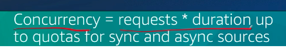
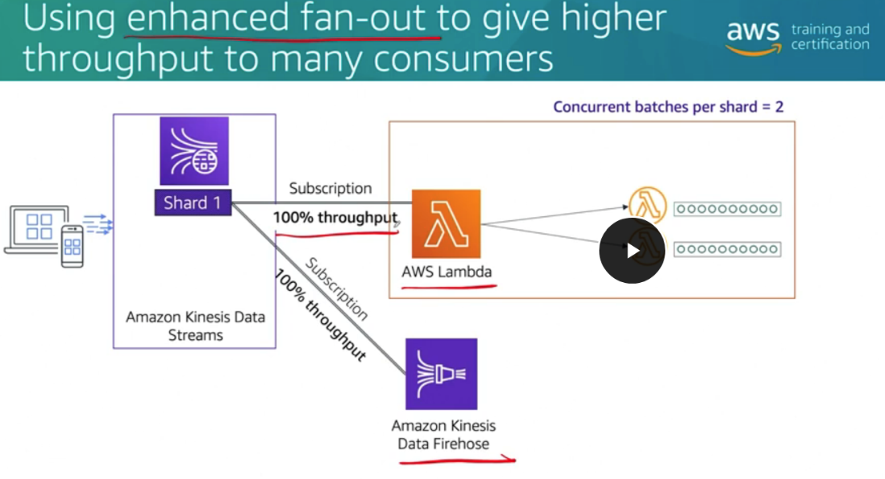

# 42

Created: 2023-09-29 22:23:31 -0600

Modified: 2023-10-22 17:30:55 -0600

---

Summary

Lambda's interaction with various event sources, such as synchronous, asynchronous, SQS, and Kinesis Data Streams, affects its scaling behavior. Understanding these interactions and configurations is crucial for optimizing performance, managing costs, and ensuring efficient scaling of serverless applications.

Facts

- Lambda handles interactions differently based on the event source type.
- Both synchronous and asynchronous event sources require consideration of concurrency.
- Concurrency is calculated as the product of request rate and function duration.
- {width="4.1875in" height="0.71875in"}

![Concurrency for synchronous event sources With both synchronous and asynchronous event sources, Lambda increases concurrency to keep up with demand, up to an account quota or the reserved concurrency set on a function. As highlighted in the example earlier in the module, you can determine the concurrency that you need for synchronous and asynchronous sources by multiplying the rate of incoming requests by the average duration of the function. For example, if it takes on average 11 seconds to complete a request and you are getting 100 requests per second, it will take 1,100 concurrent Lambda instances to keep up. As earlier invocations complete, new requests use the warm environment that is now available, and at that rate, no additional instances are needed. To learn more, choose each hotspot. ](../../../media/AWS-Developing-Serverless-Solutions-on-AWS-Model--11-42-image2.png){width="5.0in" height="3.0104166666666665in"}

- Synchronous sources return a "429 - too many requests" error when throttled, while asynchronous sources use an internal event queue.

{width="5.0in" height="2.34375in"}

{width="3.4479166666666665in" height="2.3541666666666665in"}

{width="3.7916666666666665in" height="2.625in"}

- Asynchronous event sources, like Amazon SNS, place throttled events in an internal Lambda queue for retrying up to six hours.

![Concurrency for asynchronous event sources Asynchronous events also scale concurrency up to Lambda limits to keep up with the pace of requests. Remember that when Lambda accepts an event from an asynchronous source, Lambda returns a success message to the caller and then puts the request in its own internal queue for processing. If an asynchronous function gets throttled because no concurrency is available, Lambda retries the event for up to 6 hours using its own backoff pattern. You can configure the retry duration to be less than 6 hours. ](../../../media/AWS-Developing-Serverless-Solutions-on-AWS-Model--11-42-image6.png){width="5.0in" height="2.3125in"}

- {width="5.0in" height="2.3229166666666665in"}

- With SQS as an event source, Lambda starts with 5 polling processes, which scale based on queue depth.
- SQS visibility timeout and max receive count configurations impact scaling and processing efficiency.
- ![Lambda scaling with Amazon SQS as event sources [000 i [000 i Toooi : 000 Toooi coo TÖOöi 000 Töööi coo: Toooi coo :666i 000 Töööi coo 000 AV.'S Lambda Amazon SQS Amazon SQS queue [000 i : 000 i [000 i Toooi [000 i {000 ' Lambda increases processes when the queue depth increases When an Amazon SQS queue is used as the event source, Lambda polls the queue in batches and synchronously initiates one invocation per batch of records. Lambda starts with five polling processes, which invoke five concurrent instances of your function. To avoid your Lambda function getting throttled from the start, make sure that the reserved concurrency on the function is at least five. If the Lambda service detects an increase in queue size, it automatically increases how many batches it gets from the queue each time. Lambda continues to add additional processes each minute until the queue has slowed down or it reaches maximum concurrency. Maximum concurrency is 1 ,OOO unless the account or function quota is lower. ](../../../media/AWS-Developing-Serverless-Solutions-on-AWS-Model--11-42-image8.png){width="5.0in" height="2.8125in"}
- {width="5.0in" height="1.5833333333333333in"}

{width="5.0in" height="2.1458333333333335in"}

![Batch size Standard = up to FIFO - uptc 10 Lambda = 15 minutes 0000000000 {0666666666 ooocoooooo ooococoooo ooocoooooo 0000000000 ooococoooo SQ S AWS La m t N} a Avg. 0000000000 0 0000000000, Matching batch size to function duration and timeout You can set the batch size for a standard queue up to 10,000 messages per batch. For a FIFO queue, the maximum is 10. Using a larger batch size means you can grab more messages off the queue each time, which can reduce polling costs and improve efficiency for fast workloads. Choose a function timeout that lets you process all of the messages in a single batch before you hit the function timeout so that the batch doesn't error out. ](../../../media/AWS-Developing-Serverless-Solutions-on-AWS-Model--11-42-image11.png){width="5.0in" height="2.15625in"}

![Setting visibility timeout and retries on the queue The visibility timeout tells the queue how long to make messages invisible to other consumers once they have been picked up by a consumer. This helps to avoid cases where records are processed more than once. Your visibility timeout should allow a significant buffer to account for situations in which Lambda is throttling invocations and continues trying to invoke the function for some period. If the visibility timeout expires before your Lambda function has processed the messages in that batch, any message in that batch that your function hasn't deleted will become visible again. Those messages will get processed again, which will also increase the queue depth. The recommended best practice is to set your visibility timeout to at least six times your function timeout. Set maximum receives to S Dead-letter queue Amazon SQS 0000000000 0000000000 0000000000 cooaoooaoa :oooooooooo; :aoocoaoooaæ o oocoaoooo;- 0000000000f SQ5 Vishilit•,' timeout = E times function timeout Lambda ](../../../media/AWS-Developing-Serverless-Solutions-on-AWS-Model--11-42-image12.png){width="5.0in" height="3.0833333333333335in"}

- 
- {width="5.0in" height="2.7395833333333335in"}

- {width="5.0in" height="2.9166666666666665in"}
- 
- ![Service Lambda Lambda Lambda together with Amazon SQS Amazon SQS Amazon SQS Metric Du rati on Errors Invocati ons Concu r rentExecuti ons ApproximateNumberofMessagesN0tvi si bl e ApproximateNumbe roftessagesvi si bl e ApproximateAgeOf01 destMessage NumberofMessagessent (on the dead-letter queue) What to look for Lambda function duration average is close to or equal to function timeout Lambda function error rate is increasing Invocations or number of messages in flight is decreasing while the queue depth is increasing Approximate age of the oldest message on the queue is getting higher Rate of messages hitting the dead- letter queue is increasing ](../../../media/AWS-Developing-Serverless-Solutions-on-AWS-Model--11-42-image15.png){width="5.0in" height="2.0208333333333335in"}
- Kinesis Data Streams as an event source involves Lambda consuming records, with configurations like batch size and number of concurrent batches affecting scaling.

![Lambda scaling with Amazon Kinesis Data Streams Producers write data to a Kinesis data stream, Lambda polls the stream and gets batches of records to process. In contrast to queues, Lambda (and other consumers) don't delete records from the stream. Records remain on the stream for a period of time and are available to multiple consumers. Lambda must maintain a pointer on the stream and move the pointer after a batch of records has been successfully processed. Shard 1 pointer 000 0000000000 Producer Amazon Kinesis Data Streams Kinesis Data Streams One instance per shard On success, move the pointer AWS Lambda Consumer ](../../../media/AWS-Developing-Serverless-Solutions-on-AWS-Model--11-42-image16.png){width="5.0in" height="3.4479166666666665in"}

![If you don't configure any additional error handling, Lambda keeps trying a failed batch until the records expire off of the stream. By default, Lambda uses only one invocation per shard in your stream. From a scaling perspective, this gives the Lambda function the maximum available throughput for consumers of the stream (assuming the Lambda function in the example is the only consumer of the stream). Amazon Kinesis configurations that impact scaling On the Lambda function: • Number of concurrent batches Batch size Retention timeout Error-handling decisions On the stream: • Number of shards Standard or enhanced fan-out configuration ](../../../media/AWS-Developing-Serverless-Solutions-on-AWS-Model--11-42-image17.png){width="5.0in" height="3.6458333333333335in"}

- Enhanced fan-out with Kinesis Data Streams provides dedicated throughput for consumers, using HTTP/2 for faster communication.

{width="5.0in" height="2.7083333333333335in"}

- Metrics like iterator age and error rate can indicate scaling issues with Kinesis Data Streams.
- {width="5.0in" height="1.7916666666666667in"}
- It's essential to consider quotas, trade-offs, and the scaling behavior of the chosen event source.
- Regular monitoring and tuning are crucial for optimal performance and cost management.

![One instance shard -e Share kinesis Data Streams AWS LB Adding shards to the stream to increase ingest capacity A shard is a uniquely identified sequence of data records in a stream. A partition key is used to group data by shard within a stream. The data capacity of your stream is a function of the number of shards that you specify for the stream. The total capacity of the stream is the sum of the capacities of its shards. In this example, the stream invoking this Lambda function has three shards, so three invocations of your Lambda function are invoked, one per shard. If you need to increase the speed at which your stream can ingest data being written by producers that feed the stream, you need to increase the number of shards in the stream. ](../../../media/AWS-Developing-Serverless-Solutions-on-AWS-Model--11-42-image20.png){width="5.0in" height="2.9270833333333335in"}

![Increasing concurrent batches per shard to increase processing capacity If the nature of your workload is such that you want to increase the number of function invocations running in parallel per shard, you can increase the concurrent batches per shard from the default of one and run more invocations in parallel. In this example, with concurrent batches per shard set to two, Lambda pulls two batches off of each shard in parallel and processes them at the same time. C.t sturd 2 2 2 batches of 10 Amazon Data ](../../../media/AWS-Developing-Serverless-Solutions-on-AWS-Model--11-42-image21.png){width="5.0in" height="2.1979166666666665in"}

![Concurrent batches Shard 2 Amazon Data Increasing batch size to process more records in each batch Depending on your workload and the business logic that your function is performing, you might try different batch sizes to find the optimal size for your workload. If you pull more records each time Lambda polls the stream, you can decrease costs and might improve performance. In the example, your Lambda function went from processing 10 records at a time per shard (one concurrent invocation per shard) to 40 records at a time (two concurrent functions, each processing a batch of 40). A higher batch size make sense when your function is doing quick processing on the records in the batch. However, a larger batch size means more records to process in each batch, and if there's an error in the batch, the shard will be blocked until your error-handling conditions are met, and it may take a bit longer to isolate the error with a larger batch. ](../../../media/AWS-Developing-Serverless-Solutions-on-AWS-Model--11-42-image22.png){width="5.0in" height="2.9375in"}

![Using a batch window to decrease the polling rate and control costs To avoid invoking the function with a small number of records, you can tell the stream to buffer records for up to 5 minutes by configuring a batch window. Before invoking the function, Lambda continues to read records from the stream until it has gathered a full batch or until the batch window expires. This option lets you increase the average number of records passed to the function with each invocation. In this example, the batch size is 10, and a batch window lets Lambda collect almost a full batch (eight in this example) before the window expires and Lambda sends the batch of eight to an invocation. This option is helpful when you want to reduce the number of invocations and optimize cost. Batch AV.S Lambda Streams ](../../../media/AWS-Developing-Serverless-Solutions-on-AWS-Model--11-42-image23.png){width="5.0in" height="2.9479166666666665in"}

{width="5.0in" height="1.3020833333333333in"}

{width="5.0in" height="2.7604166666666665in"}

{width="5.0in" height="2.7395833333333335in"}

{width="5.0in" height="2.8645833333333335in"}

Multiple consumer share the throughput

