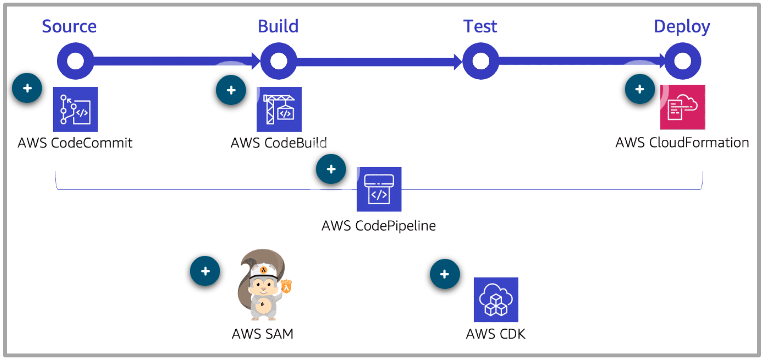
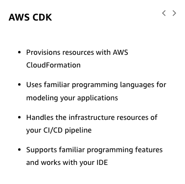

# 43

---

Summary

Automating the deployment pipeline for serverless services is essential for ensuring consistent, efficient, and error-free deployments, with AWS offering a suite of tools to facilitate this process.

Facts

- CI/CD (Continuous Integration/Continuous Delivery) is crucial for serverless applications to ensure consistent and automated deployments.
- AWS CodeCommit is a Git-based repository for version control.
- AWS CodeBuild compiles code, runs tests, and creates build artifacts.
- AWS SAM and AWS CDK simplify the creation and deployment of serverless applications using CloudFormation.
- SAM CLI provides guided options for deployment, reducing complexity.
- The CDK allows for infrastructure scripting in familiar programming languages and supports code reuse through constructs.
- A full production pipeline involves multiple stages, including build, test, staging, and production.
- Using the same CloudFormation template across different environments ensures consistency.
- Manual approval steps can be integrated for quality assurance before deploying to production.
- If issues arise post-deployment, rollbacks can be initiated to revert to a stable version.

![Continuous Integration/Continuous Deployment (CI/CD) Automating the pipeline and implementing continuous integration/continuous delivery (CI/CD) has a couple of key sections: Continuous integration (Cl) is the practice of automatically incorporating new code commits into a build and running unit tests and other automated quality gate checks before creating a new artifact for deployment. Continuous delivery (CD) takes this further, automatically taking the build artifact, deploying it to test or staging environments, and running automated tests on the deployed build. What is the current deployment pipeline ? You should assess the current deployment pipeline. Identify which parts of the deployment pipeline are automated and where do most of your deployment release issues occur. ](../../../media/AWS-Developing-Serverless-Solutions-on-AWS-Model--12-43-image1.png)

![What is the current deployment pipeline ? You should assess the current deployment pipeline. Identify which parts of the deployment pipeline are automated and where do most of your deployment release issues occur. Source Implement source and version control Branch code Write and peer review code Commit code changes Build Compile code Run unit tests Run style checkers and linting tools Capture code metrics Create artifacts Test Deploy to testing environment(s) Run integration tests Perform UI testing Run load tests Run penetration testing Deploy Deploy to production environment Conduct production testing and monitoring ](../../../media/AWS-Developing-Serverless-Solutions-on-AWS-Model--12-43-image2.png)

![Benefits of CI/CD Following are the benefits of using CI/CD. To learn more, expand each of the three benefits. Use repeatable and continuous processes With a repeatable process, you get consistent results and greatly reduce the chance of manual misses by someone on the team. You can continue to improve upon your processes to increase velocity and the levels of automation as your processes mature. When the process of building and deploying new releases isn't a resource-intensive process, it's much easier to release frequent, incremental updates. Implement many smaller deployment pipelines Having many distributed services that can be deployed independently means more and smaller deployment pipelines that each build and test a service or set of services. With an automated pipeline, you can incorporate better detection of anomalies and more testing, halt your pipeline at a certain step, and automatically roll back a change if a deployment were to fail or if an alarm threshold were met. ](../../../media/AWS-Developing-Serverless-Solutions-on-AWS-Model--12-43-image3.png)

![Give developers and end users continual access to the latest version An added benefit is the speed with which you can move new code and new features from source to test. Now you can build and deploy in very small chunks, which also gives end users the ability to review smaller updates on a regular basis in the test environment. This makes it easier to correct a change or unexpected issue with the requirements and increases visibility into work that has been completed. AWS developer tools for serverless CI/CD Your pipeline may be a mix of AWS or third-party components that suit your needs, but the concepts apply generally to whatever tools your organization uses for each of the steps in the deployment toolchain. Following graphic has the AWS tools that you can use in each step in your CI/CD pipeline. To learn more, choose each hotpot. ](../../../media/AWS-Developing-Serverless-Solutions-on-AWS-Model--12-43-image4.png)

![AWS SAM vs CDK AWS SAM • Ill. Simplifies stack creation for common serverless resources and deployment preferences Supports CloudFormation syntax in templates for incorporating dynamic data Provides a guided option so you can preview what resources will be deployed AWS CDK Handles the infrastructure resources of your CI/CD pipeline Provisions resources with CloudFormation Uses familiar programming languages for modeling your applications Supports familiar programming features and works with your IDE Example: Full production pipeline in a multi-developer environment ](../../../media/AWS-Developing-Serverless-Solutions-on-AWS-Model--12-43-image12.png)

![Three deployment environments MyBranch-Source source CodeCom mit Build test-build-source CodeBuild its Alfiliate•j tights Deploy-Testing create-changeset CloudFormation execute-changeset CloudFormation run-stubs Lambda Deploy-Staging create-changeset CloudFormation execute-changeset CloudFormation run-API-test Runscope QA-sign-off Manual approval Review Deploy-Prod create-changeset CloudFormation execute-changeset CloudForrnation post-deploy-stack Lambda Third-party tool integration Manual approval step ](../../../media/AWS-Developing-Serverless-Solutions-on-AWS-Model--12-43-image13.png)

