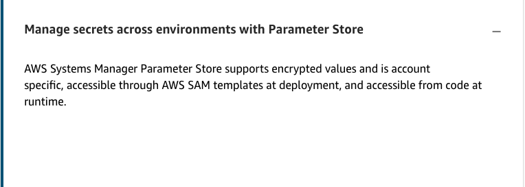

# 44

Created: 2023-09-30 13:18:02 -0600

Modified: 2023-10-22 17:31:07 -0600

---

Summary

Best practices for CI/CD pipelines in serverless deployments emphasize continuous testing, environment isolation, and efficient secret management. Utilizing tools like AWS SAM and AWS CDK can streamline deployment processes, ensuring safer and more consistent deployments across different environments.

Facts

- Continuous testing throughout the deployment pipeline is essential.
- Code reviews via pull requests help ensure code quality before merging.
- Linting, syntax checks, and unit tests should be run on the build server.
- Mocked or stubbed-out integration tests are useful in a deploy testing environment.
- Real service tests should be conducted in a deploy-staging environment.
- Canary deployments allow for gradual traffic shifting to new application versions.
- SAM templates with AutoPublishAlias can facilitate safe deployments with rollback capabilities.
- ![Best practice: Configure testing using safe deployments in AWS SAM MYLambdaFuncti on : Type: AWS: : Server less: : Function properties: Handler: index. handler Runtime: nodejs10.x Autopubli shA1ias: !Ref ENVIRONMENT e ymen re erence: Type: LinearlOpercentEvery10Mi Alarms: A list of alarms that you want to monitor - ! Ref AliasErrorMetricGreaterThanzer0A1arm - ! Ref LatestversionErrorMetri cGreaterThanzer0A1arm Hooks : aws training and -y certification Validation Lambda functions that are run before and after traffic shifting preTraffic: ! Ref preTraffi cLambdaFunction postTraffic: ! Ref postTraffi cLambdaFuncti on 0 2025 Amazon Web Inc C. its Affiliates All ](../../../media/AWS-Developing-Serverless-Solutions-on-AWS-Model--12-44-image1.png){width="5.0in" height="2.7604166666666665in"}

![Use traffic shifting with pre- and post-deployment hooks • PreTraffc: When the application is deployed, the PreTraffic Lambda function runs to determine if things should continue. If that function completes successfully (i.e., returns a 200 status code), the deployment continues. If the function does not complete successfully, the deployment rolls back. • PostTraffic: If the traffic successfully completes the traffic shifting progression to 100 percent of traffic to the new alias, the PostTraffic Lambda function runs. If it returns a 200 status code, the deployment is complete. If the PostTraffic function is not successful, the deployment is rolled back. ](../../../media/AWS-Developing-Serverless-Solutions-on-AWS-Model--12-44-image2.png){width="5.0in" height="2.46875in"}

- Isolating environments across separate accounts (e.g., dev, staging, production) reduces the risk of accidental modifications.
- Using a single SAM template with parameters across environments ensures consistency.
- Secrets should be managed using Parameter Store, which supports encrypted values and is account-specific.
- AWS SAM and AWS CDK simplify stack and pipeline creation.
- Deployment hooks and traffic shifting enhance deployment safety.
- AWS SAM templates with parameters allow for consistent deployments across different environments.

{width="5.0in" height="2.96875in"}

![Use a separate account per environment It's a best practice with serverless to use separate accounts for each stage or environment in your deployment. Each developer has an account, and the staging and deployment environments are each in their own accounts. This approach limits the blast radius of issues that occur (for example, unexpectedly high concurrency) and allows you to secure each account with IAM credentials more effectively with less complexity in your IAM policies within a given account. It also makes it less complex to differentiate which resources are associated with each environment. Because of the way costs are calculated with serverless, spinning up additional environments doesn't add much to your cost. Other than where you are provisioning concurrency or database capacity, the cost of running tests in three environments is not different than running them in one environment because it's mostly about the total number of transactions that occur, not about having three sets of infrastructure. ](../../../media/AWS-Developing-Serverless-Solutions-on-AWS-Model--12-44-image4.png){width="5.0in" height="3.1979166666666665in"}

![Use one AWS SAM template with parameters across environments As noted earlier, AWS SAM supports CloudFormation syntax so that your AWS SAM template can be the same for each deployment environment with dynamic data for the environment provided when the stack is created or updated. This helps you ensure that you have parity between all testing environments and aren't surprised by configurations or resources that are different or missing from one environment to the next. AWS SAM lets you build out multiple environments using the same template, even across accounts: Use parameters and mappings when possible to build dynamic templates based on user inputs and pseudo parameters, such as AWS: Region • Use the Globals section to simplify templates Use ExportValue and ImportValue to share resource information across stacks ](../../../media/AWS-Developing-Serverless-Solutions-on-AWS-Model--12-44-image5.png){width="5.0in" height="3.1770833333333335in"}

{width="5.0in" height="1.78125in"}

![Best practice: Manage secrets across environments with Parameter Store aws training and certification AWS SAM parameters • Include environment settings, low-risk data • Can be seen by others with access to the account • Can be passed to a Lambda function as environment variables 0 2025 Amazon Web Irv ct •ts Affi.ates All res.•.ed Stage variables • Are declared in API Gateway • Are useful for stage- specific situations (for example, when you use an API stage to represent an environment) Parameter Store • Supports encrypted values • Is account specific • Is accessible through the AWS SAM template at deployment • Is accessible from code at runtime ](../../../media/AWS-Developing-Serverless-Solutions-on-AWS-Model--12-44-image7.png){width="5.0in" height="2.875in"}

