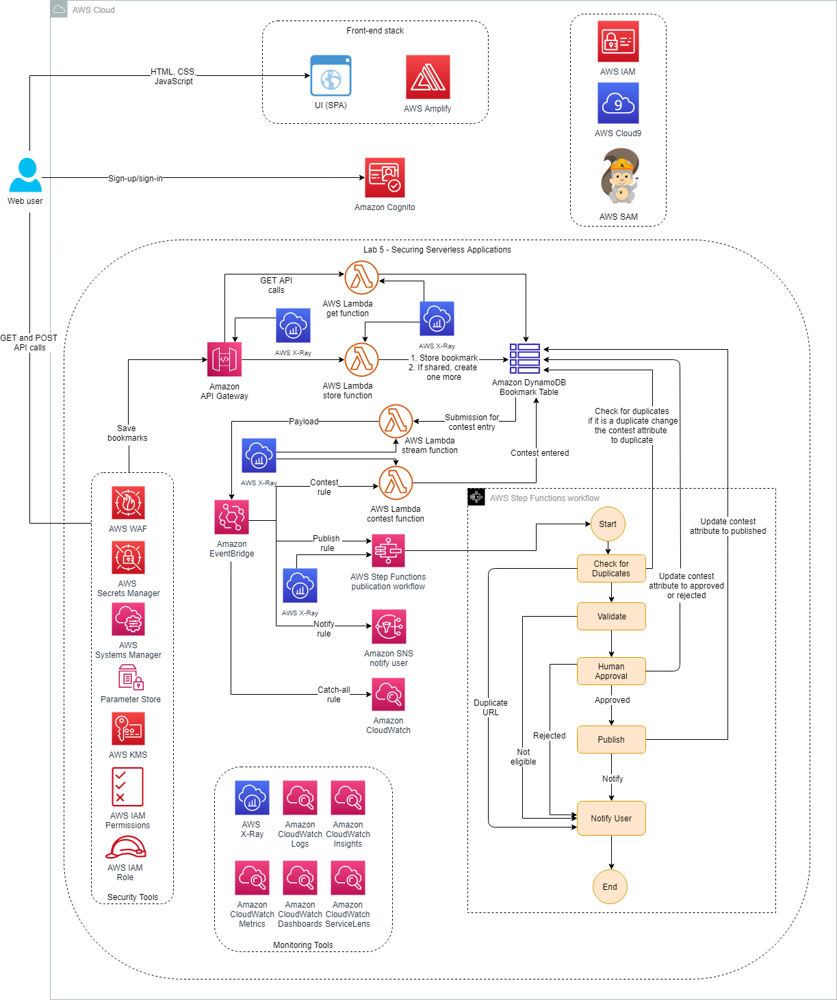
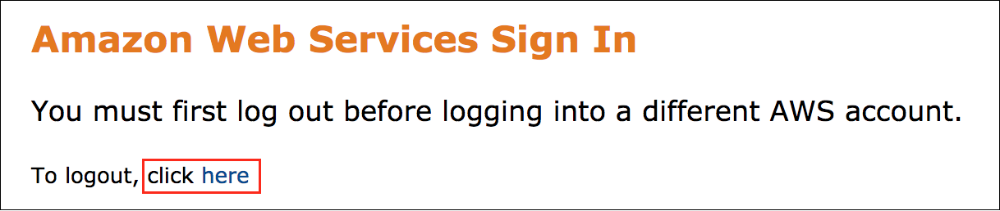
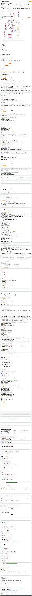

# Lab 5: Securing Serverless Applications | Self-Paced Labs

---

Clipped from: <https://labs.skillbuilder.aws/sa/lab/arn%3Aaws%3Alearningcontent%3Aus-east-1%3A470679935125%3Ablueprintversion%2FILT-TF-200-SVDVSS-1%2Flab-5-Security%3A1.3.4-b816ffc4/en-US>

© 2023 Amazon Web Services, Inc. or its affiliates. All rights reserved. This work may not be reproduced or redistributed, in whole or in part, without prior written permission from Amazon Web Services, Inc. Commercial copying, lending, or selling is prohibited. All trademarks are the property of their owners.

Note: Do not include any personal, identifying, or confidential information into the lab environment. Information entered may be visible to others.

Corrections, feedback, or other questions? Contact us at *[AWS Training and Certification](https://support.aws.amazon.com/#/contacts/aws-training).*

## Overview

Before you'll be able to make this application available outside of your development team, you need to review security best practices for securing access and protecting resources and data. You have successfully completed coding your application with several features and have also taken care of observability and monitoring aspects of the bookmark application. In this lab, you look into security aspects to ensure the protection of your resources and data and to avoid application outages.

The following architecture diagram shows the components that have been and will be deployed:

This lab uses the following services:

- AWS Amplify
- AWS Serverless Application Model (AWS SAM)
- Amazon Cognito
- AWS Cloud9
- Amazon DynamoDB
- Amazon EventBridge
- Amazon Simple Notification Service (Amazon SNS)
- AWS Step Functions
- AWS Lambda
- Amazon CloudWatch
- Amazon API Gateway
- AWS WAF
- AWS Key Management Service (AWS KMS)
- AWS Systems Manager Parameter Store
- AWS Secrets Manager

**Objectives**

After completing this lab, you will be able to:

- Secure your application with AWS WAF web ACLs
- Secure access to your API with an API Gateway resource policy
- Secure your Lambda functions and other backend services with AWS KMS, Systems Manager Parameter Store, and Secrets Manager

**Prerequisites**

This lab requires:

- Access to a notebook computer with Wi-Fi and Microsoft Windows, macOS, or Linux (Ubuntu, SUSE, or Red Hat)
- For Microsoft Windows users, administrator access to the computer
- An internet browser such as Chrome, Firefox, or Internet Explorer 9 (previous versions of Internet Explorer are not supported)
- A text editor

**Note** The lab environment is not accessible using an iPad or tablet device, but you can use these devices to access the lab guide.

**Duration**

This lab requires approximately **90 minutes** to complete.

## Start lab

1.  To launch the lab, at the top of the page, choose Start lab.

You must wait for the provisioned AWS services to be ready before you can continue.

1.  To open the lab, choose Open Console.

You are automatically signed in to the AWS Management Console in a new web browser tab.

**Do not change the Region unless instructed.**

### Common sign-in errors

#### *Error: You must first sign out*

If you see the message, **You must first log out before logging into a different AWS account:**

- Choose the **click here** link.
- Close your **Amazon Web Services Sign In** web browser tab and return to your initial lab page.
- Choose Open Console again.

#### *Error: Choosing Start Lab has no effect*

In some cases, certain pop-up or script blocker web browser extensions might prevent the **Start Lab** button from working as intended. If you experience an issue starting the lab:

- Add the lab domain name to your pop-up or script blocker's allow list or turn it off.
- Refresh the page and try again.

## Task 1: Understanding AWS WAF and securing the application with web ACLs

**AWS WAF** is a web application firewall that helps protect your web applications or APIs against common web exploits that may affect availability, compromise security, or consume excessive resources. AWS WAF gives you control over how traffic reaches your applications by enabling you to create security rules that block common attack patterns, such as SQL injection or cross-site scripting, and rules that filter out specific traffic patterns you define.

You can get started quickly using AWS Managed Rules for AWS WAF, a pre-configured set of rules managed by AWS or AWS Marketplace sellers. AWS Managed Rules for AWS WAF address issues like the OWASP Top 10 security risks. These rules are regularly updated as new issues emerge. AWS WAF includes a full-featured API that you can use to automate the creation, deployment, and maintenance of security rules.

First, you launch the application by running a pre-programmed script via **AWS Cloud9**.

1.  At the top of the AWS Management Console, to the right of the Services menu, in the search bar, search for

Cloud9

and then choose that service from the list.

2.  Next to the **BookmarkAppDevEnv** environment listing, choose **Open** .

Within a few seconds, the AWS Cloud9 environment launches.

**Note** If the browser is running in an incognito session, a pop-up window with an error message will be displayed when the Cloud9 instance is opened. Choose the **OK** button to continue. Browser in a non incognito mode is recommended.

1.  In the AWS Cloud9 terminal, run the following command to download the application code and run the startup script:

wget <https://us-west-2-tcprod.s3-us-west-2.amazonaws.com/courses/ILT-TF-200-SVDVSS/v1.3.4.prod-0a2cd90d/lab-5-Security/scripts/app-code.zip>
unzip app-code.zip
cd app-code
chmod +x resize.sh
chmod +x startupscript.sh
./startupscript.sh

The script takes a couple of minutes to run.

### What is the script doing?

- This script is modifying the **samconfig.toml** file within the backend portion of the app code.
- It is replacing values such as AWS Region, stack name, and role Amazon Resource Name (ARN), among others.
- It then updates the **aws-exports.js** file with the Amazon Cognito metadata that was launched in the lab AWS CloudFormation template.
- It then runs **npm build**, deploys the bookmark app, and uploads the **app.zip** file to the **samserverless** Amazon Simple Storage Service (Amazon S3) bucket.

**Note** Leave this page open.

### Task 1.1: Securing with AWS WAF web ACLs

A web access control list (web ACL) has a capacity of 1,500. You can add hundreds of rules and rule groups to a web ACL. The total number that you can add is based on the complexity and capacity of each rule.

A rate-based rule tracks the rate of requests for each originating IP address and triggers the rule action on IPs with rates that exceed a limit. You set the limit as the number of requests per a 5-minute time span. You can use this type of rule to put a temporary block on requests from an IP address that's sending excessive requests. By default, AWS WAF aggregates requests based on the IP address from the web request origin, but you can configure the rule to use an IP address from an HTTP header, such as X-Forwarded-For, instead.

When the rule action triggers, AWS WAF applies the action to additional requests from the IP address until the request rate falls below the limit. It can take a minute or two for the action change to go into effect.

In this task, you create a web ACL to secure the API Gateway resources using AWS WAF.

### Create a web ACL

1.  At the top of the AWS Management Console, to the right of the Services menu, in the search bar, search for

WAF & Shield

and then choose that service from the list.

2.  Choose **Create web ACL**
3.  In the **Web ACL details** section, configure the following details:

- **Region:** Choose the Region from the dropdown list. The Region should be the one displayed in the left column of the lab instructions.

**Note** If the Region is not set to the value displayed in the left column of the lab instructions, you need to change the Region before filling in the other fields. Changing the Region clears the other field values if you have entered any information before selecting the Region. If you are not sure about the Region, choose the Global Region dropdown list in the AWS Management Console.

- **Name:** Enter

BookmarkACL

- **Description:** Enter

Block actions from the API Gateway

- **CloudWatch metric name:** Enter

BookmarkACL

(pre-populated with the text entered for the **Name** value)

- **Resource Type:** Choose **Regional resources (Application Load Balancer, API Gateway, AWS AppSync)**

1.  Choose **Next**
2.  In the **Rules** section, configure the following details:

- Choose **Add rules** and select **Add my own rules and rule groups** from the dropdown list.
- Leave the default **Rule type** as **Rule builder**.

1.  In the **Rule builder** section, configure the following details:

- **Name:** Enter

100ratebasedrule

- **Type:** Select **Rate-based rule**

1.  In the **Request rate details** section, configure the following details:

- **Rate limit:** Enter

100

- **IP address to use for rate limiting:** Leave the default value as **Source IP address**
- **Criteria to count request towards rate limit:** Leave the default value as **Consider all requests**

1.  In the **Then** section, leave the default value of **Action** as **Block**.
2.  Choose **Add rule**
3.  On the **Add rules and rule groups** page, choose **Next**
4.  On the **Set rule priority** page, choose **Next**
5.  On the **Configure metrics** page, choose **Next**
6.  On the **Review and create web ACL** page, scroll to the bottom and choose **Create web ACL**

The web ACL has been created, and an ID has been generated for the web ACL.

**Note** Leave this page open.

### Attach the web ACL to API Gateway

1.  At the top of the AWS Management Console, to the right of the Services menu, in the search bar, search for

API Gateway

and then choose that service from the list.

2.  Choose the **Bookmark App**.
3.  In the left navigation pane, choose **Stages**.
4.  In the **Stages** pane, choose the **dev** stage.

You see the API Gateway end point has been deployed successfully.

1.  In the **Web Application Firewall (WAF)** section, from the **Web ACL** dropdown list, choose **BookmarkACL**.
2.  Choose **Save changes**

The web ACL has been assigned to the **dev** stage of the bookmark application.

1.  If you receive an error stating, **AWS WAF couldn't retrieve the resource that you requested. Retry your request.**, close the error and save the changes again.

**Note** Leave this page open.

### Test the web ACL using Artillery

First, you load the bookmark data using the Artillery tool and then invoke a load test.

1.  In the AWS Cloud9 console, choose the **>** arrow next to the **app-code** folder to expand it.
2.  Choose the **>** arrow next to the **test** folder to expand it.
3.  Open the **simple-post.yaml** file.
4.  In the AWS Cloud9 terminal, run the following AWS CLI and bash commands to replace the *API_GATEWAY_URL* with the actual value.

cd test
echo export API_GATEWAY_ID=$(aws apigateway get-rest-apis --query 'items[?name==`Bookmark App`].id' --output text) >> ~/environment/app-code/labVariables
echo export AWS_REGION=$(curl -s 169.254.169.254/latest/dynamic/instance-identity/document | jq -r '.region') >> ~/environment/app-code/labVariables
source ~/environment/app-code/labVariables
echo export API_GATEWAY_URL=https://${API_GATEWAY_ID}.execute-api.${AWS_REGION}.amazonaws.com/dev >> ~/environment/app-code/labVariables
source ~/environment/app-code/labVariables
sed -Ei "s|<API_GATEWAY_URL>|${API_GATEWAY_URL}|g" simple-post.yaml
cd ..

**Note** The script is running the AWS CLI command the API Gateway ID and the AWS region to construct the API Gateway URL. This URL is then substituted in the placeholder <API_GATEWAY_URL> in the **simple-post.yaml** file.

1.  In the AWS Cloud9 terminal, run the following code to install Artillery, install Faker, and run the script.

cd test
npm install <artillery@1.7.9> -g
npm install <faker@5.5.3>
artillery run simple-post.yaml

This script runs for 30 seconds, adding data through the API and then invoking the createBookmark Lambda function.

In the next steps, you run a curl command to retrieve one of the bookmark details that was added in the above step.

1.  At the top of the AWS Management Console, to the right of the Services menu, in the search bar, search for

DynamoDB

and then open that service into a new browser tab.

2.  In the left navigation pane, choose **Tables**.
3.  Choose the **bookmarksTable**.
4.  Choose **Explore table items** at the top-right corner of the page.

You see the list of items added to the **bookmarksTable** by the artillery run.

1.  In the AWS Cloud9 terminal, run the following AWS CLI and bash commands to retrieve the bookmark details of an item from the **bookmarksTable** and replace the value in the curl command:

source ~/environment/app-code/labVariables
echo export ID=$(aws dynamodb scan --table-name bookmarksTable --query Items[0].id --output text) >> ~/environment/app-code/labVariables
source ~/environment/app-code/labVariables
curl ${API_GATEWAY_URL}/bookmarks/${ID}

**Note** The *API_GATEWAY_URL* value has been fetched in the above steps and stored in the *labVariables* file. The *labVariables* file contains all of the values fetched so far using the AWS CLI commands.

The **curl** command invokes the **getBookmark** Lambda function to retrieve the bookmark details of the provided item id.

The bookmark details are displayed in a JSON format in the terminal.

1.  In the AWS Cloud9 terminal, run the following commands to test the BookmarkACL.

source ~/environment/app-code/labVariables
artillery quick -n 20 --count 100 ${API_GATEWAY_URL}/bookmarks?user='ben.franklin'

**Note** This command creates a load test of 2000 requests for the user "ben.franklin" because the goal is to reach 100 requests per minute. The 200 status code for each request indicates that the request has been successful.

1.  Wait about 60 seconds, then run the following curl command to retrieve the bookmark data and test the web ACL.

source ~/environment/app-code/labVariables
curl ${API_GATEWAY_URL}/bookmarks/${ID}

1.  The following message is displayed in the console.

{"message": "Forbidden"}

This message is displayed because the web ACL you created is blocking the request to the bookmark application. Specifying conditions in a web ACL allows you to protect your application resources.

API Gateway rejects any further calls after the first 100 requests made in 1 minute. When AWS WAF sees continuous requests from the same source IP address, it blocks all future calls based on the rule. After a few minutes, AWS WAF releases the restrictions and automatically lets the calls in.

You can check the requests that are blocked by the web ACL in the AWS WAF console.

1.  To check these requests, navigate to the AWS WAF console, and choose **BookmarkACL**.
2.  In the **Sampled requests** pane, you see all the requests by default.
3.  To see the blocked requests, choose **100ratebasedrule** from the dropdown list.

Now, you see the requests in the **BLOCK** state. As AWS WAF releases the restrictions after a few minutes, you invoke the API Gateway endpoint to see if the request is still being blocked.

**Note** It might take up to 5 minutes for AWS WAF to release the restrictions.

1.  In the AWS Cloud9 terminal, run the following curl command to test the release:

source ~/environment/app-code/labVariables
curl ${API_GATEWAY_URL}/bookmarks/${ID}

This command displays the bookmark details for the provided **id**.

**Note** If you do not see the bookmark details, wait until the restrictions are released, and run the above curl command again.

### Task 1.2: Securing with AWS WAF using an IP Address

In this section, you create an IP set that contains an IP address from which you want to block any requests to your application.

1.  Navigate to the AWS WAF page, and in the left navigation pane, choose **IP sets**.
2.  Choose Create IP set
3.  In the **IP set details** section, configure the following information:

- **Region:** Choose the Region from the dropdown list. The Region should be the one displayed in the left column of the lab instructions.

**Note** If the Region is not set to the value displayed in the left column of the lab instructions, you need to change the Region before filling in the other fields. Changing the Region clears the other field values if you have entered any information before selecting the Region. If you are not sure about the Region, choose the Global Region dropdown list in the AWS Management Console.

- **IP set name:** Enter

IPToBlock

- **Description:** Enter

Block this IP address

- **IP version:** Leave the default value
- **IP addresses:** In the AWS Cloud9 terminal, run the following command to get the IP address of the server:

curl <https://checkip.amazonaws.com/>

Copy the IP address displayed in the terminal, and paste it into the **IP addresses** field on the **Create IP set** page. Append

/32

to the end of the IP address.

**Note** Without the CIDR block of

/32

, an error will be thrown if the **Create IP set** is chosen.

1.  On the AWS WAF page, choose Create IP set

An IP set has been successfully created. Now, you need to attach the IP set to a web ACL.

1.  In the left navigation pane, choose **Web ACLs**.
2.  Choose **Create web ACL**
3.  In the **Web ACL Details** section, configure the following details:

- **Region:** Choose the Region from the dropdown list. The Region should be the one displayed in the left column of the lab instructions.

**Note** If the Region is not set to the value displayed in the left column of the lab instructions, you need to change the Region before filling in the other fields. Changing the Region clears the other field values if you have entered any before selecting the Region. If you are not sure about the Region, choose the Global Region dropdown list in the AWS Management Console.

- **Name:** Enter

IPsetbasedACL

- **Description:** Enter

Blocks actions from the specified IP address

- **CloudWatch metric name:** Enter

IPsetbasedACL

(pre-populated with the text entered for the **Name** value)

- **Resource Type:** Choose **Regional resources (Application Load Balancer, API Gateway, AWS AppSync)**

1.  Choose **Next**
2.  In the **Rules** section, configure the following details:

- Choose **Add rules** and select **Add my own rules and rule groups** from the dropdown list.

1.  In the **Rule type** section, choose **IP set**.
2.  In the **Rule** section, configure the following information:

- **Name:** Enter

IPbasedrule

1.  In the **IP set** section, configure the information below:

- **IP set:** In the dropdown list, choose **IPToBlock**
- **IP address to use as the originating address:** Leave the default value as **Source IP address**
- **Action:** Leave the default value as **Block**

1.  Choose **Add rule**
2.  On the **Add rules and rule groups** page, choose **Next**
3.  On the **Set rule priority** page, choose **Next**
4.  On the **Configure metrics** page, choose **Next**
5.  On the **Review and create web ACL** page, scroll to the bottom and choose **Create web ACL**

The web ACL has been created, and an ID has been generated for the web ACL.

**Note** Leave this page open.

### Attach the web ACL to API Gateway

1.  Navigate to the API Gateway page you left open earlier in this task.
2.  Refresh this page so that the **IPsetbasedACL** web ACL created earlier appears in the **Web ACL** dropdown list.
3.  In the **Web Application Firewall (WAF)** section, from the **Web ACL** dropdown list, select **IPsetbasedACL**.
4.  Choose **Save changes**

The web ACL has been assigned to the **dev** stage of the bookmark application.

**Note** Leave this page open.

### Test the web ACL using curl

1.  In the AWS Cloud9 terminal, run the curl command you updated earlier:

source ~/environment/app-code/labVariables
curl ${API_GATEWAY_URL}/bookmarks/${ID}

1.  The following command is displayed on the terminal because the web ACL is blocking the requests from your IP address:

{"message": "Forbidden"}

Before you proceed to the next task, you must remove the above web ACL because it blocks requests to the application from your IP address.

1.  Navigate to the API Gateway page you left open earlier in this task.
2.  Make sure that you are in the **dev** stage and the **Settings** tab for this stage. In the **Web Application Firewall (WAF)** section, from the **Web ACL** dropdown list, select **None**.
3.  Choose **Save changes**

This step disassociates the web ACL from the **dev** stage of the bookmark application.

## Task 2: Securing the application with API Gateway resource policies

API Gateway resource policies are JSON policy documents that you attach to an API to control whether a specified principal (typically an AWS Identity and Access Management [IAM] user or role) can invoke the API. You can use API Gateway resource policies to allow your API to be securely invoked by the following:

- Users from a specified AWS account
- Specified source IP address ranges or CIDR blocks
- Specified virtual private clouds (VPCs) or VPC endpoints (in any account)

You can attach a resource policy to an API by using the AWS Management Console, AWS Command Line Interface (AWS CLI), or AWS SDKs.

API Gateway resource policies are different from IAM policies. IAM policies are attached to IAM entities (users, groups, or roles) and define what actions those entities are capable of doing on which resources. API Gateway resource policies are attached to resources. For a more detailed discussion of the differences between identity-based (IAM) policies and resource policies, see [Identity-Based Policies and Resource-Based Policies](https://docs.aws.amazon.com/IAM/latest/UserGuide/access_policies_identity-vs-resource.html).

You can use API Gateway resource policies together with IAM policies.

In this task, you learn how to add certain IP addresses or a range of IP addresses to an allow list to access your API Gateway resources. You create a resource policy for the bookmark API that denies access to any IP address that isn't specifically allowed.

1.  Choose the following URL to find the IP address of your system:

<https://checkip.amazonaws.com/>

**Note** The IP address of your system is displayed in a new browser tab.

1.  Copy and paste the IP address into a text editor. You use it in the **Resource Policy** you define in the next few steps.
2.  Navigate to the API Gateway page you left open earlier.
3.  In the left navigation pane, choose **Resource Policy**.
4.  Copy and paste the following policy into the text editor:

{
"Version": "2012-10-17",
"Statement": [{
"Effect": "Allow",
"Principal": "*",
"Action": "execute-api:Invoke",
"Resource": "execute-api:/*/*/*"
},
{
"Effect": "Deny",
"Principal": "*",
"Action": "execute-api:Invoke",
"Resource": "execute-api:/*/*/*",
"Condition": {
"NotIpAddress": {
"aws:SourceIp": ["SOURCEIPORCIDRBLOCK"]
}
}
}
]
}

1.  In the last line of the policy, replace *SOURCEIPORCIDRBLOCK* with the IP address you noted earlier.
2.  Choose **Save**

Now, you need to deploy the changes.

1.  In the left navigation pane, choose **Resources**.
2.  In the **Resources** pane, choose **Actions** and select **Deploy API**.
3.  In the pop-up window, for **Deployment Stage** in the dropdown list, choose **dev**.
4.  Choose **Deploy**

This step deploys the resource policy you just created. Now, you test whether the resource policy is working or not.

1.  In the AWS Cloud9 terminal, run the following curl command to test the resource policy.

source ~/environment/app-code/labVariables
curl ${API_GATEWAY_URL}/bookmarks/${ID}

In the console, an error message similar to the following message is displayed:

{"Message":"User: anonymous is not authorized to perform: execute-api:Invoke on resource: arn:aws:execute-api:(AWS:Region):*******1234:(BookmarkAppID)/dev/GET/bookmarks/(bookmarkId) with an explicit deny"}

**Note** If you do not see the expected result, wait a few seconds and try again.

This message is displayed because you created a resource policy to deny all the requests from other than your system's IP address.

Before you proceed to the next task, you should remove the above resource policy because it blocks the application from being invoked.

1.  In the API Gateway console in the left navigation pane, choose **Resource Policy**.
2.  Select the entire policy in the text editor, and press **Delete**.
3.  Choose **Save**

Now, you need to deploy the changes.

1.  In the left navigation pane, choose **Resources**.
2.  In the **Resources** pane, choose **Actions** and select **Deploy API**.
3.  In the pop-up window, for **Deployment Stage** in the dropdown list, choose **dev**.
4.  Choose **Deploy**

This step deploys the changes you just made.

1.  In the AWS Cloud9 terminal, run the following curl command to test if the policy was removed successfully.

source ~/environment/app-code/labVariables
curl ${API_GATEWAY_URL}/bookmarks/${ID}

The console now displays the bookmark details for the **id** provided in the above command returned by API Gateway.

**Note** If you do not see the expected result, wait a few seconds and try again. Leave this page open.

## Task 3: Securing an AWS Lambda function

A highly recommended best practice is to never store your secrets or passwords in plain text or hard code them as part of the function code. They should always be encrypted to secure them from attacks. The following are a few widely used tools to manage your secrets:

- AWS KMS
- Parameter Store
- Secrets Manager

**AWS KMS** makes it easy for you to create and manage cryptographic keys and control their use across a wide range of AWS services and in your applications. AWS KMS is a secure and resilient service that uses hardware security modules that have been validated under FIPS 140-2, or are in the process of being validated, to protect your keys. AWS KMS is integrated with AWS CloudTrail to provide you with logs of all key use in order to help meet your regulatory and compliance needs.

**Parameter Store** provides secure, hierarchical storage for configuration data management and secrets management. You can store data such as passwords, database strings, Amazon Machine Image (AMI) IDs, and license codes as parameter values. You can store values as plain text or encrypted data. You can reference Systems Manager parameters in your scripts, commands, Systems Manager documents, and configuration and automation workflows by using the unique name that you specified when you created the parameter.

**Secrets Manager** helps you protect secrets needed to access your applications, services, and IT resources. The service enables you to easily rotate, manage, and retrieve database credentials, API keys, and other secrets throughout their lifecycle. Users and applications retrieve secrets with a call to Secrets Manager APIs, eliminating the need to hard code sensitive information in plain text. Secrets Manager offers secret rotation with built-in integration for Amazon Relational Database Service (Amazon RDS), Amazon Redshift, and Amazon DocumentDB. Also, the service is extensible to other types of secrets, including API keys and OAuth tokens. In addition, Secrets Manager enables you to control access to secrets using fine-grained permissions and to audit secret rotation centrally for resources in the AWS Cloud, third-party services, and on premises.

In this task, you learn how to secure secrets using AWS KMS, Parameter Store, and Secrets Manager and retrieve the secrets in your Lambda code.

### Task 3.1: Securing environment variables using AWS KMS

1.  At the top of the AWS Management Console, to the right of the Services menu, in the search bar, search for

Key Management Service

and then choose that service from the list.

2.  In the left navigation pane, choose **Customer managed keys**.
3.  Choose Create key
4.  In the **Configure key** section, leave the default option for **Key type** as **Symmetric**.
5.  Choose Next
6.  In the **Add labels** section, configure the following details:

- **Alias:** Enter

LambdaSecrets

- **Description:** Enter

Creating a Lambda secrets key

1.  Choose Next
2.  In the **Key administrators** section, select the user or role you are logged in with.

The user or role is displayed at the top-right of your screen.

1.  Choose Next
2.  In the **Key users** section, select the user or role you are logged in with.
3.  Choose Next

Review the policy in the **Key policy** section.

1.  Choose Finish
2.  In the AWS Cloud9 terminal, run the following commands.

export KeyId=$(aws kms list-aliases --query 'Aliases[?starts_with(AliasName, `alias/LambdaSecrets`)].TargetKeyId' --output text)
aws kms encrypt --plaintext "Key Management Service Secrets" --query CiphertextBlob --output text --key-id ${KeyId} --cli-binary-format raw-in-base64-out

You are encrypting the string **Key Management Service Secrets** using the AWS KMS key ID.

1.  Copy and paste the base64 encoded output from the console into a text editor.

The resulting encoded output is base64 encoded and is provided as an environment variable to your Lambda function. The Lambda function decrypts the data to get the plaintext in order to actually use it.

### Create a Lambda function and configure it in API Gateway to test the AWS KMS

In this section, you create a new Lambda function to test the AWS KMS secrets.

1.  At the top of the AWS Management Console, to the right of the Services menu, in the search bar, search for

Lambda

and then choose that service from the list.

2.  Choose Create function
3.  Choose **Author from scratch**, and configure the following information:

- **Function name:** Enter

sam-bookmark-app-secrets-function

- **Runtime:** Choose **Node.js 18.x**

1.  Expand **Change default execution role**, and configure the following information:

- **Execution role:** Choose **Use an existing role**
- **Existing role:** Choose **LambdaDeploymentRole**

1.  Choose Create function
2.  In the **Code source** section, select **index.js**, open the context(right-click) menu and choose **Open**...
3.  Delete the existing code snippet and paste the following code into the code box:

import { KMSClient, DecryptCommand } from "@aws-sdk/client-kms";
import { SSMClient, GetParameterCommand } from "@aws-sdk/client-ssm";
import { SecretsManagerClient, GetSecretValueCommand } from "@aws-sdk/client-secrets-manager";

const kmsSecret = process.env.KMS_SECRET;

let decodedSecret;
let DecodedKMSSecret;

const kms = new KMSClient({});
const ssm = new SSMClient({});
const sm = new SecretsManagerClient({});

export const handler = async message => {
console.log(message);
let secretType = message.pathParameters.id
console.log("Secret Type:", secretType);

if(secretType == 'kms')
decodedSecret = await decodeKMSSecret();
else if (secretType == 'ssm')
decodedSecret = await decodeSSMSecret();
else if (secretType == 'sm') {
var password = await decodeSMSecret(userId);
decodedSecret = "Password is: " + password;
}
else
decodedSecret = "Provide a valid secret type (kms, ssm, or sm (secrets manager))";

console.log(decodedSecret);
const response = {
statusCode: 200,
headers: {},
body: JSON.stringify('Plain text secret(s): ' + decodedSecret)
};
return response;
};

async function decodeKMSSecret() {
if (DecodedKMSSecret) {
return DecodedKMSSecret;
}
const params = {
CiphertextBlob: Buffer.from(kmsSecret, 'base64')
};
const data = await kms.send(new DecryptCommand(params));
DecodedKMSSecret = Buffer.from(data.Plaintext, 'base64').toString('utf-8');
return DecodedKMSSecret;
}

You should see a message that says **Successfully updated the function sam-bookmark-app-secrets-function.**

1.  Choose the **Configuration** tab to configure the environment variables.
2.  In the left navigation pane, choose **Environment variables**.
3.  In the **Environment variables** section, choose Edit
4.  In the **Edit environment variables** page, choose Add environment variable and configure the following details:

- **Key:** Enter

KMS_SECRET

- **Value:** Enter the base64 encoded output that you pasted into a text editor earlier

**Note** This Lambda function shows how to use the AWS KMS SDK to read secrets. Review the function code after it is deployed.

**Note** To read the secrets, an IAM permission, **kms:Decrypt**, is needed for the Lambda function. For the purposes of this lab, the permission has already been added to the **LambdaDeploymentRole**, which is assigned to the Lambda function during the pre-build lab process.

To test this Lambda function, configure it in API Gateway.

1.  Navigate to the API Gateway page you left open at the end of task 2.
2.  In the left navigation pane, choose **Resources**.
3.  In the **Resources** pane, choose the **/** endpoint, and then choose **Actions**
4.  In the dropdown list, choose **Create Resource**.
5.  In the right navigation pane, enter

secrets

for the **Resource Name**.

6.  Choose **Create Resource**

Once the resource creation is complete, the **secrets** resource appears in the **Resources** pane.

1.  In the **Resources** pane, choose the **/secrets** endpoint, and then choose **Actions**
2.  In the dropdown list, choose **Create Resource**.
3.  In the right navigation pane, enter

{id}

for the **Resource Name**.

4.  In the **Resource Path**, the value is set to **-id-** by default when you enter the **Resource Name**. Replace it with

{id}

5.  Choose **Create Resource**

Once the resource creation is complete, the **{id}** resource appears under the **secrets** resource in the **Resources** pane.

1.  In the **Resources** pane, choose the **/secrets/{id}** endpoint, and then choose **Actions**
2.  In the dropdown list, choose **Create Method**.
3.  In the dropdown menu under the **/secrets/{id}** endpoint, choose the **GET** method, and then choose .

**Note** If you see a warning message on top of the pop-up window indicating **Invalid model identifier specified: Empty**, choose the **x** on the window.

1.  In the right navigation pane, select the check box for **Use Lambda Proxy integration**.
2.  For **Lambda Function**, enter

sam-bookmark-app-secrets-function

This is the new Lambda function name that you just created.

A window pops up with a message that reads **Add Permission to Lambda Function**.

The Lambda function has been integrated into the new API endpoint. Now, the new endpoint should be deployed in order to test the function.

1.  In the **Resources** pane, choose **Actions**
2.  In the dropdown list, choose **Deploy API**.
3.  In the **Deploy API** pop-up window, from the **Deployment stage** dropdown list, choose **dev**.
4.  Choose **Deploy**

This step has successfully deployed the new endpoint to the **dev** stage.

1.  In the **Stages** pane, expand the **dev** stage.
2.  Under the **/secrets/{id}** endpoint, choose **GET**.
3.  Copy and paste the **Invoke URL** value into a text editor.
4.  Replace *{id}* with

kms

in this **Invoke URL**.

5.  Copy the updated **Invoke URL**, paste it into a new browser window, and press **Enter**.

The browser displays the following message from the Lambda function code:

"Plain text secret(s): Key Management Service Secrets"

The AWS KMS secret has been successfully decoded and is displaying the plain text.

If you enter a value other than **kms**, you will see the following message:

"Plain text secret(s): Provide a valid secret type (kms, ssm or sm (secrets manager))"

### Task 3.2: Storing and accessing passwords using Systems Manager Parameter Store

The Parameter Store is part of Systems Manager. It is used to store not only encrypted secrets but almost any data. IAM permissions can control who is able to access and change the data in a very fine-grained way. For each record in the Parameter Store, a history is stored, which makes it possible to know exactly when a change has occurred.

1.  In the AWS Cloud9 terminal, run the following command to store secrets in the Parameter Store:

aws ssm put-parameter --name /db/secret --value 'Hello, Parameter Store!' --type SecureString

You are storing a secret with the name **/db/secret** that has a value of **Hello, Parameter Store!**

The following output is displayed:

{
"Version": 1,
"Tier": "Standard"
}

### View the Parameter Store in the AWS Management Console

1.  At the top of the AWS Management Console, to the right of the Services menu, in the search bar, search for

Systems Manager

and then choose that service from the list.

2.  In the left navigation pane, choose **Parameter Store**.

The **/db/secret** secret you created earlier is displayed here.

1.  To view the details of the secret, choose **/db/secret**.
2.  To view the value of the secret, choose **Show**.

### Test the secret using a Lambda function

Update the **sam-bookmark-app-secrets-function** function code to test the new parameter.

1.  At the top of the AWS Management Console, to the right of the Services menu, in the search bar, search for

Lambda

and then choose that service from the list.

2.  Enter

sam-bookmark-app-secrets-function

into the box, and select this function.

3.  In the **Code source** section, add the following to the **index.js** file:

- Add the following constant after the kmsSecret constant (line 7):

const ssmSecret = process.env.SSM_SECRET;

- Add the following code snippet to the end of the existing code:

async function decodeSSMSecret() {
const params = {
Name: ssmSecret,
WithDecryption: true
};
const result = await ssm.send(new GetParameterCommand(params));
return result.Parameter.Value
}

The code should look like the following after you add the previous two snippets:

import { KMSClient, DecryptCommand } from "@aws-sdk/client-kms";
import { SSMClient, GetParameterCommand } from "@aws-sdk/client-ssm";
import { SecretsManagerClient, GetSecretValueCommand } from "@aws-sdk/client-secrets-manager";

const kmsSecret = process.env.KMS_SECRET;
const ssmSecret = process.env.SSM_SECRET;

let decodedSecret;
let DecodedKMSSecret;

const kms = new KMSClient({});
const ssm = new SSMClient({});
const sm = new SecretsManagerClient({});

export const handler = async message => {
console.log(message);
let secretType = message.pathParameters.id
console.log("Secret Type:", secretType);

if(secretType == 'kms')
decodedSecret = await decodeKMSSecret();
else if (secretType == 'ssm')
decodedSecret = await decodeSSMSecret();
else if (secretType == 'sm') {
var password = await decodeSMSecret(userId);
decodedSecret = "Password is: " + password;
}
else
decodedSecret = "Provide a valid secret type (kms, ssm, or sm (secrets manager))";

console.log(decodedSecret);
const response = {
statusCode: 200,
headers: {},
body: JSON.stringify('Plain text secret(s): ' + decodedSecret)
};
return response;
};

async function decodeKMSSecret() {
if (DecodedKMSSecret) {
return DecodedKMSSecret;
}
const params = {
CiphertextBlob: Buffer.from(kmsSecret, 'base64')
};
const data = await kms.send(new DecryptCommand(params));
DecodedKMSSecret = Buffer.from(data.Plaintext, 'base64').toString('utf-8');
return DecodedKMSSecret;
}

async function decodeSSMSecret() {
const params = {
Name: ssmSecret,
WithDecryption: true
};
const result = await ssm.send(new GetParameterCommand(params));
return result.Parameter.Value
}

You should see a message that says **Successfully updated the function sam-bookmark-app-secrets-function.**

1.  Choose the **Configuration** tab to configure the environment variables.
2.  In the left navigation pane, choose **Environment variables**.
3.  In the **Environment variables** section, choose Edit
4.  In the **Edit environment variables** page, choose Add environment variable and configure the following details:

- **Key:** Enter

SSM_SECRET

- **Value:** Enter

/db/secret

The Lambda function has been updated to read the Parameter Store and display the password.

**Note** There is an IAM permission, **ssm:GetParameter**, needed for the Lambda function to read Systems Manager. This permission has been added to the **LambdaDeploymentRole** in the pre-build process of the lab.

1.  To test the above changes, go to the text editor with the **Invoke URL** that you saved from task 3.1. In the **Invoke URL**, replace *{id}* with

ssm

2.  Copy and paste the updated **Invoke URL** into a new browser tab, and press **Enter**.

You should see the following text in the browser.

"Plain text secret(s): Hello, Parameter Store!"

### Task 3.3: Storing a secret using Secrets Manager

Secrets Manager helps you meet your security and compliance requirements by enabling you to rotate secrets safely without the need for code deployments. You can store and retrieve secrets using the Secrets Manager console, AWS SDK, AWS CLI, or CloudFormation. To retrieve secrets, you simply replace plaintext secrets in your applications with code to pull in those secrets programmatically using the Secrets Manager APIs.

1.  In the AWS Cloud9 terminal, run the following command to create a secret:

aws secretsmanager create-secret --name dbUserId --secret-string "secretsmanagerpassword"

This is similar to storing database credentials. Here the UserId is **dbUserId** with string of **secretsmanagerpassword**.

The following output is displayed:

{
"ARN": "arn:aws:secretsmanager:us-west-2:{AWS::AccountId}:secret:dbUserId-xxxxxx",
"Name": "dbUserId",
"VersionId": "xxxxx"
}

### View the secret in Secrets Manager from the AWS Management Console

1.  At the top of the AWS Management Console, to the right of the Services menu, in the search bar, search for

Secrets Manager

and then choose that service from the list.

The **dbUserId** secret you created earlier is displayed here.

1.  To view the details of the secret, choose **dbUserId**.
2.  In the **Secret value** section, choose **Retrieve secret value** to view the value of the secret.

### Test the secret using a Lambda function

The **sam-bookmark-app-secrets-function** function code should be updated to test the secret.

1.  At the top of the AWS Management Console, to the right of the Services menu, in the search bar, search for

Lambda

and then choose that service from the list.

2.  Enter

sam-bookmark-app-secrets-function

into the box, and select this function.

3.  In the **Code source** section, add the following to the **index.js** file:

- Add the following constant after the ssmsecret constant (line 8):

const userId = process.env.SM_USER_ID;

- Add the following code snippet to the end of the function code:

async function decodeSMSecret(smkey) {
console.log("SM Key:", smkey);
const params = {
SecretId: smkey
};
const result = await sm.send(new GetSecretValueCommand(params));
return result.SecretString;
}

The code should look like the following code after you add the two previous snippets:

import { KMSClient, DecryptCommand } from "@aws-sdk/client-kms";
import { SSMClient, GetParameterCommand } from "@aws-sdk/client-ssm";
import { SecretsManagerClient, GetSecretValueCommand } from "@aws-sdk/client-secrets-manager";

const kmsSecret = process.env.KMS_SECRET;
const ssmSecret = process.env.SSM_SECRET;
const userId = process.env.SM_USER_ID;

let decodedSecret;
let DecodedKMSSecret;

const kms = new KMSClient({});
const ssm = new SSMClient({});
const sm = new SecretsManagerClient({});

export const handler = async message => {
console.log(message);
let secretType = message.pathParameters.id
console.log("Secret Type:", secretType);

if(secretType == 'kms')
decodedSecret = await decodeKMSSecret();
else if (secretType == 'ssm')
decodedSecret = await decodeSSMSecret();
else if (secretType == 'sm') {
var password = await decodeSMSecret(userId);
decodedSecret = "Password is: " + password;
}
else
decodedSecret = "Provide a valid secret type (kms, ssm, or sm (secrets manager))";

console.log(decodedSecret);
const response = {
statusCode: 200,
headers: {},
body: JSON.stringify('Plain text secret(s): ' + decodedSecret)
};
return response;
};

async function decodeKMSSecret() {
if (DecodedKMSSecret) {
return DecodedKMSSecret;
}
const params = {
CiphertextBlob: Buffer.from(kmsSecret, 'base64')
};
const data = await kms.send(new DecryptCommand(params));
DecodedKMSSecret = Buffer.from(data.Plaintext, 'base64').toString('utf-8');
return DecodedKMSSecret;
}

async function decodeSSMSecret() {
const params = {
Name: ssmSecret,
WithDecryption: true
};
const result = await ssm.send(new GetParameterCommand(params));
return result.Parameter.Value
}

async function decodeSMSecret(smkey) {
console.log("SM Key:", smkey);
const params = {
SecretId: smkey
};
const result = await sm.send(new GetSecretValueCommand(params));
return result.SecretString;
}

You should see a message that says **Successfully updated the function sam-bookmark-app-secrets-function.**

1.  Choose the **Configuration** tab to configure the environment variables.
2.  In the left navigation pane, choose **Environment variables**.
3.  In the **Environment variables** section, choose Edit
4.  In the **Edit environment variables** page, choose Add environment variable and configure the following details:

- **Key:** Enter

SM_USER_ID

- **Value:** Enter

dbUserId

The Lambda function has been updated to read Secrets Manager and display the password.

**Note** There is an IAM permission, **secretsmanager:GetSecretValue**, needed for the Lambda function to read Secrets Manager. This permission has been added to the **SamDeploymentRole** in the pre-build process of the lab.

1.  In the **Invoke URL** you saved from task 3.1, replace *{id}* with

sm

2.  Copy and paste the updated **Invoke URL** into a new browser tab, and press **Enter**.

You should see the following text in the browser.

"Plain text secret(s): Password is: secretsmanagerpassword"

## Conclusion

Congratulations! You have successfully:

- Secured your application with AWS WAF web ACLs
- Secured access to your API with an API Gateway resource policy
- Secured your Lambda functions and other backend services with AWS KMS, Systems Manager Parameter Store, and Secrets Manager

## End lab

Follow these steps to close the console and end your lab.

1.  Return to the **AWS Management Console**.
2.  At the upper-right corner of the page, choose **AWSLabsUser**, and then choose **Sign out**.
3.  Choose End lab and then confirm that you want to end your lab.

For more information about AWS Training and Certification, see *<https://aws.amazon.com/training/>.*

*Your feedback is welcome and appreciated.*
*If you would like to share any feedback, suggestions, or corrections, please provide the details in our [AWS Training and Certification Contact Form](https://support.aws.amazon.com/#/contacts/aws-training).*

## Additional resources

- For more information on AWS WAF, see [Using AWS WAF to control access](https://docs.aws.amazon.com/AmazonCloudFront/latest/DeveloperGuide/distribution-web-awswaf.html).
- For more information on Secrets Manager, see [AWS Secrets Manager user guide](https://docs.aws.amazon.com/secretsmanager/latest/userguide/intro.html).
- For more information on AWS KMS, see [AWS KMS Features](https://aws.amazon.com/kms/features/).
- For more information on Systems Manager, see [Sharing secrets with AWS Lambda using AWS Systems Manager](https://aws.amazon.com/blogs/compute/sharing-secrets-with-aws-lambda-using-aws-systems-manager-parameter-store/)

